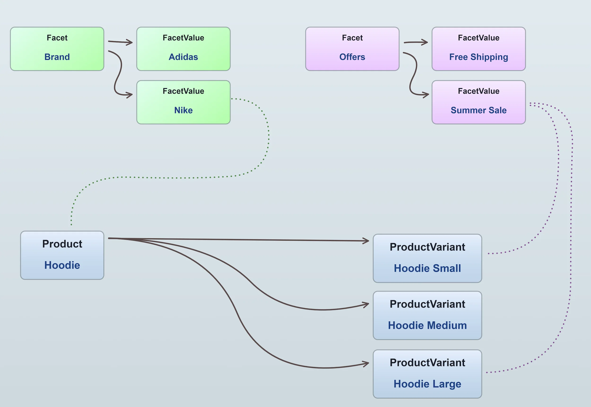
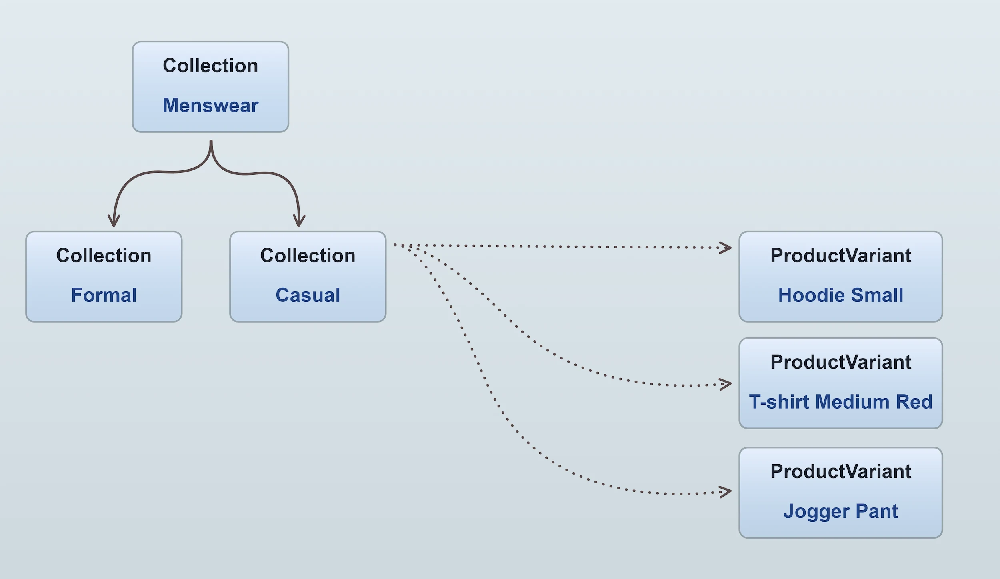
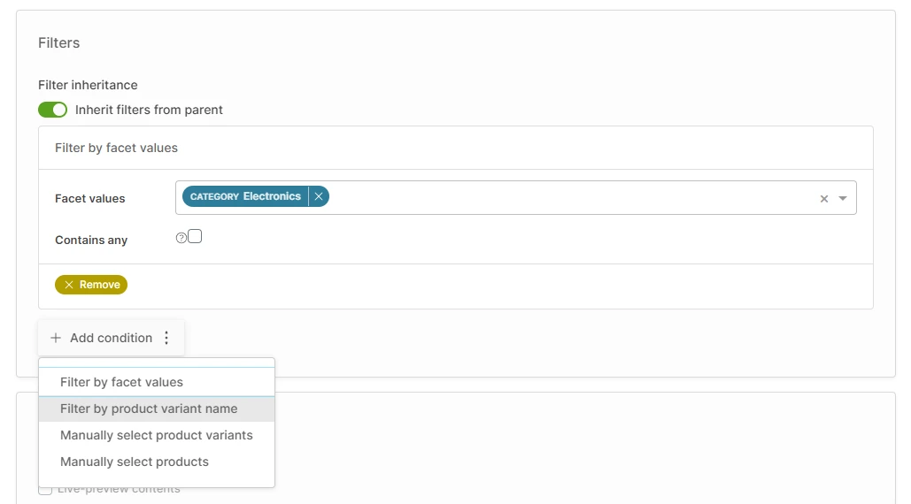

This section will explain the main parts of Vendure's data model and how they relate to one another. In Vendure these
objects are referred to as **entities**, following the terminology of the [TypeORM](https://typeorm.io/entities) library which
is used to manage the database.

## Catalog

### Products & ProductVariants

Your catalog is composed of [`Products`](/reference/typescript-api/entities/product/) and [`ProductVariants`](/reference/typescript-api/entities/product-variant/).
A `Product` always has _at least one_ `ProductVariant`. You can think of the product as a "container" which includes a name, description, and images that apply to all of
its variants.

Here's a visual example, in which we have a "Hoodie" product which is available in 3 sizes. Therefore, we have
3 variants of that product:

Multiple variants are made possible by adding one or more [`ProductOptionGroups`](/reference/typescript-api/entities/product-option-group) to
the product. These option groups then define the available [`ProductOptions`](/reference/typescript-api/entities/product-option)

If we were to add a new option group to the example above for "Color", with 2 options, "Black" and "White", then in total
we would be able to define up to 6 variants:

- Hoodie Small Black
- Hoodie Small White
- Hoodie Medium Black
- Hoodie Medium White
- Hoodie Large Black
- Hoodie Large White

:::info
When a customer adds a product to their cart, they are adding a specific `ProductVariant` to their cart, not the `Product` itself.
It is the `ProductVariant` that contains the SKU ("stock keeping unit", or product code) and price information.
:::

### Facets

[`Facets`](/reference/typescript-api/entities/facet/) are used to add structured labels to products and variants. A facet has
one or more [`FacetValues`](/reference/typescript-api/entities/facet-value/). Facet values can be assigned to products or
product variants.

For example, a "Brand" facet could be used to label products with the brand name, with each facet value representing a different brand. You can
also use facets to add other metadata to products and variants such as "New", "Sale", "Featured", etc.

These are the typical uses of facets in Vendure:

- As the **basis of Collections**, in order to categorize your catalog (see next section).
- To **filter products** in the storefront, also known as "faceted search". For example, a customer is on the "hoodies" collection
page and wants to filter to only show Nike hoodies.
- For **internal logic**, such as a promotion that applies to all variants with the "Summer Sale" facet value, or a shipping calculation
that applies a surcharge to all products with the "Fragile" facet value. Such facets can be set to be private so that they
are not exposed to the storefront.

### Collections

[`Collections`](/reference/typescript-api/entities/collection/) are used to categorize and organize your catalog. A collection
contains multiple product variants, and a product variant can belong to multiple collections. Collections can be nested to
create a hierarchy of categories, which is typically used to create a menu structure in the storefront.

The specific product variants that belong to a collection are determined by the collection's [`CollectionFilters`](/reference/typescript-api/configuration/collection-filter/).
A collection filter is a piece of logic which is used to determine whether a product variant should be included in the collection. By default, Vendure
includes a number of collection filters:

- **Filter by facet values**: Include all product variants which have a specific set of facet values.
- **Filter by product variant name**: Include all product variants whose name matches a specific string.
- **Manually select product variants**: Allows manual selection of individual product variants.
- **Manually select products**: Allows manual selection of entire products, and then includes all variants of those products.

It is also possible to create your own custom collection filters, which can be used to implement more complex logic. This is
covered in the [custom collection filters](/TODO) guide.

Collections are not _only_ used as the basis of storefront navigation. They are a general-purpose organization tool which can be used
for many purposes, such as:

- Creating a collection of "new arrivals" which is used on the homepage.
- Creating a collection of "best sellers" which is used to display a list of popular products.
- Creating a collection of "sale items" which is used to apply a discount to all products in the collection, via a promotion.

### Assets

[`Assets`](/reference/typescript-api/entities/asset/) are used to store files such as images, videos, PDFs, etc. Assets can be
assigned to **products**, **variants** and **collections** by default. By using [custom fields](/guides/concepts/custom-fields/) it is
possible to assign assets to other entities. For example, for implementing customer profile images.

## Orders

Orders are the central concept of Vendure's checkout process. An order is created when a customer adds a product to their cart, and
is completed when the customer has paid for the order and the products have been shipped.

:::note
In Vendure, there is no distinction between a "cart" and an "order". The same entity is used for both. A "cart" is simply an order
which is still "active" according to its current state.
:::

An [`Order`](/reference/typescript-api/entities/order/) is composed of one or more [`OrderLines`](/reference/typescript-api/entities/order-line/).
Each order line represents a single product variant, and contains information such as the quantity, price, tax rate, etc.

In turn, the order is associated with a [`Customer`](/reference/typescript-api/entities/customer/) and contains information such as
the shipping address, billing address, shipping method, payment method, etc.

## Customers

A [`Customer`](/reference/typescript-api/entities/customer/) is a person who can buy from your shop. A customer can have one or more
[`Addresses`](/reference/typescript-api/entities/address/), which are used for shipping and billing.

If a customer has registered an account, they will have an associated [`User`](/reference/typescript-api/entities/user/). The user
entity is used for authentication and authorization. **Guest checkouts** are also possible, in which case a customer will not have a user.

Customers can be organized into [`CustomerGroups`](/reference/typescript-api/entities/customer-group/). These groups can be used in
logic relating to promotions, shipping rules, payment rules etc. For example, you could create a "VIP" customer group and then create
a promotion which grants members of this group free shipping. Or a "B2B" group which is used in a custom tax calculator to
apply a different tax rate to B2B customers.

## Administrators & Roles

An [`Administrator`](/reference/typescript-api/entities/administrator/) is a user who has some degree of access to the
functions of the Admin API and the Admin UI. Similar to customers, administrators are also associated with a user, which
is responsible for managing authentication and authorization.
Administrators are assigned one or more [`Roles`](/reference/typescript-api/entities/role/),
which define specific [`Permissions`](/reference/typescript-api/common/permission/). Each query or mutation in the Admin API
declares which permissions are required to execute it. If an administrator does not have the required permissions, the request
will be rejected.

In the example above, the administrator Sam Bailey has two roles assigned: "Order Manager" and "Catalog Manager". An administrator
can have any number of roles assigned, and the permissions of all roles are combined to determine the permissions of the
administrator. In this way, you can have fine-grained control over which administrators can perform which actions.

There are 2 special roles which are created by default and cannot be changed:

- **SuperAdmin**: This role has all permissions, and cannot be edited or deleted. It is assigned to the first administrator
  created when the server is started.
- **Customer**: This role is assigned to all registered customers.

## Channels

A [`Channel`](/reference/typescript-api/entities/channel/) represents a distinct sales channel, and has several uses in Vendure:

- **Multi-tenancy**: Each channel can be configured with its own set of products, shipping methods, payment methods, etc. This
  allows you to run multiple shops from a single Vendure server.
- **Multi-vendor**: Each channel can represent a distinct vendor or seller, which can be used to implement a marketplace.
- **Region-specific stores**: Each channel can be configured with its own set of languages, currencies, tax rates, etc. This
  allows you to run multiple stores for different regions from a single Vendure server.
- **Distinct sales channels**: Each channel can represent a sales channel of a single business, with one channel for the online
  store, one for selling via Amazon, one for selling via Facebook etc.

There is _always_ the **default channel**, which cannot be deleted. This channel is the parent of all other channels, and also
contains all entities in the entire application, no matter which channel they are associated with. This means that channel-aware
entities are always associated with the default channel and _may_ additionally be associated with other channels.

Many entities are channel-aware, meaning that they can be associated with a multiple channels. The following entities are channel-aware:

- [`Asset`](/reference/typescript-api/entities/asset/)
- [`Collection`](/reference/typescript-api/entities/collection/)
- [`Customer`](/reference/typescript-api/entities/customer-group/)
- [`Facet`](/reference/typescript-api/entities/facet/)
- [`FacetValue`](/reference/typescript-api/entities/facet-value/)
- [`Order`](/reference/typescript-api/entities/order/)
- [`PaymentMethod`](/reference/typescript-api/entities/payment-method/)
- [`Product`](/reference/typescript-api/entities/product/)
- [`ProductVariant`](/reference/typescript-api/entities/product-variant/)
- [`Promotion`](/reference/typescript-api/entities/promotion/)
- [`Role`](/reference/typescript-api/entities/role/)
- [`ShippingMethod`](/reference/typescript-api/entities/shipping-method/)
- [`StockLocation`](/reference/typescript-api/entities/stock-location/)

Each channel is also assigned a single [`Seller`](/reference/typescript-api/entities/seller/). This entity is used to represent
the vendor or seller of the products in the channel. This is useful for implementing a marketplace, where each channel represents
a distinct vendor.
