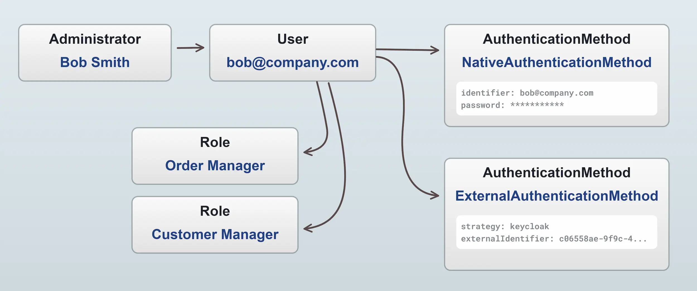
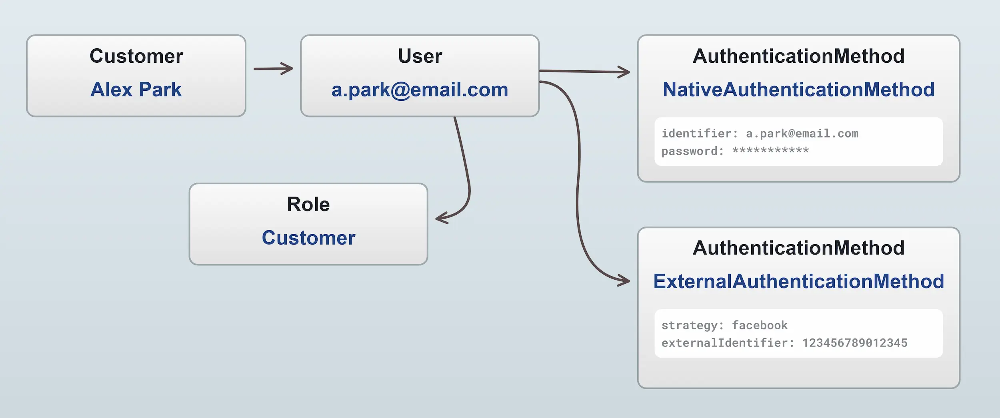
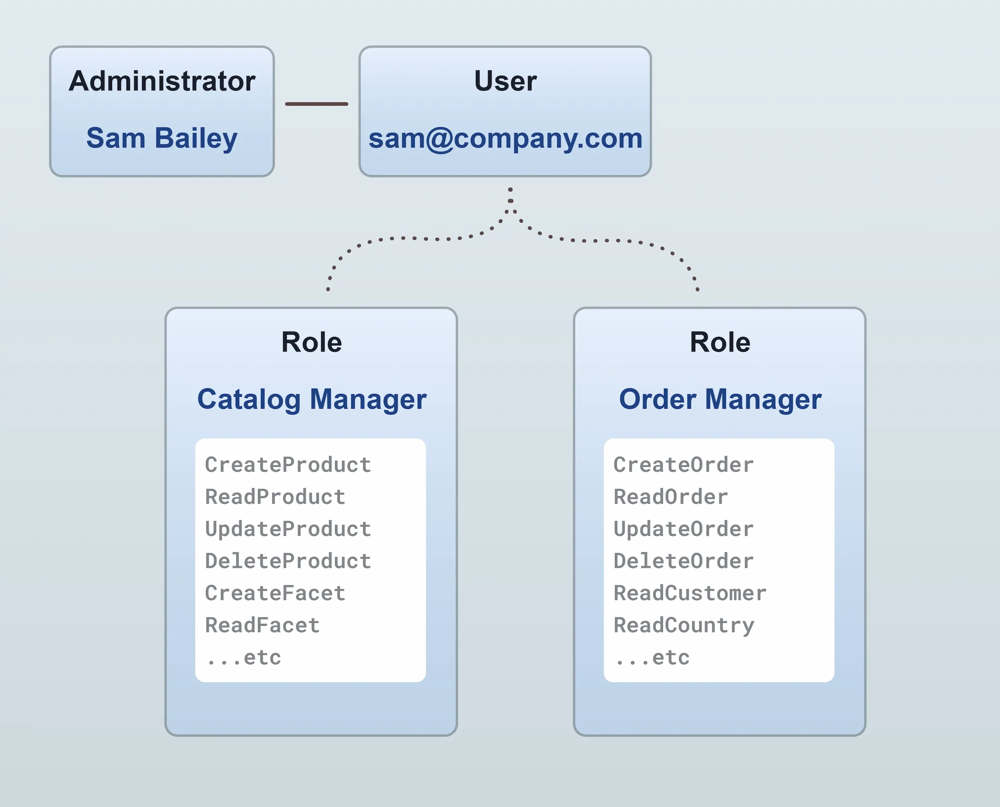

**Authentication** is the process of determining the identity of a user. Common ways of authenticating a user are by asking the user for secret credentials (username & password) or by a third-party authentication provider such as Facebook or Google login.

**Authorization** is a related concept, which means that once we have verified the identity of a user, we can then determine what that user is allowed to do. For example, a user may be authorized to view a product, but not to edit it.

The term **auth** is shorthand for _both_ authentication and authorization.

Auth in Vendure applies to both **administrators** and **customers**. Authentication is controlled by the configured `AuthenticationStrategies`, and authorization is controlled by the configured `Roles` and `Permissions`.

## Administrator auth

Administrators are required to authenticate before they can perform any operations in the Admin API.

Here is a diagram of the parts that make up Administrator authentication:



Roles can be created to allow fine-grained control over what a particular administrator has access to (see the section below).

## Customer auth

Customer only need to authenticate if they want to access a restricted operation related to their account, such as 
viewing past orders or updating an address.

Here are the parts that make up Customer authentication:



### Guest customers

Vendure also supports **guest customers**, meaning that a customer can place an order without needing to register an account, and thus not getting an
associated user or role. A guest customer, having no roles and thus no permissions, is then unable to view past orders or access any other restricted API
operations.

However, a guest customer can at a later point register an account using the same email address, at which point they will get a user with the "Customer" role,
and be able to view their past orders.


## Roles & Permissions

Both the `Customer` and `Administrator` entities relate to a single [`User`](/reference/typescript-api/entities/user/) entity which in turn has one or more [`Roles`](/reference/typescript-api/entities/role/) for controlling permissions.




In the example above, the administrator Sam Bailey has two roles assigned: "Order Manager" and "Catalog Manager". An administrator
can have any number of roles assigned, and the permissions of all roles are combined to determine the permissions of the
administrator. In this way, you can have fine-grained control over which administrators can perform which actions.

There are 2 special roles which are created by default and cannot be changed:

- **SuperAdmin**: This role has all permissions, and cannot be edited or deleted. It is assigned to the first administrator
  created when the server is started.
- **Customer**: This role is assigned to all registered customers.


All other roles can be user-defined. Here's an example of an "Inventory Manager" role being defined in the Admin UI:


## Native authentication

By default, Vendure uses a username/email address and password to authenticate users, which is implemented by the [`NativeAuthenticationStrategy`](/reference/typescript-api/auth/native-authentication-strategy/).

There is a `login` mutation available in both the Shop API and Admin API which allows a customer or administrator to authenticate using
native authentication:

```graphql title="Admin API"
mutation {
  login(username: "superadmin", password: "superadmin") {
    ...on CurrentUser {
      id
      identifier
    }
    ...on ErrorResult {
      errorCode
      message
    }
  }
}
```

:::info
See the [Managing Sessions guide](/guides/storefront/connect-api/#managing-sessions) for how to manage authenticated sessions in your storefront/client applications.
:::

## External authentication

In addition to the built-in `NativeAuthenticationStrategy`, it is possible to define a custom [`AuthenticationStrategy`](/reference/typescript-api/auth/authentication-strategy) which allows your Vendure server to support other authentication methods such as:

- Social logins (Facebook, Google, GitHub, etc.)
- Single Sign-On (SSO) providers such as Keycloak, Auth0, etc.
- Alternative factors such as SMS, TOTP, etc.

Custom authentication strategies are set via the [`VendureConfig.authOptions` object](/reference/typescript-api/auth/auth-options/#shopauthenticationstrategy):

```ts title="src/vendure-config.ts"
import { VendureConfig, NativeAuthenticationStrategy } from '@vendure/core';

import { FacebookAuthenticationStrategy } from './plugins/authentication/facebook-authentication-strategy';
import { GoogleAuthenticationStrategy } from './plugins/authentication/google-authentication-strategy';
import { KeycloakAuthenticationStrategy } from './plugins/authentication/keycloak-authentication-strategy';

export const config: VendureConfig = {
  authOptions: {
      shopAuthenticationStrategy: [
        new NativeAuthenticationStrategy(),
        new FacebookAuthenticationStrategy(),
        new GoogleAuthenticationStrategy(),
      ],
      adminAuthenticationStrategy: [
        new NativeAuthenticationStrategy(),
        new KeycloakAuthenticationStrategy(),
      ],
  }
}
```

In the above example, we define the strategies available for authenticating in the Shop API and the Admin API. The `NativeAuthenticationStrategy` is the only one actually provided by Vendure out-of-the-box, and this is the default username/email + password strategy.

The other strategies would be custom-built (or provided by future npm packages) by creating classes that implement the [`AuthenticationStrategy` interface](/reference/typescript-api/auth/authentication-strategy).

Let's take a look at a couple of examples of what a custom AuthenticationStrategy implementation would look like.

## Custom authentication examples

### Google authentication

This example demonstrates how to implement a Google login flow.

#### Storefront setup

In your storefront, you need to integrate the Google sign-in button as described in ["Integrating Google Sign-In into your web app"](https://developers.google.com/identity/sign-in/web/sign-in). Successful authentication will result in a `onSignIn` function being called in your app. It will look something like this:

```ts
function onSignIn(googleUser) {
  graphQlQuery(
    `mutation Authenticate($token: String!) {
        authenticate(input: {
          google: { token: $token }
        }) {
        ...on CurrentUser {
            id
            identifier
        }
      }
    }`,
    { token: googleUser.getAuthResponse().id_token }
  ).then(() => {
    // redirect to account page
  });
}
```

#### Backend

On the backend, you'll need to define an AuthenticationStrategy to take the authorization token provided by the
storefront in the `authenticate` mutation, and use it to get the necessary personal information on that user from
Google.

To do this you'll need to install the `google-auth-library` npm package as described in the ["Authenticate with a backend server" guide](https://developers.google.com/identity/sign-in/web/backend-auth).

```ts title="src/plugins/authentication/google-authentication-strategy.ts"
import {
    AuthenticationStrategy,
    ExternalAuthenticationService,
    Injector,
    RequestContext,
    User,
} from '@vendure/core';
import { OAuth2Client } from 'google-auth-library';
import { DocumentNode } from 'graphql';
import gql from 'graphql-tag';

export type GoogleAuthData = {
    token: string;
};

export class GoogleAuthenticationStrategy implements AuthenticationStrategy<GoogleAuthData> {
    readonly name = 'google';
    private client: OAuth2Client;
    private externalAuthenticationService: ExternalAuthenticationService;

    constructor(private clientId: string) {
        // The clientId is obtained by creating a new OAuth client ID as described
        // in the Google guide linked above.
        this.client = new OAuth2Client(clientId);
    }

    init(injector: Injector) {
        // The ExternalAuthenticationService is a helper service which encapsulates much
        // of the common functionality related to dealing with external authentication
        // providers.
        this.externalAuthenticationService = injector.get(ExternalAuthenticationService);
    }

    defineInputType(): DocumentNode {
        // Here we define the expected input object expected by the `authenticate` mutation
        // under the "google" key.
        return gql`
        input GoogleAuthInput {
            token: String!
        }
    `;
    }

    async authenticate(ctx: RequestContext, data: GoogleAuthData): Promise<User | false> {
        // Here is the logic that uses the token provided by the storefront and uses it
        // to find the user data from Google.
        const ticket = await this.client.verifyIdToken({
            idToken: data.token,
            audience: this.clientId,
        });
        const payload = ticket.getPayload();
        if (!payload || !payload.email) {
            return false;
        }

        // First we check to see if this user has already authenticated in our
        // Vendure server using this Google account. If so, we return that
        // User object, and they will be now authenticated in Vendure.
        const user = await this.externalAuthenticationService.findCustomerUser(ctx, this.name, payload.sub);
        if (user) {
            return user;
        }

        // If no user was found, we need to create a new User and Customer based
        // on the details provided by Google. The ExternalAuthenticationService
        // provides a convenience method which encapsulates all of this into
        // a single method call.
        return this.externalAuthenticationService.createCustomerAndUser(ctx, {
            strategy: this.name,
            externalIdentifier: payload.sub,
            verified: payload.email_verified || false,
            emailAddress: payload.email,
            firstName: payload.given_name,
            lastName: payload.family_name,
        });
    }
}
```

### Facebook authentication

This example demonstrates how to implement a Facebook login flow.

#### Storefront setup

In this example, we are assuming the use of the [Facebook SDK for JavaScript](https://developers.facebook.com/docs/javascript/) in the storefront.

An implementation in React might look like this:

```tsx title="/storefront/src/components/FacebookLoginButton.tsx"
/**
 * Renders a Facebook login button.
 */
export const FBLoginButton = () => {
    const fnName = `onFbLoginButtonSuccess`;
    const router = useRouter();
    const [error, setError] = useState('');
    const [socialLoginMutation] = useMutation(AuthenticateDocument);

    useEffect(() => {
        (window as any)[fnName] = function() {
            FB.getLoginStatus(login);
        };
        return () => {
            delete (window as any)[fnName];
        };
    }, []);

    useEffect(() => {
        window?.FB?.XFBML.parse();
    }, []);

    const login = async (response: any) => {
        const {status, authResponse} = response;
        if (status === 'connected') {
            const result = await socialLoginMutation({variables: {token: authResponse.accessToken}});
            if (result.data?.authenticate.__typename === 'CurrentUser') {
                // The user has logged in, refresh the browser
                trackLogin('facebook');
                router.reload();
                return;
            }
        }
        setError('An error occurred!');
    };

    return (
        <div className="text-center" style={{ width: 188, height: 28 }}>
            <FacebookSDK />
            <div
                className="fb-login-button"
                data-width=""
                data-size="medium"
                data-button-type="login_with"
                data-layout="default"
                data-auto-logout-link="false"
                data-use-continue-as="false"
                data-scope="public_profile,email"
                data-onlogin={`${fnName}();`}
            />
            {error && <div className="text-sm text-red-500">{error}</div>}
        </div>
  );
};
```

#### Backend

```ts title="/src/plugins/authentication/facebook-authentication-strategy.ts"
import {
    AuthenticationStrategy,
    ExternalAuthenticationService,
    Injector,
    Logger,
    RequestContext,
    User,
    UserService,
} from '@vendure/core';

import { DocumentNode } from 'graphql';
import gql from 'graphql-tag';
import fetch from 'node-fetch';

export type FacebookAuthData = {
    token: string;
};

export type FacebookAuthConfig = {
    appId: string;
    appSecret: string;
    clientToken: string;
};

export class FacebookAuthenticationStrategy implements AuthenticationStrategy<FacebookAuthData> {
    readonly name = 'facebook';
    private externalAuthenticationService: ExternalAuthenticationService;
    private userService: UserService;

    constructor(private config: FacebookAuthConfig) {
    }

    init(injector: Injector) {
        // The ExternalAuthenticationService is a helper service which encapsulates much
        // of the common functionality related to dealing with external authentication
        // providers.
        this.externalAuthenticationService = injector.get(ExternalAuthenticationService);
        this.userService = injector.get(UserService);
    }

    defineInputType(): DocumentNode {
        // Here we define the expected input object expected by the `authenticate` mutation
        // under the "google" key.
        return gql`
      input FacebookAuthInput {
        token: String!
      }
    `;
    }

    private async getAppAccessToken() {
        const resp = await fetch(
            `https://graph.facebook.com/oauth/access_token?client_id=${this.config.appId}&client_secret=${this.config.appSecret}&grant_type=client_credentials`,
        );
        return await resp.json();
    }

    async authenticate(ctx: RequestContext, data: FacebookAuthData): Promise<User | false> {
        const {token} = data;
        const {access_token} = await this.getAppAccessToken();
        const resp = await fetch(
            `https://graph.facebook.com/debug_token?input_token=${token}&access_token=${access_token}`,
        );
        const result = await resp.json();

        if (!result.data) {
            return false;
        }

        const uresp = await fetch(`https://graph.facebook.com/me?access_token=${token}&fields=email,first_name,last_name`);
        const uresult = (await uresp.json()) as { id?: string; email: string; first_name: string; last_name: string };

        if (!uresult.id) {
            return false;
        }

        const existingUser = await this.externalAuthenticationService.findCustomerUser(ctx, this.name, uresult.id);

        if (existingUser) {
            // This will select all the auth methods
            return (await this.userService.getUserById(ctx, existingUser.id))!;
        }

        Logger.info(`User Create: ${JSON.stringify(uresult)}`);
        const user = await this.externalAuthenticationService.createCustomerAndUser(ctx, {
            strategy: this.name,
            externalIdentifier: uresult.id,
            verified: true,
            emailAddress: uresult.email,
            firstName: uresult.first_name,
            lastName: uresult.last_name,
        });

        user.verified = true;
        return user;
    }
}
```

### Keycloak authentication

Here's an example of an AuthenticationStrategy intended to be used on the Admin API. The use-case is when the company has an existing identity server for employees, and you'd like your Vendure shop admins to be able to authenticate with their existing accounts.

This example uses [Keycloak](https://www.keycloak.org/), a popular open-source identity management server. To get your own Keycloak server up and running in minutes, follow the [Keycloak on Docker](https://www.keycloak.org/getting-started/getting-started-docker) guide.

#### Configure a login page & Admin UI

In this example, we'll assume the login page is hosted at `http://intranet/login`. We'll also assume that a "login to Vendure" button has been added to that page and that the page is using the [Keycloak JavaScript adapter](https://www.keycloak.org/docs/latest/securing_apps/index.html#_javascript_adapter), which can be used to get the current user's authorization token:

```js title="/login/index.html"
const vendureLoginButton = document.querySelector('#vendure-login-button');

vendureLoginButton.addEventListener('click', () => {
  return graphQlQuery(`
    mutation Authenticate($token: String!) {
      authenticate(input: {
        keycloak: {
          token: $token
        }
      }) {
        ...on CurrentUser { id }
      }
    }`,
    { token: keycloak.token },
  )
  .then((result) => {
      if (result.data?.authenticate.user) {
          // successfully authenticated - redirect to Vendure Admin UI
          window.location.replace('http://localhost:3000/admin');
      }
  });
});
```

We also need to tell the Admin UI application about the custom login URL, since we have no need for the default "username/password" login form. This can be done by setting the [`loginUrl` property](/reference/typescript-api/common/admin-ui/admin-ui-config#loginurl) in the AdminUiConfig:

```ts title="/src/vendure-config.ts"
import { VendureConfig } from '@vendure/core';
import { AdminUiPlugin } from '@vendure/admin-ui-plugin';

export const config: VendureConfig = {
    // ...
    plugins: [
        AdminUiPlugin.init({
            port: 5001,
            adminUiConfig: {
                loginUrl: 'http://intranet/login',
            },
        }),
    ],
};
```

#### Backend

First we will need to be making an HTTP call to our Keycloak server to validate the token and get the user's details. We'll use the [`node-fetch`](https://www.npmjs.com/package/node-fetch) library to make the HTTP call:

```bash
npm install node-fetch
```

The strategy is very similar to the Google authentication example (they both use the OpenID Connect standard), so we'll not duplicate the explanatory comments here:

```ts title="/src/plugins/authentication/keycloak-authentication-strategy.ts"
import fetch from 'node-fetch';
import {
    AuthenticationStrategy,
    ExternalAuthenticationService,
    Injector,
    Logger,
    RequestContext,
    RoleService,
    User,
} from '@vendure/core';
import { DocumentNode } from 'graphql';
import gql from 'graphql-tag';

export type KeycloakAuthData = {
    token: string;
};

export class KeycloakAuthenticationStrategy implements AuthenticationStrategy<KeycloakAuthData> {
    readonly name = 'keycloak';
    private externalAuthenticationService: ExternalAuthenticationService;
    private httpService: HttpService;
    private roleService: RoleService;

    init(injector: Injector) {
        this.externalAuthenticationService = injector.get(ExternalAuthenticationService);
        this.httpService = injector.get(HttpService);
        this.roleService = injector.get(RoleService);
    }

    defineInputType(): DocumentNode {
        return gql`
      input KeycloakAuthInput {
        token: String!
      }
    `;
    }

    async authenticate(ctx: RequestContext, data: KeycloakAuthData): Promise<User | false> {
        const { data: userInfo } = await fetch(
            'http://localhost:9000/auth/realms/myrealm/protocol/openid-connect/userinfo', {
                headers: {
                    Authorization: `Bearer ${data.token}`,
                },
            }).then(res => res.json());

        if (!userInfo) {
            return false;
        }
        const user = await this.externalAuthenticationService.findAdministratorUser(ctx, this.name, userInfo.sub);
        if (user) {
            return user;
        }

        // When creating an Administrator, we need to know what Role(s) to assign.
        // In this example, we've created a "merchant" role and assign that to all
        // new Administrators. In a real implementation, you can have more complex
        // logic to map an external user to a given role.
        const roles = await this.roleService.findAll();
        const merchantRole = roles.items.find((r) => r.code === 'merchant');
        if (!merchantRole) {
            Logger.error(`Could not find "merchant" role`);
            return false;
        }

        return this.externalAuthenticationService.createAdministratorAndUser(ctx, {
            strategy: this.name,
            externalIdentifier: userInfo.sub,
            identifier: userInfo.preferred_username,
            emailAddress: userInfo.email,
            firstName: userInfo.given_name,
            lastName: userInfo.family_name,
            roles: [merchantRole],
        });
    }
}
```
