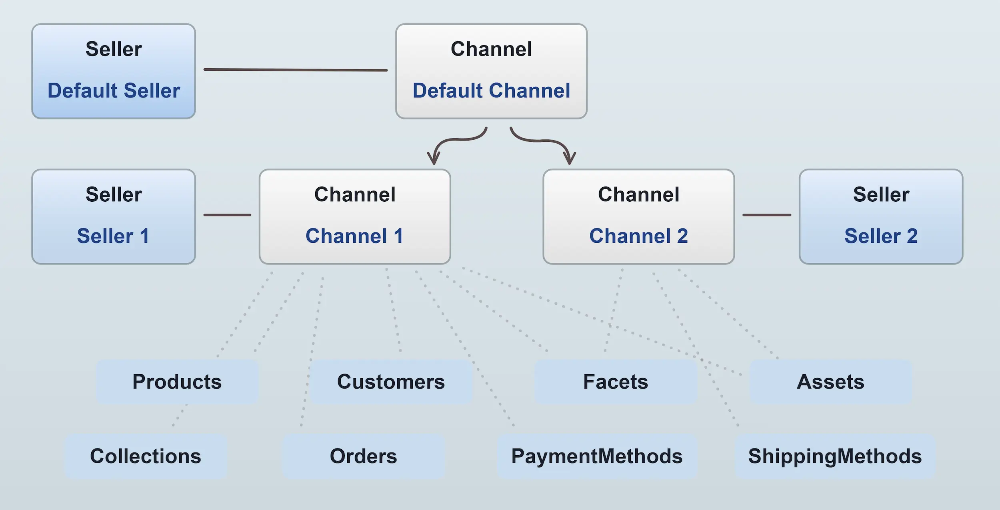
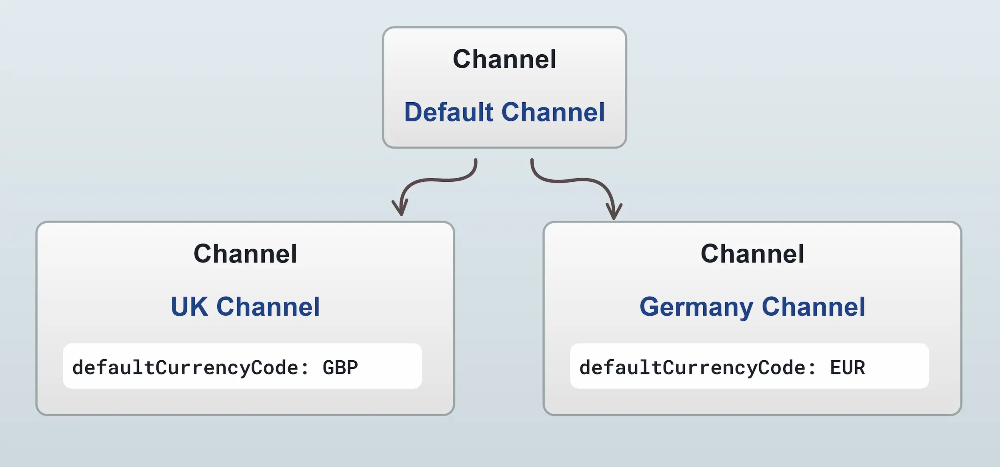
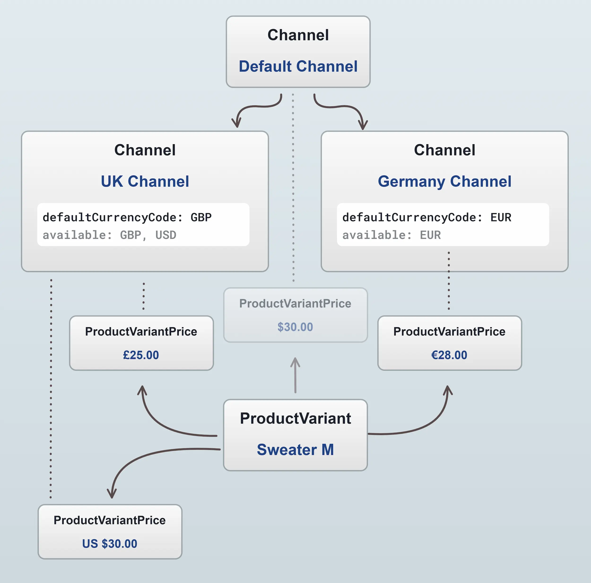
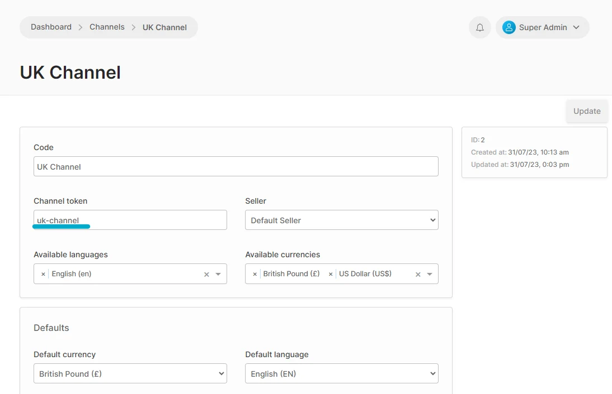

Channels are a feature of Vendure which allows multiple sales channels to be represented in a single Vendure instance. A Channel allows you to:

* Set Channel-specific currency, language, tax and shipping defaults
* Assign only specific products to the channel (with channel-specific prices)
* Create administrator roles limited to one or more channels
* Assign specific stock locations, assets, facets, collections, promotions, and other entities to the channel
* Have orders and customers associated with specific channels.

This is useful for a number of use-cases, including:

- **Multi-tenancy**: Each channel can be configured with its own set of products, shipping methods, payment methods, etc. This
  allows you to run multiple shops from a single Vendure server.
- **Multi-vendor**: Each channel can represent a distinct vendor or seller, which can be used to implement a marketplace.
- **Region-specific stores**: Each channel can be configured with its own set of languages, currencies, tax rates, etc. This
  allows you to run multiple stores for different regions from a single Vendure server.
- **Distinct sales channels**: Each channel can represent a sales channel of a single business, with one channel for the online
  store, one for selling via Amazon, one for selling via Facebook etc.


Every Vendure server always has a **default Channel**, which contains _all_ entities. Subsequent channels can then contain a subset of channel-aware entities.



## Channel-aware entities

Many entities are channel-aware, meaning that they can be associated with a multiple channels. The following entities are channel-aware:

- [`Asset`](/reference/typescript-api/entities/asset/)
- [`Collection`](/reference/typescript-api/entities/collection/)
- [`Customer`](/reference/typescript-api/entities/customer-group/)
- [`Facet`](/reference/typescript-api/entities/facet/)
- [`FacetValue`](/reference/typescript-api/entities/facet-value/)
- [`Order`](/reference/typescript-api/entities/order/)
- [`PaymentMethod`](/reference/typescript-api/entities/payment-method/)
- [`Product`](/reference/typescript-api/entities/product/)
- [`ProductVariant`](/reference/typescript-api/entities/product-variant/)
- [`Promotion`](/reference/typescript-api/entities/promotion/)
- [`Role`](/reference/typescript-api/entities/role/)
- [`ShippingMethod`](/reference/typescript-api/entities/shipping-method/)
- [`StockLocation`](/reference/typescript-api/entities/stock-location/)

## Channels & Sellers

Each channel is also assigned a single [`Seller`](/reference/typescript-api/entities/seller/). This entity is used to represent
the vendor or seller of the products in the channel. This is useful for implementing a marketplace, where each channel represents
a distinct vendor. The `Seller` entity can be extended with [custom fields](/guides/developer-guide/custom-fields/) to store additional information about the seller, such as a logo, contact details etc.

## Channels, Currencies & Prices

Each Channel has a set of `availableCurrencyCodes`, and one of these is designated as the `defaultCurrencyCode`, which sets the default currency for all monetary values in that channel.



Internally, there is a one-to-many relation from [`ProductVariant`](/reference/typescript-api/entities/product-variant/) to [`ProductVariantPrice`](/reference/typescript-api/entities/product-variant-price). So the ProductVariant does _not_ hold a price for the product - this is actually stored on the `ProductVariantPrice` entity, and there will be at least one for each Channel to which the ProductVariant has been assigned.



In this diagram we can see that every channel has at least 1 `ProductVariantPrice`. In the case of the UK Channel, there are 2 prices assigned - one for
GBP and one for USD. This means that you are able to define multiple prices in different currencies on a single product variant for a single channel.

:::info
**Note:** in the diagram above that the ProductVariant is **always assigned to the default Channel**, and thus will have a price in the default channel too. Likewise, the default Channel also has a defaultCurrencyCode. Depending on your requirements, you may or may not make use of the default Channel.
:::

### Keeping prices synchronized

When you have products assigned to multiple channels, updates to the price of a product in one channel will not automatically
be reflected in other channels. For instance, in the diagram above, both the Default channel and the UK channel have a price
in USD for the same product variant. 

If an administrator of the UK channel changes the USD price to $20, the price in the Default channel will remain at $30. This
is the default behavior, and is controlled by the [ProductVariantPriceUpdateStrategy](/reference/typescript-api/configuration/product-variant-price-update-strategy).

If you want to keep prices synchronized across all channels, you can set the `syncPricesAcrossChannels` property of the
[DefaultProductVariantPriceUpdateStrategy](/reference/typescript-api/configuration/product-variant-price-update-strategy#defaultproductvariantpriceupdatestrategy)
to `true`. This will ensure that when the price of a product variant is updated in one channel, the price in all other channels
(of that particular currency) will be updated to match.

```ts
import { DefaultProductVariantPriceUpdateStrategy, VendureConfig } from '@vendure/core';

export const config: VendureConfig = {
    // ...
    // highlight-start
    productVariantPriceUpdateStrategy: new DefaultProductVariantPriceUpdateStrategy({
        syncPricesAcrossChannels: true,
    }),
    // highlight-end
    // ...
};
```

You may however require even more sophisticated logic. For instance, you may want a one-way synchronization, where the price
in the Default channel is always the master price, and the prices in other channels are updated to match. In this case, you
can create a custom `ProductVariantPriceUpdateStrategy` which implements the desired logic.

## Use cases

### Single shop

This is the simplest set-up. You just use the default Channel for everything.

### Multiple separate shops

Let's say you are running multiple distinct businesses, each with its own distinct inventory and possibly different currencies. In this case, you set up a Channel for each shop and create the Product & Variants in the relevant shop's Channel.

The default Channel can then be used by the superadmin for administrative purposes, but other than that the default Channel would not be used. Storefronts would only target a specific shop's Channel.

### Multiple shops sharing inventory

Let's say you have a single inventory but want to split it between multiple shops. There might be overlap in the inventory, e.g. the US & EU shops share 80% of inventory, and then the rest is specific to either shop.

In this case, you can create the entire inventory in the default Channel and then assign the Products & ProductVariants to each Channel as needed, setting the price as appropriate for the currency used by each shop.

:::caution
**Note:** When creating a new Product & ProductVariants inside a sub-Channel, it will also **always get assigned to the default Channel**. If your sub-Channel uses a different currency from the default Channel, you should be aware that in the default Channel, that ProductVariant will be assigned the **same price** as it has in the sub-Channel. If the currency differs between the Channels, you need to make sure to set the correct price in the default Channel if you are exposing it to Customers via a storefront. 
:::

### Multi-vendor marketplace

This is the most advanced use of channels. For a detailed guide to this use-case, see our [Multi-vendor marketplace guide](/guides/how-to/multi-vendor-marketplaces/).


## Specifying channel in the GraphQL API

To specify which channel to use when making an API call, set the `'vendure-token'` header to match the token of the desired Channel.

For example, if we have a UK Channel with the token set to "uk-channel" as shown in this screenshot:



Then we can make a GraphQL API call to the UK Channel by setting the `'vendure-token'` header to `'uk-channel'`:

```ts title="GraphQL API call to UK Channel"
const { loading, error, data } = useQuery(GET_PRODUCT_LIST, {
    context: {
        // highlight-start
        headers: {
            'vendure-token': 'uk-channel',
        },
        // highlight-end
    },
});
```

:::note
This is an example using Apollo Client in React. The same principle applies to any GraphQL client library - set the `'vendure-token'` header to the token of the desired Channel.
:::

With the above header set, the API call will be made to the UK Channel, and the response will contain only the entities which are assigned to that Channel.
