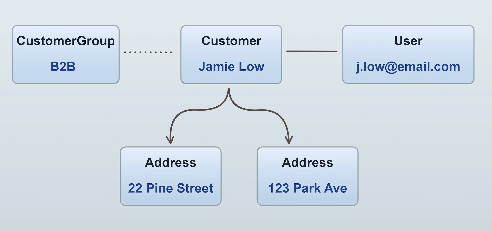

A [`Customer`](/reference/typescript-api/entities/customer/) is a person who can buy from your shop. A customer can have one or more
[`Addresses`](/reference/typescript-api/entities/address/), which are used for shipping and billing.

If a customer has registered an account, they will have an associated [`User`](/reference/typescript-api/entities/user/). The user
entity is used for authentication and authorization. **Guest checkouts** are also possible, in which case a customer will not have a user.

:::info
See the [Auth guide](/guides/core-concepts/auth/#customer-auth) for a detailed explanation of the relationship between
customers and users.
:::

Customers can be organized into [`CustomerGroups`](/reference/typescript-api/entities/customer-group/). These groups can be used in
logic relating to promotions, shipping rules, payment rules etc. For example, you could create a "VIP" customer group and then create
a promotion which grants members of this group free shipping. Or a "B2B" group which is used in a custom tax calculator to
apply a different tax rate to B2B customers.
