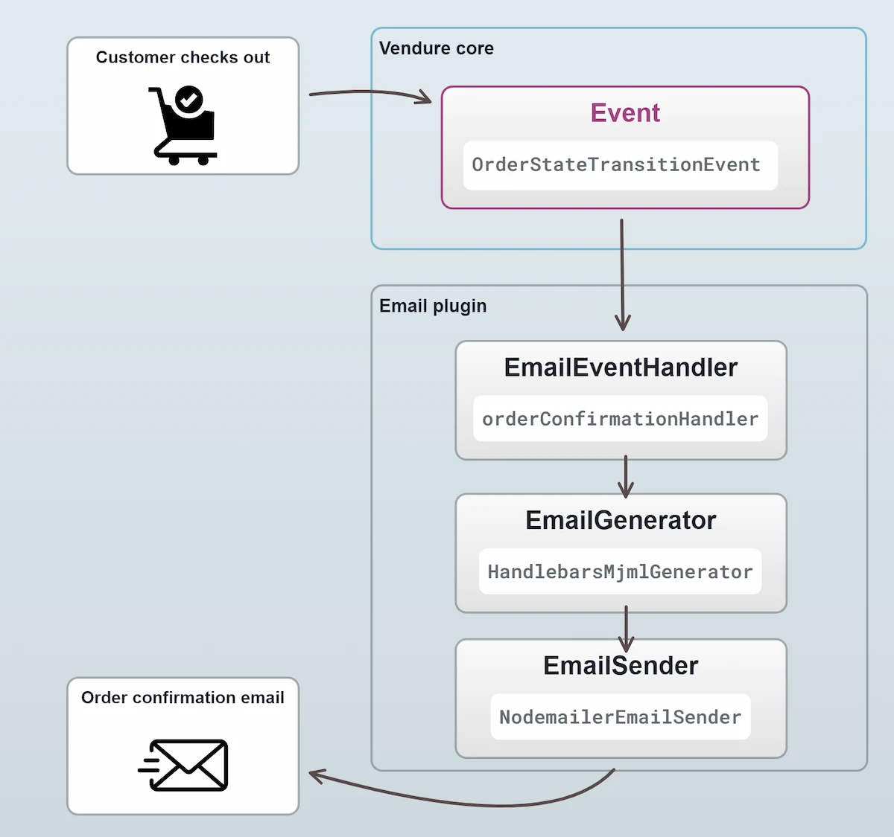

A typical ecommerce application needs to notify customers of certain events, such as when they place an order or
when their order has been shipped. This is usually done via email, but can also be done via SMS or push notifications.

## Email

Email is the most common way to notify customers of events, so a default Vendure installation includes our [EmailPlugin](/reference/core-plugins/email-plugin).

The EmailPlugin by default uses [Nodemailer](https://nodemailer.com/about/) to send emails via a variety of
different transports, including SMTP, SendGrid, Mailgun, and more.
The plugin is configured with a list of [EmailEventHandlers](/reference/core-plugins/email-plugin/email-event-handler) which are responsible for
sending emails in response to specific events.

:::note
This guide will cover some of the main concepts of the EmailPlugin, but for a more in-depth look at how to configure
and use it, see the [EmailPlugin API docs](/reference/core-plugins/email-plugin).
:::

Here's an illustration of the flow of an email being sent:



All emails are triggered by a particular [Event](/guides/developer-guide/events/) - in this case when the state of an
Order changes. The EmailPlugin ships with a set of [default email handlers](https://github.com/vendure-ecommerce/vendure/blob/master/packages/email-plugin/src/default-email-handlers.ts),
one of which is responsible for sending "order confirmation" emails.

### EmailEventHandlers

Let's take a closer look at a simplified version of the `orderConfirmationHandler`:

```ts
import { OrderStateTransitionEvent } from '@vendure/core';
import { EmailEventListener, transformOrderLineAssetUrls, hydrateShippingLines } from '@vendure/email-plugin';

// The 'order-confirmation' string is used by the EmailPlugin to identify
// which template to use when rendering the email.
export const orderConfirmationHandler = new EmailEventListener('order-confirmation')
    .on(OrderStateTransitionEvent)
    // Only send the email when the Order is transitioning to the
    // "PaymentSettled" state and the Order has a customer associated with it.
    .filter(
        event =>
            event.toState === 'PaymentSettled'
            && !!event.order.customer,
    )
    // We commonly need to load some additional data to be able to render the email
    // template. This is done via the `loadData()` method. In this method we are
    // mutating the Order object to ensure that product images are correctly
    // displayed in the email, as well as fetching shipping line data from the database.
    .loadData(async ({ event, injector }) => {
        transformOrderLineAssetUrls(event.ctx, event.order, injector);
        const shippingLines = await hydrateShippingLines(event.ctx, event.order, injector);
        return { shippingLines };
    })
    // Here we are setting the recipient of the email to be the
    // customer's email address.
    .setRecipient(event => event.order.customer!.emailAddress)
    // We can interpolate variables from the EmailPlugin's configured
    // `globalTemplateVars` object.
    .setFrom('{{ fromAddress }}')
    // We can also interpolate variables made available by the
    // `setTemplateVars()` method below
    .setSubject('Order confirmation for #{{ order.code }}')
    // The object returned here defines the variables which are
    // available to the email template.
    .setTemplateVars(event => ({ order: event.order, shippingLines: event.data.shippingLines }))
```

To recap:

- The handler listens for a specific event
- It optionally filters those events to determine whether an email should be sent
- It specifies the details of the email to be sent, including the recipient, subject, template variables, etc.

The full range of methods available when setting up an EmailEventHandler can be found in the [EmailEventHandler API docs](/reference/core-plugins/email-plugin/email-event-handler).

### Email variables

In the example above, we used the `setTemplateVars()` method to define the variables which are available to the email template.
Additionally, there are global variables which are made available to _all_ email templates & EmailEventHandlers. These are
defined in the `globalTemplateVars` property of the EmailPlugin config:

```ts title="src/vendure-config.ts"
import { VendureConfig } from '@vendure/core';
import { EmailPlugin } from '@vendure/email-plugin';

export const config: VendureConfig = {
    // ...
    plugins: [
        EmailPlugin.init({
            // ...
            // highlight-start
            globalTemplateVars: {
                fromAddress: '"MyShop" <noreply@myshop.com>',
                verifyEmailAddressUrl: 'https://www.myshop.com/verify',
                passwordResetUrl: 'https://www.myshop.com/password-reset',
                changeEmailAddressUrl: 'https://www.myshop.com/verify-email-address-change'
            },
            // highlight-end
        }),
    ],
};
```

### Email integrations

The EmailPlugin is designed to be flexible enough to work with many different email services. The default
configuration uses Nodemailer to send emails via SMTP, but you can easily configure it to use a different
transport. For instance:

- [AWS SES](https://www.vendure.io/marketplace/aws-ses)
- [SendGrid](https://www.vendure.io/marketplace/sendgrid)

## Other notification methods

The pattern of listening for events and triggering some action in response is not limited to emails. You can
use the same pattern to trigger other actions, such as sending SMS messages or push notifications. For instance,
let's say you wanted to create a plugin which sends an SMS message to the customer when their order is shipped.

:::note
This is just a simplified example to illustrate the pattern.
:::

```ts title="src/plugins/sms-plugin/sms-plugin.ts"
import { OnModuleInit } from '@nestjs/common';
import { PluginCommonModule, VendurePlugin, EventBus } from '@vendure/core';
import { OrderStateTransitionEvent } from '@vendure/core';

// A custom service which sends SMS messages
// using a third-party SMS provider such as Twilio.
import { SmsService } from './sms.service';

@VendurePlugin({
    imports: [PluginCommonModule],
    providers: [SmsService],
})
export class SmsPlugin implements OnModuleInit {
    constructor(
        private eventBus: EventBus,
        private smsService: SmsService,
    ) {}

    onModuleInit() {
        this.eventBus
            .ofType(OrderStateTransitionEvent)
            .filter(event => event.toState === 'Shipped')
            .subscribe(event => {
                this.smsService.sendOrderShippedMessage(event.order);
            });
    }
}
```