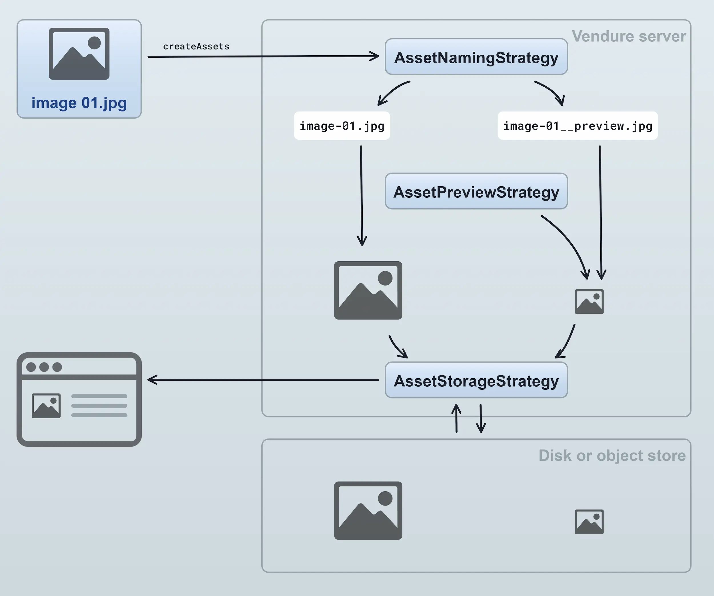
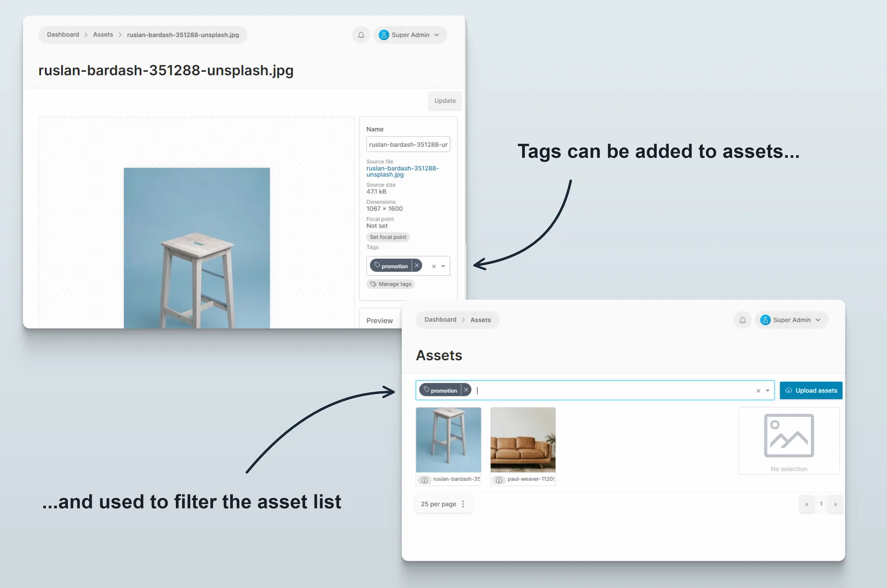

[`Assets`](/reference/typescript-api/entities/asset/) are used to store files such as images, videos, PDFs, etc. Assets can be
assigned to **products**, **variants** and **collections** by default. By using [custom fields](/guides/developer-guide/custom-fields/) it is
possible to assign assets to other entities. For example, for implementing customer profile images.

The handling of assets in Vendure is implemented in a modular way, allowing you full control over the way assets
are stored, named, imported and previewed.

1. An asset is created by uploading an image. Internally the [`createAssets` mutation](/reference/graphql-api/admin/mutations/#createassets) will be executed.
2. The [`AssetNamingStrategy`](/reference/typescript-api/assets/asset-naming-strategy/) is used to generate file names for the source image and the preview. This is useful for normalizing file names as well as handling name conflicts.
3. The [`AssetPreviewStrategy`](/reference/typescript-api/assets/asset-preview-strategy) generates a preview image of the asset. For images, this typically involves creating a version with constraints on the maximum dimensions. It could also be used to e.g. generate a preview image for uploaded PDF files, videos or other non-image assets (such functionality would require a custom `AssetPreviewStrategy` to be defined).
4. The source file as well as the preview image are then passed to the [`AssetStorageStrategy`](/reference/typescript-api/assets/asset-storage-strategy) which stores the files to some form of storage. This could be the local disk or an object store such as AWS S3 or Minio.
5. When an asset is later read, e.g. when a customer views a product detail page which includes an image of the product, the `AssetStorageStrategy` can be used to
read the file from the storage location.

## AssetServerPlugin

Vendure comes with the `@vendure/asset-server-plugin` package pre-installed. This provides the [`AssetServerPlugin`](/reference/core-plugins/asset-server-plugin/) which provides many advanced features to make working with
assets easier.

The plugin provides a ready-made set of strategies for handling assets, but also allows you to replace these defaults with
your own implementations. For example, here are instructions on how to replace the default storage strategy with one
that stores your assets on AWS S3 or Minio: [configure S3 asset storage](/reference/core-plugins/asset-server-plugin/s3asset-storage-strategy#configures3assetstorage)

It also features a powerful image transformation API, which allows you to specify the dimensions, crop, and image format
using query parameters.

:::info
See the [AssetServerPlugin docs](/reference/core-plugins/asset-server-plugin/) for a detailed description of all the features.
:::

## Asset Tags

Assets can be tagged. A [`Tag`](/reference/typescript-api/entities/tag/) is a simple text label that can be applied to an asset. An asset can have multiple tags or none. Tags are useful for organizing assets, since assets are otherwise organized as a flat list with no concept of a directory structure.

