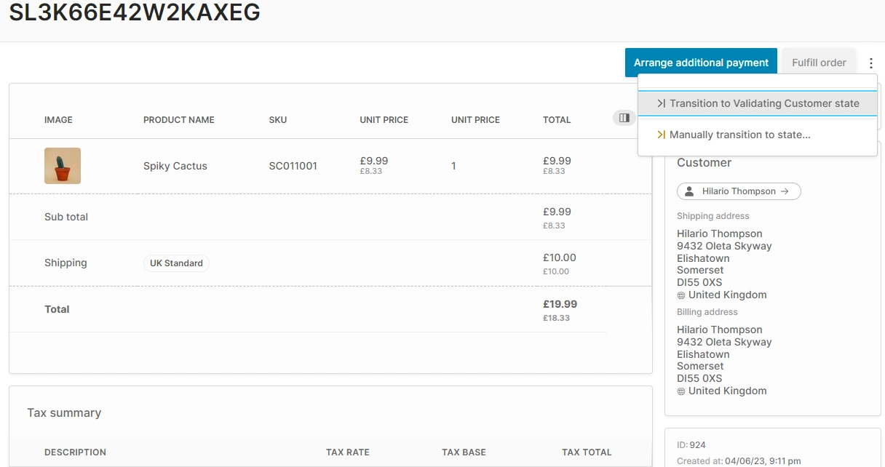

import Tabs from '@theme/Tabs';
import TabItem from '@theme/TabItem';


In Vendure, the [`Order`](/reference/typescript-api/entities/order/) entity represents the entire lifecycle of an order, from the moment a customer adds an item to their cart, through to the point where the order is completed and the customer has received their goods.

An [`Order`](/reference/typescript-api/entities/order/) is composed of one or more [`OrderLines`](/reference/typescript-api/entities/order-line/).
Each order line represents a single product variant, and contains information such as the quantity, price, tax rate, etc.

In turn, the order is associated with a [`Customer`](/reference/typescript-api/entities/customer/) and contains information such as
the shipping address, billing address, shipping method, payment method, etc.


## The Order Process

Vendure defines an order process which is based on a [finite state machine](/reference/typescript-api/state-machine/fsm/) (a method of precisely controlling how the order moves from one state to another). This means that the [`Order.state` property](/reference/typescript-api/entities/order/#state) will be one of a set of [pre-defined states](/reference/typescript-api/orders/order-process/#orderstate). From the current state, the Order can then transition (change) to another state, and the available next states depend on what the current state is.

:::note
In Vendure, there is no distinction between a "cart" and an "order". The same entity is used for both. A "cart" is simply an order
which is still "active" according to its current state.
:::

You can see the current state of an order via `state` field on the `Order` type:

<Tabs>
<TabItem value="Request" label="Request" default>

```graphql title="Shop API"
query ActiveOrder {
    activeOrder {
        id
        // highlight-next-line
        state
    }
}
```

</TabItem>
<TabItem value="Response" label="Response">

```json
{
  "data": {
    "activeOrder": {
      "id": "4",
      // highlight-next-line
      "state": "AddingItems"
    }
  }
}
```

</TabItem>
</Tabs>

The next possible states can be queried via the [`nextOrderStates`](/reference/graphql-api/shop/queries/#nextorderstates) query:

<Tabs>
<TabItem value="Request" label="Request" default>

```graphql title="Shop API"
query NextStates {
  nextOrderStates
}
```

</TabItem>
<TabItem value="Response" label="Response">

```json
{
  "data": {
    "nextOrderStates": [
      "ArrangingPayment",
      "Cancelled"
    ]
  }
}
```

</TabItem>
</Tabs>


The available states and the permissible transitions between them are defined by the configured [`OrderProcess`](/reference/typescript-api/orders/order-process/). By default, Vendure defines a [`DefaultOrderProcess`](/reference/typescript-api/orders/order-process/#defaultorderprocess) which is suitable for typical B2C use-cases. Here's a simplified diagram of the default order process:


Let's take a look at each of these states, and the transitions between them:

* **`AddingItems:`** All orders begin in the `AddingItems` state. This means that the customer is adding items to his or her shopping cart. This is the state an order would be in as long as the customer is still browsing the store.
* **`ArrangingPayment:`** From there, the Order can transition to the `ArrangingPayment`, which will prevent any further modifications to the order, which ensures the price that is sent to the payment provider is the same as the price that the customer saw when they added the items to their cart. At this point, the storefront will execute the [`addPaymentToOrder` mutation](/reference/graphql-api/shop/mutations/#addpaymenttoorder).
* **`PaymentAuthorized:`** Depending on the configured payment method, the order may then transition to the `PaymentAuthorized` state, which indicates that the payment has been successfully authorized by the payment provider. This is the state that the order will be in if the payment is not captured immediately. Once the payment is captured, the order will transition to the `PaymentSettled` state.
* **`PaymentSettled:`** If the payment captured immediately, the order will transition to the `PaymentSettled` state once the payment succeeds.
* At this point, one or more fulfillments can be created. A `Fulfillment` represents the process of shipping one or more items to the customer ("shipping" applies equally to physical or digital goods - it just means getting the product to the customer by any means). A fulfillment can be created via the [`addFulfillmentToOrder` mutation](/reference/graphql-api/admin/mutations/#addfulfillmenttoorder), or via the Admin UI. If multiple fulfillments are created, then the order can end up partial states - `PartiallyShipped` or `PartiallyDelivered`. If there is only a single fulfillment which includes the entire order, then partial states are not possible.
* **`Shipped:`** When all fulfillments have been shipped, the order will transition to the `Shipped` state. This means the goods have left the warehouse and are en route to the customer.
* **`Delivered:`** When all fulfillments have been delivered, the order will transition to the `Delivered` state. This means the goods have arrived at the customer's address. This is the final state of the order.

## Customizing the Default Order Process

It is possible to customize the [defaultOrderProcess](/reference/typescript-api/orders/order-process/#defaultorderprocess) to better match your business needs. For example, you might want to disable some of the constraints that are imposed by the default process, such as the requirement that a customer must have a shipping address before the Order can be completed.

This can be done by creating a custom version of the default process using the [configureDefaultOrderProcess](/reference/typescript-api/orders/order-process/#configuredefaultorderprocess) function, and then passing it to the [`OrderOptions.process`](/reference/typescript-api/orders/order-options/#process) config property.

```ts title="src/vendure-config.ts"
import { configureDefaultOrderProcess, VendureConfig } from '@vendure/core';

const myCustomOrderProcess = configureDefaultOrderProcess({
  // Disable the constraint that requires
  // Orders to have a shipping method assigned
  // before payment.
  arrangingPaymentRequiresShipping: false,
    
  // Other constraints which can be disabled. See the
  // DefaultOrderProcessOptions interface docs for full
  // explanations.
  //  
  // checkModificationPayments: false,
  // checkAdditionalPaymentsAmount: false,
  // checkAllVariantsExist: false,
  // arrangingPaymentRequiresContents: false,
  // arrangingPaymentRequiresCustomer: false,
  // arrangingPaymentRequiresStock: false,
  // checkPaymentsCoverTotal: false,
  // checkAllItemsBeforeCancel: false,
  // checkFulfillmentStates: false,
});

export const config: VendureConfig = {
  orderOptions: {
    process: [myCustomOrderProcess],
  },
};
```

## Custom Order Processes

Sometimes you might need to extend things beyond what is provided by the default Order process to better match your business needs. This is done by defining one or more [`OrderProcess`](/reference/typescript-api/orders/order-process#orderprocess) objects and passing them to the [`OrderOptions.process`](/reference/typescript-api/orders/order-options/#process) config property.

### Adding a new state

Let's say your company can only sell to customers with a valid EU tax ID. We'll assume that you've already used a [custom field](/guides/developer-guide/custom-fields/) to store that code on the Customer entity.

Now you want to add a step _before_ the customer handles payment, where we can collect and verify the tax ID.

So we want to change the default process of:

```text
AddingItems -> ArrangingPayment
```

to instead be:

```text
AddingItems -> ValidatingCustomer -> ArrangingPayment
```

Here's how we would define the new state:

```ts title="src/plugins/tax-id/customer-validation-process.ts"
import { OrderProcess } from '@vendure/core';

export const customerValidationProcess: OrderProcess<'ValidatingCustomer'> = {
  transitions: {
    AddingItems: {
      to: ['ValidatingCustomer'],
      mergeStrategy: 'replace',
    },
    ValidatingCustomer: {
      to: ['ArrangingPayment', 'AddingItems'],
    },
  },
};
```

This object means:

* the `AddingItems` state may _only_ transition to the `ValidatingCustomer` state (`mergeStrategy: 'replace'` tells Vendure to discard any existing transition targets and replace with this one). 
* the `ValidatingCustomer` may transition to the `ArrangingPayment` state (assuming the tax ID is valid) or back to the `AddingItems` state.

And then add this configuration to our main VendureConfig:

```ts title="src/vendure-config.ts"
import { defaultOrderProcess, VendureConfig } from '@vendure/core';
import { customerValidationProcess } from './plugins/tax-id/customer-validation-process';

export const config: VendureConfig = {
  // ...
  orderOptions: {
    process: [defaultOrderProcess, customerValidationProcess],
  },
};
```

Note that we also include the `defaultOrderProcess` in the array, otherwise we will lose all the default states and transitions.

To add multiple new States you need to extend the generic type like this:

 ```ts
import { OrderProcess } from '@vendure/core';

export const customerValidationProcess: OrderProcess<'ValidatingCustomer'|'AnotherState'> = {...}
 ```
This way multiple custom states get defined.

### Intercepting a state transition

Now we have defined our new `ValidatingCustomer` state, but there is as yet nothing to enforce that the tax ID is valid. To add this constraint, we'll use the [`onTransitionStart` state transition hook](/reference/typescript-api/state-machine/state-machine-config#ontransitionstart).

This allows us to perform our custom logic and potentially prevent the transition from occurring. We will also assume that we have a provider named `TaxIdService` available which contains the logic to validate a tax ID.

```ts title="src/plugins/tax-id/customer-validation-process.ts"
import { OrderProcess } from '@vendure/core';
import { TaxIdService } from './services/tax-id.service';

let taxIdService: TaxIdService;

const customerValidationProcess: OrderProcess<'ValidatingCustomer'> = {
  transitions: {
    AddingItems: {
      to: ['ValidatingCustomer'],
      mergeStrategy: 'replace',
    },
    ValidatingCustomer: {
      to: ['ArrangingPayment', 'AddingItems'],
    },
  },

  init(injector) {
    taxIdService = injector.get(TaxIdService);
  },

  // The logic for enforcing our validation goes here
  async onTransitionStart(fromState, toState, data) {
    if (fromState === 'ValidatingCustomer' && toState === 'ArrangingPayment') {
      const isValid = await taxIdService.verifyTaxId(data.order.customer);
      if (!isValid) {
        // Returning a string is interpreted as an error message.
        // The state transition will fail.
        return `The tax ID is not valid`;
      }
    }
  },
};
```

:::info
For an explanation of the `init()` method and `injector` argument, see the guide on [injecting dependencies in configurable operations](/guides/developer-guide/strategies-configurable-operations/#injecting-dependencies).
:::

### Responding to a state transition

Once an order has successfully transitioned to a new state, the [`onTransitionEnd` state transition hook](/reference/typescript-api/state-machine/state-machine-config#ontransitionend) is called. This can be used to perform some action
upon successful state transition.

In this example, we have a referral service which creates a new referral for a customer when they complete an order. We want to create the referral only if the customer has a referral code associated with their account.

```ts
import { OrderProcess, OrderState } from '@vendure/core';

import { ReferralService } from '../service/referral.service';

let referralService: ReferralService;

export const referralOrderProcess: OrderProcess<OrderState> = {
    init: (injector) => {
        referralService = injector.get(ReferralService);
    },
    onTransitionEnd: async (fromState, toState, data) => {
        const { order, ctx } = data;
        if (toState === 'PaymentSettled') {
            if (order.customFields.referralCode) {
                await referralService.createReferralForOrder(ctx, order);
            }
        }
    },
};
```

:::caution
Use caution when modifying an order inside the `onTransitionEnd` function. The `order` object that gets passed in to this function
will later be persisted to the database. Therefore any changes must be made to that `order` object, otherwise the changes might be lost.

As an example, let's say we want to add a Surcharge to the order. The following code **will not work as expected**:

```ts
export const myOrderProcess: OrderProcess<OrderState> = {
    async onTransitionEnd(fromState, toState, data) {
        if (fromState === 'AddingItems' && toState === 'ArrangingPayment') {
            // highlight-start
            // WARNING: This will not work!  
            await orderService.addSurchargeToOrder(ctx, order.id, {
                description: 'Test',
                listPrice: 42,
                listPriceIncludesTax: false,
            });
            // highlight-end
        }
    }
};
```

Instead, you need to ensure you **mutate the `order` object**:

```ts
export const myOrderProcess: OrderProcess<OrderState> = {
    async onTransitionEnd(fromState, toState, data) {
        if (fromState === 'AddingItems' && toState === 'ArrangingPayment') {
            // highlight-start
            const {surcharges} = await orderService.addSurchargeToOrder(ctx, order.id, {
                description: 'Test',
                listPrice: 42,
                listPriceIncludesTax: false,
            });
            // Important: mutate the order object
            order.surcharges = surcharges;
            // highlight-end
        }
    },
}
```


:::

## TypeScript Typings

To make your custom states compatible with standard services you should declare your new states in the following way:

```ts title="src/plugins/tax-id/types.ts"
import { CustomOrderStates } from '@vendure/core';

declare module '@vendure/core' {
  interface CustomOrderStates {
    ValidatingCustomer: never;
  }
}
```

This technique uses advanced TypeScript features - [declaration merging](https://www.typescriptlang.org/docs/handbook/declaration-merging.html#merging-interfaces) and  [ambient modules](https://www.typescriptlang.org/docs/handbook/modules.html#ambient-modules).

## Controlling custom states in the Admin UI

If you have defined custom order states, the Admin UI will allow you to manually transition an 
order from one state to another:


