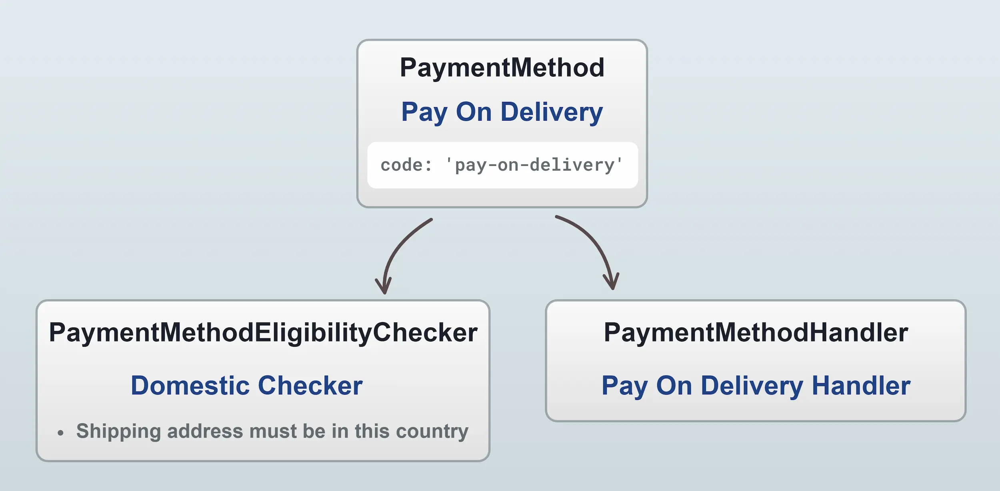
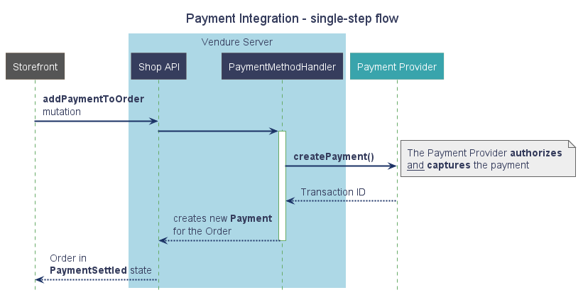
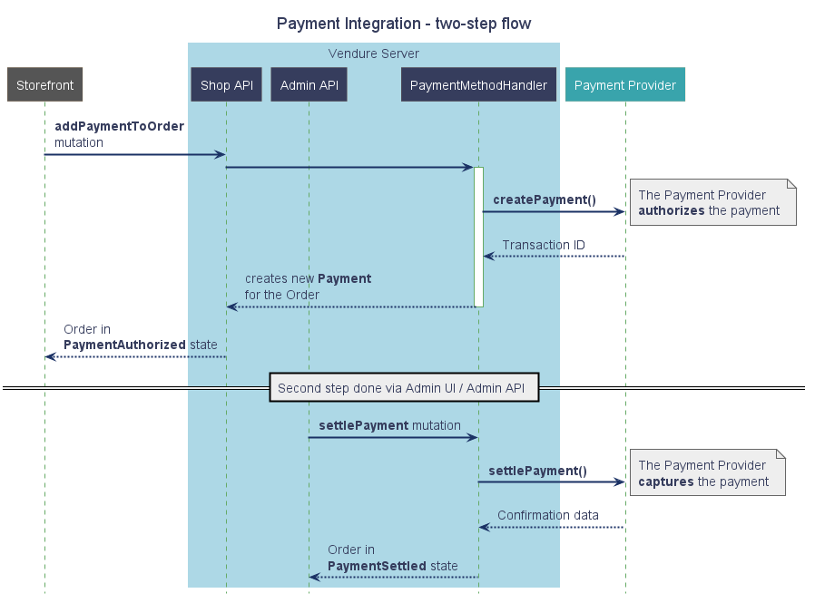

import Tabs from '@theme/Tabs';
import TabItem from '@theme/TabItem';

Vendure can support many kinds of payment workflows, such as authorizing and capturing payment in a single step upon checkout or authorizing on checkout and then capturing on fulfillment.

:::info
For complete working examples of real payment integrations, see the [payments-plugins](https://github.com/vendure-ecommerce/vendure/tree/master/packages/payments-plugin/src)
:::

## Authorization & Settlement

Typically, there are 2 parts to an online payment: **authorization** and **settlement**:

-   **Authorization** is the process by which the customer's bank is contacted to check whether the transaction is allowed. At this stage, no funds are removed from the customer's account.
-   **Settlement** (also known as "capture") is the process by which the funds are transferred from the customer's account to the merchant.

Some merchants do both of these steps at once, when the customer checks out of the store. Others do the authorize step at checkout, and only do the settlement at some later point, e.g. upon shipping the goods to the customer.

This two-step workflow can also be applied to other non-card forms of payment: e.g. if providing a "payment on delivery" option, the authorization step would occur on checkout, and the settlement step would be triggered upon delivery, either manually by an administrator of via an app integration with the Admin API.

## Creating an integration

Payment integrations are created by defining a new [PaymentMethodHandler](/reference/typescript-api/payment/payment-method-handler/) and passing that handler into the [`paymentOptions.paymentMethodHandlers`](/reference/typescript-api/payment/payment-options#paymentmethodhandlers) array in the VendureConfig.

```ts title="src/plugins/payment-plugin/my-payment-handler.ts"
import {
    CancelPaymentResult,
    CancelPaymentErrorResult,
    PaymentMethodHandler,
    VendureConfig,
    CreatePaymentResult,
    SettlePaymentResult,
    SettlePaymentErrorResult
} from '@vendure/core';
import { sdk } from 'payment-provider-sdk';

/**
 * This is a handler which integrates Vendure with an imaginary
 * payment provider, who provide a Node SDK which we use to
 * interact with their APIs.
 */
const myPaymentHandler = new PaymentMethodHandler({
    code: 'my-payment-method',
    description: [{
        languageCode: LanguageCode.en,
        value: 'My Payment Provider',
    }],
    args: {
        apiKey: {type: 'string'},
    },

    /** This is called when the `addPaymentToOrder` mutation is executed */
    createPayment: async (ctx, order, amount, args, metadata): Promise<CreatePaymentResult> => {
        try {
            const result = await sdk.charges.create({
                amount,
                apiKey: args.apiKey,
                source: metadata.token,
            });
            return {
                amount: order.total,
                state: 'Authorized' as const,
                transactionId: result.id.toString(),
                metadata: {
                    cardInfo: result.cardInfo,
                    // Any metadata in the `public` field
                    // will be available in the Shop API,
                    // All other metadata is private and
                    // only available in the Admin API.
                    public: {
                        referenceCode: result.publicId,
                    }
                },
            };
        } catch (err) {
            return {
                amount: order.total,
                state: 'Declined' as const,
                metadata: {
                    errorMessage: err.message,
                },
            };
        }
    },

    /** This is called when the `settlePayment` mutation is executed */
    settlePayment: async (ctx, order, payment, args): Promise<SettlePaymentResult | SettlePaymentErrorResult> => {
        try {
            const result = await sdk.charges.capture({
                apiKey: args.apiKey,
                id: payment.transactionId,
            });
            return {success: true};
        } catch (err) {
            return {
                success: false,
                errorMessage: err.message,
            }
        }
    },

    /** This is called when a payment is cancelled. */
    cancelPayment: async (ctx, order, payment, args): Promise<CancelPaymentResult | CancelPaymentErrorResult> => {
        try {
            const result = await sdk.charges.cancel({
                apiKey: args.apiKey,
                id: payment.transactionId,
            });
            return {success: true};
        } catch (err) {
            return {
                success: false,
                errorMessage: err.message,
            }
        }
    },
});
```

We can now add this handler to our configuration:

```ts title="src/vendure-config.ts"
import { VendureConfig } from '@vendure/core';
import { myPaymentHandler } from './plugins/payment-plugin/my-payment-handler';

export const config: VendureConfig = {
    // ...
    paymentOptions: {
        paymentMethodHandlers: [myPaymentHandler],
    },
};
```

:::info
If your PaymentMethodHandler needs access to the database or other providers, see the [configurable operation dependency injection guide](/guides/developer-guide/strategies-configurable-operations/#injecting-dependencies).
:::

## The PaymentMethod entity

Once the PaymentMethodHandler is defined as above, you can use it to create a new [`PaymentMethod`](/reference/typescript-api/entities/payment-method/) via the Admin UI (_Settings_ -> _Payment methods_, then _Create new payment method_) or via the Admin API `createPaymentMethod` mutation.

A payment method consists of an optional [`PaymentMethodEligibilityChecker`](/reference/typescript-api/payment/payment-method-eligibility-checker/), which is used to determine whether the payment method is available to the customer, and a [`PaymentMethodHandler`](/reference/typescript-api/payment/payment-method-handler).

The payment method also has a **code**, which is a string identifier used to specify this method when adding a payment to an order.



## Payment flow

### Eligible payment methods

Once the active Order has been transitioned to the `ArrangingPayment` state (see the [Order guide](/guides/core-concepts/orders/)), we can query the available payment methods by executing the [`eligiblePaymentMethods` query](/reference/graphql-api/shop/queries#eligiblepaymentmethods).

<Tabs>
<TabItem value="Request" label="Request" default>

```graphql title="Shop API"
query GetEligiblePaymentMethods {
    eligiblePaymentMethods {
        code
        name
        isEligible
        eligibilityMessage
    }
}
```

</TabItem>
<TabItem value="Response" label="Response">

```json
{
  "data": {
    "eligiblePaymentMethods": [
      {
        "code": "my-payment-method",
        "name": "My Payment Method",
        "isEligible": true,
        "eligibilityMessage": null
      }
    ]
  }
}
```

</TabItem>
</Tabs>


### Add payment to order

One or more Payments are created by executing the [`addPaymentToOrder` mutation](/reference/graphql-api/shop/mutations#addpaymenttoorder). This mutation has a required `method` input field, which _must_ match the `code` of an eligible `PaymentMethod`. In the case above, this would be set to `"my-payment-method"`.
 

<Tabs>
<TabItem value="Request" label="Request" default>

```graphql title="Shop API"
mutation {
    addPaymentToOrder(
        input: {
            method: "my-payment-method"
            metadata: { token: "<some token from the payment provider>" }
        }
    ) {
        ... on Order {
            id
            code
            state
            # ... etc
        }
        ... on ErrorResult {
            errorCode
            message
        }
        ...on PaymentFailedError {
            paymentErrorMessage
        }
        ...on PaymentDeclinedError {
            paymentErrorMessage
        }
        ...on IneligiblePaymentMethodError {
            eligibilityCheckerMessage
        }
    }
}

```

</TabItem>
<TabItem value="Response" label="Response">

```json
{
  "data": {
    "addPaymentToOrder": {
      "id": "12345",
      "code": "J9AC5PY13BQGRKTF",
      "state": "PaymentAuthorized"
    }
  }
}
```

</TabItem>
</Tabs>

:::info
The `metadata` field is used to store the specific data required by the payment provider. E.g. some providers have a client-side part which begins the transaction and returns a token which must then be verified on the server side.

The `metadata` field is required, so if your payment provider does not require any additional data, you can simply pass an empty object: `metadata: {}`.
:::

3. This mutation internally invokes the [PaymentMethodHandler's `createPayment()` function](/reference/typescript-api/payment/payment-method-config-options/#createpayment). This function returns a [CreatePaymentResult object](/reference/typescript-api/payment/payment-method-types#createpaymentfn) which is used to create a new [Payment](/reference/typescript-api/entities/payment). If the Payment amount equals the order total, then the Order is transitioned to either the `PaymentAuthorized` or `PaymentSettled` state and the customer checkout flow is complete.

### Single-step

If the `createPayment()` function returns a result with the state set to `'Settled'`, then this is a single-step ("authorize & capture") flow, as illustrated below:



### Two-step

If the `createPayment()` function returns a result with the state set to `'Authorized'`, then this is a two-step flow, and the settlement / capture part is performed at some later point, e.g. when shipping the goods, or on confirmation of payment-on-delivery.



## Custom Payment Flows

If you need to support an entirely different payment flow than the above, it is also possible to do so by configuring a [PaymentProcess](/reference/typescript-api/payment/payment-process). This allows new Payment states and transitions to be defined, as well as allowing custom logic to run on Payment state transitions.

Here's an example which adds a new "Validating" state to the Payment state machine, and combines it with a [OrderProcess](/reference/typescript-api/orders/order-process), [PaymentMethodHandler](/reference/typescript-api/payment/payment-method-handler) and [OrderPlacedStrategy](/reference/typescript-api/orders/order-placed-strategy).

```text
├── plugins
    └── my-payment-plugin
        ├── payment-process.ts
        ├── payment-method-handler.ts
        ├── order-process.ts
        └── order-placed-strategy.ts
```

```ts title="src/plugins/my-payment-plugin/payment-process.ts"
import { PaymentProcess } from '@vendure/core';

/**
 * Declare your custom state in special interface to make it type-safe
 */
declare module '@vendure/core' {
    interface PaymentStates {
        Validating: never;
    }
}

/**
 * Define a new "Validating" Payment state, and set up the
 * permitted transitions to/from it.
 */
const customPaymentProcess: PaymentProcess<'Validating'> = {
    transitions: {
        Created: {
            to: ['Validating'],
            mergeStrategy: 'replace',
        },
        Validating: {
            to: ['Settled', 'Declined', 'Cancelled'],
        },
    },
};
```

```ts title="src/plugins/my-payment-plugin/order-process.ts"
import { OrderProcess } from '@vendure/core';
/**
 * Define a new "ValidatingPayment" Order state, and set up the
 * permitted transitions to/from it.
 */
const customOrderProcess: OrderProcess<'ValidatingPayment'> = {
    transitions: {
        ArrangingPayment: {
            to: ['ValidatingPayment'],
            mergeStrategy: 'replace',
        },
        ValidatingPayment: {
            to: ['PaymentAuthorized', 'PaymentSettled', 'ArrangingAdditionalPayment'],
        },
    },
};
```

```ts title="src/plugins/my-payment-plugin/payment-method-handler.ts"
import { LanguageCode, PaymentMethodHandler } from '@vendure/core';

/**
 * This PaymentMethodHandler creates the Payment in the custom "Validating"
 * state.
 */
const myPaymentHandler = new PaymentMethodHandler({
    code: 'my-payment-handler',
    description: [{languageCode: LanguageCode.en, value: 'My payment handler'}],
    args: {},
    createPayment: (ctx, order, amount, args, metadata) => {
        // payment provider logic omitted
        return {
            state: 'Validating' as any,
            amount,
            metadata,
        };
    },
    settlePayment: (ctx, order, payment) => {
        return {
            success: true,
        };
    },
});
```

```ts title="src/plugins/my-payment-plugin/order-placed-strategy.ts"
import { OrderPlacedStrategy, OrderState, RequestContext } from '@vendure/core';

/**
 * This OrderPlacedStrategy tells Vendure to set the Order as "placed"
 * when it transitions to the custom "ValidatingPayment" state.
 */
class MyOrderPlacedStrategy implements OrderPlacedStrategy {
    shouldSetAsPlaced(ctx: RequestContext, fromState: OrderState, toState: OrderState): boolean | Promise<boolean> {
        return fromState === 'ArrangingPayment' && toState === ('ValidatingPayment' as any);
    }
}
```

```ts title="src/vendure-config.ts"
import { defaultOrderProcess, defaultPaymentProcess, VendureConfig } from '@vendure/core';
import { customOrderProcess } from './plugins/my-payment-plugin/order-process';
import { customPaymentProcess } from './plugins/my-payment-plugin/payment-process';
import { myPaymentHandler } from './plugins/my-payment-plugin/payment-method-handler';
import { MyOrderPlacedStrategy } from './plugins/my-payment-plugin/order-placed-strategy';

// Combine the above in the VendureConfig
export const config: VendureConfig = {
    // ...
    orderOptions: {
        process: [defaultOrderProcess, customOrderProcess],
        orderPlacedStrategy: new MyOrderPlacedStrategy(),
    },
    paymentOptions: {
        process: [defaultPaymentProcess, customPaymentProcess],
        paymentMethodHandlers: [myPaymentHandler],
    },
};
```

### Integration with hosted payment pages

A hosted payment page is a system that works similar to [Stripe checkout](https://stripe.com/payments/checkout). The idea behind this flow is that the customer does not enter any credit card data anywhere on the merchant's site which waives the merchant from the responsibility to take care of sensitive data.

The checkout flow works as follows:

1. The user makes a POST to the card processor's URL via a Vendure served page
2. The card processor accepts card information from the user and authorizes a payment
3. The card processor redirects the user back to Vendure via a POST which contains details about the processed payment
4. There is a pre-shared secret between the merchant and processor used to sign cross-site POST requests

When integrating with a system like this, you would need to create a Controller to accept POST redirects from the payment processor (usually a success and a failure URL), as well as serve a POST form on your store frontend.

With a hosted payment form the payment is already authorized by the time the card processor makes the POST request to Vendure, possibly settled even, so the payment handler won't do anything in particular - just return the data it has been passed. The validation of the POST request is done in the controller or service and the payment amount and payment reference are just passed to the payment handler which passes them on.
