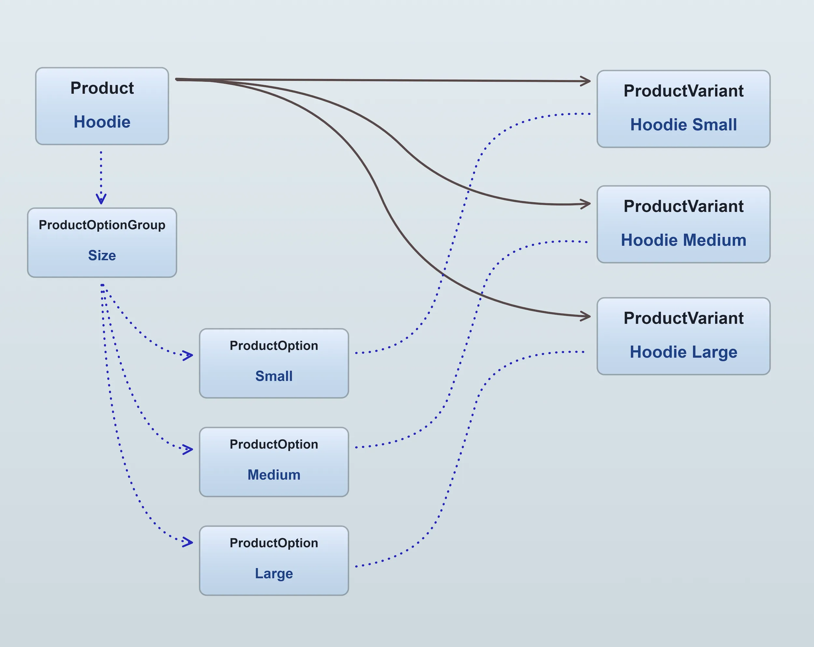
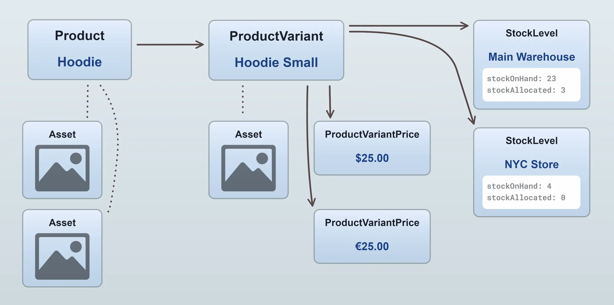

Your catalog is composed of [`Products`](/reference/typescript-api/entities/product/) and [`ProductVariants`](/reference/typescript-api/entities/product-variant/).
A `Product` always has _at least one_ `ProductVariant`. You can think of the product as a "container" which includes a name, description, and images that apply to all of
its variants.

Here's a visual example, in which we have a "Hoodie" product which is available in 3 sizes. Therefore, we have
3 variants of that product:

Multiple variants are made possible by adding one or more [`ProductOptionGroups`](/reference/typescript-api/entities/product-option-group) to
the product. These option groups then define the available [`ProductOptions`](/reference/typescript-api/entities/product-option)

If we were to add a new option group to the example above for "Color", with 2 options, "Black" and "White", then in total
we would be able to define up to 6 variants:

- Hoodie Small Black
- Hoodie Small White
- Hoodie Medium Black
- Hoodie Medium White
- Hoodie Large Black
- Hoodie Large White

:::info
When a customer adds a product to their cart, they are adding a specific `ProductVariant` to their cart, not the `Product` itself.
It is the `ProductVariant` that contains the SKU ("stock keeping unit", or product code) and price information.
:::

## Product price and stock

The `ProductVariant` entity contains the price and stock information for a product. Since a given product variant can have more
than one price, and more than one stock level (in the case of multiple warehouses), the `ProductVariant` entity contains
relations to one or more [`ProductVariantPrice`](/reference/typescript-api/entities/product-variant-price) entities and
one or more [`StockLevel`](/reference/typescript-api/entities/stock-level) entities.

## Facets

[`Facets`](/reference/typescript-api/entities/facet/) are used to add structured labels to products and variants. Facet values can be assigned to products or product variants, and are commonly used for catalog organization, storefront filtering, and internal business logic.

For a detailed explanation of facets, filtering, and how they relate to collections, see the [Facets & Filters](/core-concepts/facets-filters/) guide.
