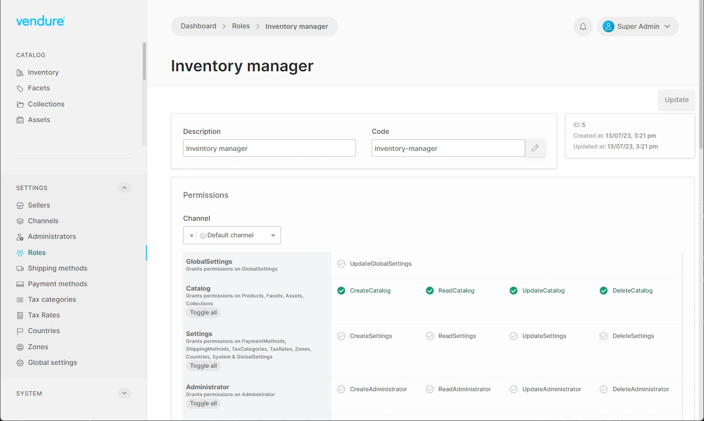

Roles are the foundation of Vendure's **role-based access control (RBAC)** system. A Role is a named
collection of [Permissions](/core-concepts/permissions/) that determines what actions an administrator
is allowed to perform.

## How roles work

Each [`Administrator`](/reference/typescript-api/entities/administrator/) is assigned one or more Roles.
When an administrator makes a request to the Admin API, Vendure checks whether their combined roles include
the permission required for that operation. If not, the request is denied.

When an administrator has multiple roles, the permissions from all roles are **unioned together**. This
means an administrator with an "Order Manager" role and a "Catalog Manager" role can perform all actions
allowed by either role.

## Built-in roles

Vendure creates two special roles automatically. These roles cannot be modified or deleted:

- **SuperAdmin** — carries every permission in the system. This role is assigned to the first
  administrator created during server initialization. It grants unrestricted access to all operations
  across all channels.

- **Customer** — assigned to every registered customer. This role carries the minimum permissions
  required for a customer to manage their own account, such as viewing their order history and
  updating their profile.

## Custom roles

Beyond the built-in roles, administrators can create any number of custom roles to match their
organizational structure. A custom role is defined by selecting the specific permissions it should
grant.

Common patterns include roles like "Inventory Manager" (stock and product permissions), "Order
Processor" (order and fulfillment permissions), or "Marketing Lead" (promotion and collection
permissions). The granularity of Vendure's permission system means you can tailor roles precisely
to each team member's responsibilities.

## Channel-scoped roles

Roles can optionally be **scoped to one or more Channels**. This is a powerful feature for multi-tenant
and multi-vendor setups where different administrators should only have access to specific parts of the
system.

For example, in a marketplace scenario, a seller's administrator might have a "Seller Product Manager"
role that is scoped only to that seller's channel. They can manage products within their channel but
have no visibility into other channels or the default channel.

A single administrator can have a mix of channel-scoped and global roles, providing flexible access
control that scales with the complexity of your business.

## Role assignment

Roles are assigned to administrators through the Admin API or the admin interface. Changes take effect
on the administrator's next authenticated request — there is no need to invalidate sessions.

## Further reading

- [Permissions](/core-concepts/permissions/) — the individual permissions that make up a role
- [User Management](/core-concepts/user-management/) — how users and administrators relate
- [Channels](/core-concepts/channels/) — channel-scoped access control for multi-tenant setups
