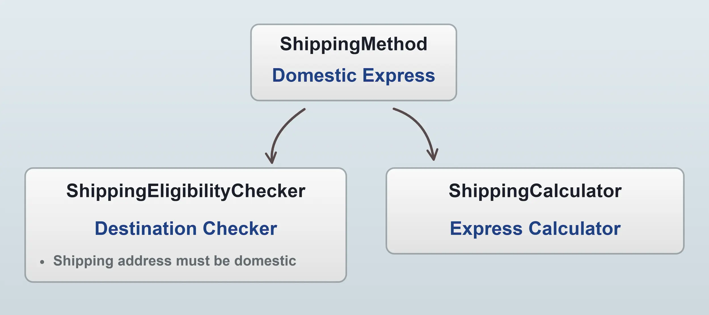

Shipping in Vendure is handled by [ShippingMethods](/reference/typescript-api/entities/shipping-method/). 
A ShippingMethod is composed of a **checker** and a **calculator**. 

* The [`ShippingEligibilityChecker`](/reference/typescript-api/shipping/shipping-eligibility-checker/) determines whether the order is eligible for the ShippingMethod. It can contain custom logic such as checking the total weight of the order, or whether the order is being shipped to a particular country.
* The [`ShippingCalculator`](/reference/typescript-api/shipping/shipping-calculator/) calculates the cost of shipping the order. The calculation can be performed directly by the calculator itself, or it could call out to a third-party API to determine the cost.



Multiple shipping methods can be set up and then your storefront can query [`eligibleShippingMethods`](/reference/graphql-api/shop/queries/#eligibleshippingmethods) to find out which ones can be applied to the active order.

When querying `eligibleShippingMethods`, each of the defined ShippingMethods' checker functions is executed to find out whether the order is eligible for that method, and if so, the calculator is executed to determine what the cost of shipping will be for that method.

Shipping methods can be restricted to specific [zones](/core-concepts/zones/), allowing different shipping options based on the customer's location.

## Fulfillments

Fulfillments represent the actual shipping status of items in an order. When an order is placed and payment has been settled, the order items are then delivered to the customer in one or more Fulfillments. For a detailed look at how fulfillments work, see the [Fulfillment guide](/core-concepts/fulfillment/).

For details on creating custom checkers, calculators, and fulfillment handlers, see the [Developer Guide](/developer-guide/strategies-configurable-operations/).

## Code Examples

### Querying eligible shipping methods

<Tabs>
<TabItem value="Request" label="Request" default>

```graphql title="Shop API"
query GetEligibleShippingMethods {
    eligibleShippingMethods {
        id
        name
        price
        priceWithTax
    }
}
```

</TabItem>
<TabItem value="Response" label="Response">

```json
{
  "data": {
    "eligibleShippingMethods": [
      {
        "id": "1",
        "name": "Standard Shipping",
        "price": 500,
        "priceWithTax": 500
      },
      {
        "id": "2",
        "name": "Express Shipping",
        "price": 1000,
        "priceWithTax": 1000
      }
    ]
  }
}
```

</TabItem>
</Tabs>

### Custom ShippingEligibilityChecker

Custom checkers can be created by defining a [`ShippingEligibilityChecker` object](/reference/typescript-api/shipping/shipping-eligibility-checker/).

For example, you could create a checker which works with a custom "weight" field to only apply to orders below a certain weight:

```ts title="src/shipping-methods/max-weight-checker.ts"
import { LanguageCode, ShippingEligibilityChecker } from '@vendure/core';

export const maxWeightChecker = new ShippingEligibilityChecker({
    code: 'max-weight-checker',
    description: [
        {languageCode: LanguageCode.en, value: 'Max Weight Checker'}
    ],
    args: {
        maxWeight: {
            type: 'int',
            ui: {component: 'number-form-input', suffix: 'grams'},
            label: [{languageCode: LanguageCode.en, value: 'Maximum order weight'}],
            description: [
                {
                    languageCode: LanguageCode.en,
                    value: 'Order is eligible only if its total weight is less than the specified value',
                },
            ],
        },
    },

    /**
     * Must resolve to a boolean value, where `true` means that the order is
     * eligible for this ShippingMethod.
     *
     * (This example assumes a custom field "weight" is defined on the
     * ProductVariant entity)
     */
    check: (ctx, order, args) => {
        const totalWeight = order.lines
            .map(l => l.productVariant.customFields.weight ?? 0 * l.quantity)
            .reduce((total, lineWeight) => total + lineWeight, 0);

        return totalWeight <= args.maxWeight;
    },
});
```

Custom checkers are then passed into the VendureConfig [ShippingOptions](/reference/typescript-api/shipping/shipping-options/#shippingeligibilitycheckers) to make them available when setting up new ShippingMethods:

```ts title="src/vendure-config.ts"
import { defaultShippingEligibilityChecker, VendureConfig } from '@vendure/core';
import { maxWeightChecker } from './shipping-methods/max-weight-checker';

export const config: VendureConfig = {
    // ...
    shippingOptions: {
        shippingEligibilityCheckers: [
            defaultShippingEligibilityChecker,
            maxWeightChecker,
        ],
    }
}
```

### Custom ShippingCalculator

Custom calculators can be created by defining a [`ShippingCalculator` object](/reference/typescript-api/shipping/shipping-calculator/).

For example, you could create a calculator which consults an external data source (e.g. a spreadsheet, database or 3rd-party API) to find out the cost and estimated delivery time for the order.

```ts title="src/shipping-methods/external-shipping-calculator.ts"
import { LanguageCode, ShippingCalculator } from '@vendure/core';
import { shippingDataSource } from './shipping-data-source';

export const externalShippingCalculator = new ShippingCalculator({
    code: 'external-shipping-calculator',
    description: [{languageCode: LanguageCode.en, value: 'Calculates cost from external source'}],
    args: {
        taxRate: {
            type: 'int',
            ui: {component: 'number-form-input', suffix: '%'},
            label: [{languageCode: LanguageCode.en, value: 'Tax rate'}],
        },
    },
    calculate: async (ctx, order, args) => {
        // `shippingDataSource` is assumed to fetch the data from some
        // external data source.
        const { rate, deliveryDate, courier } = await shippingDataSource.getRate({
            destination: order.shippingAddress,
            contents: order.lines,
        });

        return {
            price: rate,
            priceIncludesTax: ctx.channel.pricesIncludeTax,
            taxRate: args.taxRate,
            // metadata is optional but can be used to pass arbitrary
            // data about the shipping estimate to the storefront.
            metadata: { courier, deliveryDate },
        };
    },
});
```

Custom calculators are then passed into the VendureConfig [ShippingOptions](/reference/typescript-api/shipping/shipping-options/#shippingcalculators) to make them available when setting up new ShippingMethods:

```ts
import { defaultShippingCalculator, VendureConfig } from '@vendure/core';
import { externalShippingCalculator } from './external-shipping-calculator';

export const config: VendureConfig = {
  // ...
  shippingOptions: {
    shippingCalculators: [
      defaultShippingCalculator,
      externalShippingCalculator,
    ],
  }
}
```

:::info
If your ShippingEligibilityChecker or ShippingCalculator needs access to the database or other providers, see the [configurable operation dependency injection guide](/developer-guide/strategies-configurable-operations/#injecting-dependencies).
:::

### Custom FulfillmentProcess

The fulfillment state machine can be customized by defining a [FulfillmentProcess](/reference/typescript-api/fulfillment/fulfillment-process) and passing it to your VendureConfig:

```ts title="src/vendure-config.ts"
import { FulfillmentProcess, VendureConfig } from '@vendure/core';
import { myCustomFulfillmentProcess } from './my-custom-fulfillment-process';

export const config: VendureConfig = {
  // ...
  shippingOptions: {
    process: [myCustomFulfillmentProcess],
  },
};
```
