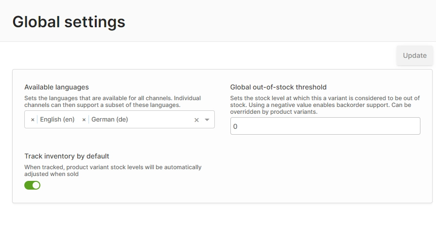
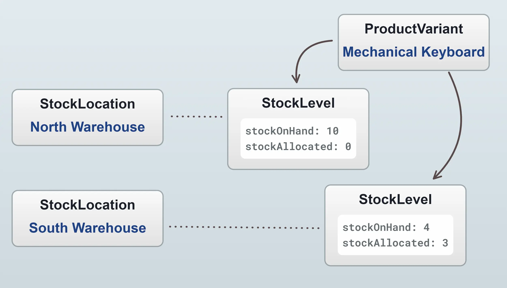

import Tabs from '@theme/Tabs';
import TabItem from '@theme/TabItem';

Vendure includes features to help manage your stock levels, stock allocations and back orders. The basic purpose is to help you keep track of how many of a given ProductVariant you have available to sell.

Stock control is enabled globally via the Global Settings:



It can be disabled if, for example, you manage your stock with a separate inventory management system and synchronize stock levels into Vendure automatically. The setting can also be overridden at the individual ProductVariant level.

## Stock Locations

Vendure uses the concept of [`StockLocations`](/reference/typescript-api/entities/stock-location/) to represent the physical locations where stock is stored. This could be a warehouse, a retail store, or any other location. If you do not have multiple stock locations, then you can simply use the default location which is created automatically.



### Selecting a stock location

When you have multiple stock locations set up, you need a way to determine which location to use when querying stock levels and when allocating stock to orders. This is handled by the [`StockLocationStrategy`](/reference/typescript-api/products-stock/stock-location-strategy/). This strategy exposes a number of methods which are used to determine which location (or locations) to use when:

- querying stock levels (`getAvailableStock`)
- allocating stock to orders (`forAllocation`)
- releasing stock from orders (`forRelease`)
- creating sales upon fulfillment (`forSale`)
- returning items to stock upon cancellation (`forCancellation`)

The default strategy is the [`DefaultStockLocationStrategy`](/reference/typescript-api/products-stock/default-stock-location-strategy), which simply uses the default location for all of the above methods. This is suitable for all cases where there is just a single stock location.

If you have multiple stock locations, you'll need to implement a custom strategy which uses custom logic to determine which stock location to use. For instance, you could:

- Use the location with the most stock available
- Use the location closest to the customer
- Use the location which has the cheapest shipping cost

### Displaying stock levels in the storefront

The [`StockDisplayStrategy`](/reference/typescript-api/products-stock/stock-display-strategy/) is used to determine how stock levels are displayed in the storefront. The default strategy is the [`DefaultStockDisplayStrategy`](/reference/typescript-api/products-stock/default-stock-display-strategy), which will only display one of three states: `'IN_STOCK'`, `'OUT_OF_STOCK'` or `'LOW_STOCK'`. This is to avoid exposing your exact stock levels to the public, which can sometimes be undesirable.

You can implement a custom strategy to display stock levels in a different way. Here's how you would implement a custom strategy to display exact stock levels:

```ts title="src/exact-stock-display-strategy.ts"
import { RequestContext, StockDisplayStrategy, ProductVariant } from '@vendure/core';

export class ExactStockDisplayStrategy implements StockDisplayStrategy {
    getStockLevel(ctx: RequestContext, productVariant: ProductVariant, saleableStockLevel: number): string {
        return saleableStockLevel.toString();
    }
}
```

This strategy is then used in your config:

```ts title="src/vendure-config.ts"
import { VendureConfig } from '@vendure/core';
import { ExactStockDisplayStrategy } from './exact-stock-display-strategy';

export const config: VendureConfig = {
    // ...
    catalogOptions: {
        stockDisplayStrategy: new ExactStockDisplayStrategy(),
    },
};
```

## Stock Control Concepts

* **Stock on hand:** This refers to the number of physical units of a particular variant which you have in stock right now. This can be zero or more, but not negative.
* **Allocated:** This refers to the number of units which have been assigned to Orders, but which have not yet been fulfilled.
* **Out-of-stock threshold:** This value determines the stock level at which the variant is considered "out of stock". This value is set globally, but can be overridden for specific variants. It defaults to `0`.
* **Saleable:** This means the number of units that can be sold right now. The formula is:
    `saleable = stockOnHand - allocated - outOfStockThreshold`

Here's a table to better illustrate the relationship between these concepts:

Stock on hand | Allocated | Out-of-stock threshold | Saleable
--------------|-----------|------------------------|----------
10            | 0         | 0                      | 10
10            | 0         | 3                      | 7
10            | 5         | 0                      | 5
10            | 5         | 3                      | 2
10            | 10        | 0                      | 0
10            | 10        | -5                     | 5

The saleable value is what determines whether the customer is able to add a variant to an order. If there is 0 saleable stock, then any attempt to add to the order will result in an [`InsufficientStockError`](/reference/graphql-api/admin/object-types/#insufficientstockerror).


<Tabs>
<TabItem value="Request" label="Request" default>

```graphql title="Shop API"
query AddItemToOrder {
    addItemToOrder(productVariantId: 123, quantity: 150) {
        ...on Order {
            id
            code
            totalQuantity
        }
        ...on ErrorResult {
            errorCode
            message
        }
        ...on InsufficientStockError {
            errorCode
            message
            quantityAvailable
            order {
                id
                totalQuantity
            }
        }
    }
}
```

</TabItem>
<TabItem value="Response" label="Response">

```json
{
  "data": {
    "addItemToOrder": {
      "errorCode": "INSUFFICIENT_STOCK_ERROR",
      "message": "Only 105 items were added to the order due to insufficient stock",
      "quantityAvailable": 105,
      "order": {
        "id": "2",
        "totalQuantity": 106
      }
    }
  }
}
```

</TabItem>
</Tabs>

### Stock allocation

Allocation mean we are setting stock aside because it has been purchased but not yet shipped. It prevents us from selling more of a particular item than we are able to deliver. 

By default, stock gets allocated to an order once the order transitions to the `PaymentAuthorized` or `PaymentSettled` state. This is defined by the [`DefaultStockAllocationStrategy`](/reference/typescript-api/orders/default-stock-allocation-strategy). Using a custom [`StockAllocationStrategy`](/reference/typescript-api/orders/stock-allocation-strategy/) you can define your own rules for when stock is allocated.

With the [`defaultFulfillmentProcess`](/reference/typescript-api/fulfillment/fulfillment-process/#defaultfulfillmentprocess), allocated stock will be converted to **sales** and minused from the `stockOnHand` value when a Fulfillment is created.


### Back orders

You may have noticed that the `outOfStockThreshold` value can be set to a negative number. This allows you to sell variants even when you don't physically have them in stock. This is known as a "back order". 

Back orders can be really useful to allow orders to keep flowing even when stockOnHand temporarily drops to zero. For many businesses with predictable re-supply schedules they make a lot of sense.

Once a customer completes checkout, those variants in the order are marked as `allocated`. When a Fulfillment is created, those allocations are converted to Sales and the `stockOnHand` of each variant is adjusted. Fulfillments may only be created if there is sufficient stock on hand.

### Stock movements

There is a [`StockMovement`](/reference/typescript-api/entities/stock-movement/) entity which records the history of stock changes. `StockMovement` is actually an abstract class, with the following concrete implementations:

- [`Allocation`](/reference/typescript-api/entities/stock-movement/#allocation): When stock is allocated to an order, before the order is fulfilled. Adds stock to `allocated`, which reduces the saleable stock.
- [`Sale`](/reference/typescript-api/entities/stock-movement/#sale): When allocated stock gets fulfilled. Removes stock from `allocated` as well as `stockOnHand`.
- [`Cancellation`](/reference/typescript-api/entities/stock-movement/#cancellation): When items from a fulfilled order are cancelled, the stock is returned to `stockOnHand`. Adds stock to `stockOnHand`.
- [`Release`](/reference/typescript-api/entities/stock-movement/#release): When items which have been allocated (but not yet converted to sales via the creation of a Fulfillment) are cancelled. Removes stock from `allocated`.
- [`StockAdjustment`](/reference/typescript-api/entities/stock-movement/#stockadjustment): A general-purpose stock adjustment. Adds or removes stock from `stockOnHand`. Used when manually setting stock levels via the Admin UI, for example.

Stock movements can be queried via the `ProductVariant.stockMovements`. Here's an example where we query the stock levels and stock movements of a particular variant:


<Tabs>
<TabItem value="Request" label="Request" default>

```graphql title="Admin API"
query GetStockMovements {
    productVariant(id: 1) {
        id
        name
        stockLevels {
            stockLocation {
                name
            }
            stockOnHand
            stockAllocated
        }
        stockMovements {
            items {
                ...on StockMovement {
                    createdAt
                    type
                    quantity
                }
            }
        }
    }
}
```

</TabItem>
<TabItem value="Response" label="Response">

```json
{
  "data": {
    "productVariant": {
      "id": "1",
      "name": "Laptop 13 inch 8GB",
      "stockLevels": [
        {
          "stockLocation": {
            "name": "Default Stock Location"
          },
          "stockOnHand": 100,
          "stockAllocated": 0
        }
      ],
      "stockMovements": {
        "items": [
          {
            "createdAt": "2023-07-13T13:21:10.000Z",
            "type": "ADJUSTMENT",
            "quantity": 100
          }
        ]
      }
    }
  }
}
```

</TabItem>
</Tabs>
