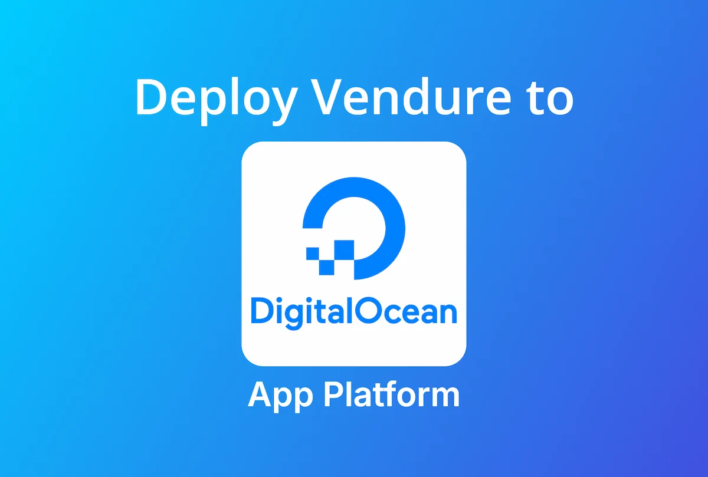
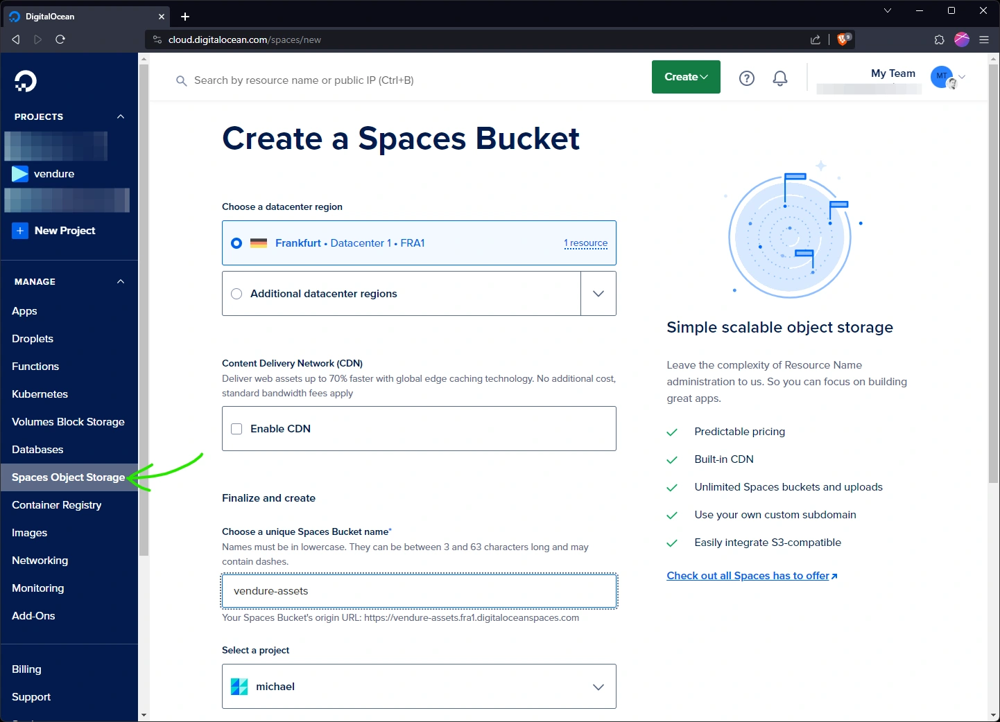
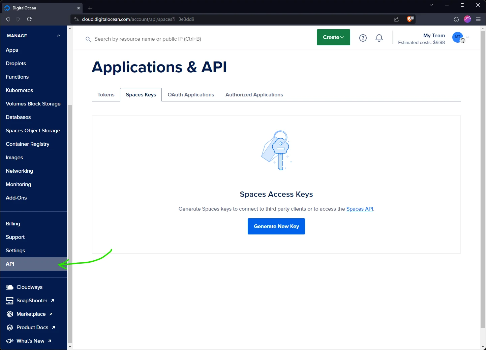
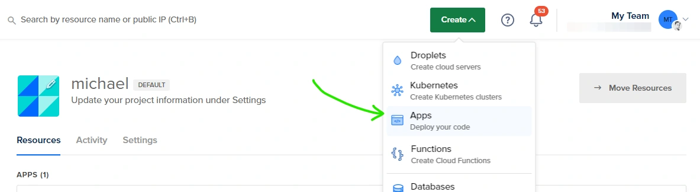
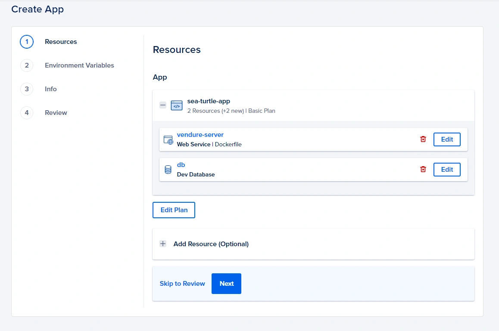
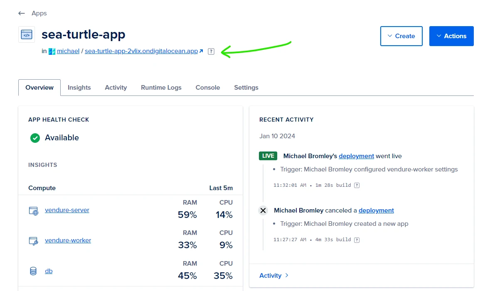

[App Platform](https://www.digitalocean.com/products/app-platform) is a fully managed platform which allows you to deploy and scale your Vendure server and infrastructure with ease.

:::note
The configuration in this guide will cost around $22 per month to run.
:::

## Prerequisites

First of all you'll need to [create a new Digital Ocean account](https://cloud.digitalocean.com/registrations/new) if you
don't already have one.

For this guide you'll need to have your Vendure project in a git repo on either GitHub or GitLab. App Platform also supports
deploying from docker registries, but that is out of the scope of this guide.

:::info
If you'd like to quickly get started with a ready-made Vendure project which includes sample data, you can clone our
[Vendure one-click-deploy repo](https://github.com/vendure-ecommerce/one-click-deploy).
:::

## Configuration

### Database connection

:::info
The following is already pre-configured if you are using the one-click-deploy repo.
:::

Make sure your DB connection options uses the following environment variables:

```ts title="src/vendure-config.ts"
import { VendureConfig } from '@vendure/core';

export const config: VendureConfig = {
    // ...
    dbConnectionOptions: {
        // ...
        type: 'postgres',
        database: process.env.DB_NAME,
        host: process.env.DB_HOST,
        port: +process.env.DB_PORT,
        username: process.env.DB_USERNAME,
        password: process.env.DB_PASSWORD,
        ssl: process.env.DB_CA_CERT ? {
            ca: process.env.DB_CA_CERT,
        } : undefined,
    },
};
```
### Asset storage

:::info
The following is already pre-configured if you are using the one-click-deploy repo.
:::

Since App Platform services do not include any persistent storage, we need to configure Vendure to use Digital Ocean's
Spaces service, which is an S3-compatible object storage service. This means you'll need to make sure to have the
following packages installed:

```
npm install @aws-sdk/client-s3 @aws-sdk/lib-storage
```


and set up your AssetServerPlugin like this:

```ts title="src/vendure-config.ts"
import { VendureConfig } from '@vendure/core';
import { AssetServerPlugin, configureS3AssetStorage } from '@vendure/asset-server-plugin';

export const config: VendureConfig = {
    // ...
    plugins: [
        AssetServerPlugin.init({
            route: 'assets',
            assetUploadDir: process.env.ASSET_UPLOAD_DIR || path.join(__dirname, '../static/assets'),
            // highlight-start
            // If the MINIO_ENDPOINT environment variable is set, we'll use
            // Minio as the asset storage provider. Otherwise, we'll use the
            // default local provider.
            storageStrategyFactory: process.env.MINIO_ENDPOINT ?  configureS3AssetStorage({
                bucket: 'vendure-assets',
                credentials: {
                    accessKeyId: process.env.MINIO_ACCESS_KEY,
                    secretAccessKey: process.env.MINIO_SECRET_KEY,
                },
                nativeS3Configuration: {
                    endpoint: process.env.MINIO_ENDPOINT,
                    forcePathStyle: true,
                    signatureVersion: 'v4',
                    // The `region` is required by the AWS SDK even when using MinIO,
                    // so we just use a dummy value here.
                    region: 'eu-west-1',
                },
            }) : undefined,
            // highlight-end
        }),
    ],
    // ...
};
```

## Create Spaces Object Storage

First we'll create a Spaces bucket to store our assets. Click the "Spaces Object Storage" nav item and
create a new space and call it "vendure-assets".



Next we need to create an access key and secret. Click the "API" nav item and generate a new key.



Name the key something meaningful like "vendure-assets-key" and then **make sure to copy the secret as it will only be
shown once**. Store the access key and secret key in a safe place for later - we'll be using it when we set up our 
app's environment variables.

:::caution
If you forget to copy the secret key, you'll need to delete the key and create a new one.
:::

## Create the server resource

Now we're ready to create our app infrastructure! Click the "Create" button in the top bar and select "Apps".



Now connect to your git repo, and select the repo of your Vendure project.

Depending on your repo, App Platform may suggest more than one app: in this screenshot we are using the one-click-deploy
repo which contains a Dockerfile, so App Platform is suggesting two different ways to deploy the app. We'll select the
Dockerfile option, but either option should work fine. Delete the unused resource.

We need to edit the details of the server app. Click the "Edit" button and set the following:

* **Resource Name**: "vendure-server"
* **Resource Type**: Web Service
* **Run Command**: `node ./dist/index.js`
* **HTTP Port**: 3000

At this point you can also click the "Edit Plan" button to select the resource allocation for the server, which will
determine performance and price. For testing purposes the smallest Basic server (512MB, 1vCPU) is fine. This can also be changed later.

### Add a database 

Next click "Add Resource", select **Database** and click "Add", and then accept the default Postgres database. Click the
"Create and Attach" to create the database and attach it to the server app.

Your config should now look like this:



## Set up environment variables

Next we need to set up the environment variables. Since these will be shared by both the server and worker apps, we'll create
them at the Global level. 

You can use the "bulk editor" to paste in the following variables (making sure to replace the values in `<angle brackets>` with
your own values):

```sh
DB_NAME=${db.DATABASE}
DB_USERNAME=${db.USERNAME}
DB_PASSWORD=${db.PASSWORD}
DB_HOST=${db.HOSTNAME}
DB_PORT=${db.PORT}
DB_CA_CERT=${db.CA_CERT}
// highlight-next-line
COOKIE_SECRET=<add some random characters>
SUPERADMIN_USERNAME=superadmin
// highlight-next-line
SUPERADMIN_PASSWORD=<create some strong password>
// highlight-start
MINIO_ACCESS_KEY=<use the key generated earlier>
MINIO_SECRET_KEY=<use the secret generated earlier>
MINIO_ENDPOINT=<use the endpoint of your spaces bucket>
// highlight-end
```

:::note
The values starting with `${db...}` are automatically populated by App Platform and should not be changed, unless you chose
to name your database something other than `db`.
:::

After saving your environment variables you can click through the confirmation screens to create the app.

## Create the worker resource

Now we need to set up the [Vendure worker](/guides/developer-guide/worker-job-queue/) which will handle background tasks. From the dashboard of your newly-created
app, click the "Create" button and then select "Create Resources From Source Code".

You will be prompted to select the repo again, and then you'll need to set up a new single resource with the following 
settings:

* **Resource Name**: "vendure-worker"
* **Resource Type**: Worker
* **Run Command**: `node ./dist/index-worker.js`

Again you can edit the plan, and the smallest Basic plan is fine for testing purposes.

No new environment variables are needed since we'll be sharing the Global variables with the worker.

## Test your Vendure server

Once everything has finished deploying, you can click the app URL to open your Vendure server in a new tab. 



:::info
Append `/admin` to the URL to access the admin UI, and log in with the superadmin credentials you set in the environment variables.
:::
