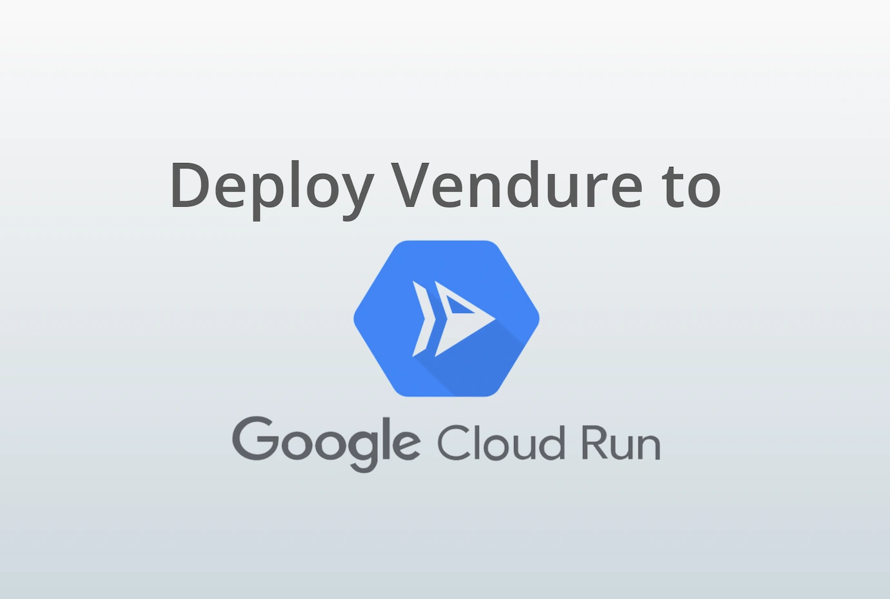

[Google Cloud Run](https://cloud.google.com/run) is a fully managed platform which allows you to run containerized apps and only pay while your app code is actually running.

This guide was written by Martijn from [Pinelab](https://pinelab.studio/), who have been successfully running multiple Vendure projects on Google Cloud Run. The step by step commands can be found here on GitHub: 
- https://github.com/Pinelab-studio/vendure-google-cloud-run-starter/blob/main/README.md.

## Prerequisites
This guide assumes you have:

* Google cloud's `gcloud` cli installed locally
* Created a Google Cloud project and enabled the API's we need: https://github.com/Pinelab-studio/vendure-google-cloud-run-starter/blob/main/README.md#create-a-google-cloud-project 

## Setting up a MySQL database with Google Cloud SQL
Google Cloud SQL is a fully-managed relational database service that makes it easy to set up, maintain, and manage databases in the cloud. 
Vendure requires an SQL database to store its data, and Google Cloud SQL is a great option for this because it provides a reliable, scalable, and secure way to host our database.

You can find the `gcloud` commands to create a MySQL database here: https://github.com/Pinelab-studio/vendure-google-cloud-run-starter/blob/main/README.md#create-a-mysql-database

## Google Cloud Storage for assets
Vendure stores assets such as product images on file system by default. However, Google Cloud Run does not have internal file storage, so we need to use an external storage service. 
Google Cloud Storage is a great option for this because it provides a scalable and reliable way to store our assets in the cloud.

Use these `gcloud` [commands](https://github.com/Pinelab-studio/vendure-google-cloud-run-starter/blob/main/README.md#asset-storage) to create a storage bucket for our assets.

## Google Cloud Tasks for Vendure's worker
Vendure uses a worker process to perform asynchronous tasks such as sending emails. To communicate between the main application and the worker process, we need a message queue. Google Cloud Tasks is a great option for this because it provides a fully-managed, scalable, and reliable way to send and receive messages between applications.

You don't need to do anything to enable Cloud Tasks: [this plugin](https://github.com/Pinelab-studio/vendure-google-cloud-run-starter/blob/8fd342c15fa7b38e3662311f176901a5d38cde3d/src/vendure-config.ts#L88) automatically creates task queues for you.

## Running locally
Let's test out our application locally before deploying to Cloud Run. Copy [this](https://github.com/Pinelab-studio/vendure-google-cloud-run-starter/blob/main/.env.example) `.env.example` to `.env` and fill in your variables. You can skip the `WORKER_HOST` variable, because we don't have it yet.

## Dockerize Vendure
Google Cloud Run allows us to deploy containerized applications without worrying about the underlying infrastructure. To deploy Vendure to Google Cloud Run, we need to Dockerize it. Dockerizing Vendure means packaging the application and its dependencies into a container that can be easily deployed to Google Cloud Run.

The setup for containerizing Vendure is already done: [This file](https://github.com/Pinelab-studio/vendure-google-cloud-run-starter/blob/main/Dockerfile) and [this file](https://github.com/Pinelab-studio/vendure-google-cloud-run-starter/blob/main/build-docker.sh) will build your container.

## Deployment
The example repository contains GitHub action definitions to automatically deploy your app to Cloud Run when you push to the `main` branch.

Follow [these steps](https://github.com/Pinelab-studio/vendure-google-cloud-run-starter/blob/main/build-docker.sh) to create a service account and set your variables as repository secret in GitHub.

## Keep alive
As final improvement, you can use Google Cloud Scheduler to poll your Cloud Run instance to prevent cold starts with [this command](https://github.com/Pinelab-studio/vendure-google-cloud-run-starter/blob/main/build-docker.sh).

That's it! Feel free to reach out for any questions, or create a [Pull Request in the repository](https://github.com/Pinelab-studio/vendure-google-cloud-run-starter/pulls) if you have any improvements.
