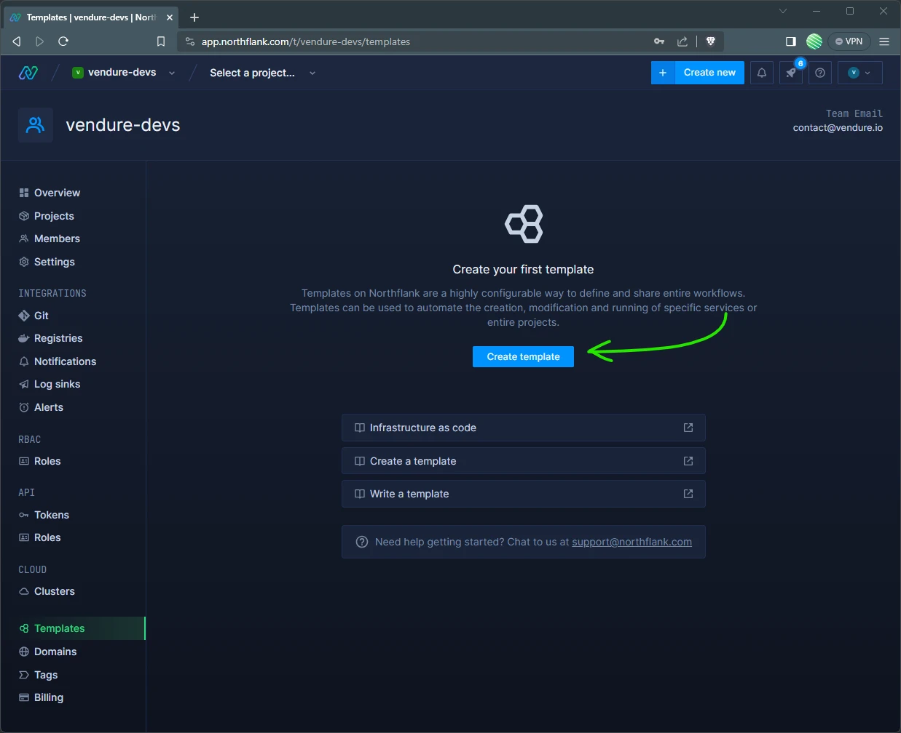
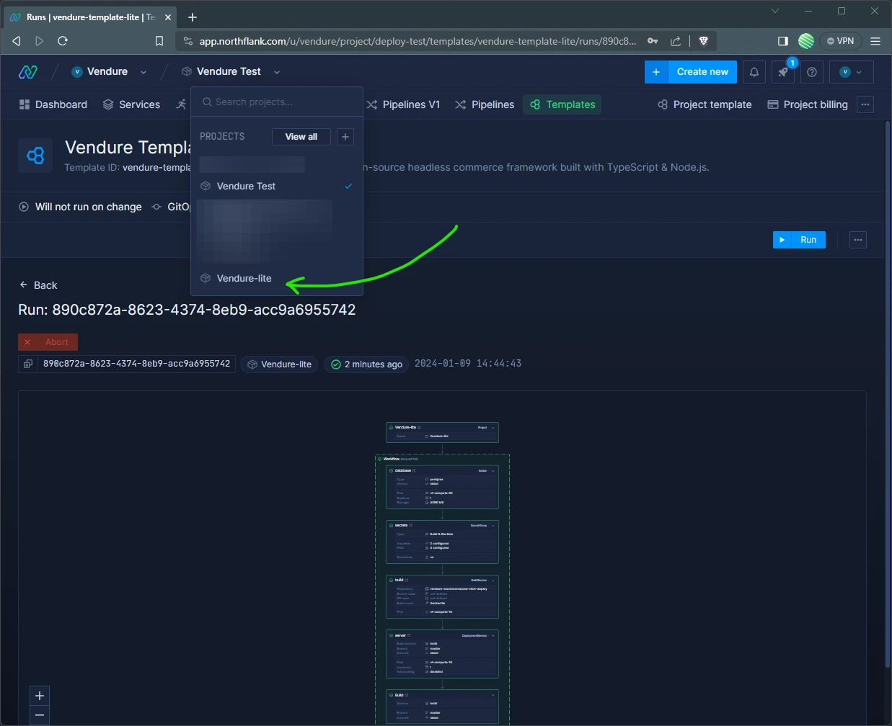
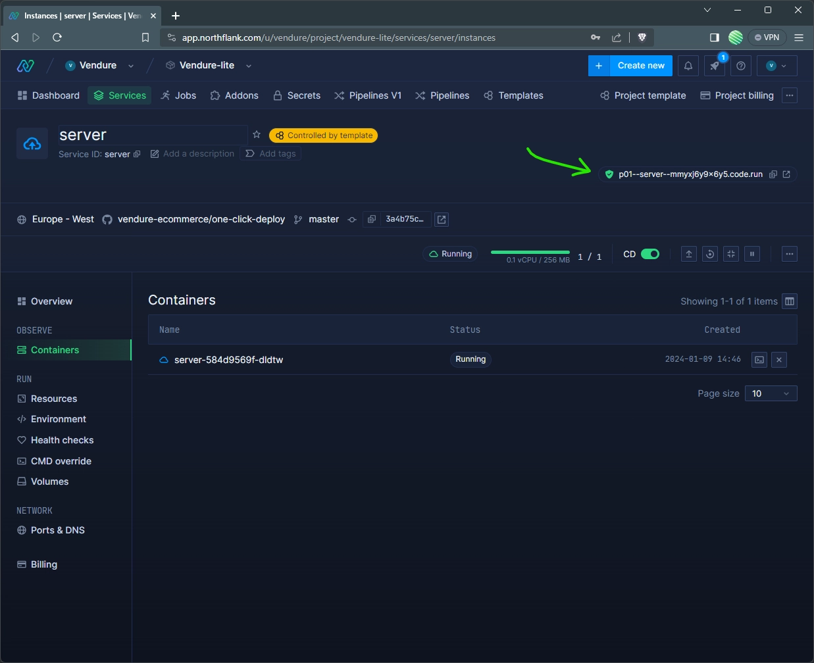

import Tabs from '@theme/Tabs';
import TabItem from '@theme/TabItem';


[Northflank](https://northflank.com) is a comprehensive developer platform to build and scale your apps. It has an outstanding developer experience and has a free tier for small projects, and is well-suited for deploying and scaling Vendure applications.

This guide will walk you through the steps to deploy [a sample Vendure application](https://github.com/vendure-ecommerce/one-click-deploy) to Northflank.

## Set up a Northflank account

Go to the Northflank [sign up page](https://app.northflank.com/signup) to create a new account. As part of the sign-up you'll be asked for credit card details, but you won't be charged unless you upgrade to a paid plan.

## Create a custom template

A template defines the infrastructure that is needed to run your Vendure server. Namely, a **server**, a **worker**, 
**MinIO object storage** for assets and a **Postgres database**.

Click the templates menu item in the navbar and click the "Create template" button.



Now paste the following configuration into the editor in the "code" tab:


<Tabs>
<TabItem label="Full Template" value="Full Template">

:::note
This template configures a production-like setup for Vendure, with the server and worker running in separate processes
and a separate MinIO instance for asset storage.

The resources configured here will cost around $20 per month.

If you want to use the free plan, use the "Lite Template".
:::

<div class="limited-height-code-block">

```json
{
  "apiVersion": "v1",
  "name": "Vendure Template",
  "description": "Vendure is a modern, open-source composable commerce platform",
  "project": {
    "spec": {
      "name": "Vendure",
      "region": "europe-west",
      "description": "Vendure is a modern, open-source composable commerce platform",
      "color": "#57637A"
    }
  },
  "spec": {
    "kind": "Workflow",
    "spec": {
      "type": "sequential",
      "steps": [
        {
          "kind": "Workflow",
          "spec": {
            "type": "parallel",
            "steps": [
              {
                "kind": "Addon",
                "ref": "database",
                "spec": {
                  "name": "database",
                  "type": "postgres",
                  "version": "14-latest",
                  "billing": {
                    "deploymentPlan": "nf-compute-20",
                    "storageClass": "ssd",
                    "storage": 4096,
                    "replicas": 1
                  },
                  "tlsEnabled": false,
                  "externalAccessEnabled": false,
                  "ipPolicies": [],
                  "pitrEnabled": false
                }
              },
              {
                "kind": "Addon",
                "ref": "storage",
                "spec": {
                  "name": "minio",
                  "type": "minio",
                  "version": "latest",
                  "billing": {
                    "deploymentPlan": "nf-compute-20",
                    "storageClass": "ssd",
                    "storage": 4096,
                    "replicas": 1
                  },
                  "tlsEnabled": true,
                  "externalAccessEnabled": false,
                  "ipPolicies": [],
                  "pitrEnabled": false,
                  "typeSpecificSettings": {},
                  "backupSchedules": []
                }
              }
            ]
          }
        },
        {
          "kind": "SecretGroup",
          "spec": {
            "secretType": "environment-arguments",
            "priority": 10,
            "name": "secrets",
            "secrets": {
              "variables": {
                "APP_ENV": "production",
                "COOKIE_SECRET": "${fn.randomSecret(32)}",
                "SUPERADMIN_USERNAME": "superadmin",
                "SUPERADMIN_PASSWORD": "${fn.randomSecret(16)}",
                "DB_SCHEMA": "public"
              },
              "files": {}
            },
            "addonDependencies": [
              {
                "addonId": "${refs.database.id}",
                "keys": [
                  {
                    "keyName": "HOST",
                    "aliases": [
                      "DB_HOST"
                    ]
                  },
                  {
                    "keyName": "PORT",
                    "aliases": [
                      "DB_PORT"
                    ]
                  },
                  {
                    "keyName": "DATABASE",
                    "aliases": [
                      "DB_NAME"
                    ]
                  },
                  {
                    "keyName": "USERNAME",
                    "aliases": [
                      "DB_USERNAME"
                    ]
                  },
                  {
                    "keyName": "PASSWORD",
                    "aliases": [
                      "DB_PASSWORD"
                    ]
                  }
                ]
              },
              {
                "addonId": "${refs.storage.id}",
                "keys": [
                  {
                    "keyName": "MINIO_ENDPOINT",
                    "aliases": [
                      "MINIO_ENDPOINT"
                    ]
                  },
                  {
                    "keyName": "ACCESS_KEY",
                    "aliases": [
                      "MINIO_ACCESS_KEY"
                    ]
                  },
                  {
                    "keyName": "SECRET_KEY",
                    "aliases": [
                      "MINIO_SECRET_KEY"
                    ]
                  }
                ]
              }
            ],
            "restrictions": {
              "restricted": false,
              "nfObjects": [],
              "tags": []
            }
          }
        },
        {
          "kind": "BuildService",
          "ref": "builder",
          "spec": {
            "name": "builder",
            "billing": {
              "deploymentPlan": "nf-compute-20"
            },
            "vcsData": {
              "projectUrl": "https://github.com/vendure-ecommerce/one-click-deploy",
              "projectType": "github"
            },
            "buildSettings": {
              "dockerfile": {
                "buildEngine": "kaniko",
                "dockerFilePath": "/Dockerfile",
                "dockerWorkDir": "/",
                "useCache": false
              }
            },
            "disabledCI": false,
            "buildArguments": {}
          }
        },
        {
          "kind": "Build",
          "spec": {
            "id": "${refs.builder.id}",
            "type": "service",
            "branch": "master",
            "buildOverrides": {
              "buildArguments": {}
            },
            "reuseExistingBuilds": true
          },
          "condition": "success",
          "ref": "build"
        },
        {
          "kind": "Workflow",
          "spec": {
            "type": "parallel",
            "steps": [
              {
                "kind": "DeploymentService",
                "spec": {
                  "deployment": {
                    "instances": 1,
                    "docker": {
                      "configType": "customCommand",
                      "customCommand": "node ./dist/index.js"
                    },
                    "internal": {
                      "buildId": "${refs.build.id}",
                      "buildSHA": "latest"
                    }
                  },
                  "name": "server",
                  "billing": {
                    "deploymentPlan": "nf-compute-20"
                  },
                  "ports": [
                    {
                      "name": "app",
                      "internalPort": 3000,
                      "public": true,
                      "protocol": "HTTP",
                      "security": {
                        "credentials": [],
                        "policies": []
                      },
                      "domains": [],
                      "disableNfDomain": false
                    }
                  ],
                  "runtimeEnvironment": {},
                  "runtimeFiles": {}
                }
              },
              {
                "kind": "DeploymentService",
                "spec": {
                  "name": "worker",
                  "billing": {
                    "deploymentPlan": "nf-compute-10"
                  },
                  "deployment": {
                    "instances": 1,
                    "docker": {
                      "configType": "customCommand",
                      "customCommand": "node ./dist/index-worker.js"
                    },
                    "internal": {
                      "buildId": "${refs.build.id}",
                      "buildSHA": "latest"
                    }
                  },
                  "ports": [],
                  "runtimeEnvironment": {}
                }
              }
            ]
          }
        }
      ]
    }
  }
}
```

</div>

</TabItem>


<TabItem label="Lite Template" value="Lite Template">

:::note
This template runs the Vendure server & worker in a single process, and as such will fit within the
resource limits of the Northflank free plan. Local disk storage is used for assets, which means that
horizontal scaling is not possible.

This setup is suitable for testing purposes, but is not recommended for production use.
:::


<div class="limited-height-code-block">

```json
{
  "apiVersion": "v1",
  "name": "Vendure Lite Template",
  "description": "Vendure is a modern, open-source composable commerce platform",
  "project": {
    "spec": {
      "name": "Vendure Lite",
      "region": "europe-west",
      "description": "Vendure is a modern, open-source composable commerce platform",
      "color": "#17b9ff"
    }
  },
  "spec": {
    "kind": "Workflow",
    "spec": {
      "type": "sequential",
      "steps": [
        {
          "kind": "Addon",
          "spec": {
            "name": "database",
            "type": "postgres",
            "version": "14-latest",
            "billing": {
              "deploymentPlan": "nf-compute-20",
              "storageClass": "ssd",
              "storage": 4096,
              "replicas": 1
            },
            "tlsEnabled": false,
            "externalAccessEnabled": false,
            "ipPolicies": [],
            "pitrEnabled": false
          }
        },
        {
          "kind": "SecretGroup",
          "spec": {
            "name": "secrets",
            "secretType": "environment-arguments",
            "priority": 10,
            "secrets": {
              "variables": {
                "APP_ENV": "production",
                "COOKIE_SECRET": "${fn.randomSecret(32)}",
                "SUPERADMIN_USERNAME": "superadmin",
                "SUPERADMIN_PASSWORD": "${fn.randomSecret(16)}",
                "DB_SCHEMA": "public",
                "ASSET_UPLOAD_DIR": "/data",
                "RUN_JOB_QUEUE_FROM_SERVER": "true"
              }
            },
            "addonDependencies": [
              {
                "addonId": "database",
                "keys": [
                  {
                    "keyName": "HOST",
                    "aliases": [
                      "DB_HOST"
                    ]
                  },
                  {
                    "keyName": "PORT",
                    "aliases": [
                      "DB_PORT"
                    ]
                  },
                  {
                    "keyName": "DATABASE",
                    "aliases": [
                      "DB_NAME"
                    ]
                  },
                  {
                    "keyName": "USERNAME",
                    "aliases": [
                      "DB_USERNAME"
                    ]
                  },
                  {
                    "keyName": "PASSWORD",
                    "aliases": [
                      "DB_PASSWORD"
                    ]
                  }
                ]
              }
            ],
            "restrictions": {
              "restricted": false,
              "nfObjects": [],
              "tags": []
            }
          }
        },
        {
          "kind": "BuildService",
          "spec": {
            "name": "builder",
            "billing": {
              "deploymentPlan": "nf-compute-10"
            },
            "vcsData": {
              "projectUrl": "https://github.com/vendure-ecommerce/one-click-deploy",
              "projectType": "github"
            },
            "buildSettings": {
              "dockerfile": {
                "buildEngine": "kaniko",
                "dockerFilePath": "/Dockerfile",
                "dockerWorkDir": "/",
                "useCache": false
              }
            },
            "disabledCI": false,
            "buildArguments": {}
          }
        },
        {
          "kind": "Build",
          "ref": "build",
          "spec": {
            "id": "builder",
            "type": "service",
            "branch": "master",
            "reuseExistingBuilds": true
          },
          "condition": "success"
        },
        {
          "kind": "DeploymentService",
          "ref": "server",
          "spec": {
            "name": "server",
            "billing": {
              "deploymentPlan": "nf-compute-20"
            },
            "deployment": {
              "instances": 1,
              "docker": {
                "configType": "customCommand",
                "customCommand": "yarn start:server"
              },
              "internal": {
                "buildId": "${refs.build.id}",
                "buildSHA": "latest"
              }
            },
            "ports": [
              {
                "name": "app",
                "internalPort": 3000,
                "public": true,
                "protocol": "HTTP",
                "security": {
                  "credentials": [],
                  "policies": []
                },
                "domains": []
              }
            ],
            "runtimeEnvironment": {}
          }
        },
        {
          "kind": "Volume",
          "spec": {
            "spec": {
              "storageSize": 5120,
              "accessMode": "ReadWriteOnce",
              "storageClassName": "ssd"
            },
            "name": "storage",
            "mounts": [
              {
                "containerMountPath": "/data",
                "volumeMountPath": ""
              }
            ],
            "attachedObjects": [
              {
                "id": "${refs.server.id}",
                "type": "service"
              }
            ]
          }
        }
      ]
    }
  }
}
```

</div>

</TabItem>
</Tabs>

Then click the "Create template" button.

## Run the template

Next, click the "run template" button to start the deployment process.


Once the template run has completed, you should be able to see the newly-created project in the project selector.



## Find the public URL

Click the "Services" menu item in the left sidebar and then click the "Server" service.


In the top right corner you'll see the public URL of your new Vendure server!

Note that it may take a few minutes for the server to start up and populate all the test data because the free tier has limited CPU and memory resources.

Once it is ready, you can navigate to the public URL and append `/admin` to the end of the URL to access the admin panel. 




:::note
The superadmin password was generated for you by the template, and can be found in the "Secrets" section from the project nav bar
as `SUPERADMIN_PASSWORD`.
:::

Congratulations on deploying your Vendure server!


## Next steps

Now that you have a basic Vendure server up and running, you can explore some of the other features offered by Northflank 
that you might need for a full production setup:

- Configure [health checks](https://northflank.com/docs/v1/application/observe/configure-health-checks) to ensure any container crashes are rapidly detected and restarted. Also see the
[Vendure health check docs](/guides/deployment/using-docker#healthreadiness-checks).
- [Set up a Redis instance](https://northflank.com/docs/v1/application/databases-and-persistence/deploy-databases-on-northflank/deploy-redis-on-northflank) so that you can take advantage of our highly performant [BullMQJobQueuePlugin](/reference/core-plugins/job-queue-plugin/bull-mqjob-queue-plugin) and set up [Redis-based session caching](/reference/typescript-api/auth/session-cache-strategy/) to handle multi-instance deployments.
- With the above in place, you can safely start to [scale your server instances](https://northflank.com/docs/v1/application/scale/scaling-replicas) to handle more traffic. 
- [Add a custom domain](https://northflank.com/docs/v1/application/domains/add-a-domain-to-your-account) using Northflank's powerful DNS management system.
- Set up [infrastructure alerts](https://northflank.com/docs/v1/application/observe/set-infrastructure-alerts) to be notified when any of your containers crash or experience load spikes.
