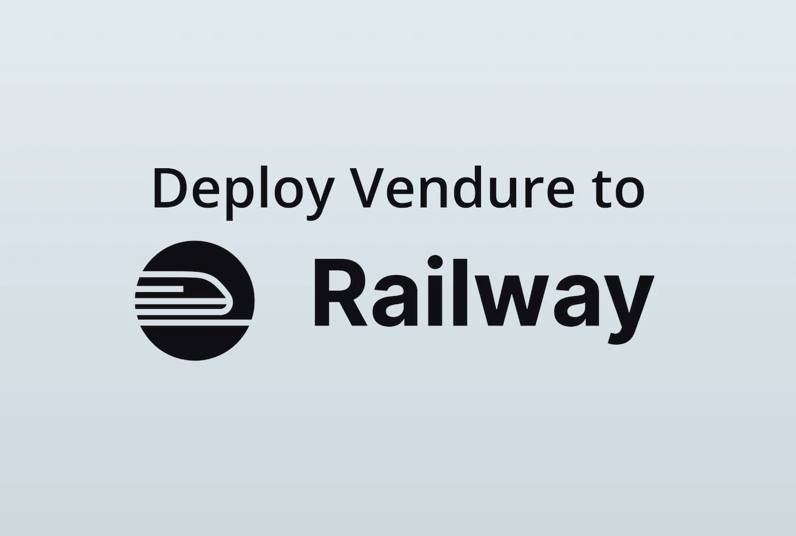
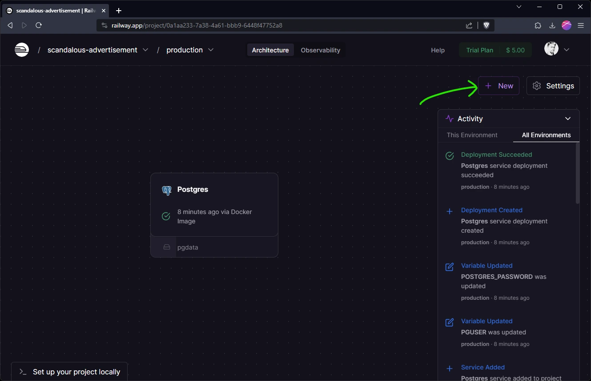
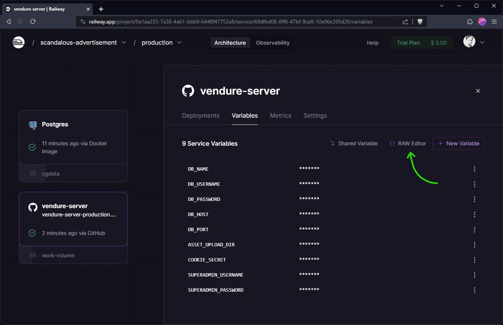
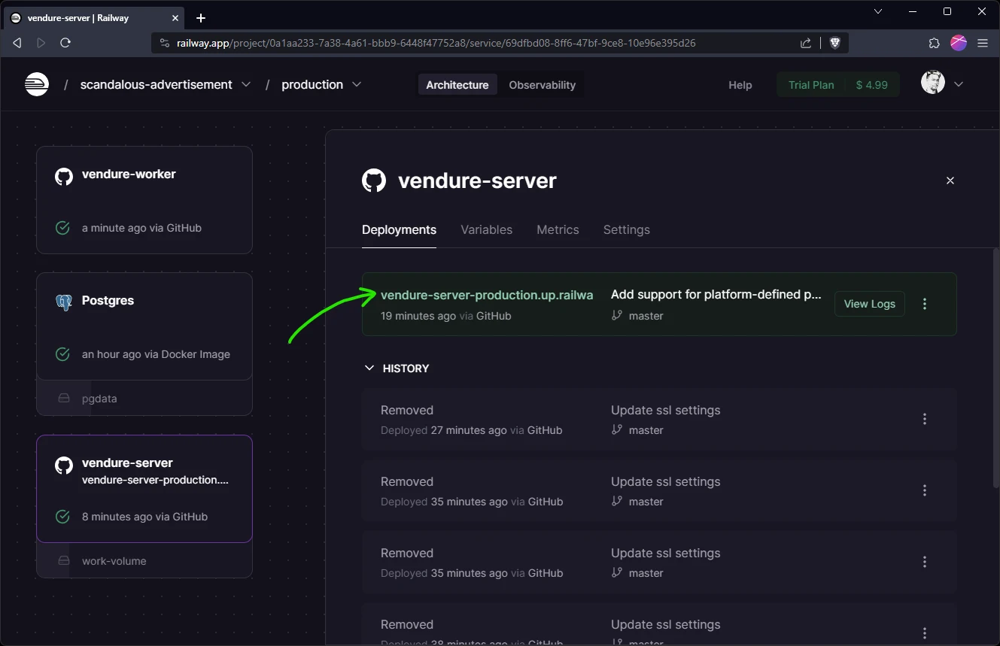

[Railway](https://railway.app/) is a managed hosting platform which allows you to deploy and scale your Vendure server and infrastructure with ease.

:::note
This guide should be runnable on the Railway free trial plan, which means you can deploy it for free and thereafter
pay only for the resources you use, which should be around $5 per month.
:::

## Prerequisites

First of all you'll need to create a new Railway account (click "login" on the website and enter your email address) if you
don't already have one.

You'll also need a GitHub account and you'll need to have your Vendure project hosted there. 

In order to use the Railway trial plan, you'll need to connect your GitHub account to Railway via the Railway dashboard.

:::info
If you'd like to quickly get started with a ready-made Vendure project which includes sample data, you can clone our
[Vendure one-click-deploy repo](https://github.com/vendure-ecommerce/one-click-deploy).
:::

## Configuration

### Port

Railway defines the port via the `PORT` environment variable, so make sure your Vendure Config uses this variable:

```ts title="src/vendure-config.ts"
import { VendureConfig } from '@vendure/core';

export const config: VendureConfig = {
    apiOptions: {
        // highlight-next-line
        port: +(process.env.PORT || 3000),
        // ...
    },
    // ...
};
```

### Database connection

:::info
The following is already pre-configured if you are using the one-click-deploy repo.
:::

Make sure your DB connection options uses the following environment variables:

```ts title="src/vendure-config.ts"
import { VendureConfig } from '@vendure/core';

export const config: VendureConfig = {
    // ...
    dbConnectionOptions: {
        // ...
        database: process.env.DB_NAME,
        host: process.env.DB_HOST,
        port: +process.env.DB_PORT,
        username: process.env.DB_USERNAME,
        password: process.env.DB_PASSWORD,
    },
};
```
### Asset storage

:::info
The following is already pre-configured if you are using the one-click-deploy repo.
:::

In this guide we will use the AssetServerPlugin's default local disk storage strategy. Make sure you use the
`ASSET_UPLOAD_DIR` environment variable to set the path to the directory where the uploaded assets will be stored.

```ts title="src/vendure-config.ts"
import { VendureConfig } from '@vendure/core';
import { AssetServerPlugin } from '@vendure/asset-server-plugin';

export const config: VendureConfig = {
    // ...
    plugins: [
        AssetServerPlugin.init({
            route: 'assets',
            // highlight-next-line
            assetUploadDir: process.env.ASSET_UPLOAD_DIR || path.join(__dirname, '../static/assets'),
        }),
    ],
    // ...
};
```

## Create a new Railway project

From the Railway dashboard, click "New Project" and select "Empty Project". You'll be taken to a screen where you can
add the first service to your project. 

## Create the database

Click the "Add a Service" button and select "database". Choose a database that matches the one you are using in your
Vendure project. If you are following along using the one-click-deploy repo, then choose "Postgres".

## Create the Vendure server

Click the "new" button to create a new service, and select "GitHub repo". Select the repository which contains your
Vendure project. You may need to configure access to this repo if you haven't already done so.



### Configure the server service

You should then see a card representing this service in the main area of the dashboard. Click the card and go to the
"settings" tab.

* Scroll to the "Service" section and rename the service to "vendure-server".
* Check the "Build" section and make sure the build settings make sense for your repo. If you are using
the one-click-deploy repo, then it should detect the Dockerfile.
* In the "Deploy" section, set the "Custom start command" to `node ./dist/index.js`.
* Finally, scroll up to the "Networking" section and click "Generate domain" to set up a temporary domain for your
Vendure server.

### Create a Volume

In order to persist the uploaded product images, we need to create a volume. Click the "new" button and select "Volume".
Attach it to the "vendure-server" service and set the mount path to `/vendure-assets`.

### Configure server env vars

Click on the "vendure-server" service and go to the "Variables" tab. This is where we will set up the environment
variables which are used in our Vendure Config. You can use the raw editor to add the following variables, making
sure to replace the highlighted values with your own:

```sh
DB_NAME=${{Postgres.PGDATABASE}}
DB_USERNAME=${{Postgres.PGUSER}}
DB_PASSWORD=${{Postgres.PGPASSWORD}}
DB_HOST=${{Postgres.PGHOST}}
DB_PORT=${{Postgres.PGPORT}}
ASSET_UPLOAD_DIR=/vendure-assets
// highlight-next-line
COOKIE_SECRET=<add some random characters>
SUPERADMIN_USERNAME=superadmin
// highlight-next-line
SUPERADMIN_PASSWORD=<create some strong password>
```

 

:::note
The variables starting with `${{Postgres...}}` assume that your database service is called "Postgres". If you have
named it differently, then you'll need to change these variables accordingly.
:::

## Create the Vendure worker

Finally, we need to define the worker process which will run the background tasks. Click the "new" button and select
"GitHub repo". Select again the repository which contains your Vendure project. 

### Configure the worker service

You should then see a card representing this service in the main area of the dashboard. Click the card and go to the
"settings" tab.

* Scroll to the "Service" section and rename the service to "vendure-worker".
* Check the "Build" section and make sure the build settings make sense for your repo. If you are using
  the one-click-deploy repo, then it should detect the Dockerfile.
* In the "Deploy" section, set the "Custom start command" to `node ./dist/index-worker.js`.

### Configure worker env vars

The worker will need to know how to connect to the database, so add the following variables to the "Variables" tab:

```sh
DB_NAME=${{Postgres.PGDATABASE}}
DB_USERNAME=${{Postgres.PGUSER}}
DB_PASSWORD=${{Postgres.PGPASSWORD}}
DB_HOST=${{Postgres.PGHOST}}
DB_PORT=${{Postgres.PGPORT}}
```

## Test your Vendure server

To test that everything is working, click the "vendure-server" card and then the link to the temporary domain.



## Next Steps

This setup gives you a basic Vendure server to get started with. When moving to a more production-ready setup, you'll
want to consider the following:

- Use MinIO for asset storage. This is a more robust and scalable solution than the local disk storage used here. 
  - [MinIO template for Railway](https://railway.app/template/SMKOEA), 
  - [Configuring the AssetServerPlugin for MinIO](/reference/core-plugins/asset-server-plugin/s3asset-storage-strategy/#usage-with-minio)
- Use Redis to power the job queue and session cache. This is not only more performant, but will enable horizontal scaling of your
server and worker instances.
  - [Railway Redis docs](https://docs.railway.app/guides/redis)
  - [Vendure horizontal scaling docs](/guides/deployment/horizontal-scaling)
  