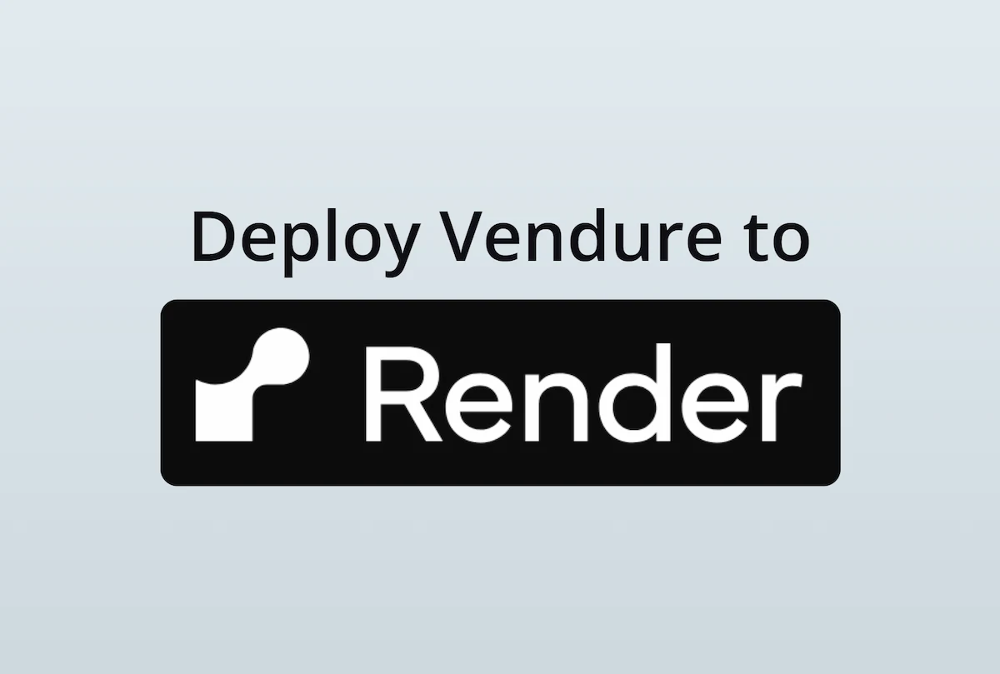
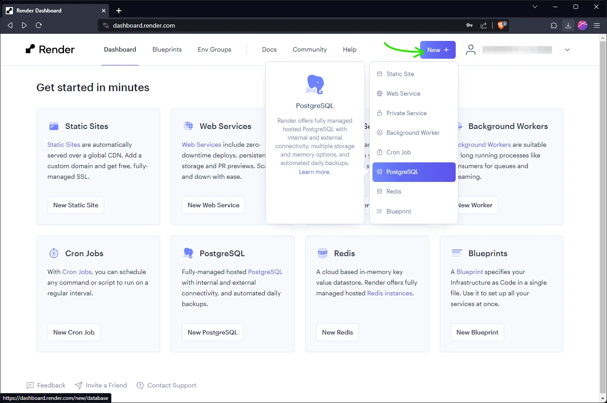
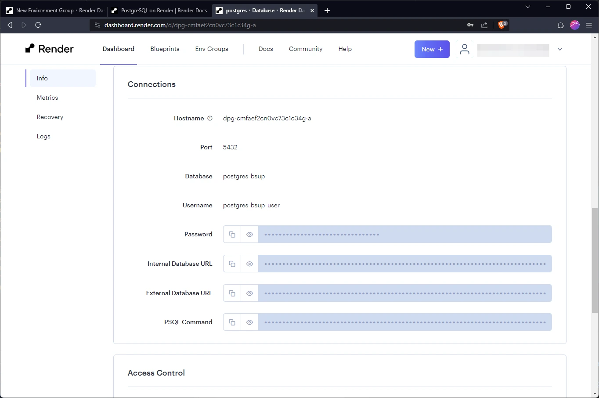
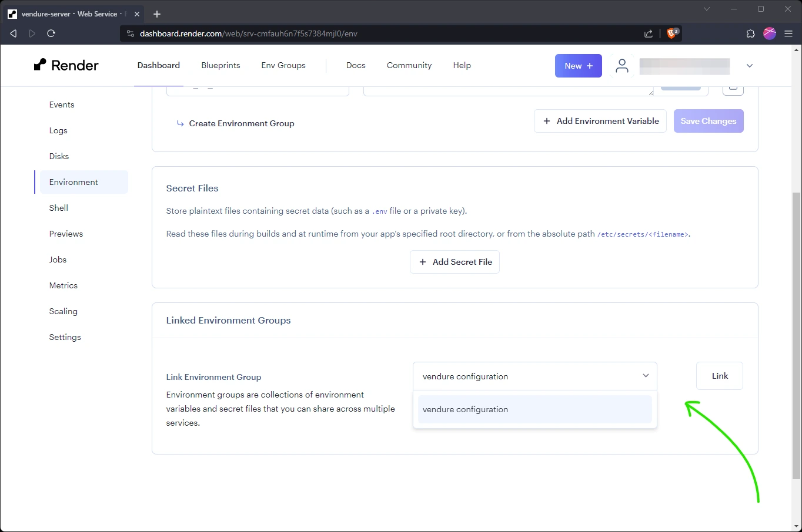
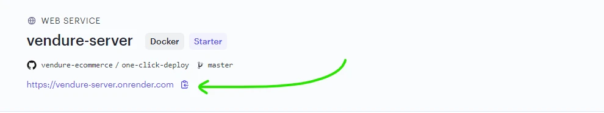

[Render](https://render.com/) is a managed hosting platform which allows you to deploy and scale your Vendure server and infrastructure with ease.

:::note
The configuration in this guide will cost from around $12 per month to run.
:::

## Prerequisites

First of all you'll need to [create a new Render account](https://dashboard.render.com/register) if you
don't already have one.

For this guide you'll need to have your Vendure project in a git repo on either GitHub or GitLab.

:::info
If you'd like to quickly get started with a ready-made Vendure project which includes sample data, you can use our
[Vendure one-click-deploy repo](https://github.com/vendure-ecommerce/one-click-deploy), which means you won't have
to set up your own git repo.
:::

## Configuration

### Port

Render defines the port via the `PORT` environment variable and [defaults to `10000`](https://docs.render.com/web-services#host-and-port-configuration), so make sure your Vendure Config uses this variable:

```ts title="src/vendure-config.ts"
import { VendureConfig } from '@vendure/core';

export const config: VendureConfig = {
    apiOptions: {
        // highlight-next-line
        port: +(process.env.PORT || 3000),
        // ...
    },
    // ...
};
```

### Database connection

:::info
The following is already pre-configured if you are using the one-click-deploy repo.
:::

Make sure your DB connection options uses the following environment variables:

```ts title="src/vendure-config.ts"
import { VendureConfig } from '@vendure/core';

export const config: VendureConfig = {
    // ...
    dbConnectionOptions: {
        // ...
        database: process.env.DB_NAME,
        host: process.env.DB_HOST,
        port: +process.env.DB_PORT,
        username: process.env.DB_USERNAME,
        password: process.env.DB_PASSWORD,
    },
};
```
### Asset storage

:::info
The following is already pre-configured if you are using the one-click-deploy repo.
:::

In this guide we will use the AssetServerPlugin's default local disk storage strategy. Make sure you use the
`ASSET_UPLOAD_DIR` environment variable to set the path to the directory where the uploaded assets will be stored.

```ts title="src/vendure-config.ts"
import { VendureConfig } from '@vendure/core';
import { AssetServerPlugin } from '@vendure/asset-server-plugin';

export const config: VendureConfig = {
    // ...
    plugins: [
        AssetServerPlugin.init({
            route: 'assets',
            // highlight-next-line
            assetUploadDir: process.env.ASSET_UPLOAD_DIR || path.join(__dirname, '../static/assets'),
        }),
    ],
    // ...
};
```

## Create a database

From the Render dashboard, click the "New" button and select "PostgreSQL" from the list of services:



Give the database a name (e.g. "postgres"), select a region close to you, select an appropriate plan
and click "Create Database".

## Create the Vendure server

Click the "New" button again and select "Web Service" from the list of services. Choose the "Build and deploy from a Git repository" option.

In the next step you will be prompted to connect to either GitHub or GitLab. Select the appropriate option and follow the instructions
to connect your account and grant access to the repository containing your Vendure project.

:::info
If you are using the one-click-deploy repo, you should instead use the "Public Git repository" option and enter the URL of the repo:

```
https://github.com/vendure-ecommerce/one-click-deploy
```
:::

### Configure the server service

In the next step you will configure the server:

- **Name**: "vendure-server"
- **Region**: Select a region close to you
- **Branch**: Select the branch you want to deploy, usually "main" or "master"
- **Runtime**: If you have a Dockerfile then it should be auto-detected. If not you should select "Node" and enter the appropriate build and start commands. For a
typical Vendure project these would be:
  - **Build Command**: `yarn; yarn build` or `npm install; npm run build`
  - **Start Command**: `node ./dist/index.js`
- **Instance Type**: Select the appropriate instance type. Since we want to use a persistent volume to store our assets, we need to
use at least the "Starter" instance type or higher.

Click the "Advanced" button to expand the advanced options:

- Click "Add Disk" to set up a persistent volume for the assets and use the following settings:
  - **Name**: "vendure-assets"
  - **Mount Path**: `/vendure-assets`
  - **Size**: As appropriate. For testing purposes you can use the smallest size (1GB)
- **Health Check Path**: `/health`
- **Docker Command**: `node ./dist/index.js` (if you are _not_ using a Dockerfile this option will not be available)

Click "Create Web Service" to create the service.

:::note
If you have not already set up payment, you will be prompted to enter credit card details at this point.
:::

## Configure environment variables

Next we need to set up the environment variables which will be used by both the server and worker. Click the "Env Groups" tab
and then click the "New Environment Group" button.

Name the group "vendure configuration" and add the following variables. The database variables can be found by navigating
to the database service, clicking the "Info" tab and scrolling to the "Connections" section:



```shell
DB_NAME=<database "Database">
DB_USERNAME=<database "Username">
DB_PASSWORD=<database "Password">
DB_HOST=<database "Hostname">
DB_PORT=<database "Port">
ASSET_UPLOAD_DIR=/vendure-assets
// highlight-next-line
COOKIE_SECRET=<add some random characters>
SUPERADMIN_USERNAME=superadmin
// highlight-next-line
SUPERADMIN_PASSWORD=<create some strong password>
```
Once the correct values have been entered, click "Create Environment Group".

Next, click the "vendure-server" service and go to the "Environment" tab to link the environment group to the service:



## Create the Vendure worker

Finally, we need to define the worker process which will run the background tasks. Click the "New" button and select
"Background Worker".

Select the same git repo as before, and in the next step configure the worker:

- **Name**: "vendure-worker"
- **Region**: Same as the server
- **Branch**: Select the branch you want to deploy, usually "main" or "master"
- **Runtime**: If you have a Dockerfile then it should be auto-detected. If not you should select "Node" and enter the appropriate build and start commands. For a
  typical Vendure project these would be:
  - **Build Command**: `yarn; yarn build` or `npm install; npm run build`
  - **Start Command**: `node ./dist/index-worker.js`
- **Instance Type**: Select the appropriate instance type. The Starter size is fine to get started.

Click the "Advanced" button to expand the advanced options:

- **Docker Command**: `node ./dist/index-worker.js` (if you are _not_ using a Dockerfile this option will not be available)

Click "Create Background Worker" to create the worker.

Finally, click the "Environment" tab and link the "vendure configuration" environment group to the worker.

## Test your Vendure server

Navigate back to the dashboard, click the "vendure-server" service, and you should see a link to the temporary domain:



Click the link and append `/admin` to the URL to open the Admin UI. Log in with the username and password you set in the
environment variables.

## Next Steps

This setup gives you a basic Vendure server to get started with. When moving to a more production-ready setup, you'll
want to consider the following:

- Use MinIO for asset storage. This is a more robust and scalable solution than the local disk storage used here.
  - [Deploying MinIO to Render](https://docs.render.com/deploy-minio),
  - [Configuring the AssetServerPlugin for MinIO](/reference/core-plugins/asset-server-plugin/s3asset-storage-strategy/#usage-with-minio)
- Use Redis to power the job queue and session cache. This is not only more performant, but will enable horizontal scaling of your
  server and worker instances.
  - [Render Redis docs](https://docs.render.com/redis#creating-a-redis-instance)
  - [Vendure horizontal scaling docs](/guides/deployment/horizontal-scaling)
  