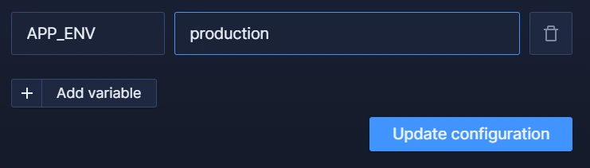

This is a guide to the recommended configuration for a production Vendure application.

## Environment variables

Keep sensitive information or context-dependent settings in environment variables. In local development you can store the values in a `.env` file. For production, you should use the mechanism provided by your hosting platform to set the values for production.

The default `@vendure/create` project scaffold makes use of environment variables already. For example:

```ts
const IS_DEV = process.env.APP_ENV === 'dev';
```

The `APP_ENV` environment variable can then be set using the admin dashboard of your hosting provider:



If you are using [Docker or Kubernetes](/deployment/using-docker), they include their own methods of setting environment variables.

## Superadmin credentials

Ensure you set the superadmin credentials to something other than the default of `superadmin:superadmin`. Use your hosting platform's environment variables to set a **strong** password for the Superadmin account.

```ts
import { VendureConfig } from '@vendure/core';

export const config: VendureConfig = {
  authOptions: {
    tokenMethod: ['bearer', 'cookie'],
    superadminCredentials: {
      identifier: process.env.SUPERADMIN_USERNAME,
      password: process.env.SUPERADMIN_PASSWORD,
    },
  },
  // ...
};
```

## API hardening

It is recommended that you install and configure the [HardenPlugin](/reference/core-plugins/harden-plugin/) for all production deployments. This plugin locks down your schema (disabling introspection and field suggestions) and protects your Shop API against malicious queries that could otherwise overwhelm your server.

Install the plugin: 

```bash
npm install @vendure/harden-plugin

# or

yarn add @vendure/harden-plugin
```

Then add it to your VendureConfig:

```ts
import { VendureConfig } from '@vendure/core';
import { HardenPlugin } from '@vendure/harden-plugin';

const IS_DEV = process.env.APP_ENV === 'dev';

export const config: VendureConfig = {
  // ...
  plugins: [
    HardenPlugin.init({
      maxQueryComplexity: 500,
      apiMode: IS_DEV ? 'dev' : 'prod',
    }),
    // ...
  ]
};
```

:::info
For a detailed explanation of how to best configure this plugin, see the [HardenPlugin docs](/reference/core-plugins/harden-plugin/).
:::

## ID Strategy

By default, Vendure uses auto-increment integer IDs as entity primary keys. While easier to work with in development, sequential primary keys can leak information such as the number of orders or customers in the system.

For this reason you should consider using the UuidIdStrategy for production.

```ts title="src/vendure-config.ts"
import { UuidIdStrategy, VendureConfig } from '@vendure/core';

export const config: VendureConfig = {
    entityOptions: {
        entityIdStrategy: new UuidIdStrategy(),
    },
    // ...
}
```

Another option, if you wish to stick with integer IDs, is to create a custom [EntityIdStrategy](/reference/typescript-api/configuration/entity-id-strategy/) which uses the `encodeId()` and `decodeId()` methods to obfuscate the sequential nature of the ID.

## Database Timezone

Vendure internally treats all dates & times as UTC. However, you may sometimes run into issues where dates are offset by some fixed amount of hours. E.g. you place an order at 17:00, but it shows up in the Dashboard as being placed at 19:00. Typically, this is caused by the timezone of your database not being set to UTC.

You can check the timezone in **MySQL/MariaDB** by executing:

```sql
SELECT TIMEDIFF(NOW(), UTC_TIMESTAMP);
```
and you should expect to see `00:00:00`.

In **Postgres**, you can execute:
```sql
show timezone;
```
and you should expect to see `UTC` or `Etc/UTC`.

## Trust proxy

When deploying your Vendure application behind a reverse proxy (usually the case with most hosting services), consider configuring Express's `trust proxy` setting. This allows you to retrieve the original IP address from the `X-Forwarded-For` header, which proxies use to forward the client's IP address.

You can set the `trustProxy` option in your `VendureConfig`:

```ts
import { VendureConfig } from '@vendure/core';

export const config: VendureConfig = {
    apiOptions: {
        trustProxy: 1, // Trust the first proxy in front of your app
    },
};
```

For more details on configuring `trust proxy`, refer to the [Express documentation](https://expressjs.com/en/guide/behind-proxies.html).

## Security Considerations

Please read over the [Security](/developer-guide/security) section of the Developer Guide for more information on how to secure your Vendure application.
