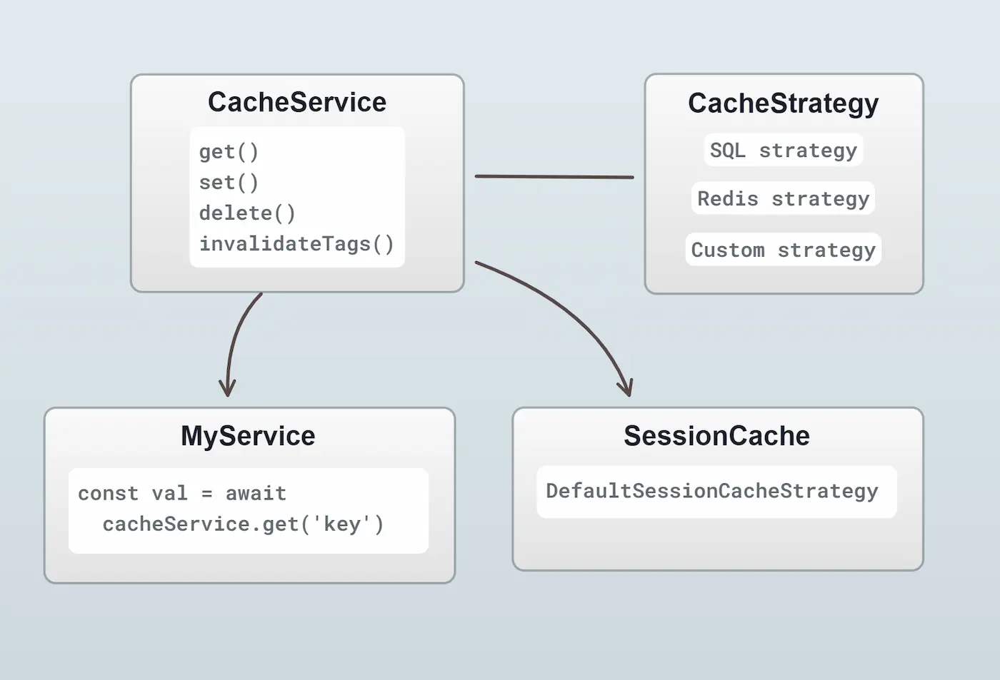

Caching is a technique to improve performance of a system by saving the results of expensive
operations and reusing them when the same operation is requested again.

Vendure uses caching in a number of places to improve performance, and the same caching
mechanism is available for use in custom plugins.

## Setting up the cache

In order to take advantage of Vendure distributed caching, you need to enable a cache plugin.

:::note
If no cache plugin is specified, Vendure uses an in-memory cache which is not shared between instances.
This is suitable for development, but not recommended for production use.
:::

### DefaultCachePlugin

The [DefaultCachePlugin](/reference/typescript-api/cache/default-cache-plugin) uses the database to store the cache data.
This is a simple and effective cache strategy which has the advantage of not requiring any additional
infrastructure.

```ts title="vendure-config.ts"
import { DefaultCachePlugin, VendureConfig } from '@vendure/core';

export const config: VendureConfig = {
    // ...
    plugins: [
        DefaultCachePlugin.init({
            // optional maximum number of items to
            // store in the cache. Defaults to 10,000
            cacheSize: 20_000,
        }),
    ],
};
```

After enabling the `DefaultCachePlugin`, you will need to [generate a migration](/developer-guide/migrations/) to add the necessary
tables to the database.

### RedisCachePlugin

Vendure also provides a [RedisCachePlugin](/reference/typescript-api/cache/redis-cache-plugin) which uses a Redis
server to store the cache data and can have better performance characteristics.

```ts title="vendure-config.ts"
import { RedisCachePlugin, VendureConfig } from '@vendure/core';

export const config: VendureConfig = {
    // ...
    plugins: [
        RedisCachePlugin.init({
            redisOptions: {
                host: 'localhost',
                port: 6379,
            },
        }),
    ],
};
```

## CacheService

The [`CacheService`](/reference/typescript-api/cache/cache-service) is the general-purpose API for interacting with the cache.
It provides methods for setting, getting and deleting cache entries.



Internally, the `CacheService` uses a [CacheStrategy](/reference/typescript-api/cache/cache-strategy) to store the data. The cache strategy is responsible for
the actual storage and retrieval of the data. The `CacheService` provides a consistent API which can be used
regardless of the underlying cache strategy.

:::info
From Vendure v3.1, new projects are created with the [DefaultCachePlugin](/reference/typescript-api/cache/default-cache-plugin) enabled by default. This plugin
uses the database to store the cache data. This is a simple and effective cache strategy which is suitable
for most use-cases.

For more advanced use-cases, you can use the [RedisCachePlugin](/reference/typescript-api/cache/redis-cache-plugin) which uses a Redis
server to store the cache data and can have better performance characteristics.
:::

### Multi-instance use

It is common to run Vendure in a multi-instance setup, where multiple instances of the server and worker are
running in parallel.

The `CacheService` is designed to work in this environment. Both the [DefaultCachePlugin](/reference/typescript-api/cache/default-cache-plugin)
and the [RedisCachePlugin](/reference/typescript-api/cache/redis-cache-plugin) use a single shared cache across all
instances.

This means that if one instance sets a cache entry, it will be available to all other instances. Likewise,
if one instance deletes a cache entry, it will be deleted for all other instances.

### Usage

The `CacheService` can be injected into any service, resolver, strategy or configurable operation.

```ts
import { Injectable } from '@nestjs/common';
import { CacheService } from '@vendure/core';

@Injectable()
export class MyService {
    constructor(private cacheService: CacheService) {}

    async myMethod() {
        const cacheKey = 'MyService.myMethod';
        const cachedValue = await this.cacheService.get(cacheKey);
        if (cachedValue) {
            return cachedValue;
        }
        const newValue = await this.expensiveOperation();
        // Cache the result for 1 minute (60 * 1000 milliseconds)
        await this.cacheService.set(cacheKey, newValue, { ttl: 60 * 1000 });
        return newValue;
    }

    private async expensiveOperation() {
        // Do something expensive
    }
}
```

:::info

The data stored in the cache must be serializable. This means you cannot store instances of classes,
functions, or other non-serializable data types.

:::

### Cache key naming

When setting a cache entry, it is important to choose a unique key which will not conflict
with other cache entries. The key should be namespaced to avoid conflicts. For example,
you can use the name of the class & method as part of the key. If there is an identifier
which is unique to the operation, that can be used as well.

```ts
getVariantIds(productId: ID): Promise<ID[]> {
    const cacheKey = `ProductService.getVariantIds:${productId}`;
    const cachedValue = await this.cacheService.get(cacheKey);
    if (cachedValue) {
        return cachedValue;
    }
    const newValue = await this.expensiveOperation(productId);
    await this.cacheService.set(cacheKey, newValue, { ttl: 60 * 1000 });
    return newValue;
}
```

### Cache eviction

The cache is not infinite, and entries will be evicted after a certain time. The time-to-live (TTL)
of a cache entry can be set when calling `set()`. If no TTL is set, the cache entry will remain
in the cache indefinitely.

Cache entries can also be manually deleted using the `delete()` method:

```ts
await this.cacheService.delete(cacheKey);
```

### Cache tags

When setting a cache entry, you can also specify a list of tags. This allows you to invalidate
all cache entries which share a tag. For example, if you have a cache entry which is related to
a Product, you can tag it with the Product's ID. When the Product is updated, you can invalidate
all cache entries which are tagged with that Product ID.

```ts
const cacheKey = `ProductService.getVariantIds:${productId}`;

await this.cacheService.set(cacheKey, newValue, {
    tags: [`Product:${productId}`]
});

// later

await this.cacheService.invalidateTags([`Product:${productId}`]);
```

### createCache Helper

The `createCache` helper function can be used to create a [Cache](/reference/typescript-api/cache) instance
which is a convenience wrapper around the `CacheService` APIs:

```ts
import { Injectable } from '@nestjs/common';
import { CacheService, ID, EventBus, ProductEvent,RequestContext } from '@vendure/core';

@Injectable()
export class FacetValueChecker {
    // Create a Cache instance with a 1-day TTL
    private facetValueCache = this.cacheService.createCache({
        getKey: (productId: ID) => `FacetValueChecker.${productId}`,
        options: { ttl: 1000 * 60 * 60 * 24 },
    });

    constructor(private cacheService: CacheService, private eventBus: EventBus) {
        this.eventBus.ofType(ProductEvent).subscribe(event => {
            if (event.type !== 'created') {
                // Invalidate the cache entry when a Product is updated or deleted
                this.facetValueCache.delete(event.entity.id);
            }
        });
    }

    async getFacetValueIdsForProduct(ctx: RequestContext, productId: ID): Promise<ID[]> {
        return this.facetValueCache.get(productId, () =>
            // This function will only be called if the cache entry does not exist
            // or has expired. It will set the result in the cache automatically.
            this.calculateFacetValueIdsForProduct(ctx, productId));
    }

    async calculateFacetValueIdsForProduct(ctx: RequestContext, productId: ID): Promise<ID[]> {
        // Do something expensive
    }
}
```

## RequestContextCache

The [RequestContextCacheService](/reference/typescript-api/cache/request-context-cache-service) is a specialized
cache service which is scoped to the current request. This is useful when you want to cache data
for the duration of a single request, but not across multiple requests.

This can be especially useful in resolvers, where you may want to cache the result of a specific resolved
field which may be requested multiple times within the same request.

For example, in Vendure core, when dealing with product lists, there's a particular very hot
code path that is used to calculate the correct prices to return for each product. As part of this
calculation, we need to know the active tax zone, which can be expensive to calculate newly
for each product. We use the `RequestContextCacheService` to cache the active tax zone for the
duration of the request.

```ts
const activeTaxZone = await this.requestContextCache.get(
    ctx,
    'activeTaxZone',
    () => taxZoneStrategy
        .determineTaxZone(ctx, zones, ctx.channel, order),
);
```

Internally, the `RequestContextCacheService` makes used of the WeakMap data structure which means the cached
data will be automatically garbage-collected when the request is finished. It is also able to store
any kind of data, not just serializable data.

## Session Cache

There is an additional cache which is specifically used to cache session data, since this data is commonly
accessed on almost all requests. Since v3.1, the default is to use the [DefaultSessionCacheStrategy](/reference/typescript-api/auth/default-session-cache-strategy)
which internally just uses whatever the current `CacheStrategy` is to store the data.

This means that in most cases you don't need to worry about the session cache, but if you have specific
requirements, you can create a custom session cache strategy and set it via the `authOptions.sessionCacheStrategy`
config property.

## SelfRefreshingCache
The [SelfRefreshingCache](/reference/typescript-api/cache/self-refreshing-cache) is a specialized in-memory cache which automatically
refreshes itself if the value is found to be stale. This is useful to cache a single frequently-accessed value, that don't change often.

It is created using the [createSelfRefreshingCache](/reference/typescript-api/cache/self-refreshing-cache#createselfrefreshingcache) function, which takes a configuration object that specifies the
name of the cache, the time-to-live (TTL) for the cache entries, and a refresh function that will be called to update the value when it is stale.

```ts title="SelfRefreshingCache Example"
import {
  Channel,
  createSelfRefreshingCache,
  EventBus,
  InitializerEvent,
  InternalServerError,
  Logger,
  RequestContext
  SelfRefreshingCache,
  TransactionalConnection,
} from '@vendure/core';

@Injectable()
export class PublicChannelService {
  private publicChannel: SelfRefreshingCache<Channel, [RequestContext]>; // [!code highlight]
  private readonly logCtx = 'PublicChannelService';

  constructor(
    private connection: TransactionalConnection,
    private eventBus: EventBus,
  ) {
    this.eventBus.ofType(InitializerEvent).subscribe(async () => {
      this.publicChannel = await createSelfRefreshingCache({ // [!code highlight]
        name: 'PublicChannelService.publicChannel', // [!code highlight]
        ttl: 1000 * 60 * 5, // 5min // [!code highlight]
        refresh: { fn: ctx => this.findPublicChannel(ctx), defaultArgs: [RequestContext.empty()] }, // [!code highlight]
      }); // [!code highlight]
    });
  }

  async getPublicChannel(): Promise<Channel> {
    const publicChannel = await this.publicChannel.value(); // [!code highlight]
    if (!publicChannel) {
      throw new InternalServerError(`error.public-channel-not-found`);
    }
    return publicChannel;
  }

  private async findPublicChannel(ctx: RequestContext): Promise<Channel> {
    const publicChannel = await this.connection.getRepository(ctx, Channel).findOne({
      where: { code: DEFAULT_PUBLIC_CHANNEL_CODE },
      relations: ['defaultShippingZone', 'defaultTaxZone'],
    });

    if (!publicChannel) {
      Logger.error('Could not find public channel!', this.logCtx);
      throw new InternalServerError(`error.public-channel-not-found`);
    }
    return publicChannel;
  }
}
```