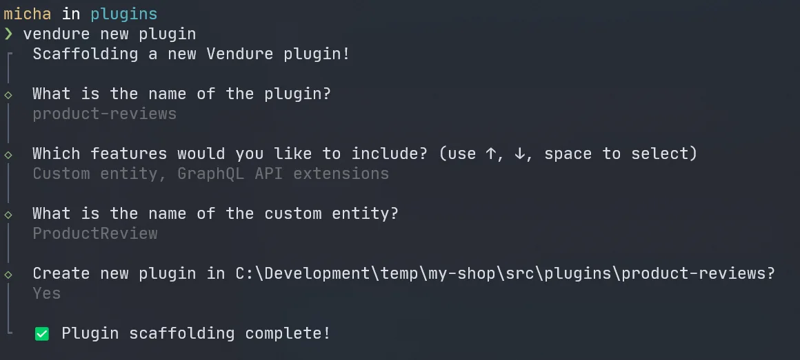

The Vendure CLI is a command-line tool for boosting your productivity as a developer.

Currently, it provides functionality for rapidly scaffolding a new plugin, and in future we will be expanding the capabilities to include other common tasks.

:::info
The Vendure CLI package was introduced with Vendure v2.1.0
:::

## Installation

You can install the CLI locally in your Vendure project, or you can run it without installation using `npx`. The advantage of installing locally is that you can more easily control the installed version, and you can reference the CLI using the `vendure` command.

```bash
npm install -D @vendure/cli

# or 

yarn add -D @vendure/cli
```

and then from your project directory you can run:

```bash
vendure --version
```

### Running without installation

If you want to use the Vendure CLI without installing it in your project, you can run

```bash
npx @vendure/cli --version
```

## Scaffold a new plugin

The Vendure CLI can be used to quickly scaffold a new [plugin](/guides/developer-guide/plugins).

1. Navigate to your plugins directory
   ```bash
   cd src/plugins
   ```
2. Run the `new plugin` command
   ```bash
   vendure new plugin
   ```
3. Answer the questions to configure your new plugin


