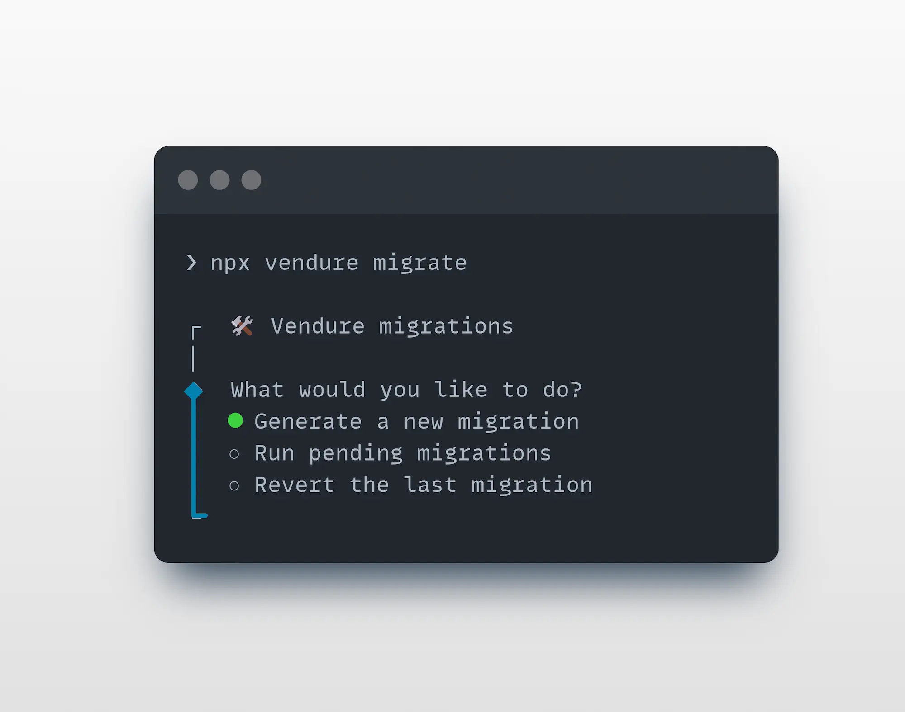

import Tabs from '@theme/Tabs';
import TabItem from '@theme/TabItem';

The Vendure CLI is a command-line tool for boosting your productivity as a developer by automating common tasks
such as creating new plugins, entities, API extensions and more.

It is much more than just a scaffolding tool - it is able to analyze your project and intelligently modify your existing
codebase to integrate new functionality.

## Installation

:::info
The Vendure CLI comes installed with a new Vendure project by default from v2.2.0+
:::

To manually install the CLI, run:

<Tabs groupId="package-manager">
<TabItem value="npm" label="npm" default>

```bash
npm install -D @vendure/cli
```

</TabItem>
<TabItem value="yarn" label="yarn">

```bash
yarn add -D @vendure/cli
```

</TabItem>
</Tabs>

## The Add Command

The `add` command is used to add new entities, resolvers, services, plugins, and more to your Vendure project.

From your project's **root directory**, run:

<Tabs groupId="package-manager">
<TabItem value="npm" label="npm" default>

```bash
npx vendure add
```

</TabItem>
<TabItem value="yarn" label="yarn">

```bash
yarn vendure add
```

</TabItem>
</Tabs>


The CLI will guide you through the process of adding new functionality to your project. 

The `add` command is much more than a simple file generator. It is able to
analyze your project source code to deeply understand and correctly update your project files.

## The Migrate Command

The `migrate` command is used to generate and manage [database migrations](/guides/developer-guide/migrations) for your Vendure project.


From your project's **root directory**, run:

<Tabs groupId="package-manager">
<TabItem value="npm" label="npm" default>

```bash
npx vendure migrate
```

</TabItem>
<TabItem value="yarn" label="yarn">

```bash
yarn vendure migrate
```

</TabItem>
</Tabs>

