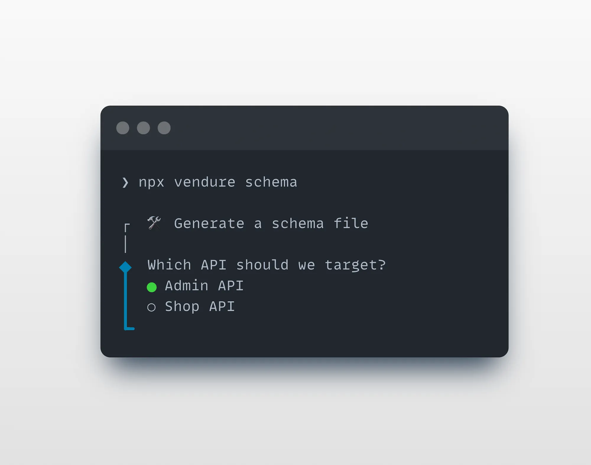

The Vendure CLI is a command-line tool for boosting your productivity as a developer by automating common tasks
such as creating new plugins, entities, API extensions and more.

It is much more than just a scaffolding tool - it is able to analyze your project and intelligently modify your existing
codebase to integrate new functionality.

## Installation

:::info
The Vendure CLI comes installed with a new Vendure project by default from v2.2.0+
:::

To manually install the CLI, run:

<Tabs groupId="package-manager">
<TabItem value="npm" label="npm" default>

```bash
npm install -D @vendure/cli
```

</TabItem>
<TabItem value="yarn" label="yarn">

```bash
yarn add -D @vendure/cli
```

</TabItem>
</Tabs>

## Interactive vs Non-Interactive Mode

The Vendure CLI supports both **interactive** and **non-interactive** modes:

- **Interactive mode**: Provides guided prompts and menus for easy use during development
- **Non-interactive mode**: Allows direct command execution with arguments and options, perfect for automation, CI/CD, and AI agents

## The Add Command

The `add` command is used to add new entities, resolvers, services, plugins, and more to your Vendure project.

### Interactive Mode

From your project's **root directory**, run:

<Tabs groupId="package-manager">
<TabItem value="npm" label="npm" default>

```bash
npx vendure add
```

</TabItem>
<TabItem value="yarn" label="yarn">

```bash
yarn vendure add
```

</TabItem>
</Tabs>


The CLI will guide you through the process of adding new functionality to your project.

The `add` command is much more than a simple file generator. It is able to
analyze your project source code to deeply understand and correctly update your project files.

### Non-Interactive Mode

For automation or when you know exactly what you need to add, you can use the non-interactive mode with specific arguments and options:

<Tabs groupId="package-manager">
<TabItem value="npm" label="npm" default>

```bash
# Create a new plugin
npx vendure add -p MyPlugin

# Add an entity to a plugin
npx vendure add -e MyEntity --selected-plugin MyPlugin

# Add an entity with features
npx vendure add -e MyEntity --selected-plugin MyPlugin --custom-fields --translatable

# Add a service to a plugin
npx vendure add -s MyService --selected-plugin MyPlugin

# Add a service with specific type
npx vendure add -s MyService --selected-plugin MyPlugin --type entity

# Add job queue support to a plugin
npx vendure add -j MyPlugin --name my-job --selected-service MyService

# Add GraphQL codegen to a plugin
npx vendure add -c MyPlugin

# Add API extension to a plugin
npx vendure add -a MyPlugin --queryName getCustomData --mutationName updateCustomData

# Add Dashboard extensions to a plugin
npx vendure add -d MyPlugin

# Use custom config file
npx vendure add -p MyPlugin --config ./custom-vendure.config.ts
```

</TabItem>
<TabItem value="yarn" label="yarn">

```bash
# Create a new plugin
yarn vendure add -p MyPlugin

# Add an entity to a plugin
yarn vendure add -e MyEntity --selected-plugin MyPlugin

# Add an entity with features
yarn vendure add -e MyEntity --selected-plugin MyPlugin --custom-fields --translatable

# Add a service to a plugin
yarn vendure add -s MyService --selected-plugin MyPlugin

# Add a service with specific type
yarn vendure add -s MyService --selected-plugin MyPlugin --type entity

# Add job queue support to a plugin
yarn vendure add -j MyPlugin --name my-job --selected-service MyService

# Add GraphQL codegen to a plugin
yarn vendure add -c MyPlugin

# Add API extension to a plugin
yarn vendure add -a MyPlugin --queryName getCustomData --mutationName updateCustomData

# Add Dashboard extensions to a plugin
yarn vendure add -d MyPlugin

# Use custom config file
yarn vendure add -p MyPlugin --config ./custom-vendure.config.ts
```

</TabItem>
</Tabs>

#### Add Command Options

| Flag | Long Form                  | Description                        | Example                                                                  |
| ---- | -------------------------- | ---------------------------------- | ------------------------------------------------------------------------ |
| `-p` | `--plugin <n>`             | Create a new plugin                | `vendure add -p MyPlugin`                                                |
| `-e` | `--entity <n>`             | Add a new entity to a plugin       | `vendure add -e MyEntity --selected-plugin MyPlugin`                     |
| `-s` | `--service <n>`            | Add a new service to a plugin      | `vendure add -s MyService --selected-plugin MyPlugin`                    |
| `-j` | `--job-queue [plugin]`     | Add job queue support              | `vendure add -j MyPlugin --name job-name --selected-service ServiceName` |
| `-c` | `--codegen [plugin]`       | Add GraphQL codegen configuration  | `vendure add -c MyPlugin`                                                |
| `-a` | `--api-extension [plugin]` | Add API extension scaffold         | `vendure add -a MyPlugin --queryName getName --mutationName setName`     |
| `-d` | `--dashboard [plugin]`     | Add Dashboard extensions setup     | `vendure add -d MyPlugin`                                                |
|      | `--config <path>`          | Specify custom Vendure config file | `--config ./custom-config.ts`                                            |

#### Sub-options for specific commands

**Entity (`-e`) additional options:**

- `--selected-plugin <n>`: Name of the plugin to add the entity to (required)
- `--custom-fields`: Add custom fields support to the entity
- `--translatable`: Make the entity translatable

**Service (`-s`) additional options:**

- `--selected-plugin <n>`: Name of the plugin to add the service to (required)
- `--type <type>`: Type of service: basic or entity (default: basic)

**Job Queue (`-j`) additional options:**

- `--name <name>`: Name for the job queue (required)
- `--selected-service <name>`: Service to add the job queue to (required)

**API Extension (`-a`) additional options: (requires either)**

- `--queryName <n>`: Name for the GraphQL query
- `--mutationName <n>`: Name for the GraphQL mutation

:::info
**Validation**: Entity and service commands validate that the specified plugin exists in your project. If the plugin is not found, the command will list all available plugins in the error message. Both commands require the `--selected-plugin` parameter when running in non-interactive mode.
:::

## The Migrate Command

The `migrate` command is used to generate and manage [database migrations](/developer-guide/migrations) for your Vendure project.

### Interactive Mode

From your project's **root directory**, run:

<Tabs groupId="package-manager">
<TabItem value="npm" label="npm" default>

```bash
npx vendure migrate
```

</TabItem>
<TabItem value="yarn" label="yarn">

```bash
yarn vendure migrate
```

</TabItem>
</Tabs>


### Non-Interactive Mode

For migration operations, use specific arguments and options:

<Tabs groupId="package-manager">
<TabItem value="npm" label="npm" default>

```bash
# Generate a new migration
npx vendure migrate -g my-migration-name

# Run pending migrations
npx vendure migrate -r

# Revert the last migration
npx vendure migrate --revert

# Generate migration with custom output directory
npx vendure migrate -g my-migration -o ./custom/migrations
```

</TabItem>
<TabItem value="yarn" label="yarn">

```bash
# Generate a new migration
yarn vendure migrate -g my-migration-name

# Run pending migrations
yarn vendure migrate -r

# Revert the last migration
yarn vendure migrate --revert

# Generate migration with custom output directory
yarn vendure migrate -g my-migration -o ./custom/migrations
```

</TabItem>
</Tabs>

#### Migrate Command Options

| Flag | Long Form             | Description                            | Example                                           |
| ---- | --------------------- | -------------------------------------- | ------------------------------------------------- |
| `-g` | `--generate <name>`   | Generate a new migration               | `vendure migrate -g add-user-table`               |
| `-r` | `--run`               | Run all pending migrations             | `vendure migrate -r`                              |
|      | `--revert`            | Revert the last migration              | `vendure migrate --revert`                        |
| `-o` | `--output-dir <path>` | Custom output directory for migrations | `vendure migrate -g my-migration -o ./migrations` |

## The Schema Command

:::info
The `schema` command was added in Vendure v3.5
:::

The `schema` command allows you to generate a schema file for your Admin or Shop APIs, in either the GraphQL schema definition language (SDL)
or as JSON.

This is useful when integrating with GraphQL tooling such as your [IDE's GraphQL plugin](/getting-started/graphql-intro/#ide-plugins).

### Interactive Mode

From your project's **root directory**, run:

<Tabs groupId="package-manager">
<TabItem value="npm" label="npm" default>

```bash
npx vendure schema
```

</TabItem>
<TabItem value="yarn" label="yarn">

```bash
yarn vendure schema
```

</TabItem>
</Tabs>



### Non-Interactive Mode

To automate or quickly generate a schema in one command

<Tabs groupId="package-manager">
<TabItem value="npm" label="npm" default>

```bash
# Create a schema file in SDL format for the Admin API
npx vendure schema --api admin

# Create a JSON format schema of the Shop API
npx vendure migrate --api shop --format json
```

</TabItem>
<TabItem value="yarn" label="yarn">

```bash
# Create a schema file in SDL format for the Admin API
yarn vendure schema --api admin

# Create a JSON format schema of the Shop API
yarn vendure migrate --api shop --format json
```

</TabItem>
</Tabs>

#### Migrate Command Options

| Flag | Long Form             | Description                                     | Example                                                        |
| ---- | --------------------- | ----------------------------------------------- | -------------------------------------------------------------- |
| `-a` | `--api <admin,shop>`  | Select the API (required)                       | `vendure schema --api admin`                                   |
| `-d` | `--dir <dir>`         | Select the output dir (defaults to current dir) | `vendure schema --api admin --dir ../..`                       |
| `-n` | `--file-name <name>`  | The name of the generated file                  | `vendure schema --api admin --file-name introspection.graphql` |
| `-f` | `--format <sdl,json>` | The output format (defaults to SDL)             | `vendure schema --api admin --format json`                     |

## Working in Monorepos

The Vendure CLI automatically supports monorepo structures where packages have their own `tsconfig.json` files that extend a shared base configuration.

### Requirements

For the CLI to work correctly in a monorepo, ensure that:

1. **Each package containing a Vendure config has its own `tsconfig.json`** that extends the root config
2. **Path mappings are defined in your root `tsconfig.json`**

### Example Setup

A typical monorepo structure:

```text
my-monorepo/
├── tsconfig.json             # Root config with path mappings
├── packages/
│   └── vendure-app/
│       ├── tsconfig.json     # Extends root config
│       └── src/
│           └── vendure-config.ts
└── libs/
    └── shared/
        └── src/
            └── index.ts
```

**Root `tsconfig.json`:**

```json
{
    "compilerOptions": {
        "baseUrl": ".",
        "paths": {
            "@my-org/shared": ["libs/shared/src/index.ts"]
        }
    }
}
```

**Package `packages/vendure-app/tsconfig.json`:**

```json
{
    "extends": "../../tsconfig.json",
    "compilerOptions": {
        "outDir": "./dist"
    }
}
```

### How It Works

When you run CLI commands, it:

1. Locates the nearest `tsconfig.json` by walking up from your Vendure config file
2. Resolves the `extends` chain to merge all configurations
3. Registers path mappings so imports like `@my-org/shared` resolve correctly

:::info
The CLI automatically detects your monorepo structure. No additional configuration flags are required as long as your `tsconfig.json` files are properly set up with `extends`.
:::

## Getting Help

To see all available commands and options:

```bash
npx vendure --help
npx vendure add --help
npx vendure migrate --help
npx vendure schema --help
```
