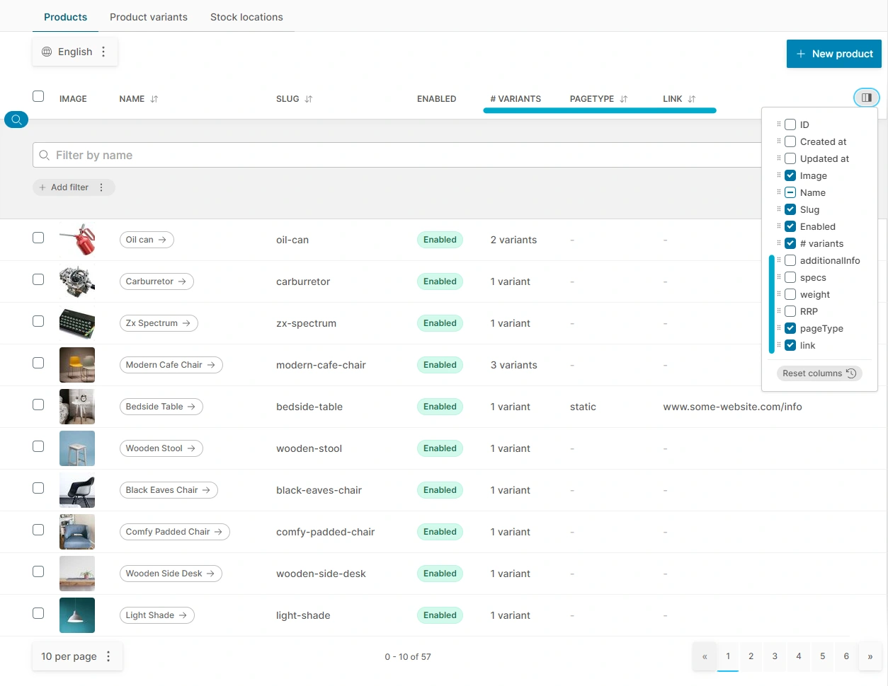
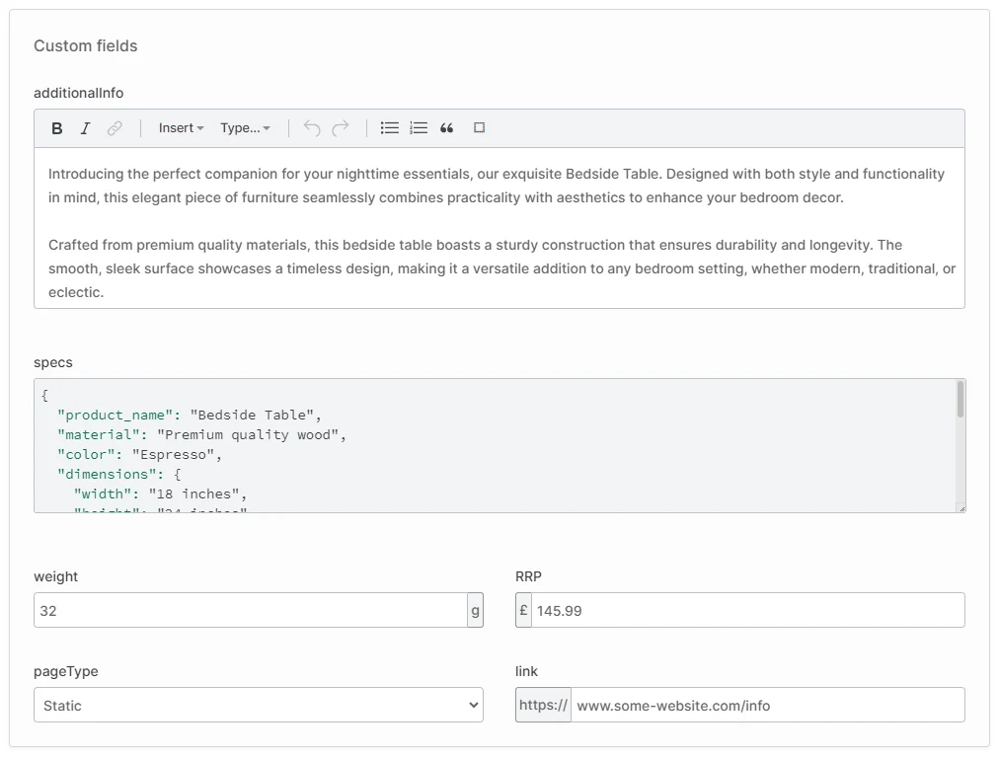

import Tabs from '@theme/Tabs';
import TabItem from '@theme/TabItem';
import CustomFieldProperty from '@site/src/components/CustomFieldProperty';

Custom fields allow you to add your own custom data properties to almost every Vendure entity. The entities which may have custom fields defined are listed in the [CustomFields interface documentation](/reference/typescript-api/custom-fields/).

Some use-cases for custom fields include:

* Storing the weight, dimensions or other product-specific data on the `ProductVariant` entity.
* Storing additional product codes on the `ProductVariant` entity such as ISBN or GTIN.
* Adding a `downloadable` flag to the `Product` entity to indicate whether the product is a digital download.
* Storing an external identifier (e.g. from a payment provider) on the `Customer` entity.
* Adding a longitude and latitude to the `StockLocation` for use in selecting the closest location to a customer.

## Defining custom fields

Custom fields are specified in the VendureConfig:

```ts
const config = {
    // ...
    customFields: {
        Product: [
            { name: 'infoUrl', type: 'string' },
            { name: 'downloadable', type: 'boolean' },
            { name: 'shortName', type: 'localeString' },
        ],
        User: [
            { name: 'socialLoginToken', type: 'string', unique: true },
        ],
    },
};
```

With the example config above, the following will occur:

1. The database schema will be altered, and a column will be added for each custom field. **Note: changes to custom fields require a database migration**. See the [Migrations guide](/guides/developer-guide/migrations/).
2. The GraphQL APIs will be modified to add the custom fields to the `Product` and `User` types respectively.
3. If you are using the [AdminUiPlugin](/reference/core-plugins/admin-ui-plugin/), the Admin UI detail pages will now contain form inputs to allow the custom field data to be added or edited, and the list view data tables will allow custom field columns to be added, sorted and filtered.



The values of the custom fields can then be set and queried via the GraphQL APIs:


<Tabs>
<TabItem value="Request" label="Request" default>

```graphql
mutation {
    updateProduct(input: {
        id: 1
        // highlight-start
        customFields: {
            infoUrl: "https://some-url.com",
            downloadable: true,
        }
        // highlight-end
        translations: [
            // highlight-next-line
            { languageCode: en, customFields: { shortName: "foo" } }
        ]
    }) {
        id
        name
        // highlight-start
        customFields {
            infoUrl
            downloadable
            shortName
        }
        // highlight-end
    }
}
```

</TabItem>
<TabItem value="Response" label="Response">

```json
{
  "data": {
    "product": {
      "id": "1",
      "name": "Laptop",
      "customFields": {
          "infoUrl": "https://some-url.com",
          "downloadable": true,
          "shortName": "foo"
      }
    }
  }
}
```

</TabItem>
</Tabs>

The custom fields will also extend the filter and sort options available to the `products` list query:

```graphql
query {
    products(options: {
        // highlight-start
        filter: {
            infoUrl: { contains: "new" },
            downloadable: { eq: true }
        },
        sort: {
            infoUrl: ASC
        }
        // highlight-end
    }) {
        items {
            id
            name
            // highlight-start
            customFields {
                infoUrl
                downloadable
                shortName
            }
            // highlight-end
        }
    }
}
```


## Available custom field types

The following types are available for custom fields:

| Type           | Description                  | Example                                                  |
|----------------|------------------------------|----------------------------------------------------------|
| `string`       | Short string data            | url, label                                               |
| `localeString` | Localized short strings      | localized url                                            |
| `text`         | Long text data               | extended product info, json config object                |
| `localeText`   | Localized long text          | localized extended product info                          |
| `int`          | Integer                      | product weight, customer loyalty points, monetary values |
| `float`        | Floating point number        | product review rating                                    |
| `boolean`      | Boolean                      | isDownloadable flag on product                           |
| `datetime`     | A datetime                   | date that variant is back in stock                       |
| `relation`     | A relation to another entity | Asset used as a customer avatar, related Products        |

To see the underlying DB data type and GraphQL type used for each, see the [CustomFieldType doc](/reference/typescript-api/custom-fields/custom-field-type).

#### Relations

It is possible to set up custom fields that hold references to other entities using the `'relation'` type:

```ts
const config = {
    // ...
    customFields: {
        Customer: [
            {
                name: 'avatar',
                // highlight-start
                type: 'relation',
                entity: Asset,
                // highlight-end
            },
        ],
    },
};
```

In this example, we set up a many-to-one relationship from Customer to Asset, allowing us to specify an avatar image for each Customer. Relation custom fields are unique in that the input and output names are not the same - the input will expect an ID and will be named `'<field name>Id'` or `'<field name>Ids'` for list types.

```graphql
mutation {
    updateCustomer(input: {
        id: 1
        customFields: {
            avatarId: 42,
        }
    }) {
        id
        customFields {
            avatar {
                id
                name
                preview
            }
        }
    }
}
```

## Accessing custom fields in TypeScript

As well as exposing custom fields via the GraphQL APIs, you can also access them directly in your TypeScript code. This is useful for plugins which need to access custom field data.

Given the following custom field configuration:

```ts title="src/vendure-config.ts"
import { VendureConfig } from '@vendure/core';

const config: VendureConfig = {
    // ...
    customFields: {
        Customer: [
            { name: 'externalId', type: 'string' },
            { name: 'avatar', type: 'relation', entity: Asset },
        ],
    },
};
```

the `externalId` will be available whenever you access a `Customer` entity:

```ts
const customer = await this.connection.getRepository(ctx, Customer).findOne({
    where: { id: 1 },
});
console.log(customer.externalId);
```

The `avatar` relation will require an explicit join to be performed in order to access the data, since it is not
eagerly loaded by default:

```ts
const customer = await this.connection.getRepository(ctx, Customer).findOne({
    where: { id: 1 },
    relations: {
        customFields: {
            avatar: true,
        }
    }
});
console.log(customer.avatar);
```

or if using the QueryBuilder API:

```ts
const customer = await this.connection.getRepository(ctx, Customer).createQueryBuilder('customer')
    .leftJoinAndSelect('customer.customFields.avatar', 'avatar')
    .where('customer.id = :id', { id: 1 })
    .getOne();
console.log(customer.avatar);
```

or using the EntityHydrator:

```ts
const customer = await this.customerService.findOne(ctx, 1);
await this.entityHydrator.hydrate(ctx, customer, { relations: ['customFields.avatar'] });
console.log(customer.avatar);
```

## Custom field config properties

### Common properties

All custom fields share some common properties:

- [`name`](#name)
- [`type`](#type)
- [`list`](#list)
- [`label`](#label)
- [`description`](#description)
- [`public`](#public)
- [`readonly`](#readonly)
- [`internal`](#internal)
- [`defaultValue`](#defaultvalue)
- [`nullable`](#nullable)
- [`unique`](#unique)
- [`validate`](#validate)
- [`requiresPermission`](#requirespermission)

#### name

<CustomFieldProperty required={true} type="string"/>

The name of the field. This is used as the column name in the database, and as the GraphQL field name. The name should not contain spaces and by convention should be camelCased.

```ts title="src/vendure-config.ts"
const config = {
    // ...
    customFields: {
        Product: [
            {
                // highlight-next-line
                name: 'infoUrl',
                type: 'string'
            },
        ]
    }
};
```

#### type

<CustomFieldProperty required={true} type="CustomFieldType" typeLink="/reference/typescript-api/custom-fields/custom-field-type"/>

The type of data that will be stored in the field.

#### list

<CustomFieldProperty required={false} type="boolean" />

If set to `true`, then the field will be an array of the specified type. Defaults to `false`.

```ts title="src/vendure-config.ts"
const config = {
    // ...
    customFields: {
        Product: [
            {
                name: 'infoUrls',
                type: 'string',
                // highlight-next-line
                list: true,
            },
        ]
    }
};
```

Setting a custom field to be a list has the following effects:

* The GraphQL type will be an array of the specified type.
* The Admin UI will display a list of inputs for the field.
* For lists of primitive types (anything except `relation`), the database type will be set to `simple-json` which serializes the data into a JSON string. For lists of `relation` types, a separate many-to-many table will be created.

#### label

<CustomFieldProperty required={false} type="LocalizedStringArray" typeLink="/reference/typescript-api/configurable-operation-def/localized-string-array"/>

An array of localized labels for the field. These are used in the Admin UI to label the field.

```ts title="src/vendure-config.ts"
import { LanguageCode } from '@vendure/core';

const config = {
    // ...
    customFields: {
        Product: [
            {
                name: 'infoUrl',
                type: 'string',
                // highlight-start
                label: [
                    {languageCode: LanguageCode.en, value: 'Info URL'},
                    {languageCode: LanguageCode.de, value: 'Info-URL'},
                    {languageCode: LanguageCode.es, value: 'URL de información'},
                ],
                // highlight-end
            },
        ]
    }
};
```

#### description

<CustomFieldProperty required={false} type="LocalizedStringArray" typeLink="/reference/typescript-api/configurable-operation-def/localized-string-array"/>

An array of localized descriptions for the field. These are used in the Admin UI to describe the field.

```ts title="src/vendure-config.ts"
import { LanguageCode } from '@vendure/core';

const config = {
    // ...
    customFields: {
        Product: [
            {
                name: 'infoUrl',
                type: 'string',
                // highlight-start
                description: [
                    {languageCode: LanguageCode.en, value: 'A URL to more information about the product'},
                    {languageCode: LanguageCode.de, value: 'Eine URL zu weiteren Informationen über das Produkt'},
                    {languageCode: LanguageCode.es, value: 'Una URL con más información sobre el producto'},
                ],
                // highlight-end
            },
        ]
    }
};
```

#### public

<CustomFieldProperty required={false} type="boolean" />

Whether the custom field is available via the Shop API. Defaults to `true`.

```ts title="src/vendure-config.ts"
const config = {
    // ...
    customFields: {
        Product: [
            {
                name: 'profitMargin',
                type: 'int',
                // highlight-next-line
                public: false,
            },
        ]
    }
};
```

#### readonly

<CustomFieldProperty required={false} type="boolean" />

Whether the custom field can be updated via the GraphQL APIs. Defaults to `false`. If set to `true`, then the field
can only be updated via direct manipulation via TypeScript code in a plugin.

```ts title="src/vendure-config.ts"
const config = {
    // ...
    customFields: {
        Product: [
            {
                name: 'profitMargin',
                type: 'int',
                // highlight-next-line
                readonly: true,
            },
        ]
    }
};
```

#### internal

<CustomFieldProperty required={false} type="boolean" />

Whether the custom field is exposed at all via the GraphQL APIs. Defaults to `false`. If set to `true`, then the field will not be available
via the GraphQL API, but can still be used in TypeScript code in a plugin. Internal fields are useful for storing data which is not intended
to be exposed to the outside world, but which can be used in plugin logic.

```ts title="src/vendure-config.ts"
const config = {
    // ...
    customFields: {
        OrderLine: [
            {
                name: 'referralId',
                type: 'string',
                // highlight-next-line
                internal: true,
            },
        ]
    }
};
```

#### defaultValue

<CustomFieldProperty required={false} type="any" />

The default value when an Entity is created with this field. If not provided, then the default value will be `null`. Note that if you set `nullable: false`, then
you should also provide a `defaultValue` to avoid database errors when creating new entities.

```ts title="src/vendure-config.ts"
const config = {
    // ...
    customFields: {
        Product: [
            {
                name: 'reviewRating',
                type: 'float',
                // highlight-next-line
                defaultValue: 0,
            },
        ]
    }
};
```

#### nullable

<CustomFieldProperty required={false} type="boolean" />

Whether the field is nullable in the database. If set to `false`, then a `defaultValue` should be provided.

```ts title="src/vendure-config.ts"
const config = {
    // ...
    customFields: {
        Product: [
            {
                name: 'reviewRating',
                type: 'float',
                // highlight-start
                nullable: false,
                defaultValue: 0,
                // highlight-end
            },
        ]
    }
};
```

#### unique

<CustomFieldProperty required={false} type="boolean" />

Whether the value of the field should be unique. When set to `true`, a UNIQUE constraint is added to the column. Defaults
to `false`.

```ts title="src/vendure-config.ts"
const config = {
    // ...
    customFields: {
        Customer: [
            {
                name: 'externalId',
                type: 'string',
                // highlight-next-line
                unique: true,
            },
        ]
    }
};
```

#### validate

<CustomFieldProperty required={false} type="(value: any, injector: Injector, ctx: RequestContext) => string | LocalizedString[] | void" />

A custom validation function. If the value is valid, then the function should not return a value. If a string or LocalizedString array is returned, this is interpreted as an error message.

Note that string, number and date fields also have some built-in validation options such as `min`, `max`, `pattern` which you can read about in the following sections.

```ts title="src/vendure-config.ts"
import { LanguageCode } from '@vendure/core';

const config = {
    // ...
    customFields: {
        Product: [
            {
                name: 'infoUrl',
                type: 'string',
                // highlight-start
                validate: (value: any) => {
                    if (!value.startsWith('http')) {
                        // If a localized error message is not required, a simple string can be returned.
                        // return 'The URL must start with "http"';

                        // If a localized error message is required, return an array of LocalizedString objects.
                        return [
                            {languageCode: LanguageCode.en, value: 'The URL must start with "http"'},
                            {languageCode: LanguageCode.de, value: 'Die URL muss mit "http" beginnen'},
                            {languageCode: LanguageCode.es, value: 'La URL debe comenzar con "http"'},
                        ];
                    }
                },
                // highlight-end
            },
        ]
    }
};
```

This function can even be asynchronous and may use the [Injector](/reference/typescript-api/common/injector/) to access providers.

```ts title="src/vendure-config.ts"
const config = {
    // ...
    customFields: {
        ProductVariant: [
            {
                name: 'partCode',
                type: 'string',
                // highlight-start
                validate: async (value, injector, ctx) => {
                    const partCodeService = injector.get(PartCodeService);
                    const isValid = await partCodeService.validateCode(value);
                    if (!isValid) {
                        return `Part code ${value} is not valid`;
                    }
                },
                // highlight-end
            },
        ]
    }
};
```

#### requiresPermission

<CustomFieldProperty required={false} type="Permission | Permission[] | string | string[]" />

Since v2.2.0, you can restrict access to custom field data by specifying a permission or permissions which are required to read and update the field.
For instance, you might want to add a particular custom field to the `Product` entity, but you do not want all administrators to be able
to view or update the field.

In the Admin UI, the custom field will not be displayed if the current administrator lacks the required permission.

In the GraphQL API, if the current user does not have the required permission, then the field will always return `null`. 
Attempting to set the value of a field for which the user does not have the required permission will cause the mutation to fail
with an error.

```ts title="src/vendure-config.ts"
import { Permission } from '@vendure/core';

const config = {
    // ...
    customFields: {
        Product: [
            {
                name: 'internalNotes',
                type: 'text',
                // highlight-start
                requiresPermission: Permission.SuperAdmin,
                // highlight-end
            },
            {
                name: 'shippingType',
                type: 'string',
                // highlight-start
                // You can also use an array of permissions, 
                // and the user must have at least one of the permissions
                // to access the field.
                requiresPermission: [
                    Permission.SuperAdmin, 
                    Permission.ReadShippingMethod,
                ],
                // highlight-end
            },
        ]
    }
};
```

:::note

The `requiresPermission` property only affects the _Admin API_. Access to a custom field via the _Shop API_ is controlled by the `public` property.

If you need special logic to control access to a custom field in the Shop API, you can set `public: false` and then implement
a custom [field resolver](/guides/developer-guide/extend-graphql-api/#add-fields-to-existing-types) which contains the necessary logic, and returns
the entity's custom field value if the current customer meets the requirements.

:::

### Properties for `string` fields

In addition to the common properties, the `string` custom fields have some type-specific properties:

- [`pattern`](#pattern)
- [`options`](#options)
- [`length`](#length)

#### pattern

<CustomFieldProperty required={false} type="string" />

A regex pattern which the field value must match. If the value does not match the pattern, then the validation will fail.

```ts title="src/vendure-config.ts"
const config = {
    // ...
    customFields: {
        ProductVariant: [
            {
                name: 'gtin',
                type: 'string',
                // highlight-next-line
                pattern: '^\d{8}(?:\d{4,6})?$',
            },
        ]
    }
};
```

#### options

<CustomFieldProperty required={false} type="{ value: string; label?: LocalizedString[]; }[]" />

An array of pre-defined options for the field. This is useful for fields which should only have a limited set of values. The `value` property is the value which will be stored in the database, and the `label` property is an optional array of localized strings which will be displayed in the admin UI.

```ts title="src/vendure-config.ts"
import { LanguageCode } from '@vendure/core';

const config = {
    // ...
    customFields: {
        ProductVariant: [
            {
                name: 'condition',
                type: 'string',
                // highlight-start
                options: [
                    {value: 'new', label: [{languageCode: LanguageCode.en, value: 'New'}]},
                    {value: 'used', label: [{languageCode: LanguageCode.en, value: 'Used'}]},
                ],
                // highlight-end
            },
        ]
    }
};
```

Attempting to set the value of the field to a value which is not in the `options` array will cause the validation to fail.

#### length

<CustomFieldProperty required={false} type="number" />

The max length of the varchar created in the database. Defaults to 255. Maximum is 65,535.

```ts title="src/vendure-config.ts"
const config = {
    // ...
    customFields: {
        ProductVariant: [
            {
                name: 'partCode',
                type: 'string',
                // highlight-next-line
                length: 20,
            },
        ]
    }
};
```

### Properties for `localeString` fields

In addition to the common properties, the `localeString` custom fields have some type-specific properties:

- [`pattern`](#pattern-1)
- [`length`](#length-1)

#### pattern

<CustomFieldProperty required={false} type="string" />

Same as the `pattern` property for `string` fields.

#### length

<CustomFieldProperty required={false} type="number" />

Same as the `length` property for `string` fields.

### Properties for `int` & `float` fields

In addition to the common properties, the `int` & `float` custom fields have some type-specific properties:

- [`min`](#min)
- [`max`](#max)
- [`step`](#step)

#### min

<CustomFieldProperty required={false} type="number" />

The minimum permitted value. If the value is less than this, then the validation will fail.

```ts title="src/vendure-config.ts"
const config = {
    // ...
    customFields: {
        ProductVariant: [
            {
                name: 'reviewRating',
                type: 'int',
                // highlight-next-line
                min: 0,
            },
        ]
    }
};
```

#### max

<CustomFieldProperty required={false} type="number" />

The maximum permitted value. If the value is greater than this, then the validation will fail.

```ts title="src/vendure-config.ts"
const config = {
    // ...
    customFields: {
        ProductVariant: [
            {
                name: 'reviewRating',
                type: 'int',
                // highlight-next-line
                max: 5,
            },
        ]
    }
};
```

#### step

<CustomFieldProperty required={false} type="number" />

The step value. This is used in the Admin UI to determine the increment/decrement value of the input field.

```ts title="src/vendure-config.ts"
const config = {
    // ...
    customFields: {
        ProductVariant: [
            {
                name: 'reviewRating',
                type: 'int',
                // highlight-next-line
                step: 0.5,
            },
        ]
    }
};
```

### Properties for `datetime` fields

In addition to the common properties, the `datetime` custom fields have some type-specific properties.
The min, max & step properties for datetime fields are intended to be used as described in
[the MDN datetime-local docs](https://developer.mozilla.org/en-US/docs/Web/HTML/Element/input/datetime-local#Additional_attributes)

- [`min`](#min-1)
- [`max`](#max-1)
- [`step`](#step-1)

#### min

<CustomFieldProperty required={false} type="string" />

The earliest permitted date. If the value is earlier than this, then the validation will fail.

```ts title="src/vendure-config.ts"
const config = {
    // ...
    customFields: {
        ProductVariant: [
            {
                name: 'releaseDate',
                type: 'datetime',
                // highlight-next-line
                min: '2019-01-01T00:00:00.000Z',
            },
        ]
    }
};
```

#### max

<CustomFieldProperty required={false} type="string" />

The latest permitted date. If the value is later than this, then the validation will fail.

```ts title="src/vendure-config.ts"
const config = {
    // ...
    customFields: {
        ProductVariant: [
            {
                name: 'releaseDate',
                type: 'datetime',
                // highlight-next-line
                max: '2019-12-31T23:59:59.999Z',
            },
        ]
    }
};
```

#### step

<CustomFieldProperty required={false} type="string" />

The step value. See [the MDN datetime-local docs](https://developer.mozilla.org/en-US/docs/Web/HTML/Element/input/datetime-local#step) to understand how this is used.

### Properties for `relation` fields

In addition to the common properties, the `relation` custom fields have some type-specific properties:

- [`entity`](#entity)
- [`eager`](#eager)
- [`graphQLType`](#graphqltype)
- [`inverseSide`](#inverseside)

#### entity

<CustomFieldProperty required={true} type="VendureEntity" typeLink="/reference/typescript-api/entities/vendure-entity" />


The entity which this custom field is referencing. This can be one of the built-in entities, or a custom entity. If the entity is a custom entity, it must extend the `VendureEntity` class.

```ts title="src/vendure-config.ts"
import { Product } from '\@vendure/core';

const config = {
    // ...
    customFields: {
        Product: [
            {
                name: 'relatedProducts',
                list: true,
                // highlight-next-line
                type: 'relation',
                // highlight-next-line
                entity: Product,
            },
        ]
    }
};
```

#### eager

<CustomFieldProperty required={false} type="boolean" />

Whether to [eagerly load](https://typeorm.io/#/eager-and-lazy-relations) the relation. Defaults to false. Note that eager loading has performance implications, so should only be used when necessary.

```ts title="src/vendure-config.ts"
import { Product } from '\@vendure/core';

const config = {
    // ...
    customFields: {
        Product: [
            {
                name: 'relatedProducts',
                list: true,
                type: 'relation',
                entity: Product,
                // highlight-next-line
                eager: true,
            },
        ]
    }
};
```

#### graphQLType

<CustomFieldProperty required={false} type="string" />

The name of the GraphQL type that corresponds to the entity. Can be omitted if the GraphQL type name is the same as the entity name, which is the case for all of the built-in entities.

```ts title="src/vendure-config.ts"
import { CmsArticle } from './entities/cms-article.entity';

const config = {
    // ...
    customFields: {
        Product: [
            {
                name: 'blogPosts',
                list: true,
                type: 'relation',
                entity: CmsArticle,
                // highlight-next-line
                graphQLType: 'BlogPost',
            },
        ]
    }
};
```

In the above example, the `CmsArticle` entity is being used as a related entity. However, the GraphQL type name is `BlogPost`, so we must specify this in the `graphQLType` property, otherwise Vendure will try to extend the GraphQL schema with reference to a non-existent "CmsArticle" type.

#### inverseSide

<CustomFieldProperty required={false} type="string | ((object: VendureEntity) => any)" />

Allows you to specify the [inverse side of the relation](https://typeorm.io/#inverse-side-of-the-relationship). Let's say you are adding a relation from `Product`
to a custom entity which refers back to the product. You can specify this inverse relation like so:

```ts title="src/vendure-config.ts"
import { Product } from '\@vendure/core';
import { ProductReview } from './entities/product-review.entity';

const config = {
    // ...
    customFields: {
        Product: [
            {
                name: 'reviews',
                list: true,
                type: 'relation',
                entity: ProductReview,
                // highlight-start
                inverseSide: (review: ProductReview) => review.product,
                // highlight-end
            },
        ]
    }
};
```

This then allows you to query the `ProductReview` entity and include the `product` relation:

```ts
const { productReviews } = await this.connection.getRepository(ProductReview).findOne({
    where: { id: 1 },
    relations: ['product'],
});
```

## Custom Field UI

In the Admin UI, an appropriate default form input component is used for each custom field type. The Admin UI comes with a set of ready-made form input components, but it is also possible to create custom form input components. The ready-made components are:

- `text-form-input`: A single-line text input
- `password-form-input`: A single-line password input
- `select-form-input`: A select input
- `textarea-form-input`: A multi-line textarea input
- `rich-text-form-input`: A rich text editor input that saves the content as HTML
- `json-editor-form-input`: A simple JSON editor input
- `html-editor-form-input`: A simple HTML text editor input
- `number-form-input`: A number input
- `currency-form-input`: A number input with currency formatting
- `boolean-form-input`: A checkbox input
- `date-form-input`: A date input
- `relation-form-input`: A generic entity relation input which allows an ID to be manually specified
- `customer-group-form-input`: A select input for selecting a CustomerGroup
- `facet-value-form-input`: A select input for selecting a FacetValue
- `product-selector-form-input`: A select input for selecting a Product from an autocomplete list
- `product-multi-form-input`: A modal dialog for selecting multiple Products or ProductVariants

#### Default form inputs

This table shows the default form input component used for each custom field type:

| Type                     | Form input component                                                                         |
|--------------------------|----------------------------------------------------------------------------------------------|
| `string`, `localeString` | `text-form-input` or, if options are defined, `select-form-input`                            |
| `text`, `localeText`     | `textarea-form-input`                                                                        |
| `int`, `float`           | `number-form-input`                                                                          |
| `boolean`                | `boolean-form-input`                                                                         |
| `datetime`               | `date-form-input`                                                                            |
| `relation`               | Depends on related entity, defaults to `relation-form-input` if no specific component exists |

:::info
**UI for relation type**

The Admin UI app has built-in selection components for "relation" custom fields that reference certain common entity types, such as Asset, Product, ProductVariant and Customer. If you are relating to an entity not covered by the built-in selection components, you will see a generic relation component which allows you to manually enter the ID of the entity you wish to select.

If the generic selector is not suitable, or is you wish to replace one of the built-in selector components, you can create a UI extension that defines a custom field control for that custom field. You can read more about this in the [custom form input guide](/guides/extending-the-admin-ui/custom-form-inputs/)
:::

### Specifying the input component

The defaults listed above can be overridden by using the `ui` property of the custom field config object. For example, if we want a number to be displayed as a currency input:

```ts title="src/vendure-config.ts"
const config = {
    // ...
    customFields: {
        ProductVariant: [
            {
                name: 'rrp',
                type: 'int',
                // highlight-next-line
                ui: { component: 'currency-form-input' },
            },
        ]
    }
}
```

Here's an example config demonstrating several ways to customize the UI controls for custom fields:

```ts
import { LanguageCode, VendureConfig } from '@vendure/core';

const config: VendureConfig = {
    // ...
    customFields: {
        Product: [
            // Rich text editor
            {name: 'additionalInfo', type: 'text', ui: {component: 'rich-text-form-input'}},
            // JSON editor
            {name: 'specs', type: 'text', ui: {component: 'json-editor-form-input'}},
            // Numeric with suffix
            {
                name: 'weight',
                type: 'int',
                ui: {component: 'number-form-input', suffix: 'g'},
            },
            // Currency input
            {
                name: 'RRP',
                type: 'int',
                ui: {component: 'currency-form-input'},
            },
            // Select with options
            {
                name: 'pageType',
                type: 'string',
                ui: {
                    component: 'select-form-input',
                    options: [
                        {value: 'static', label: [{languageCode: LanguageCode.en, value: 'Static'}]},
                        {value: 'dynamic', label: [{languageCode: LanguageCode.en, value: 'Dynamic'}]},
                    ],
                },
            },
            // Text with prefix
            {
                name: 'link',
                type: 'string',
                ui: {
                    component: 'text-form-input',
                    prefix: 'https://',
                },
            },
        ],
    },
};
```

and the resulting UI:



:::info

The various configuration options for each of the built-in form input  (e.g. `suffix`) is documented in the [`DefaultFormConfigHash` object](/reference/typescript-api/configurable-operation-def/default-form-config-hash/).

:::

### Custom form input components

If none of the built-in form input components are suitable, you can create your own. This is a more advanced topic which is covered in detail in the [Custom Form Input Components](/guides/extending-the-admin-ui/custom-form-inputs/) guide.


## Tabbed custom fields

With a large, complex project, it's common for lots of custom fields to be required. This can get visually noisy in the UI, so Vendure supports tabbed custom fields. Just specify the tab name in the `ui` object, and those fields with the same tab name will be grouped in the UI! The tab name can also be a translation token if you need to support multiple languages.

:::note

Tabs will only be displayed if there is more than one tab name used in the custom fields. A lack of a `tab` property is counted as a tab (the "general" tab).

:::

```ts title="src/vendure-config.ts"
const config = {
    // ...
    customFields: {
        Product: [
            { name: 'additionalInfo', type: 'text', ui: {component: 'rich-text-form-input'} },
            { name: 'specs', type: 'text', ui: {component: 'json-editor-form-input'} },
            { name: 'width', type: 'int', ui: {tab: 'Shipping'} },
            { name: 'height', type: 'int', ui: {tab: 'Shipping'} },
            { name: 'depth', type: 'int', ui: {tab: 'Shipping'} },
            { name: 'weight', type: 'int', ui: {tab: 'Shipping'} },
        ],
    },
}
```


## TypeScript Typings

Because custom fields are generated at run-time, TypeScript has no way of knowing about them based on your
VendureConfig. Consider the example above - let's say we have a [plugin](/guides/developer-guide/plugins/) which needs to
access the custom field values on a Product entity.

Attempting to access the custom field will result in a TS compiler error:

```ts {hl_lines=[12,13]}
import { RequestContext, TransactionalConnection, ID, Product } from '@vendure/core';

export class MyService {
    constructor(private connection: TransactionalConnection) {
    }

    async getInfoUrl(ctx: RequestContext, productId: ID) {
        const product = await this.connection
            .getRepository(ctx, Product)
            .findOne(productId);

        return product.customFields.infoUrl;
    }                           // ^ TS2339: Property 'infoUrl'
}                             // does not exist on type 'CustomProductFields'.
```

The "easy" way to solve this is to assert the `customFields` object as `any`:

```ts
return (product.customFields as any).infoUrl;
```

However, this sacrifices type safety. To make our custom fields type-safe we can take advantage of a couple of more advanced TypeScript features - [declaration merging](https://www.typescriptlang.org/docs/handbook/declaration-merging.html#merging-interfaces) and [ambient modules](https://www.typescriptlang.org/docs/handbook/modules.html#ambient-modules). This allows us to extend the built-in `CustomProductFields` interface to add our custom fields to it:

```ts
// types.ts

// Note: we are using a deep import here, rather than importing from `@vendure/core` due to
// a possible bug in TypeScript (https://github.com/microsoft/TypeScript/issues/46617) which
// causes issues when multiple plugins extend the same custom fields interface.
import { CustomProductFields } from '@vendure/core/dist/entity/custom-entity-fields';

declare module '@vendure/core/dist/entity/custom-entity-fields' {
    interface CustomProductFields {
        infoUrl: string;
        downloadable: boolean;
        shortName: string;
    }
}
```

When this file is then imported into our service file (either directly or indirectly), TypeScript will know about our custom fields, and we do not need to do any type assertions.

```ts
return product.customFields.infoUrl;
// no error, plus TS autocomplete works.
```

:::caution
Note that for the typings to work correctly, **order of imports matters**.

One way to ensure that your custom field typings always get imported first is to include them as the first item in the tsconfig "include" array.
:::

:::tip
For a working example of this setup, see the [real-world-vendure repo](https://github.com/vendure-ecommerce/real-world-vendure/blob/master/src/plugins/reviews/types.ts)
:::

