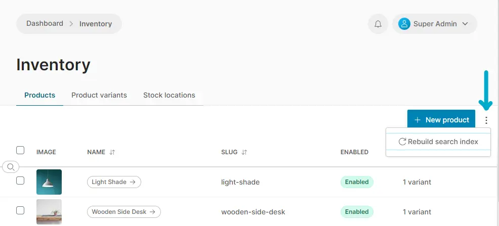

If you have hundreds, thousands or more products, inputting all the data by hand via the Admin UI can be too inefficient. To solve this, Vendure supports bulk-importing product and other data.

Data import is also useful for setting up test or demo environments, and is also used by the `@vendure/testing` package for end-to-end tests.

## Product Import Format

Vendure uses a flat **.csv** format for importing product data. The format encodes data about:

* products
* product variants
* product & variant assets
* product & variant facets
* product & variant custom fields

Here's an example which defines 2 products, "Laptop" and "Clacky Keyboard". The laptop has 4 variants, and the keyboard only a single variant. 

```csv
name            , slug            , description               , assets                      , facets                              , optionGroups    , optionValues , sku         , price   , taxCategory , stockOnHand , trackInventory , variantAssets , variantFacets
Laptop          , laptop          , "Description of laptop"   , laptop_01.jpg|laptop_02.jpg , category:electronics|brand:Apple    , screen size|RAM , 13 inch|8GB  , L2201308    , 1299.00 , standard    , 100         , false          ,               , 
                ,                 ,                           ,                             ,                                     ,                 , 15 inch|8GB  , L2201508    , 1399.00 , standard    , 100         , false          ,               , 
                ,                 ,                           ,                             ,                                     ,                 , 13 inch|16GB , L2201316    , 2199.00 , standard    , 100         , false          ,               , 
                ,                 ,                           ,                             ,                                     ,                 , 15 inch|16GB , L2201516    , 2299.00 , standard    , 100         , false          ,               , 
Clacky Keyboard , clacky-keyboard , "Description of keyboard" , keyboard_01.jpg             , category:electronics|brand:Logitech ,                 ,              , A4TKLA45535 , 74.89   , standard    , 100         , false          ,               ,
```

Here's an explanation of each column:

* `name`: The name of the product. Rows with an empty "name" are interpreted as variants of the preceeding product row.
* `slug`: The product's slug. Can be omitted, in which case will be generated from the name.
* `description`: The product description.
* `assets`: One or more asset file names separated by the pipe (`|`) character. The files can be located on the local file system, in which case the path is interpreted as being relative to the [`importAssetsDir`](/reference/typescript-api/import-export/import-export-options/#importassetsdir) as defined in the VendureConfig. Files can also be urls which will be fetched from a remote http/https url. If you need more control over how assets are imported, you can implement a custom [AssetImportStrategy](/reference/typescript-api/import-export/asset-import-strategy#assetimportstrategy). The first asset will be set as the featuredAsset.
* `facets`: One or more facets to apply to the product separated by the pipe (`|`) character. A facet has the format `<facet-name>:<facet-value>`.
* `optionGroups`: OptionGroups define what variants make up the product. Applies only to products with more than one variant. 
* `optionValues`: For each optionGroup defined, a corresponding value must be specified for each variant. Applies only to products with more than one variant.
* `sku`: The Stock Keeping Unit (unique product code) for this product variant.
* `price`: The price can be either with or without taxes, depending on your channel settings (can be set later).
* `taxCategory`: The name of an existing tax category. Tax categories can be also be imported using the InitialData object.
* `stockOnHand`: The number of units in stock.
* `trackInventory`: Whether this variant should have its stock level tracked, i.e. the stock level is automatically decreased for each unit ordered.
* `variantAssets`: Same as `assets` but applied to the product variant.
* `variantFacets`: Same as `facets` but applied to the product variant.

### Importing Custom Field Data

If you have [CustomFields](/guides/developer-guide/custom-fields/) defined on your Product or ProductVariant entities, this data can also be encoded in the import csv:

* `product:<customFieldName>`: The value of this column will populate `Product.customFields[customFieldName]`. 
* `variant:<customFieldName>`: The value of this column will populate `ProductVariant.customFields[customFieldName]`. 

:::info 
For a real example, see the [products.csv file used to populate the Vendure demo data](https://github.com/vendure-ecommerce/vendure/blob/master/packages/core/mock-data/data-sources/products.csv)
:::

#### Importing `relation` custom fields

To import custom fields with the type `relation`, the value in the CSV must be a stringified object with an `id` property:

```csv
... ,product:featuredReview
... ,"{ ""id"": 123 }"
```

#### Importing `list` custom fields

To import custom fields with `list` set to `true`, the data should be separated with a pipe (`|`) character:

```csv
... ,product:keywords
... ,tablet|pad|android
```

#### Importing data in multiple languages

If a field is translatable (i.e. of `localeString` type), you can use column names with an appended language code (e.g. `name:en`, `name:de`, `product:keywords:en`, `product:keywords:de`) to specify its value in multiple languages.

Use of language codes has to be consistent throughout the file. You don't have to translate every translatable field. If there are no translated columns for a field, the generic column's value will be used for all languages. But when you do translate columns, the set of languages for each of them needs to be the same. As an example, you cannot use `name:en` and `name:de`, but only provide `slug:en` (it's okay to use only a `slug` column though, in which case this slug will be used for both the English and the German version).

## Initial Data

As well as product data, other initialization data can be populated using the [`InitialData` object](/reference/typescript-api/import-export/initial-data/). **This format is intentionally limited**; more advanced requirements (e.g. setting up ShippingMethods that use custom checkers & calculators) should be carried out via [custom populate scripts](#populating-the-server).

```ts
import { InitialData, LanguageCode } from '@vendure/core';

export const initialData: InitialData = {
    paymentMethods: [
        {
            name: 'Standard Payment',
            handler: {
                code: 'dummy-payment-handler',
                arguments: [{ name: 'automaticSettle', value: 'false' }],
            },
        },
    ],
    roles: [
        {
            code: 'administrator',
            description: 'Administrator',
            permissions: [
                Permission.CreateCatalog,
                Permission.ReadCatalog,
                Permission.UpdateCatalog,
                Permission.DeleteCatalog,
                Permission.CreateSettings,
                Permission.ReadSettings,
                Permission.UpdateSettings,
                Permission.DeleteSettings,
                Permission.CreateCustomer,
                Permission.ReadCustomer,
                Permission.UpdateCustomer,
                Permission.DeleteCustomer,
                Permission.CreateCustomerGroup,
                Permission.ReadCustomerGroup,
                Permission.UpdateCustomerGroup,
                Permission.DeleteCustomerGroup,
                Permission.CreateOrder,
                Permission.ReadOrder,
                Permission.UpdateOrder,
                Permission.DeleteOrder,
                Permission.CreateSystem,
                Permission.ReadSystem,
                Permission.UpdateSystem,
                Permission.DeleteSystem,
            ],
        },
    ],
    defaultLanguage: LanguageCode.en,
    countries: [
        { name: 'Austria', code: 'AT', zone: 'Europe' },
        { name: 'Malaysia', code: 'MY', zone: 'Asia' },
        { name: 'United Kingdom', code: 'GB', zone: 'Europe' },
    ],
    defaultZone: 'Europe',
    taxRates: [
        { name: 'Standard Tax', percentage: 20 },
        { name: 'Reduced Tax', percentage: 10 },
        { name: 'Zero Tax', percentage: 0 },
    ],
    shippingMethods: [{ name: 'Standard Shipping', price: 500 }, { name: 'Express Shipping', price: 1000 }],
    collections: [
        {
            name: 'Electronics',
            filters: [
                {
                    code: 'facet-value-filter',
                    args: { facetValueNames: ['Electronics'], containsAny: false },
                },
            ],
            assetPaths: ['jakob-owens-274337-unsplash.jpg'],
        },
    ],
};
```

* `paymentMethods`: Defines which payment methods are available.
  * `name`: Name of the payment method.
  * `handler`: Payment plugin handler information.
* `roles`: Defines which user roles are available.
  * `code`: Role code name.
  * `description`: Role description.
  * `permissions`: List of permissions to apply to the role.
* `defaultLanguage`: Sets the language that will be used for all translatable entities created by the initial data e.g. Products, ProductVariants, Collections etc. Should correspond to the language used in your product csv file.
* `countries`: Defines which countries are available.
  * `name`: The name of the country in the language specified by `defaultLanguage`
  * `code`: A standardized code for the country, e.g. [ISO 3166-1](https://en.wikipedia.org/wiki/List_of_ISO_3166_country_codes)
  * `zone`: A [Zone](/reference/typescript-api/entities/zone) to which this country belongs.
* `defaultZone`: Sets the default shipping & tax zone for the default Channel. The zone must correspond to a value of `zone` set in the `countries` array. 
* `taxRates`: For each item, a new [TaxCategory](/reference/typescript-api/entities/tax-category/) is created, and then a [TaxRate](/reference/typescript-api/entities/tax-rate) is created for each unique zone defined in the `countries` array. 
* `shippingMethods`: Allows simple flat-rate [ShippingMethods](/reference/typescript-api/entities/shipping-method) to be defined.
* `collections`: Allows Collections to be created. Currently, only collections based on facet values can be created (`code: 'facet-value-filter'`). The `assetPaths` and `facetValueNames` values must correspond to a value specified in the products csv file. The name should match the value specified in the product csv file (or can be a normalized - lower-case & hyphenated - version thereof). If there are FacetValues in multiple Facets with the same name, the facet may be specified with a colon delimiter, e.g. `brand:apple`, `flavour: apple`.

## Populating The Server

### The `populate()` function
The `@vendure/core` package exposes a [`populate()` function](/reference/typescript-api/import-export/populate/) which can be used along with the data formats described above to populate your Vendure server:

```ts title="src/my-populate-script.ts"
import { bootstrap, DefaultJobQueuePlugin } from '@vendure/core';
import { populate } from '@vendure/core/cli';
import path from "path";

import { config } from './vendure-config';
import { initialData } from './my-initial-data';

const productsCsvFile = path.join(__dirname, 'path/to/products.csv')

const populateConfig = {
    ...config,
    plugins: (config.plugins || []).filter(
        // Remove your JobQueuePlugin during populating to avoid
        // generating lots of unnecessary jobs as the Collections get created.
        plugin => plugin !== DefaultJobQueuePlugin,
    ),
}

populate(
    () => bootstrap(populateConfig),
    initialData,
    productsCsvFile,
    'my-channel-token' // optional - used to assign imported 
)                      // entities to the specified Channel

    .then(app => {
        return app.close();
    })
    .then(
        () => process.exit(0),
        err => {
            console.log(err);
            process.exit(1);
        },
    );
```

:::note
When removing the `DefaultJobQueuePlugin` from the plugins list as in the code snippet above, one should manually rebuild the search index in order for the newly added products to appear.
In the Admin UI, this can be done by navigating to the product list view and clicking the three icon next to the search input:


:::

### Populating test data

When installing with @vendure/create, you have the option of populating test data (products, payment methods, countries, zones, tax rates etc).

This guide illustrates how to populate that test data again on an existing Vendure installation, without needing to re-install from scratch.

1. `npm install --save-dev @vendure/create`. This installs the "create" package, which contains the test data we will need.
2. drop all tables from your database, but leave the actual database there.
3. create a script that looks like this:

```ts title="src/populate-test-data.ts"
import { populate } from '@vendure/core/cli';
import { bootstrap, VendureConfig } from '@vendure/core';
import { config } from './vendure-config';

populate(
    () => bootstrap({
        ...config,
        importExportOptions: {
            importAssetsDir: path.join(
                require.resolve('@vendure/create/assets/products.csv'),
                '../images'
            ),
        },
        dbConnectionOptions: {...config.dbConnectionOptions, synchronize: true}
    }),
    require('@vendure/create/assets/initial-data.json'),
    require.resolve('@vendure/create/assets/products.csv')
)
    .then(app => app.close())
    .catch(err => {
        console.log(err);
        process.exit(1);
    });
```

Running this script will populate the database with the test data like when you first installed Vendure.

### Custom populate scripts

If you require more control over how your data is being imported - for example if you also need to import data into custom entities, or import customer or order information - you can create your own CLI script to do this: see [Stand-Alone CLI Scripts](/guides/developer-guide/stand-alone-scripts/).

In addition to all the services available in the [Service Layer](/guides/developer-guide/the-service-layer/), the following specialized import services are available:

* [`ImportParser`](/reference/typescript-api/import-export/import-parser): Used to parse the CSV file into an array of objects.
* [`FastImporterService`](/reference/typescript-api/import-export/fast-importer-service): Used to create new products & variants in bulk, optimized for speed.
* [`Populator`](/reference/typescript-api/import-export/populator): Used to populate the initial data.
* [`AssetImporter`](/reference/typescript-api/import-export/asset-importer): Creates new Assets in bulk, using the configured [`AssetImportStrategy`](/reference/typescript-api/import-export/asset-import-strategy).
* [`Importer`](/reference/typescript-api/import-export/importer/): Uses all of the above services in combination - this is the basis of the `populate()` function described above.

Using these specialized import services is preferable to using the normal service-layer services (`ProductService`, `ProductVariantService` etc.) for bulk imports. This is because these import services are optimized for bulk imports (they omit unnecessary checks, use optimized SQL queries) and also do not publish events when creating new entities.

However, it is still possible to use the normal service-layer services if you prefer. For example, the following code snippet shows how to create a new ProductVariant using the `ProductVariantService`:

## Importing from other platforms

If you are migrating from another platform, you can create a custom import script to import your data into Vendure.

Your existing platform may provide an API which you can use to fetch the data, or it may provide a mechanism for exporting
the data to a file.

Therefore, you have a couple of options:

1. Export the data to a file, and then transform this into the Vendure CSV format for import as above.
2. Write a script which import the data via the other platform's API, and then import this data into Vendure using the services described above, or any other of the Vendure core services.

The first option is the simplest, but may not be possible if the other platform does not provide a suitable export format.

The second option is more complex, but allows for more flexibility and can be used to import data from any source, as well as allowing the import of other data such as customer and order information.

As an illustrative example, let's imagine we are migrating away from an imaginary commerce platform, "OldCommerce", and we want to import our data into Vendure.

Luckily, OldCommerce provides a client package which allows us to easily interact with their API.

:::note
This is a much-simplified example, but it should serve to illustrate the general approach.
:::

```ts title="src/import-from-other-platform.ts"
import { INestApplicationContext } from '@nestjs/common';
import {
    bootstrapWorker,
    ConfigService,
    Importer,
    LanguageCode,
    ParsedProductWithVariants,
    RequestContext, RequestContextService,
    TransactionalConnection, User,
    SearchService,
} from '@vendure/core';
import { createClient, OldCommerceProduct } from '@old-commerce/client';

import { config } from './vendure-config';

if (require.main === module) {
    importData().then(
        () => process.exit(0),
        err => {
            console.log(err);
            process.exit(1);
        },
    );
}

async function importData() {
    // We use the bootstrapWorker() function instead of bootstrap() because we don't 
    // need to start the server, we just need access to the services.
    const {app} = await bootstrapWorker(config);

    // Create an instace of the client we'll be using to interact with the
    // OldCommerce API
    const client = createClient({
        // OldCommerce client config
    });

    // Let's grab a reference to each of the Vendure services we'll need.
    const importer = app.get(Importer);

    // Most service methods require a RequestContext, so we'll create one here.
    const ctx = await getSuperadminContext(app);

    // To reindex after importing products
    const searchService = app.get(SearchService);

    // Fetch all the products to import from the OldCommerce API
    const productsToImport: OldCommerceProduct[] = await client.getAllProducts();

    // Transform the OldCommerce products into the format expected by the Importer
    const importRows: ParsedProductWithVariants[] = productsToImport.map(product => ({
        product: {
            translations: [
                {
                    languageCode: LanguageCode.en,
                    name: product.name,
                    slug: product.slug,
                    description: product.description,
                    customFields: {},
                },
            ],
            assetPaths: product.images.map(image => image.sourceUrl),
            facets: [],
            optionGroups: product.options.map(option => ({
                translations: [
                    {
                        languageCode: LanguageCode.en,
                        name: option.name,
                        values: option.values.map(value => value.name),
                    },
                ],
            })),
        },
        variants: product.variations.map(variation => {
            const optionValues = variation.options.map(option => option.value);
            return {
                sku: variation.productCode,
                price: variation.price,
                stockOnHand: variation.stock,
                translations: [{languageCode: LanguageCode.en, optionValues}],
            };
        }),
    }));

    // Import the products
    await importer.importProducts(ctx, importRows, progress => {
        console.log(`Imported ${progress.imported} of ${importRows.length} products`);
    });

    // Rebuild search index 
    await searchService.reindex(ctx);

    // Close the app
    await app.close();
}

/**
 * Creates a RequestContext configured for the default Channel with the activeUser set
 * as the superadmin user.
 */
export async function getSuperadminContext(app: INestApplicationContext): Promise<RequestContext> {
    const {superadminCredentials} = app.get(ConfigService).authOptions;
    const superAdminUser = await app.get(TransactionalConnection)
        .getRepository(User)
        .findOneOrFail({where: {identifier: superadminCredentials.identifier}});
    return app.get(RequestContextService).create({
        apiType: 'admin',
        user: superAdminUser,
    });
}
```
