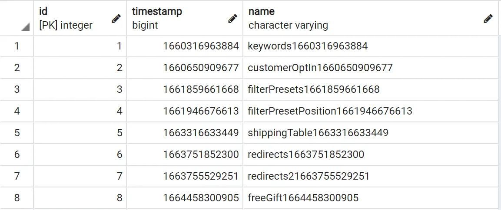

import Tabs from '@theme/Tabs';
import TabItem from '@theme/TabItem';

Database migrations are needed whenever the database schema changes. This can be caused by:

* changes to the [custom fields](/guides/developer-guide/custom-fields/) configuration
* new [database entities defined by plugins](/guides/developer-guide/database-entity/)
* occasional changes to the core Vendure database schema when updating to newer versions

## Synchronize vs migrate

TypeORM (which Vendure uses to interact with the database) has a `synchronize` option which, when set to `true`, will automatically update your database schema to reflect the current Vendure configuration. This is equivalent to automatically generating and running a migration _every time_ the server starts up.

This is convenient while developing, but **should not be used in production**, since a misconfiguration could potentially delete production data. In this case, migrations should be used.

```ts title="src/vendure-config.ts"
import { VendureConfig } from '@vendure/core';

export const config: VendureConfig = {
    // ...
    dbConnectionOptions: {
        // ...
        // highlight-next-line
        synchronize: false,
    }
};
```

## Migration workflow

This section assumes a standard Vendure installation based on `@vendure/create`. 

Let's assume you have defined a new "keywords" custom field on the Product entity. The next time you start your server you'll see a message like this:

```bash
[server] Your database schema does not match your current configuration. Generate a new migration for the following changes:
[server]  - ALTER TABLE "product" ADD "customFieldsKeywords" character varying(255)
```

Since we have `synchronize` set to `false`, we need to generate a migration to apply these changes to the database. The workflow for this is as follows:

### 1. Generate a migration

:::cli
Run `npx vendure migrate` and select "Generate a new migration"
:::

### 2. Check the migration file

This will have created a new migration file in the `src/migrations` directory. Open this file and check that it looks correct. It should look something like this:

```ts title="src/migrations/1690558104092-add-keywords-field.ts"
import {MigrationInterface, QueryRunner} from "typeorm";

export class addKeywordsField1690558104092 implements MigrationInterface {

   public async up(queryRunner: QueryRunner): Promise<any> {
        await queryRunner.query(`ALTER TABLE "product" ADD "customFieldsKeywords" character varying(255)`, undefined);
   }

   public async down(queryRunner: QueryRunner): Promise<any> {
        await queryRunner.query(`ALTER TABLE "product" DROP COLUMN "customFieldsKeywords"`, undefined);
   }

}
```

The `up()` function is what will be executed when the migration is run. The `down()` function is what will be executed if the migration is reverted. In this case, the `up()` function is adding a new column to the `product` table, and the `down()` function is removing it.

:::note
The exact query will depend on the database you are using. The above example is for PostgreSQL.
:::

### 3. Run the migration

Assuming the migration file looks correct, the next time you start the server, the migration will
be run automatically. This is because the `runMigrations` function is called in the `src/index.ts` file:

```ts title="src/index.ts"
import { bootstrap, runMigrations } from '@vendure/core';
import { config } from './vendure-config';

// highlight-next-line
runMigrations(config)
    .then(() => bootstrap(config))
    .catch(err => {
        console.log(err);
    });
```

It is also possible to run the migration manually without starting the server:

:::cli
Run `npx vendure migrate` and select "Run pending migrations"
:::

:::caution
TypeORM will attempt to run each migration inside a transaction. This means that if one of the migration commands fails, then the entire transaction will be rolled back to its original state.

_However_ this is **not supported by MySQL / MariaDB**. This means that when using MySQL or MariaDB, errors in your migration script could leave your database in a broken or inconsistent state. Therefore it is **critical** that you first create a backup of your database before running a migration.

You can read more about this issue in [typeorm/issues/7054](https://github.com/typeorm/typeorm/issues/7054)
:::

## Migrations in-depth

Now we'll dive into what's going on under the hood.

Vendure exposes a some helper function which wrap around the underlying [TypeORM migration functionality](https://typeorm.io/migrations). The 
reason for using these helper functions rather than using the TypeORM CLI directly is that Vendure generates additional 
schema information based on custom fields and plugin configurations which are not available to the TypeORM CLI.

In a standard Vendure installation prior to v2.2.0, you'll see the following migration script in your project root directory.
Running the `vendure migrate` command also uses a very similar script internally.

```ts title="migration.ts"
import { generateMigration, revertLastMigration, runMigrations } from '@vendure/core';
import program from 'commander';

import { config } from './src/vendure-config';

program
    .command('generate <name>')
    .description('Generate a new migration file with the given name')
    .action(name => {
        return generateMigration(config, { name, outputDir: './src/migrations' });
    });

program
    .command('run')
    .description('Run all pending migrations')
    .action(() => {
        return runMigrations(config);
    });

program
    .command('revert')
    .description('Revert the last applied migration')
    .action(() => {
        return revertLastMigration(config);
    });

program.parse(process.argv);
```

and a set of scripts in your `package.json` file:

```json
{
  // ...
  "scripts": {
    "migration:generate": "ts-node migration.ts generate",
    "migration:run": "ts-node migration.ts run",
    "migration:revert": "ts-node migration.ts revert"
  }
}
```

When running and reverting migrations, Vendure is looking for migration files in the directory specified by the `dbConnectionOptions.migrations` option is set in your VendureConfig:

```ts title="src/vendure-config.ts"
import { VendureConfig } from '@vendure/core';
import path from 'path';

export const config: VendureConfig = {
    // ...
    dbConnectionOptions: {
        // ...
        // highlight-next-line
        migrations: [path.join(__dirname, './migrations/*.+(js|ts)')],
    }
};
```

TypeORM keeps track of which migrations have been run by creating a new `migrations` table in your database, and each time a migration is successfully run
it adds a row to this table with the name of the migration class and a timestamp. This prevents the same migration from being run twice, and also allows
TypeORM to know which migration to revert when the `revertLastMigration` function is called.



These are the underlying function exposed by Vendure which are used to generate, run and revert migrations:

- [`generateMigration` function](/reference/typescript-api/migration/generate-migration/)
- [`runMigrations` function](/reference/typescript-api/migration/run-migrations/)
- [`revertLastMigration` function](/reference/typescript-api/migration/revert-last-migration/)

### Reverting a migration

The `revertLastMigration` function will revert the last applied migration by applying the `down()` method. If run again it will then revert the one before that, and so on.
In doing so, it will also remove the corresponding row from the `migrations` table.

