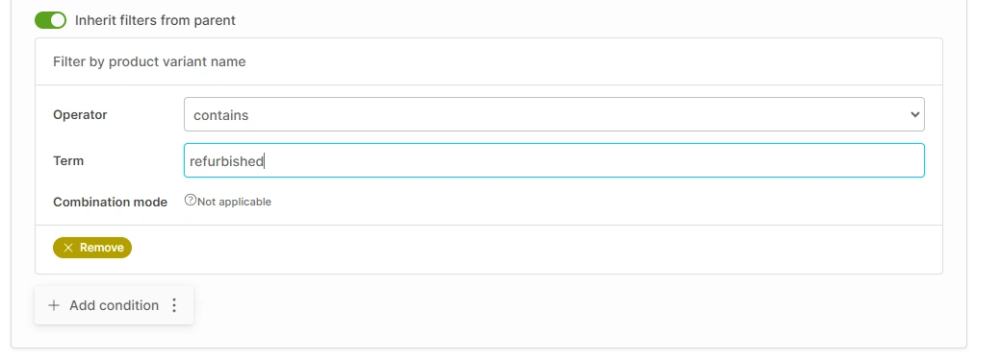

Vendure is built to be highly configurable and extensible. Two methods of providing this extensibility are **strategies** and **configurable operations**.

## Strategies

A strategy is named after the [Strategy Pattern](https://en.wikipedia.org/wiki/Strategy_pattern), and is a way of providing
a pluggable implementation of a particular feature. Vendure makes heavy use of this pattern to delegate the implementation
of key points of extensibility to the developer.

Examples of strategies include:

- [`OrderCodeStrategy`](/reference/typescript-api/orders/order-code-strategy/) - determines how order codes are generated
- [`StockLocationStrategy`](/reference/typescript-api/products-stock/stock-location-strategy/) - determines which stock locations are used to fulfill an order
- [`ActiveOrderStrategy`](/reference/typescript-api/orders/active-order-strategy/) - determines how the active order in the Shop API is selected
- [`AssetStorageStrategy`](/reference/typescript-api/assets/asset-storage-strategy/) - determines where uploaded assets are stored
- [`GuestCheckoutStrategy`](/reference/typescript-api/orders/guest-checkout-strategy/) - defines rules relating to guest checkouts
- [`OrderItemPriceCalculationStrategy`](/reference/typescript-api/orders/order-item-price-calculation-strategy/) - determines how items are priced when added to the order
- [`TaxLineCalculationStrategy`](/reference/typescript-api/tax/tax-line-calculation-strategy/) - determines how tax is calculated for an order line

As an example, let's take the [`OrderCodeStrategy`](/reference/typescript-api/orders/order-code-strategy/). This strategy
determines how codes are generated when new orders are created. By default, Vendure will use the built-in `DefaultOrderCodeStrategy`
which generates a random 16-character string.

What if you need to change this behavior? For instance, you might have an existing back-office system that is responsible
for generating order codes, which you need to integrate with. Here's how you would do this:

```ts title="src/config/my-order-code-strategy.ts"
import { OrderCodeStrategy, RequestContext } from '@vendure/core';
import { OrderCodeService } from '../services/order-code.service';

export class MyOrderCodeStrategy implements OrderCodeStrategy {

    private orderCodeService: OrderCodeService;

    init(injector) {
        this.orderCodeService = injector.get(OrderCodeService);
    }

    async generate(ctx: RequestContext): string {
        return this.orderCodeService.getNewOrderCode();
    }
}
```

:::info

All strategies can make use of existing services by using the `init()` method. This is because all strategies
extend the underlying [`InjectableStrategy` interface](/reference/typescript-api/common/injectable-strategy). In
this example we are assuming that we already created an `OrderCodeService` which contains all the specific logic for
connecting to our backend service which generates the order codes.

:::

We then need to pass this custom strategy to our config:

```ts title="src/vendure-config.ts"
import { VendureConfig } from '@vendure/core';
import { MyOrderCodeStrategy } from '../config/my-order-code-strategy';

export const config: VendureConfig = {
    // ...
    orderOptions: {
        // highlight-next-line
        orderCodeStrategy: new MyOrderCodeStrategy(),
    },
}
```

### Strategy lifecycle

Strategies can use two optional lifecycle methods:

- `init(injector: Injector)` - called during the bootstrap phase when the server or worker is starting up.
This is where you can inject any services which you need to use in the strategy. You can also perform any other setup logic
needed, such as instantiating a connection to an external service.
- `destroy()` - called during the shutdown of the server or worker. This is where you can perform any cleanup logic, such as
closing connections to external services.

### Passing options to a strategy

Sometimes you might want to pass some configuration options to a strategy.
For example, imagine you want to create a custom [`StockLocationStrategy`](/reference/typescript-api/products-stock/stock-location-strategy/) which
selects a location within a given proximity to the customer's address. You might want to pass the maximum distance to the strategy
in your config:

```ts title="src/vendure-config.ts"
import { VendureConfig } from '@vendure/core';
import { MyStockLocationStrategy } from '../config/my-stock-location-strategy';

export const config: VendureConfig = {
    // ...
    catalogOptions: {
        // highlight-next-line
        stockLocationStrategy: new MyStockLocationStrategy({ maxDistance: 100 }),
    },
}
```

This config will be passed to the strategy's constructor:

```ts title="src/config/my-stock-location-strategy.ts"
import  { ID, ProductVariant, RequestContext, StockLevel, StockLocationStrategy } from '@vendure/core';

export class MyStockLocationStrategy implements StockLocationStrategy {

    constructor(private options: { maxDistance: number }) {}

    getAvailableStock(
        ctx: RequestContext,
        productVariantId: ID,
        stockLevels: StockLevel[]
    ): ProductVariant[] {
        const maxDistance = this.options.maxDistance;
        // ... implementation omitted
    }
}
```

## Configurable Operations

Configurable operations are similar to strategies in that they allow certain aspects of the system to be customized. However,
the main difference is that they can also be _configured_ via the Admin UI. This allows the store owner to make changes to the
behavior of the system without having to restart the server.

So they are typically used to supply some custom logic that needs to accept configurable arguments which can change
at runtime.

Vendure uses the following configurable operations:

- [`CollectionFilter`](/reference/typescript-api/configuration/collection-filter/) - determines which products are included in a collection
- [`PaymentMethodHandler`](/reference/typescript-api/payment/payment-method-handler/) - determines how payments are processed
- [`PromotionCondition`](/reference/typescript-api/promotions/promotion-condition/) - determines whether a promotion is applicable
- [`PromotionAction`](/reference/typescript-api/promotions/promotion-action/) - determines what happens when a promotion is applied
- [`ShippingEligibilityChecker`](/reference/typescript-api/shipping/shipping-eligibility-checker/) - determines whether a shipping method is available
- [`ShippingCalculator`](/reference/typescript-api/shipping/shipping-calculator/) - determines how shipping costs are calculated

Whereas strategies are typically used to provide a single implementation of a particular feature, configurable operations
are used to provide a set of implementations which can be selected from at runtime.

For example, Vendure ships with a set of default CollectionFilters:

```ts title="default-collection-filters.ts"
export const defaultCollectionFilters = [
    facetValueCollectionFilter,
    variantNameCollectionFilter,
    variantIdCollectionFilter,
    productIdCollectionFilter,
];
```

When setting up a Collection, you can choose from these available default filters:


When one is selected, the UI will allow you to configure the arguments for that filter:



Let's take a look at a simplified implementation of the `variantNameCollectionFilter`:

```ts title="variant-name-collection-filter.ts"
import { CollectionFilter, LanguageCode } from '@vendure/core';

export const variantNameCollectionFilter = new CollectionFilter({
    args: {
        operator: {
            type: 'string',
            ui: {
                component: 'select-form-input',
                options: [
                    { value: 'startsWith' },
                    { value: 'endsWith' },
                    { value: 'contains' },
                    { value: 'doesNotContain' },
                ],
            },
        },
        term: { type: 'string' },
    },
    code: 'variant-name-filter',
    description: [{ languageCode: LanguageCode.en, value: 'Filter by product variant name' }],
    apply: (qb, args) => {
        // ... implementation omitted
    },
});
```

Here are the important parts:

- Configurable operations are **instances** of a pre-defined class, and are instantiated before being passed to your config.
- They must have a `code` property which is a unique string identifier.
- They must have a `description` property which is a localizable, human-readable description of the operation.
- They must have an `args` property which defines the arguments which can be configured via the Admin UI. If the operation has no arguments,
then this would be an empty object.
- They will have one or more methods that need to be implemented, depending on the type of operation. In this case, the `apply()` method
is used to apply the filter to the query builder.

### Configurable operation args

The `args` property is an object which defines the arguments which can be configured via the Admin UI. Each property of the `args`
object is a key-value pair, where the key is the name of the argument, and the value is an object which defines the type of the argument
and any additional configuration.

As an example let's look at the `dummyPaymentMethodHandler`, a test payment method which we ship with Vendure core:

```ts title="dummy-payment-method.ts"
import { PaymentMethodHandler, LanguageCode } from '@vendure/core';

export const dummyPaymentHandler = new PaymentMethodHandler({
    code: 'dummy-payment-handler',
    description: [/* omitted for brevity */],
    args: {
        automaticSettle: {
            type: 'boolean',
            label: [
                {
                    languageCode: LanguageCode.en,
                    value: 'Authorize and settle in 1 step',
                },
            ],
            description: [
                {
                    languageCode: LanguageCode.en,
                    value: 'If enabled, Payments will be created in the "Settled" state.',
                },
            ],
            required: true,
            defaultValue: false,
        },
    },
    createPayment: async (ctx, order, amount, args, metadata, method) => {
        // Inside this method, the `args` argument is type-safe and will be
        // an object with the following shape:
        // {
        //   automaticSettle: boolean
        // }

        // ... implementation omitted
    },
})
```

The following properties are used to configure the argument:

#### type

<span class="badge badge--primary">Required</span>

[`ConfigArgType`](/reference/typescript-api/configurable-operation-def/config-arg-type)

The following types are available: `string`, `int`, `float`, `boolean`, `datetime`, `ID`.

#### label

<span class="badge badge--secondary">Optional</span>

[`LocalizedStringArray`](/reference/typescript-api/configurable-operation-def/localized-string-array/)

A human-readable label for the argument. This is used in the Admin UI.

#### description

<span class="badge badge--secondary">Optional</span>

[`LocalizedStringArray`](/reference/typescript-api/configurable-operation-def/localized-string-array/)

A human-readable description for the argument. This is used in the Admin UI as a tooltip.

#### required

<span class="badge badge--secondary">Optional</span>

`boolean`

Whether the argument is required. If `true`, then the Admin UI will not allow the user to save the configuration
unless a value has been provided for this argument.

#### defaultValue

<span class="badge badge--secondary">Optional</span>

`any` (depends on the `type`)

The default value for the argument. If not provided, then the argument will be `undefined` by default.

#### list

<span class="badge badge--secondary">Optional</span>

`boolean`

Whether the argument is a list of values. If `true`, then the Admin UI will allow the user to add multiple values
for this argument. Defaults to `false`.

#### ui

<span class="badge badge--secondary">Optional</span>

Allows you to specify the UI component that will be used to render the argument in the Admin UI, by specifying
a `component` property, and optional properties to configure that component.

```ts
{
    args: {
        operator: {
            type: 'string',
            ui: {
                component: 'select-form-input',
                options: [
                    { value: 'startsWith' },
                    { value: 'endsWith' },
                    { value: 'contains' },
                    { value: 'doesNotContain' },
                ],
            },
        },
    }
}
```

A full description of the available UI components can be found in the [Custom Fields guide](/guides/developer-guide/custom-fields/#custom-field-ui).

### Injecting dependencies

Configurable operations are instantiated before being passed to your config, so the mechanism for injecting dependencies
is similar to that of strategies: namely you use an optional `init()` method to inject dependencies into the operation instance.

The main difference is that the injected dependency cannot then be stored as a class property, since you are not defining
a class when you define a configurable operation. Instead, you can store the dependency as a closure variable.

Here’s an example of a ShippingCalculator that injects a service which has been defined in a plugin:

```ts title="src/config/custom-shipping-calculator.ts"
import { Injector, ShippingCalculator } from '@vendure/core';
import { ShippingRatesService } from './shipping-rates.service';

// We keep reference to our injected service by keeping it
// in the top-level scope of the file.
let shippingRatesService: ShippingRatesService;

export const customShippingCalculator = new ShippingCalculator({
    code: 'custom-shipping-calculator',
    description: [],
    args: {},

    init(injector: Injector) {
        // The init function is called during bootstrap, and allows
        // us to inject any providers we need.
        shippingRatesService = injector.get(ShippingRatesService);
    },

    calculate: async (order, args) => {
        // We can now use the injected provider in the business logic.
        const { price, priceWithTax } = await shippingRatesService.getRate({
            destination: order.shippingAddress,
            contents: order.lines,
        });

        return {
            price,
            priceWithTax,
        };
    },
});
```


