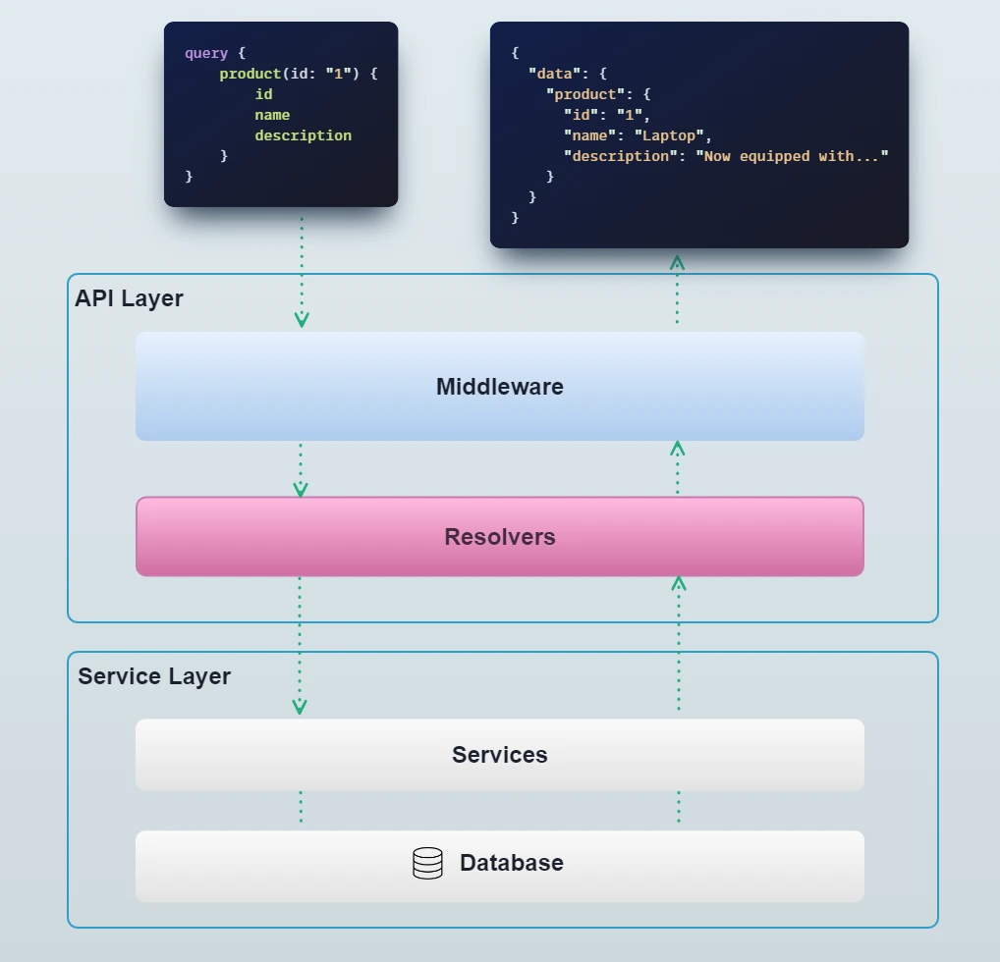

The service layer is the core of the application. This is where the business logic is implemented, and where
the application interacts with the database. When a request comes in to the API, it gets routed to a resolver
which then calls a service method to perform the required operation.



:::info
Services are classes which, in NestJS terms, are [providers](https://docs.nestjs.com/providers#services). They
follow all the rules of NestJS providers, including dependency injection, scoping, etc.
:::

Services are generally scoped to a specific domain or entity. For instance, in the Vendure core, there is a [`Product` entity](/reference/typescript-api/entities/product),
and a corresponding [`ProductService`](/reference/typescript-api/services/product-service) which contains all the methods for interacting with products.

Here's a simplified example of a `ProductService`, including an implementation of the `findOne()` method that was
used in the example in the [previous section](/guides/developer-guide/the-api-layer/#resolvers):

```ts title="src/services/product.service.ts"
import { Injectable } from '@nestjs/common';
import { IsNull } from 'typeorm';
import { ID, Product, RequestContext, TransactionalConnection, TranslatorService } from '@vendure/core';

@Injectable()
export class ProductService {

    constructor(private connection: TransactionalConnection,
                private translator: TranslatorService){}

    /**
     * @description
     * Returns a Product with the given id, or undefined if not found.
     */
    async findOne(ctx: RequestContext, productId: ID): Promise<Product | undefined> {
        const product = await this.connection.findOneInChannel(ctx, Product, productId, ctx.channelId, {
            where: {
                deletedAt: IsNull(),
            },
        });
        if (!product) {
            return;
        }
        return this.translator.translate(product, ctx);
    }

    // ... other methods
    findMany() {}
    create() {}
    update() {}
}
```

- The `@Injectable()` decorator is a [NestJS](https://docs.nestjs.com/providers#services) decorator which allows the service
    to be injected into other services or resolvers.
- The `constructor()` method is where the dependencies of the service are injected. In this case, the `TransactionalConnection`
    is used to access the database, and the `TranslatorService` is used to translate the Product entity into the current
    language.

## Using core services

All the internal Vendure services can be used in your own plugins and scripts. They are listed in the [Services API reference](/reference/typescript-api/services/) and
can be imported from the `@vendure/core` package.

To make use of a core service in your own plugin, you need to ensure your plugin is importing the `PluginCommonModule` and
then inject the desired service into your own service's constructor:

```ts title="src/my-plugin/my.plugin.ts"
import { PluginCommonModule, VendurePlugin } from '@vendure/core';
import { MyService } from './services/my.service';

@VendurePlugin({
    // highlight-start
    imports: [PluginCommonModule],
    providers: [MyService],
    // highlight-end
})
export class MyPlugin {}
```

```ts title="src/my-plugin/services/my.service.ts"
import { Injectable } from '@nestjs/common';
import { ProductService } from '@vendure/core';

@Injectable()
export class MyService {

    // highlight-next-line
    constructor(private productService: ProductService) {}

    // you can now use the productService methods
}
```

## Accessing the database

One of the main responsibilities of the service layer is to interact with the database. For this, you will be using
the [`TransactionalConnection` class](/reference/typescript-api/data-access/transactional-connection/), which is a wrapper
around the [TypeORM `DataSource` object](https://typeorm.io/data-source-api). The primary purpose of the `TransactionalConnection`
is to ensure that database operations can be performed within a transaction (which is essential for ensuring data integrity), even
across multiple services. Furthermore, it exposes some helper methods which make it easier to perform common operations.

:::info

Always pass the `RequestContext` (`ctx`) to the `TransactionalConnection` methods. This ensures the operation occurs within
any active transaction.

:::

There are two primary APIs for accessing data provided by TypeORM: the **Find API** and the **QueryBuilder API**.

### The Find API

This API is the most convenient and type-safe way to query the database. It provides a powerful type-safe way to query
including support for eager relations, pagination, sorting, filtering and more.

Here are some examples of using the Find API:

```ts title="src/services/item.service.ts"
import { Injectable } from '@nestjs/common';
import { ID, RequestContext, TransactionalConnection } from '@vendure/core';
import { IsNull } from 'typeorm';
import { Item } from '../entities/item.entity';

@Injectable()
export class ItemService {

    constructor(private connection: TransactionalConnection) {}

    findById(ctx: RequestContext, itemId: ID): Promise<Item | null> {
        return this.connection.getRepository(ctx, Item).findOne({
            where: { id: itemId },
        });
    }

    findByName(ctx: RequestContext, name: string): Promise<Item | null> {
        return this.connection.getRepository(ctx, Item).findOne({
            where: {
                // Multiple where clauses can be specified,
                // which are joined with AND
                name,
                deletedAt: IsNull(),
            },
        });
    }

    findWithRelations() {
        return this.connection.getRepository(ctx, Item).findOne({
            where: { name },
            relations: {
                // Join the `item.customer` relation
                customer: true,
                product: {
                    // Here we are joining a nested relation `item.product.featuredAsset`
                    featuredAsset: true,
                },
            },
        });
    }

    findMany(ctx: RequestContext): Promise<Item[]> {
        return this.connection.getRepository(ctx, Item).find({
            // Pagination
            skip: 0,
            take: 10,
            // Sorting
            order: {
                name: 'ASC',
            },
        });
    }
}
```

:::info

Further examples can be found in the [TypeORM Find Options documentation](https://typeorm.io/find-options).

:::

### The QueryBuilder API

When the Find API is not sufficient, the QueryBuilder API can be used to construct more complex queries. For instance,
if you want to have a more complex `WHERE` clause than what can be achieved with the Find API, or if you want to perform
sub-queries, then the QueryBuilder API is the way to go.

Here are some examples of using the QueryBuilder API:

```ts title="src/services/item.service.ts"
import { Injectable } from '@nestjs/common';
import { ID, RequestContext, TransactionalConnection } from '@vendure/core';
import { Brackets, IsNull } from 'typeorm';
import { Item } from '../entities/item.entity';

@Injectable()
export class ItemService {

    constructor(private connection: TransactionalConnection) {}

    findById(ctx: RequestContext, itemId: ID): Promise<Item | null> {
        // This is simple enough that you should prefer the Find API,
        // but here is how it would be done with the QueryBuilder API:
        return this.connection.getRepository(ctx, Item).createQueryBuilder('item')
            .where('item.id = :id', { id: itemId })
            .getOne();
    }

    findManyWithSubquery(ctx: RequestContext, name: string) {
        // Here's a more complex query that would not be possible using the Find API:
        return this.connection.getRepository(ctx, Item).createQueryBuilder('item')
            .where('item.name = :name', { name })
            .andWhere(
                new Brackets(qb1 => {
                    qb1.where('item.state = :state1', { state1: 'PENDING' })
                       .orWhere('item.state = :state2', { state2: 'RETRYING' });
                }),
            )
            .orderBy('item.createdAt', 'ASC')
            .getMany();
    }
}
```

:::info

Further examples can be found in the [TypeORM QueryBuilder documentation](https://typeorm.io/select-query-builder).

:::

### Working with relations

One limitation of TypeORM's typings is that we have no way of knowing at build-time whether a particular relation will be
joined at runtime. For instance, the following code will build without issues, but will result in a runtime error:

```ts
const product = await this.connection.getRepository(ctx, Product).findOne({
    where: { id: productId },
});
if (product) {
    // highlight-start
    console.log(product.featuredAsset.preview);
    // ^ Error: Cannot read property 'preview' of undefined
    // highlight-end
}
```

This is because the `featuredAsset` relation is not joined by default. The simple fix for the above example is to use
the `relations` option:

```ts
const product = await this.connection.getRepository(ctx, Product).findOne({
    where: { id: productId },
    // highlight-next-line
    relations: { featuredAsset: true },
});
```
or in the case of the QueryBuilder API, we can use the `leftJoinAndSelect()` method:

```ts
const product = await this.connection.getRepository(ctx, Product).createQueryBuilder('product')
    // highlight-next-line
    .leftJoinAndSelect('product.featuredAsset', 'featuredAsset')
    .where('product.id = :id', { id: productId })
    .getOne();
```

### Using the EntityHydrator

But what about when we do not control the code which fetches the entity from the database? For instance, we might be implementing
a function which gets an entity passed to it by Vendure. In this case, we can use the [`EntityHydrator`](/reference/typescript-api/data-access/entity-hydrator/)
to ensure that a given relation is "hydrated" (i.e. joined) before we use it:

```ts
import { EntityHydrator, ShippingCalculator } from '@vendure/core';

let entityHydrator: EntityHydrator;

const myShippingCalculator = new ShippingCalculator({
    // ... rest of config omitted for brevity
    init(injector) {
        entityHydrator = injector.get(EntityHydrator);
    },
    calculate: (ctx, order, args) => {
      // highlight-start
      // ensure that the customer and customer.groups relations are joined
      await entityHydrator.hydrate(ctx, order, { relations: ['customer.groups' ]});
      // highlight-end

      if (order.customer?.groups?.some(g => g.name === 'VIP')) {
        // ... do something special for VIP customers
      } else {
        // ... do something else
      }
    },
});
```

### Joining relations in built-in service methods

Many of the core services allow an optional `relations` argument in their `findOne()` and `findMany()` and related methods.
This allows you to specify which relations should be joined when the query is executed. For instance, in the [`ProductService`](/reference/typescript-api/services/product-service)
there is a `findOne()` method which allows you to specify which relations should be joined:

```ts
const productWithAssets = await this.productService
    .findOne(ctx, productId, ['featuredAsset', 'assets']);
```

