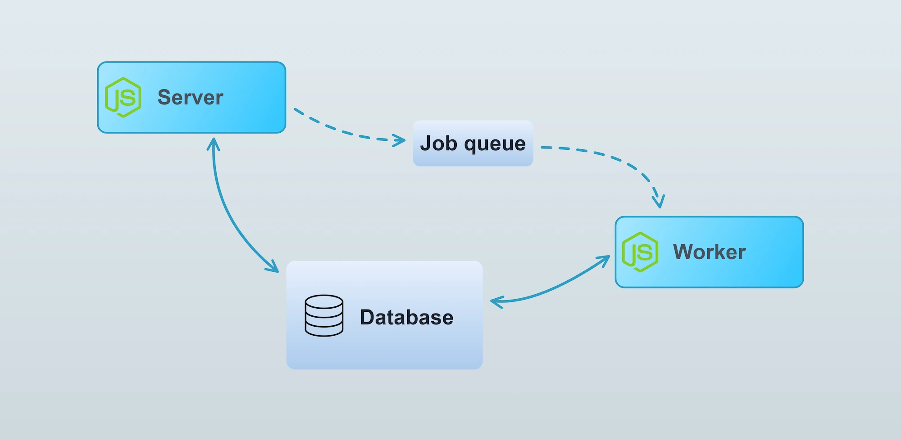
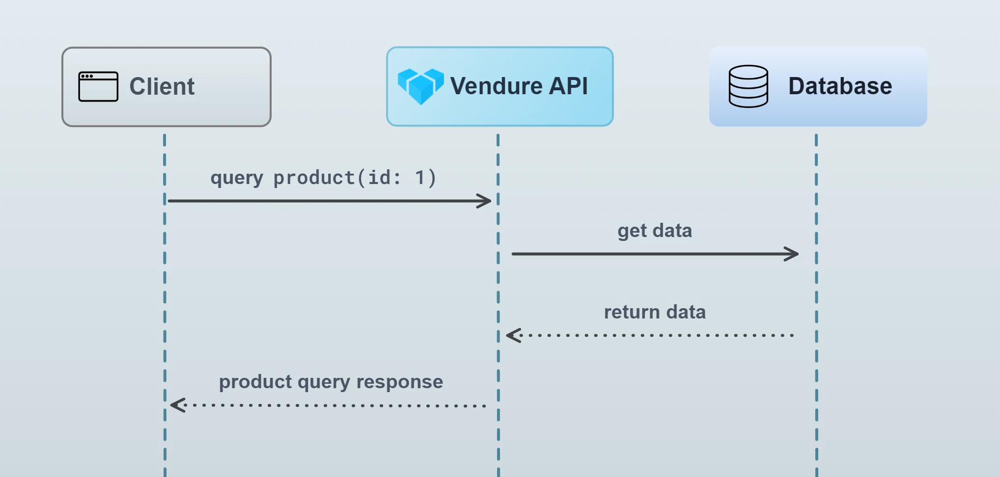
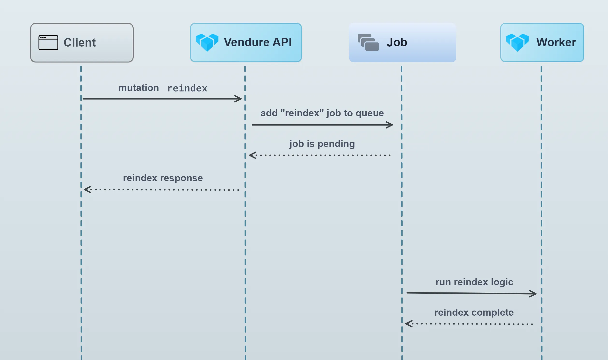
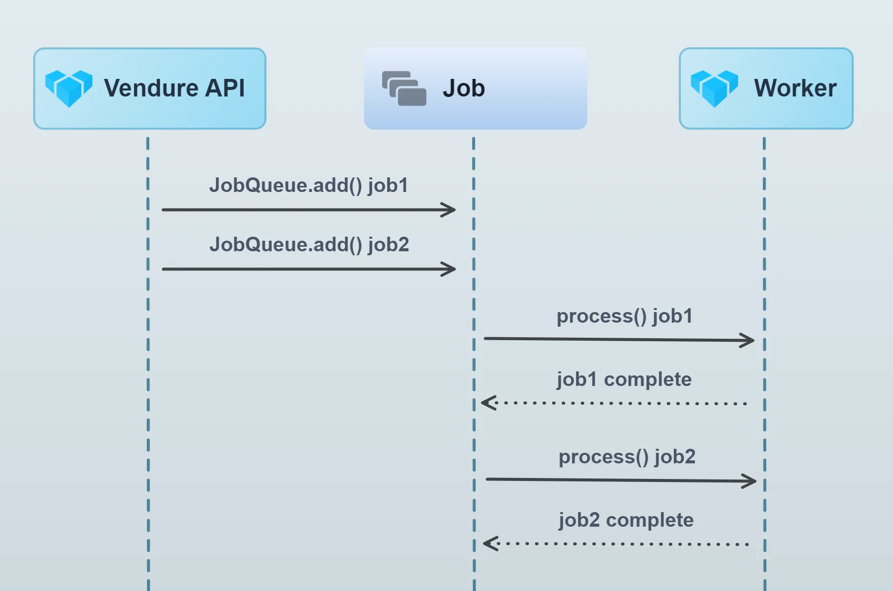

The Vendure Worker is a Node.js process responsible for running computationally intensive
or otherwise long-running tasks in the background. For example, updating a
search index or sending emails. Running such tasks in the background allows
the server to stay responsive, since a response can be returned immediately
without waiting for the slower tasks to complete.

Put another way, the Worker executes **jobs** which have been placed in the **job queue**.



## The worker

The worker is started by calling the [`bootstrapWorker()`](/reference/typescript-api/worker/bootstrap-worker/) function with the same
configuration as is passed to the main server `bootstrap()`. In a standard Vendure installation, this is found
in the `index-worker.ts` file:

```ts title="src/index-worker.ts"
import { bootstrapWorker } from '@vendure/core';
import { config } from './vendure-config';

bootstrapWorker(config)
    .then(worker => worker.startJobQueue())
    .catch(err => {
        console.log(err);
    });
```

### Underlying architecture

The Worker is a NestJS standalone application. This means it is almost identical to the main server app,
but does not have any network layer listening for requests. The server communicates with the worker
via a “job queue” architecture. The exact implementation of the job queue is dependent on the
configured [`JobQueueStrategy`](/reference/typescript-api/job-queue/job-queue-strategy/), but by default
the worker polls the database for new jobs.

### Multiple workers

It is possible to run multiple workers in parallel to better handle heavy loads. Using the
[`JobQueueOptions.activeQueues`](/reference/typescript-api/job-queue/job-queue-options#activequeues) configuration, it is even possible to have particular workers dedicated
to one or more specific types of jobs. For example, if your application does video transcoding,
you might want to set up a dedicated worker just for that task:

```ts title="src/transcoder-worker.ts"
import { bootstrapWorker, mergeConfig } from '@vendure/core';
import { config } from './vendure-config';

const transcoderConfig = mergeConfig(config, {
    jobQueueOptions: {
      activeQueues: ['transcode-video'],
    }
});

bootstrapWorker(transcoderConfig)
  .then(worker => worker.startJobQueue())
  .catch(err => {
    console.log(err);
  });
```

### Running jobs on the main process

It is possible to run jobs from the Job Queue on the main server. This is mainly used for testing
and automated tasks, and is not advised for production use, since it negates the benefits of
running long tasks off of the main process. To do so, you need to manually start the JobQueueService:

```ts title="src/index.ts"
import { bootstrap, JobQueueService } from '@vendure/core';
import { config } from './vendure-config';

bootstrap(config)
    .then(app => app.get(JobQueueService).start())
    .catch(err => {
        console.log(err);
        process.exit(1);
    });
```

### ProcessContext

Sometimes your code may need to be aware of whether it is being run as part of a server or worker process.
In this case you can inject the [`ProcessContext`](/reference/typescript-api/common/process-context/) provider and query it like this:

```ts title="src/plugins/my-plugin/services/my.service.ts"
import { Injectable, OnApplicationBootstrap } from '@nestjs/common';
import { ProcessContext } from '@vendure/core';

@Injectable()
export class MyService implements OnApplicationBootstrap {
    constructor(private processContext: ProcessContext) {}

    onApplicationBootstrap() {
        if (this.processContext.isServer) {
            // code which will only execute when running in
            // the server process
        }
    }
}
```

## The job queue

Vendure uses a [job queue](https://en.wikipedia.org/wiki/Job_queue) to handle the processing of certain tasks which are typically too slow to run in the
normal request-response cycle. A normal request-response looks like this:



In the normal request-response, all intermediate tasks (looking up data in the database, performing business logic etc.)
occur before the response can be returned. For most operations this is fine, since those intermediate tasks are very fast.

Some operations however will need to perform much longer-running tasks. For example, updating the search index on
thousands of products could take up to a minute or more. In this case, we certainly don’t want to delay the response
until that processing has completed. That’s where a job queue comes in:



### What does Vendure use the job queue for?

By default, Vendure uses the job queue for the following tasks:

- Re-building the search index
- Updating the search index when changes are made to Products, ProductVariants, Assets etc.
- Updating the contents of Collections
- Sending transactional emails

### How does the Job Queue work?

This diagram illustrates the job queue mechanism:



The server adds jobs to the queue. The worker then picks up these jobs from the queue and processes them in sequence,
one by one (it is possible to increase job queue throughput by running multiple workers or by increasing the concurrency
of a single worker).

### JobQueueStrategy

The actual queue part is defined by the configured [`JobQueueStrategy`](/reference/typescript-api/job-queue/job-queue-strategy/).

If no strategy is defined, Vendure uses an [in-memory store](/reference/typescript-api/job-queue/in-memory-job-queue-strategy/)
of the contents of each queue. While this has the advantage
of requiring no external dependencies, it is not suitable for production because when the server is stopped, the entire
queue will be lost and any pending jobs will never be processed. Moreover, it cannot be used when running the worker
as a separate process.

A better alternative is to use the [DefaultJobQueuePlugin](/reference/typescript-api/job-queue/default-job-queue-plugin/)
(which will be used in a standard `@vendure/create` installation), which configures Vendure to use the [SqlJobQueueStrategy](/reference/typescript-api/job-queue/sql-job-queue-strategy).
This strategy uses the database as a queue, and means that even if the Vendure server stops, pending jobs will be persisted and upon re-start, they will be processed.

It is also possible to implement your own JobQueueStrategy to take advantage of other technologies.
Examples include RabbitMQ, Google Cloud Pub Sub & Amazon SQS. It may make sense to implement a custom strategy based on
one of these if the default database-based approach does not meet your performance requirements.

### Job Queue Performance

It is common for larger Vendure projects to define multiple custom job queues, When using the [DefaultJobQueuePlugin](/reference/typescript-api/job-queue/default-job-queue-plugin/)
with many queues, performance may be impacted. This is because the `SqlJobQueueStrategy` uses polling to check for
new jobs in the database. Each queue will (by default) query the database every 200ms. So if there are 10 queues,
this will result in a constant 50 queries/second.

In this case it is recommended to try the [BullMQJobQueuePlugin](/reference/core-plugins/job-queue-plugin/bull-mqjob-queue-plugin/),
which uses an efficient push-based strategy built on Redis.

## Using Job Queues in a plugin

If your plugin involves long-running tasks, you can also make use of the job queue.

:::info
A real example of this can be seen in the [EmailPlugin source](https://github.com/vendure-ecommerce/vendure/blob/master/packages/email-plugin/src/plugin.ts)
:::

Let's say you are building a plugin which allows a video URL to be specified, and then that video gets transcoded into a format suitable for streaming on the storefront. This is a long-running task which should not block the main thread, so we will use the job queue to run the task on the worker.

First we'll add a new mutation to the Admin API schema:

```ts title="src/plugins/product-video/api/api-extensions.ts"
import gql from 'graphql-tag';

export const adminApiExtensions = gql`
  extend type Mutation {
    addVideoToProduct(productId: ID! videoUrl: String!): Job!
  }
`;
```

The resolver looks like this:


```ts title="src/plugins/product-video/api/product-video.resolver.ts"
import { Args, Mutation, Resolver } from '@nestjs/graphql';
import { Allow, Ctx, RequestContext, Permission, RequestContext } from '@vendure/core'
import { ProductVideoService } from '../services/product-video.service';

@Resolver()
export class ProductVideoResolver {

    constructor(private productVideoService: ProductVideoService) {}

    @Mutation()
    @Allow(Permission.UpdateProduct)
    addVideoToProduct(@Ctx() ctx: RequestContext, @Args() args: { productId: ID; videoUrl: string; }) {
        return this.productVideoService.transcodeForProduct(
            args.productId,
            args.videoUrl,
        );
    }
}
```
The resolver just defines how to handle the new `addVideoToProduct` mutation, delegating the actual work to the `ProductVideoService`.

### Creating a job queue

:::cli
Use `npx vendure add` to easily add a job queue to a service.
:::

The [`JobQueueService`](/reference/typescript-api/job-queue/job-queue-service/) creates and manages job queues. The queue is created when the
application starts up (see [NestJS lifecycle events](https://docs.nestjs.com/fundamentals/lifecycle-events)), and then we can use the `add()` method to add jobs to the queue.

```ts title="src/plugins/product-video/services/product-video.service.ts"
import { Injectable, OnModuleInit } from '@nestjs/common';
import { JobQueue, JobQueueService, ID, Product, TransactionalConnection } from '@vendure/core';
import { transcode } from 'third-party-video-sdk';

@Injectable()
class ProductVideoService implements OnModuleInit {

    private jobQueue: JobQueue<{ productId: ID; videoUrl: string; }>;

    constructor(private jobQueueService: JobQueueService,
                private connection: TransactionalConnection) {
    }

    async onModuleInit() {
        this.jobQueue = await this.jobQueueService.createQueue({
            name: 'transcode-video',
            process: async job => {
                // Inside the `process` function we define how each job
                // in the queue will be processed.
                // In this case we call out to some imaginary 3rd-party video
                // transcoding API, which performs the work and then
                // returns a new URL of the transcoded video, which we can then
                // associate with the Product via the customFields.
                const result = await transcode(job.data.videoUrl);
                await this.connection.getRepository(Product).save({
                    id: job.data.productId,
                    customFields: {
                        videoUrl: result.url,
                    },
                });
                // The value returned from the `process` function is stored as the "result"
                // field of the job (for those JobQueueStrategies that support recording of results).
                //
                // Any error thrown from this function will cause the job to fail.
                return result;
            },
        });
    }

    transcodeForProduct(productId: ID, videoUrl: string) {
        // Add a new job to the queue and immediately return the
        // job itself.
        return this.jobQueue.add({productId, videoUrl}, {retries: 2});
    }
}
```

Notice the generic type parameter of the `JobQueue`:

```ts
JobQueue<{ productId: ID; videoUrl: string; }>
```

This means that when we call `jobQueue.add()` we must pass in an object of this type. This data will then be available in the `process` function as the `job.data` property.

:::note
The data passed to `jobQueue.add()` must be JSON-serializable, because it gets serialized into a string when stored in the job queue. Therefore you should
avoid passing in complex objects such as `Date` instances, `Buffer`s, etc.
:::

The `ProductVideoService` is in charge of setting up the JobQueue and adding jobs to that queue. Calling

```ts
productVideoService.transcodeForProduct(id, url);
```

will add a transcoding job to the queue.

:::tip
Plugin code typically gets executed on both the server _and_ the worker. Therefore, you sometimes need to explicitly check
what context you are in. This can be done with the [ProcessContext](/reference/typescript-api/common/process-context/) provider.
:::

Finally, the `ProductVideoPlugin` brings it all together, extending the GraphQL API, defining the required CustomField to store the transcoded video URL, and registering our service and resolver. The [PluginCommonModule](/reference/typescript-api/plugin/plugin-common-module/) is imported as it exports the `JobQueueService`.

```ts title="src/plugins/product-video/product-video.plugin.ts"
import gql from 'graphql-tag';
import { PluginCommonModule, VendurePlugin } from '@vendure/core';
import { ProductVideoService } from './services/product-video.service';
import { ProductVideoResolver } from './api/product-video.resolver';
import { adminApiExtensions } from './api/api-extensions';

@VendurePlugin({
    imports: [PluginCommonModule],
    providers: [ProductVideoService],
    adminApiExtensions: {
        schema: adminApiExtensions,
        resolvers: [ProductVideoResolver]
    },
    configuration: config => {
        config.customFields.Product.push({
            name: 'videoUrl',
            type: 'string',
        });
        return config;
    }
})
export class ProductVideoPlugin {}
```

### Passing the RequestContext

It is common to need to pass the [RequestContext object](/reference/typescript-api/request/request-context) to the `process` function of a job, since `ctx` is required by many Vendure
service methods that you may be using inside your `process` function. However, the `RequestContext` object itself is not serializable,
so it cannot be passed directly to the `JobQueue.add()` method. Instead, you can serialize the `RequestContext` using the [`RequestContext.serialize()`
method](/reference/typescript-api/request/request-context/#serialize), and then deserialize it in the `process` function using the static `deserialize` method:

```ts
import { Injectable, OnModuleInit } from '@nestjs/common';
import { JobQueue, JobQueueService, Product, TransactionalConnection,
    SerializedRequestContext, RequestContext } from '@vendure/core';

@Injectable()
class ProductExportService implements OnModuleInit {

    // highlight-next-line
    private jobQueue: JobQueue<{ ctx: SerializedRequestContext; }>;

    constructor(private jobQueueService: JobQueueService,
                private connection: TransactionalConnection) {
    }

    async onModuleInit() {
        this.jobQueue = await this.jobQueueService.createQueue({
            name: 'export-products',
            process: async job => {
                // highlight-next-line
                const ctx = RequestContext.deserialize(job.data.ctx);
                const allProducts = await this.connection.getRepository(ctx, Product).find();
                // ... logic to export the product omitted for brevity
            },
        });
    }

    exportAllProducts(ctx: RequestContext) {
        // highlight-next-line
        return this.jobQueue.add({ ctx: RequestContext.serialize(ctx) });
    }
}
```

### Handling job cancellation

It is possible for an administrator to cancel a running job. Doing so will cause the configured job queue strategy to mark the job as cancelled, but
on its own this will not stop the job from running. This is because the job queue itself has no direct control over the `process` function once
it has been started.

It is up to the `process` function to check for cancellation and stop processing if the job has been cancelled. This can be done by checking the
`job.state` property, and if the job is cancelled, the `process` function can throw an error to indicate that the job was interrupted
by early cancellation:

```ts
import { Injectable, OnModuleInit } from '@nestjs/common';
import { JobQueue, JobQueueService, Product, TransactionalConnection,
    SerializedRequestContext, RequestContext, Job, JobState } from '@vendure/core';
import { IsNull } from 'typeorm';

@Injectable()
class ProductExportService implements OnModuleInit {

    private jobQueue: JobQueue<{ ctx: SerializedRequestContext; }>;

    constructor(private jobQueueService: JobQueueService,
                private connection: TransactionalConnection) {
    }

    async onModuleInit() {
        this.jobQueue = await this.jobQueueService.createQueue({
            name: 'export-products',
            process: async job => {
                const ctx = RequestContext.deserialize(job.data.ctx);
                const allProducts = await this.connection.getRepository(ctx, Product).find({
                    where: { deletedAt: IsNull() }
                });
                let successfulExportCount = 0;
                for (const product of allProducts) {
                    // highlight-start
                    if (job.state === JobState.CANCELLED) {
                        // If the job has been cancelled, stop processing
                        // to prevent unnecessary work.
                        throw new Error('Job was cancelled');
                    }
                    // highlight-end

                    // ... logic to export the product omitted for brevity
                    successfulExportCount++;
                }
                return { successfulExportCount };
            },
        });
    }

    exportAllProducts(ctx: RequestContext) {
        return this.jobQueue.add({ ctx: RequestContext.serialize(ctx) });
    }
}
```


### Subscribing to job updates

When creating a new job via `JobQueue.add()`, it is possible to subscribe to updates to that Job (progress and status changes). This allows you, for example, to create resolvers which are able to return the results of a given Job.

In the video transcoding example above, we could modify the `transcodeForProduct()` call to look like this:

```ts title="src/plugins/product-video/services/product-video.service.ts"
import { Injectable, OnModuleInit } from '@nestjs/common';
import { of } from 'rxjs';
import { map, catchError } from 'rxjs/operators';
import { ID, Product, TransactionalConnection } from '@vendure/core';

@Injectable()
class ProductVideoService implements OnModuleInit {
    // ... omitted (see above)

    transcodeForProduct(productId: ID, videoUrl: string) {
        const job = await this.jobQueue.add({productId, videoUrl}, {retries: 2});

        return job.updates().pipe(
            map(update => {
                // The returned Observable will emit a value for every update to the job
                // such as when the `progress` or `status` value changes.
                Logger.info(`Job ${update.id}: progress: ${update.progress}`);
                if (update.state === JobState.COMPLETED) {
                    Logger.info(`COMPLETED ${update.id}: ${update.result}`);
                }
                return update.result;
            }),
            catchError(err => of(err.message)),
        );
    }
}
```

If you prefer to work with Promises rather than Rxjs Observables, you can also convert the updates to a promise:

```ts
const job = await this.jobQueue.add({ productId, videoUrl }, { retries: 2 });

return job.updates().toPromise()
  .then(/* ... */)
  .catch(/* ... */);
```
