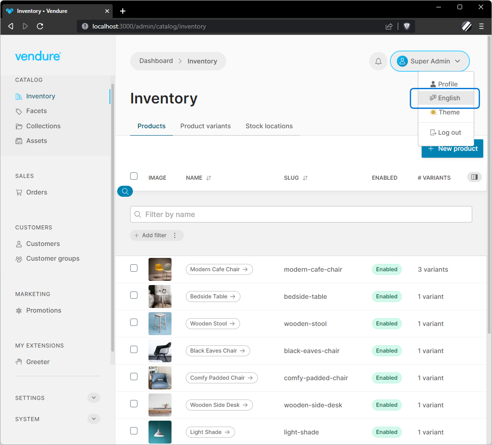

The Vendure Admin UI is fully localizable, allowing you to:

* create custom translations for your UI extensions
* override existing translations
* add complete translations for whole new languages



## Translation format

The Admin UI uses the [Messageformat](https://messageformat.github.io/messageformat/) specification to convert i18n tokens to localized strings in the browser. Each language should have a corresponding JSON file containing the translations for that language.

Here is an excerpt from the `en.json` file that ships with the Admin UI:

```JSON title="en.json"
{
  "admin": {
    "create-new-administrator": "Create new administrator"
  },
  "asset": {
    "add-asset": "Add asset",
    "add-asset-with-count": "Add {count, plural, 0 {assets} one {1 asset} other {{count} assets}}",
    "assets-selected-count": "{ count } assets selected",
    "dimensions": "Dimensions"
  }
}
```

The translation tokens are grouped into a single-level deep nested structure. In the Angular code, these are referenced like this: 

```HTML
<label>{{ 'asset.assets-selected-count' | translate:{ count } }}</label>
```

That is, the `{ ... }` represent variables that are passed from the application code and interpolated into the final localized string.

## Adding a new language

The Admin UI ships with built-in support for many languages, but allows you to add support for any other language without the need to modify the package internals.

1. **Create your translation file**

     Start by copying the contents of the [English language file](https://github.com/vendure-ecommerce/vendure/blob/master/packages/admin-ui/src/lib/static/i18n-messages/en.json) into a new file, `<languageCode>.json`, where `languageCode` is the 2-character [ISO 639-1 code](https://en.wikipedia.org/wiki/List_of_ISO_639-1_codes) for the language. Replace the strings with the translation for the new language.
2. **Install `@vendure/ui-devkit`**

    If not already installed, install the `@vendure/ui-devkit` package, which allows you to create custom builds of the Admin UI.
3. **Register the translation file**
  
    Here's a minimal directory structure and sample code to add your new translation:
    
    ```text
    /src
    ├─ vendure-config.ts
    └─ translations/
        └─ ms.json
    ```
    
    And the config code to register the translation file:
    
    ```ts title="src.vendure-config.ts"
    import path from 'path';
    import { VendureConfig } from '@vendure/core';
    import { AdminUiPlugin } from '@vendure/admin-ui-plugin';
    import { compileUiExtensions } from '@vendure/ui-devkit/compiler';
    
    export const config: VendureConfig = {
        // ...
        plugins: [
            AdminUiPlugin.init({
                port: 3002,
                app: compileUiExtensions({
                    outputPath: path.join(__dirname, '../admin-ui'),
                    extensions: [{
                        translations: {
                            ms: path.join(__dirname, 'translations/ms.json'),
                        }
                    }],
                }),
                adminUiConfig:{
                    defaultLanguage: LanguageCode.ms,
                    availableLanguages: [LanguageCode.ms, LanguageCode.en],
                }
            }),
        ],
    };
    ```

## Translating UI Extensions

You can also create translations for your own UI extensions, in much the same way as outlined above in "Adding a new language". Your translations can be split over several files, since the `translations` config object can take a glob, e.g.:

```ts
translations: {
  de: path.join(__dirname, 'ui-extensions/my-extension/**/*.de.json'),
}
```

This allows you, if you wish, to co-locate your translation files with your components.

Care should be taken to uniquely namespace your translation tokens, as conflicts with the base translation file will cause your translations to overwrite the defaults. This can be solved by using a unique section name, e.g.:

```JSON
{
  "my-reviews-plugin": {
    "all-reviews": "All reviews",
    "approve review": "Approve review"
  }
}
```
