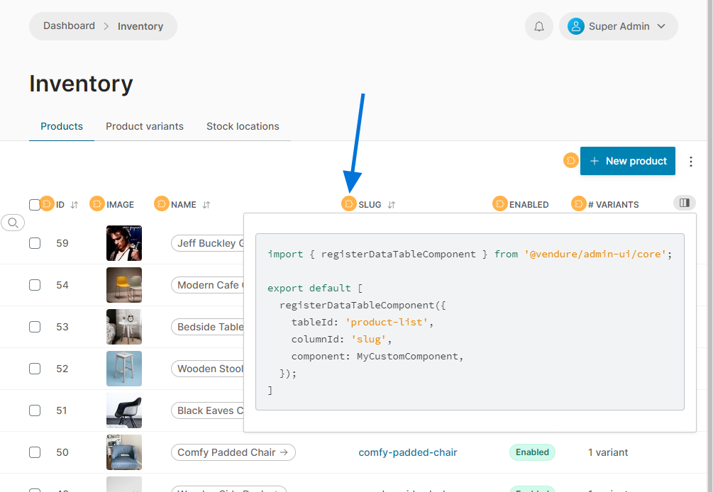
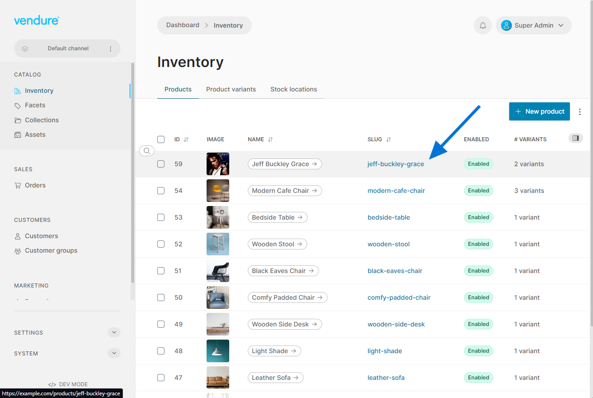

import Tabs from '@theme/Tabs';
import TabItem from '@theme/TabItem';

The Admin UI list views are powered by a data table component which features sorting, advanced filtering, pagination and more. It will also give you the option of displaying any configured [custom fields](/guides/developer-guide/custom-fields/) for the entity in question.

With Admin UI extensions, you can specify custom components to use in rendering any column of any data table - both custom fields _and_ built-in fields, using either Angular or React components.

Let's say we want to make the product "slug" column link to the matching product detail page in our storefront.

### 1. Define a component

First we'll define the component we will use to render the "slug" column:

<Tabs groupId="framework">
<TabItem value="angular" label="Angular">

Angular components will receive the value of the current column as the `rowItem` input. In this case, the `rowItem` will be the Product entity, because we will be adding this to the product list data table.

```ts title="src/plugins/slug-link/ui/components/slug-link/slug-link.component.ts"
import { Component, Input } from '@angular/core';
import { CustomColumnComponent } from '@vendure/admin-ui/core';

@Component({
    selector: 'slug-link',
    template: `
        <a [href]="'https://example.com/products/' + rowItem.slug" target="_blank">{{ rowItem.slug }}</a>
    `,
    standalone: true,
})
export class SlugLinkComponent implements CustomColumnComponent {
    @Input() rowItem: { slug: string };
}
```

</TabItem>
<TabItem value="react" label="React">

React components will receive the value of the current column as the `rowItem` prop. In this case, the `rowItem` will be the Product entity, because we will be adding this to the product list data table.

```tsx title="src/plugins/slug-link/ui/components/SlugLink.tsx"
import { ReactDataTableComponentProps } from '@vendure/admin-ui/react';
import React from 'react';

export function SlugLink({ rowItem }: ReactDataTableComponentProps<{ slug: string }>) {
    const slug = rowItem.slug;
    return (
        <a href={`https://example.com/category/${slug}`} target="_blank">
            {slug}
        </a>
    );
}
```

</TabItem>
</Tabs>

### 2. Register the component

Next we need to register the component in out `providers.ts` file. We need to pass both a `tableId` and a `columnId` to identify the table and column to which the component should be added. The values for these IDs can be found by pressing the `ctrl + u` shortcut when the Admin UI is in dev mode, and then clicking the extension point icon at the top of the column in question:



In this case we want to target the `product-list` table and the `slug` column.

<Tabs groupId="framework">
<TabItem value="angular" label="Angular">

```ts title="src/plugins/slug-link/ui/providers.ts"
import { registerDataTableComponent } from '@vendure/admin-ui/core';
import { SlugLinkComponent } from './components/slug-link/slug-link.component';

export default [
    registerDataTableComponent({
        component: SlugWithLinkComponent,
        tableId: 'product-list',
        columnId: 'slug',
    }),
];
```

</TabItem>
<TabItem value="react" label="React">

```ts title="src/plugins/slug-link/ui/providers.ts"
import { registerReactDataTableComponent } from '@vendure/admin-ui/react';
import { SlugLink } from './components/SlugLink';

export default [
    registerReactDataTableComponent({
        component: SlugWithLink,
        tableId: 'product-list',
        columnId: 'slug',
        props: {
            // Additional props may be passed to the component
            foo: 'bar',
        },
    }),
];
```

</TabItem>
</Tabs>

When running the Admin UI, the product list slug should now be rendered as a link:


