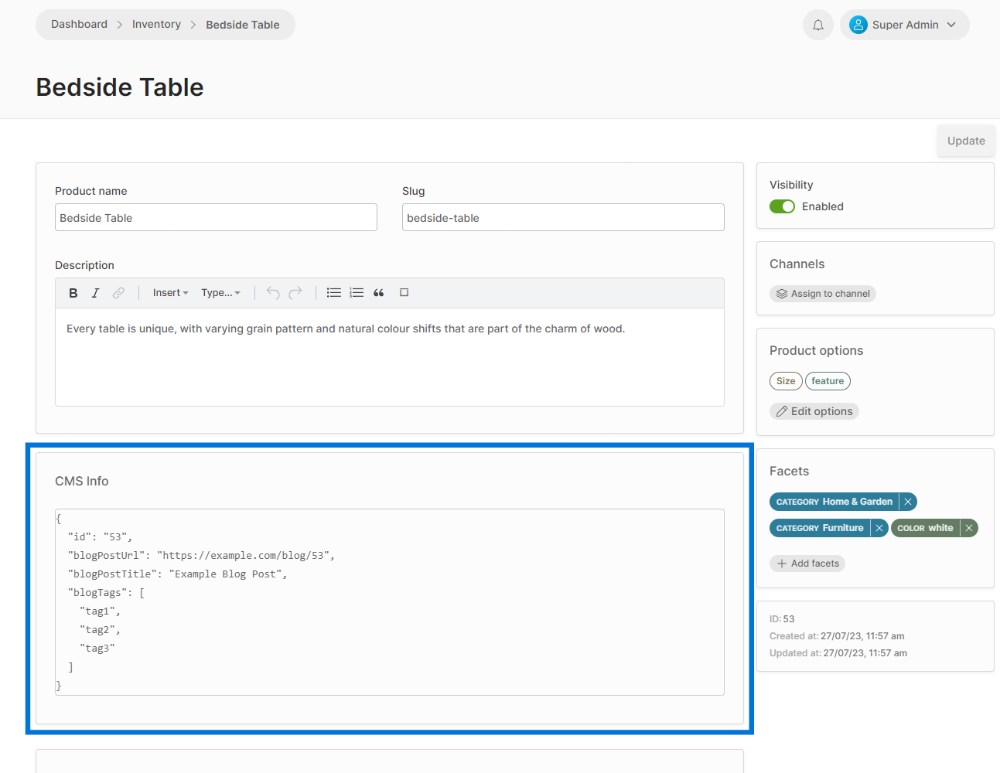

import Tabs from '@theme/Tabs';
import TabItem from '@theme/TabItem';

Detail views can be extended with custom Angular or React components using the [`registerCustomDetailComponent`](/reference/admin-ui-api/custom-detail-components/register-custom-detail-component/) and [`registerReactCustomDetailComponent`](/reference/admin-ui-api/react-extensions/register-react-custom-detail-component) functions.

Any components registered in this way will appear below the main detail form.

:::info
The valid locations for embedding custom detail components can be found in the [CustomDetailComponentLocationId docs](/reference/admin-ui-api/custom-detail-components/custom-detail-component-location-id).
:::

Let's imagine that your project has an external content management system (CMS) which is used to store additional details about products. You might want to display some of this information in the product detail page. We will demonstrate the same component in both Angular and React.

### 1. Create a component


<Tabs groupId="framework">
<TabItem value="Angular" label="Angular" default>

```ts title="src/plugins/cms/ui/components/product-info/product-info.component.ts"
import { Component, OnInit } from '@angular/core';
import { Observable, switchMap } from 'rxjs';
import { FormGroup } from '@angular/forms';
import { DataService, CustomDetailComponent, SharedModule } from '@vendure/admin-ui/core';
import { CmsDataService } from '../../providers/cms-data.service';

@Component({
    template: `
        <vdr-card title="CMS Info">
            <pre>{{ extraInfo$ | async | json }}</pre>
        </vdr-card>`,
    standalone: true,
    providers: [CmsDataService],
    imports: [SharedModule],
})
export class ProductInfoComponent implements CustomDetailComponent, OnInit {
    // These two properties are provided by Vendure and will vary
    // depending on the particular detail page you are embedding this
    // component into. In this case, it will be a "product" entity.
    entity$: Observable<any>
    detailForm: FormGroup;

    extraInfo$: Observable<any>;

    constructor(private cmsDataService: CmsDataService) {
    }

    ngOnInit() {
        this.extraInfo$ = this.entity$.pipe(
            switchMap(entity => this.cmsDataService.getDataFor(entity.id))
        );
    }
}
```

</TabItem>
<TabItem value="React" label="React">

When using React, we can use the [`useDetailComponentData` hook](/reference/admin-ui-api/react-hooks/use-detail-component-data) to access the entity and form data.

```tsx title="src/plugins/cms/ui/components/ProductInfo.tsx"
import React, { useEffect, useState } from 'react';
import { Card, useDetailComponentData, useInjector } from '@vendure/admin-ui/react';
import { CmsDataService } from '../providers/cms-data.service';

export function ProductInfo() {
    // The "entity" will vary depending on which detail page this component
    // is embedded in. In this case, it will be a "product" entity.
    const { entity, detailForm } = useDetailComponentData();
    const cmsDataService = useInjector(CmsDataService);
    const [extraInfo, setExtraInfo] = useState<any>();
    
    useEffect(() => {
        if (!entity?.id) {
            return;
        }
        const subscription = cmsDataService.getDataFor(entity?.id).subscribe(data => {
            setExtraInfo(data);
        });
        return () => subscription.unsubscribe();
    }, [entity?.id]);
    
    return (
        <Card title="CMS Info">
            <pre>{JSON.stringify(extraInfo, null, 2)}</pre>
        </Card>
    );
}
```

</TabItem>
</Tabs>

### 2. Register the component

We can then register the component in our `providers.ts` file:

<Tabs groupId="framework">
<TabItem value="Angular" label="Angular" default>

```ts title="src/plugins/cms/ui/providers.ts"
import { registerCustomDetailComponent } from '@vendure/admin-ui/core';
import { ProductInfoComponent } from './components/product-info/product-info.component';

export default [
    registerCustomDetailComponent({
        locationId: 'product-detail',
        component: ProductInfoComponent,
    }),
];
```

</TabItem>
<TabItem value="React" label="React">

```ts title="src/plugins/cms/ui/providers.ts"
import { registerReactCustomDetailComponent } from '@vendure/admin-ui/react';
import { ProductInfo } from './components/ProductInfo';

export default [
    registerReactCustomDetailComponent({
        locationId: 'product-detail',
        component: ProductInfo,
    }),
];
```

</TabItem>
</Tabs>

When running the Admin UI, the component should now appear in the product detail page:



## Manipulating the detail form

The `detailForm` property is an instance of the Angular [FormGroup](https://angular.io/api/forms/FormGroup) which can be used to manipulate the form fields, set the validity of the form, mark the form as dirty etc. For example, we could add a button which updates the `description` field of the product:

<Tabs groupId="framework">
<TabItem value="Angular" label="Angular" default>

```ts title="src/plugins/cms/ui/components/product-info/product-info.component.ts"
import { Component, OnInit } from '@angular/core';
import { FormGroup } from '@angular/forms';
import { CustomDetailComponent } from '@vendure/admin-ui/core';

@Component({
    template: `<button class="button secondary" (click)="updateDescription()">Update description</button>`,
    standalone: true,
})
export class ProductInfoComponent implements CustomDetailComponent, OnInit {
    entity$: Observable<any>
    detailForm: FormGroup;
    
    // highlight-start
    updateDescription() {
        const descriptionControl = this.detailForm.get('description');
        if (descriptionControl) {
            descriptionControl.setValue('New description');
            descriptionControl.markAsDirty();
        }        
    }
    // highlight-end
}
```

</TabItem>
<TabItem value="React" label="React">

```tsx title="src/plugins/cms/ui/components/ProductInfo.tsx"
import React from 'react';
import { Card, useDetailComponentData } from '@vendure/admin-ui/react';

export function ProductInfo() {
    const { detailForm } = useDetailComponentData();

    // highlight-start
    const updateDescription = () => {
        const descriptionControl = detailForm.get('description');
        if (descriptionControl) {
            descriptionControl.setValue('New description');
            descriptionControl.markAsDirty();
        }
    };
    // highlight-end

    return (
        <button className="button secondary" onClick={updateDescription}>Update description</button>
    );
}
```

</TabItem>
</Tabs>
