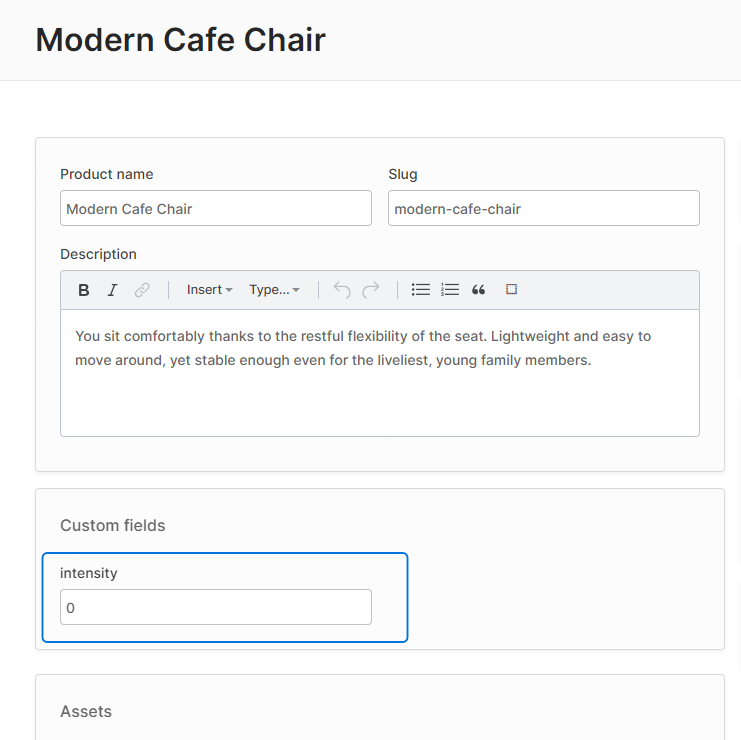
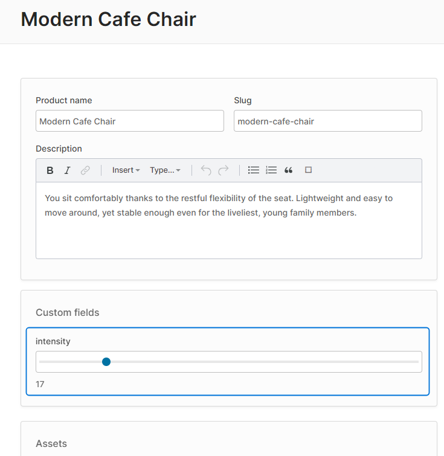

# Custom Form Inputs

Another way to extend the Admin UI app is to define custom form input components for manipulating any [Custom Fields](/guides/developer-guide/custom-fields/) you have defined on your entities as well as [configurable args](/reference/typescript-api/configurable-operation-def/config-args/) used by custom [Configurable Operations](/guides/developer-guide/strategies-configurable-operations/#configurable-operations).

## For Custom Fields

Let's say you define a custom "intensity" field on the Product entity:

```ts title="src/vendure-config.ts"
customFields: {
    Product: [
        {name: 'intensity', type: 'int', min: 0, max: 100, defaultValue: 0},
    ],
}
```

By default, the "intensity" field will be displayed as a number input:



But let's say we want to display a range slider instead. Here's how we can do this using our shared extension module combined with the [registerFormInputComponent function](/reference/admin-ui-api/custom-input-components/register-form-input-component/):

```ts title="src/ui-extensions/slider-form-input.component.ts"
import { NgModule, Component } from '@angular/core';
import { FormControl } from '@angular/forms';
import { IntCustomFieldConfig, SharedModule, FormInputComponent, registerFormInputComponent } from '@vendure/admin-ui/core';

@Component({
    template: `
      <input
          type="range"
          [min]="config.min || 0"
          [max]="config.max || 100"
          [formControl]="formControl" />
      {{ formControl.value }}
  `,
})
export class SliderControl implements FormInputComponent<IntCustomFieldConfig> {
    readonly: boolean;
    config: IntCustomFieldConfig;
    formControl: FormControl;
}

@NgModule({
    imports: [SharedModule],
    declarations: [SliderControl],
    providers: [
        registerFormInputComponent('slider-form-input', SliderControl),
    ]
})
export class SharedExtensionModule {
}
```

The `SharedExtensionModule` is then passed to the `compileUiExtensions()` function as described in the [UI Extensions With Angular guide](/guides/extending-the-admin-ui/using-angular/#4-pass-the-extension-to-the-compileuiextensions-function):

```ts title="src/vendure-config.ts"
AdminUiPlugin.init({
    port: 5001,
    app: compileUiExtensions({
        outputPath: path.join(__dirname, '../admin-ui'),
        extensions: [{
            extensionPath: path.join(__dirname, 'ui-extensions'),
            ngModules: [{
                type: 'shared',
                ngModuleFileName: 'shared.module.ts',
                ngModuleName: 'SharedExtensionModule',
            }],
        }],
    }),
})
```

Once registered, this new slider input can be used in our custom field config:

```ts title="src/vendure-config.ts"
customFields: {
    Product: [
        {
            name: 'intensity', type: 'int', min: 0, max: 100, defaultValue: 0,
            // highlight-next-line
            ui: {component: 'slider-form-input'}
        },
    ],
}
```
As we can see, adding the `ui` property to the custom field config allows us to specify our custom slider component.
The component id _'slider-form-input'_ **must match** the string passed as the first argument to `registerFormInputComponent()`.

:::info
If we want, we can also pass any other arbitrary data in the `ui` object, which will then be available in our component as `this.config.ui.myField`. Note that only JSON-compatible data types are permitted, so no functions or class instances.
:::


Re-compiling the Admin UI will result in our SliderControl now being used for the "intensity" custom field:



To recap the steps involved:

1. Create an Angular Component which implements the `FormInputComponent` interface.
2. Add this component to your shared extension module's `declarations` array.
3. Use `registerFormInputComponent()` to register your component for the given entity & custom field name.
4. Specify this component's ID in your custom field config.

### Custom Field Controls for Relations

If you have a custom field of the `relation` type (which allows you to relate entities with one another), you can also define custom field controls for them. The basic mechanism is exactly the same as with primitive custom field types (i.e. `string`, `int` etc.), but there are a couple of important points to know:

1. The value of the `formControl` will be the _related entity object_ rather than an id. The Admin UI will internally take care of converting the entity object into an ID when performing the create/update mutation.
2. Your control will most likely need to fetch data in order to display a list of selections for the user.

Here is a simple example taken from the [real-world-vendure](https://github.com/vendure-ecommerce/real-world-vendure/blob/master/src/plugins/reviews/ui/components/featured-review-selector/featured-review-selector.component.ts) repo:

```ts title="src/plugins/reviews/ui/components/relation-review-input/relation-review-input.component.ts"
import { ChangeDetectionStrategy, Component, OnInit } from '@angular/core';
import { FormControl } from '@angular/forms';
import { ActivatedRoute } from '@angular/router';
import { RelationCustomFieldConfig } from '@vendure/common/lib/generated-types';
import { CustomFieldControl, DataService } from '@vendure/admin-ui/core';
import { Observable } from 'rxjs';
import { switchMap } from 'rxjs/operators';

import { GET_REVIEWS_FOR_PRODUCT } from '../product-reviews-list/product-reviews-list.graphql';
import { GetReviewForProduct, ProductReviewFragment } from '../../generated-types';

@Component({
  selector: 'relation-review-input',
  template: `
    <div *ngIf="formControl.value as review">
      <vdr-chip>{{ review.rating }} / 5</vdr-chip>
      {{ review.summary }}
      <a [routerLink]="['/extensions', 'product-reviews', review.id]">
        <clr-icon shape="link"></clr-icon>
      </a>
    </div>
    <select appendTo="body" [formControl]="formControl">
      <option [ngValue]="null">Select a review...</option>
      <option *ngFor="let item of reviews$ | async" [ngValue]="item">
        <b>{{ item.summary }}</b>
        {{ item.rating }} / 5
      </option>
    </select>
  `,
  changeDetection: ChangeDetectionStrategy.OnPush,
})
export class RelationReviewInputComponent implements OnInit, FormInputComponent<RelationCustomFieldConfig> {
  readonly: boolean;
  formControl: FormControl;
  config: RelationCustomFieldConfig;

  reviews$: Observable<ProductReviewFragment[]>;

  constructor(private dataService: DataService, private route: ActivatedRoute) {}

  ngOnInit() {
    this.reviews$ = this.route.data.pipe(
      switchMap(data => data.entity),
      switchMap((product: any) => {
        return this.dataService
          .query<GetReviewForProduct.Query, GetReviewForProduct.Variables>(
            GET_REVIEWS_FOR_PRODUCT,
            {
              productId: product.id,
            },
          )
          .mapSingle(({ product }) => product?.reviews.items ?? []);
      }),
    );
  }
}
```

## For ConfigArgs

[ConfigArgs](/reference/typescript-api/configurable-operation-def/config-args/) are used by classes which extend [Configurable Operations](/guides/developer-guide/strategies-configurable-operations/#configurable-operations) (such as ShippingCalculator or PaymentMethodHandler). These ConfigArgs allow user-input values to be passed to the operation's business logic.

They are configured in a very similar way to custom fields, and likewise can use custom form inputs by specifying the `ui` property. 

Here's an example:

```ts title="src/config/order-fixed-discount-action.ts"
export const orderFixedDiscount = new PromotionOrderAction({
    code: 'order_fixed_discount',
    args: {
        discount: {
            type: 'int',
            // highlight-start
            ui: {
                component: 'currency-form-input',
            },
            // highlight-end
        },
    },
    execute(ctx, order, args) {
        return -args.discount;
    },
    description: [{languageCode: LanguageCode.en, value: 'Discount order by fixed amount'}],
});
```


