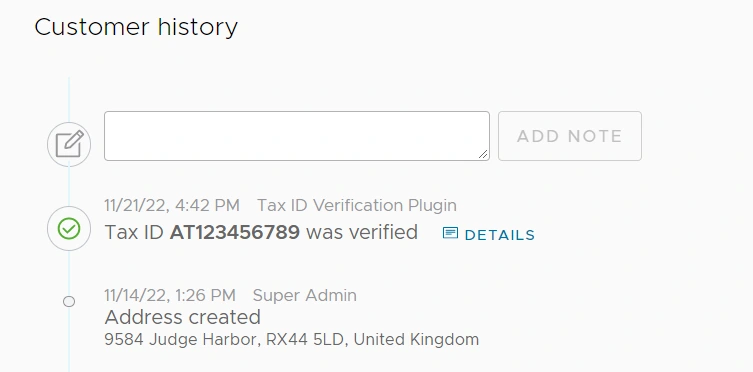

The Order & Customer detail pages feature a timeline of history entries. Since v1.9.0 it is possible to define custom history entry types - see the [HistoryService docs](/reference/typescript-api/services/history-service/) for an example.

You can also define a custom Angular component to render any timeline entry using the [registerHistoryEntryComponent function](/reference/admin-ui-api/custom-history-entry-components/register-history-entry-component/).



:::note
Currently it is only possible to define new tabs using Angular components.
:::

Following the example used in the HistoryService docs, we can define a component to render the tax ID verification
entry in our Customer timeline:

```ts title="src/plugins/tax-id/ui/components/tax-id-history-entry/tax-id-history-entry.component.ts"
import { Component } from '@angular/core';
import {
    CustomerFragment,
    CustomerHistoryEntryComponent,
    SharedModule,
    TimelineDisplayType,
    TimelineHistoryEntry,
} from '@vendure/admin-ui/core';

@Component({
    selector: 'tax-id-verification-entry',
    template: `
        <div *ngIf="entry.data.valid">
            Tax ID <strong>{{ entry.data.taxId }}</strong> was verified
            <vdr-history-entry-detail *ngIf="entry.data">
                <vdr-object-tree [value]="entry.data"></vdr-object-tree>
            </vdr-history-entry-detail>
        </div>
        <div *ngIf="!entry.data.valid">Tax ID {{ entry.data.taxId }} could not be verified</div>
    `,
    standalone: true,
    imports: [SharedModule],
})
export class TaxIdHistoryEntryComponent implements CustomerHistoryEntryComponent {
    entry: TimelineHistoryEntry;
    customer: CustomerFragment;

    getDisplayType(entry: TimelineHistoryEntry): TimelineDisplayType {
        return entry.data.valid ? 'success' : 'error';
    }

    getName(entry: TimelineHistoryEntry): string {
        return 'Tax ID Verification Plugin';
    }

    isFeatured(entry: TimelineHistoryEntry): boolean {
        return true;
    }

    getIconShape(entry: TimelineHistoryEntry) {
        return entry.data.valid ? 'check-circle' : 'exclamation-circle';
    }
}
```

We can then register this component in the `providers.ts` file:

```ts title="src/plugins/tax-id/ui/providers.ts"
import { registerHistoryEntryComponent } from '@vendure/admin-ui/core';
import { TaxIdHistoryEntryComponent } from './components/tax-id-history-entry/tax-id-history-entry.component';

export default [
    registerHistoryEntryComponent({
        type: 'CUSTOMER_TAX_ID_VERIFICATION',
        component: TaxIdHistoryEntryComponent,
    }),
];
```

Then we need to add the `providers.ts` file to the `uiExtensions` array as described in the [UI Extensions Getting Started guide](/guides/extending-the-admin-ui/getting-started/).

