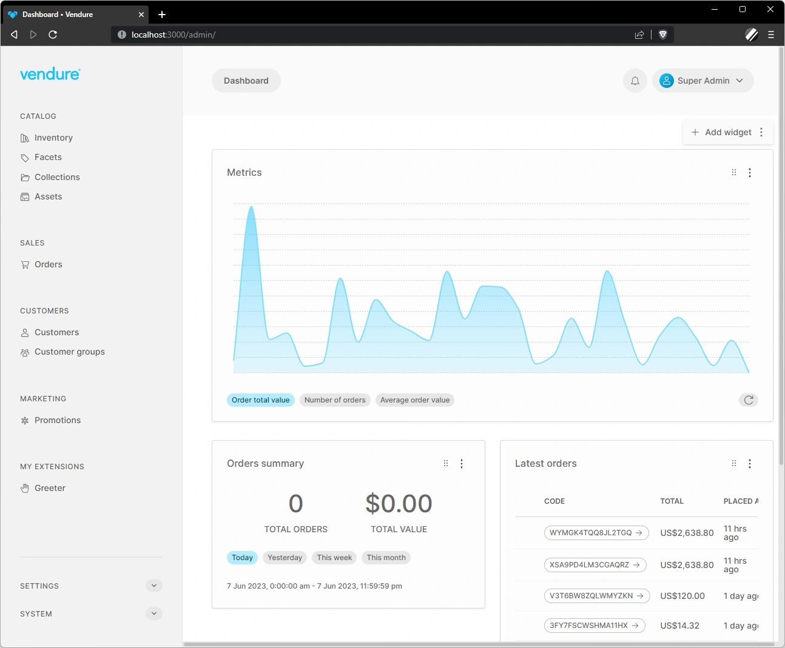

Dashboard widgets are components which can be added to the Admin UI dashboard. These widgets are useful for displaying information which is commonly required by administrations, such as sales summaries, lists of incomplete orders, notifications, etc.

The Admin UI comes with a handful of widgets, and you can also create your own widgets.



:::note
Currently it is only possible to define new widgets using Angular components.
:::

## Example: Reviews Widget

In this example we will use a hypothetical reviews plugin, which allows customers to write product reviews. These reviews then get approved by an Administrator before being displayed in the storefront.

To notify administrators about new reviews that need approval, we'll create a dashboard widget.

### Create the widget

A dashboard widget is an Angular component. This example features a simplified UI, just to illustrate the overall structure:

```ts title="src/plugins/reviews/ui/components/reviews-widget/reviews-widget.component.ts"
import { Component, OnInit } from '@angular/core';
import { DataService, SharedModule } from '@vendure/admin-ui/core';
import { Observable } from 'rxjs';

@Component({
    selector: 'reviews-widget',
    template: `
        <ul>
            <li *ngFor="let review of pendingReviews$ | async">
                <a [routerLink]="['/extensions', 'product-reviews', review.id]">{{ review.summary }}</a>
                <span class="rating">{{ review.rating }} / 5</span>
            </li>
        </ul>
    `,
    standalone: true,
    imports: [SharedModule],
})
export class ReviewsWidgetComponent implements OnInit {
    pendingReviews$: Observable<any[]>;

    constructor(private dataService: DataService) {}

    ngOnInit() {
        this.pendingReviews$ = this.dataService.query(gql`
            query GetAllReviews($options: ProductReviewListOptions) {
                productReviews(options: $options) {
                    items {
                        id
                        createdAt
                        authorName
                        summary
                        rating
                    }
                }
            }`, {
                options: {
                    filter: { state: { eq: 'new' } },
                    take: 10,
                },
            })
            .mapStream(data => data.productReviews.items);
    }
}
```

:::note
We also need to define an `NgModule` for this component. This is because we will be lazy-loading the component at run-time, and the NgModule is required for us to use shared providers (e.g. `DataService`) and any shared components, directives or pipes defined in the `@vendure/admin-ui/core` package.
:::

### Register the widget

Our widget now needs to be registered in our [providers file](/guides/extending-the-admin-ui/getting-started/#providers):

```ts title="src/plugins/reviews/ui/providers.ts"
import { registerDashboardWidget } from '@vendure/admin-ui/core';

export default [
    // highlight-start
    registerDashboardWidget('reviews', {
        title: 'Latest reviews',
        supportedWidths: [4, 6, 8, 12],
        requiresPermissions: ['ReadReview'],
        loadComponent: () =>
            import('./reviews-widget/reviews-widget.component').then(
                m => m.ReviewsWidgetComponent,
            ),
    }),
    // highlight-end
];
```

* **`title`** This is the title of the widget that will be displayed in the widget header.
* **`supportedWidths`** This indicated which widths are supported by the widget. The number indicates columns in a Bootstrap-style 12-column grid. So `12` would be full-width, `6` half-width, etc. In the UI, the administrator will be able to re-size the widget to one of the supported widths. If not provided, all widths will be allowed.
* **`requiresPermissions`** This allows an array of Permissions to be specified which limit the display of the widget to administrators who possess all of those permissions. If not provided, all administrators will be able to use the widget.
* **`loadComponent`** This function defines how to load the component. Using the dynamic `import()` syntax will enable the Angular compiler to intelligently generate a lazy-loaded JavaScript bundle just for that component. This means that your widget can, for example, include 3rd-party dependencies (such as a charting library) without increasing the bundle size (and therefore load-times) of the main Admin UI app. The widget-specific code will _only_ be loaded when the widget is rendered on the dashboard.

Once registered, the reviews widget will be available to select by administrators with the appropriate permissions.

## Setting the default widget layout

While administrators can customize which widgets they want to display on the dashboard, and the layout of those widgets, you can also set a default layout:

```ts title="src/plugins/reviews/ui/providers.ts"
import { registerDashboardWidget, setDashboardWidgetLayout } from '@vendure/admin-ui/core';

export default [
    registerDashboardWidget('reviews', {
        // omitted for brevity
    }),
    // highlight-start
    setDashboardWidgetLayout([
        { id: 'welcome', width: 12 },
        { id: 'orderSummary', width: 4 },
        { id: 'latestOrders', width: 8 },
        { id: 'reviews', width: 6 },
    ]),
    // highlight-end
];
```

This defines the order of widgets with their default widths. The actual layout in terms of rows and columns will be calculated at run-time based on what will fit on each row.

## Overriding default widgets

The Admin UI comes with a set of default widgets, such as the order summary and latest orders widgets (they can be found in [the default-widgets.ts file](https://github.com/vendure-ecommerce/vendure/blob/master/packages/admin-ui/src/lib/dashboard/src/default-widgets.ts)).

Sometimes you may wish to alter the permissions settings of the default widgets to better control which of your Administrators is able to access it.

For example, the "order summary" widget has a default permission requirement of "ReadOrder". If you want to limit the availability to e.g. the SuperAdmin role, you can do so by overriding the definition like this:

```ts title="src/plugins/reviews/ui/providers.ts"
import { registerDashboardWidget } from '@vendure/admin-ui/core';
import { OrderSummaryWidgetComponent } from '@vendure/admin-ui/dashboard';

export default [
    // highlight-start
    registerDashboardWidget('orderSummary', {
        title: 'dashboard.orders-summary',
        loadComponent: () => OrderSummaryWidgetComponent,
        requiresPermissions: ['SuperAdmin'],
    }),
    // highlight-end
];
```
