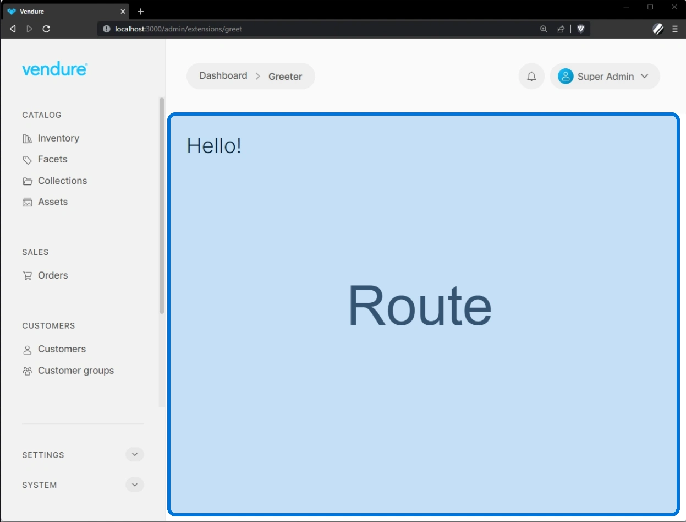
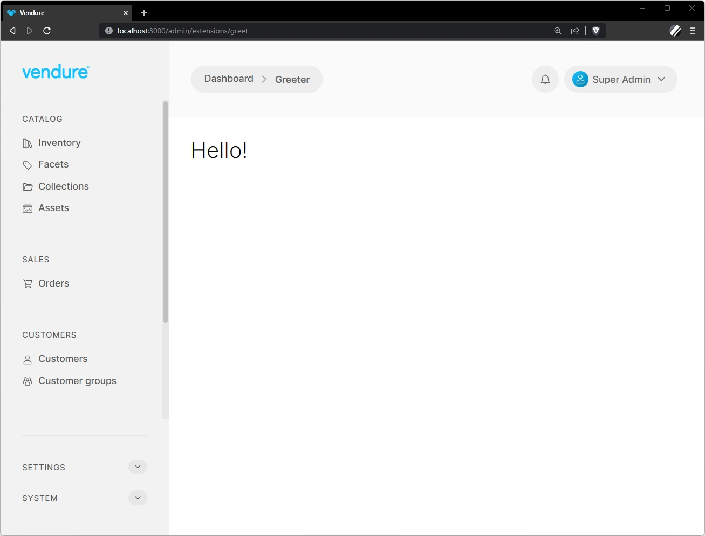

Routes allow you to mount entirely custom components at a given URL in the Admin UI. New routes will appear in this area of the Admin UI:



Routes can be defined natively using either **Angular** or **React**. It is also possible to [use other frameworks](/extending-the-admin-ui/using-other-frameworks/) in a more limited capacity.

## Example: Creating a "Greeter" route

### 1. Create a plugin

We will first quickly scaffold a new plugin to house our UI extensions:

- Run `npx vendure add` from your project root
- Select `Create a new Vendure plugin` and when prompted for a name, name it **"greeter"**
- After the plugin is created, you will be prompted to add features to the plugin. Select `[Plugin: UI] Set up Admin UI extensions`

You should now have a new plugin scaffolded at `./src/plugins/greeter`, with some empty UI extension files in the `ui` 
directory. If you check your `vendure-config.ts` file you should also see that your `AdminUiPlugin.init()` call has been modified
to compile the UI extensions:

```ts
AdminUiPlugin.init({
    route: 'admin',
    port: serverPort + 2,
    adminUiConfig: {
        apiPort: serverPort,
    },
    app: compileUiExtensions({ // [!code highlight]
        outputPath: path.join(__dirname, '../admin-ui'), // [!code highlight]
        extensions: [ // [!code highlight]
            GreeterPlugin.ui, // [!code highlight]
        ], // [!code highlight]
        devMode: true, // [!code highlight]
    }), // [!code highlight]
}),
```

### 2. Create the route component

First we need to create the component which will be mounted at the route. This component can be either an Angular component or a React component.

<Tabs groupId="framework">
<TabItem value="Angular" label="Angular" default>


```ts title="src/plugins/greeter/ui/components/greeter/greeter.component.ts"
import { SharedModule } from '@vendure/admin-ui/core';
import { Component } from '@angular/core';

@Component({
    selector: 'greeter',
    template: `
        <vdr-page-block>
            <h2>{{ greeting }}</h2>
        </vdr-page-block>`,
    standalone: true,
    imports: [SharedModule],
})
export class GreeterComponent {
    greeting = 'Hello!';
}
```

</TabItem>
<TabItem value="React" label="React">

```ts title="src/plugins/greeter/ui/components/greeter/Greeter.tsx"
import React from 'react';

export function Greeter() {
    const greeting = 'Hello!';
    return (
        <div className="page-block">
            <h2>{greeting}</h2>
        </div>
    );
}
```

</TabItem>
</Tabs>

:::note
The `<vdr-page-block>` (Angular) and `<div className="page-block">` (React) is a wrapper that sets the layout and max width of your component to match the rest of the Admin UI. You should usually wrap your component in this element.
:::


### 3. Define the route

Next we need to define a route in our `routes.ts` file. Note that this file can have any name, but "routes.ts" is a convention.

<Tabs groupId="framework">
<TabItem value="Angular" label="Angular" default>

Using [`registerRouteComponent`](/reference/admin-ui-api/routes/register-route-component) you can define a new route based on an Angular component.

```ts title="src/plugins/greeter/ui/routes.ts"
import { registerRouteComponent } from '@vendure/admin-ui/core';
import { GreeterComponent } from './components/greeter/greeter.component';

export default [
    registerRouteComponent({
        component: GreeterComponent,
        path: '',
        title: 'Greeter Page',
        breadcrumb: 'Greeter',
    }),
];
```

</TabItem>
<TabItem value="React" label="React">

Here's the equivalent example using React and [`registerReactRouteComponent`](/reference/admin-ui-api/react-extensions/register-react-route-component):

```ts title="src/plugins/greeter/ui/routes.ts"
import { registerReactRouteComponent } from '@vendure/admin-ui/react';
import { Greeter } from './components/Greeter';

export default [
    registerReactRouteComponent({
        component: Greeter,
        path: '',
        title: 'Greeter Page',
        breadcrumb: 'Greeter',
    }),
];
```

</TabItem>
</Tabs>

The `path: ''` is actually optional, since `''` is the default value. But this is included here to show that you can mount different components at different paths. See the section on route parameters below.

### 4. Add the route to the extension config

Since you have used the CLI to scaffold your plugin, this part has already been done for you. But for the sake of completeness
this is the part of your plugin which is configured to point to your routes file:

```ts title="src/plugins/greeter/greeter.plugin.ts"
// ...
export class GreeterPlugin {
    static options: PluginInitOptions;

    static init(options: PluginInitOptions): Type<GreeterPlugin> {
        this.options = options;
        return GreeterPlugin;
    }

    static ui: AdminUiExtension = { // [!code highlight]
        id: 'greeter-ui', // [!code highlight]
        extensionPath: path.join(__dirname, 'ui'), // [!code highlight]
        routes: [{ route: 'greeter', filePath: 'routes.ts' }], // [!code highlight]
        providers: ['providers.ts'], // [!code highlight]
    }; // [!code highlight]
}

```

Note that by specifying `route: 'greeter'`, we are "mounting" the routes at the `/extensions/greeter` path.

:::info

The `/extensions/` prefix is used to avoid conflicts with built-in routes. From Vendure v2.2.0 it is possible to customize
this prefix using the `prefix` property. See the section on [overriding built-in routes](#overriding-built-in-routes) for 
more information.

:::

The `filePath` property is relative to the directory specified in the `extensionPath` property. In this case, the `routes.ts` file is located at `src/plugins/greeter/ui/routes.ts`.

### 5. Test it out

Now run your app with `npm run dev`. Wait for it to compile the Admin UI extensions.

Now go to the Admin UI app in your browser and log in. You should now be able to manually enter the URL `http://localhost:3000/admin/extensions/greeter` and you should see the component with the "Hello!" header:




## Links

To link to other routes, you must use the `routerLink` directive for Angular, or the `Link` component for React:


<Tabs groupId="framework">
<TabItem value="Angular" label="Angular" default>

```html
<a class="button-ghost" [routerLink]="['/extensions/my-plugin/my-custom-route']">
    John Smith
</a>
```

</TabItem>
<TabItem value="React" label="React">

```tsx
import React from 'react';
import { Link } from '@vendure/admin-ui/react';

export function DemoComponent() {
    return (
        <Link className="button-ghost" href="/extensions/my-plugin/my-custom-route">
            John Smith
        </Link>
    );
}
```

</TabItem>
</Tabs>

## Route parameters

The `path` property is used to specify the path to a specific component. This path can contain parameters, which will then be made available to the component. Parameters are defined using the `:` prefix. For example:

<Tabs groupId="framework">
<TabItem value="Angular" label="Angular" default>

```ts title="src/plugins/my-plugin/ui/routes.ts"
import { registerRouteComponent } from '@vendure/admin-ui/core';
import { TestComponent } from './components/test/test.component';

export default [
    registerRouteComponent({
        component: TestComponent,
        path: ':id', // [!code highlight]
        title: 'Test',
        breadcrumb: 'Test',
    }),
];
```

</TabItem>
<TabItem value="React" label="React">

```ts title="src/plugins/my-plugin/ui/routes.ts"
import { registerReactRouteComponent } from '@vendure/admin-ui/react';
import { Test } from './components/Test';

export default [
    registerReactRouteComponent({
        component: Test,
        path: ':id', // [!code highlight]
        title: 'Test',
        breadcrumb: 'Test',
    }),
];
```

</TabItem>
</Tabs>

The `id` parameter will then be available in the component:

<Tabs groupId="framework">
<TabItem value="Angular" label="Angular" default>

```ts title="src/plugins/my-plugin/ui/components/test/test.component.ts"
import { SharedModule } from '@vendure/admin-ui/core';
import { Component } from '@angular/core';
import { ActivatedRoute } from '@angular/router';

@Component({
    selector: 'test',
    template: `
        <vdr-page-block>
            <p>id: {{ id }}</p> {/* [!code highlight] */}
        </vdr-page-block>`,
    standalone: true,
    imports: [SharedModule],
})
export class TestComponent {
    id: string;

    constructor(private route: ActivatedRoute) {
        this.id = this.route.snapshot.paramMap.get('id'); // [!code highlight]
    }
}
```

</TabItem>
<TabItem value="React" label="React">

```tsx title="src/plugins/my-plugin/ui/components/Test.tsx"
import React from 'react';
import { useRouteParams } from '@vendure/admin-ui/react';

export function Test() {
    const { params } = useRouteParams(); // [!code highlight]
    return (
        <div className="page-block">
            <p>id: {params.id}</p> {/* [!code highlight] */}
        </div>
    );
}
```

</TabItem>
</Tabs>

Loading the route `/extensions/test/123` will then display the id "123".

## Injecting services

It is possible to inject services into your components. This includes both the [built-in services](/reference/admin-ui-api/services/) for things like data fetching, notifications and modals, as well as any custom services you have defined in your UI extension.

Here's an example of injecting the built-in `NotificationService` into a component to display a toast notification:


<Tabs groupId="framework">
<TabItem value="Angular" label="Angular" default>

In Angular, we can use either the constructor to inject the service (as shown below), or the `inject()` function. See the [Angular dependency injection guide](https://angular.io/guide/dependency-injection#injecting-a-dependency) for more information.

```ts title="src/plugins/my-plugin/ui/components/test/test.component.ts"
import { SharedModule, NotificationService } from '@vendure/admin-ui/core';
import { Component } from '@angular/core';

@Component({
    selector: 'test',
    template: `
        <vdr-page-block>
            <button class="button primary" (click)="showNotification()">Click me</button>
        </vdr-page-block>`,
    standalone: true,
    imports: [SharedModule],
})
export class TestComponent {
    constructor(private notificationService: NotificationService) {} // [!code highlight]
    
    showNotification() {
        this.notificationService.success('Hello!'); // [!code highlight]
    }
}
```

</TabItem>
<TabItem value="React" label="React">

In React, we use the [`useInjector()`](/reference/admin-ui-api/react-hooks/use-injector) hook to inject the service:

```tsx title="src/plugins/my-plugin/ui/components/Test.tsx"
import { NotificationService } from '@vendure/admin-ui/core';
import { useInjector } from '@vendure/admin-ui/react'; // [!code highlight]
import React from 'react';

export function Test() {
    const notificationService = useInjector(NotificationService); // [!code highlight]
    
    function showNotification() {
        notificationService.success('Hello!'); // [!code highlight]
    }
    return (
        <div className="page-block">
            <button className="button primary" onClick={showNotification}>Click me</button>
        </div>
    );
}
```

</TabItem>
</Tabs>

## Setting page title

The `title` property is used to set the page title. This is displayed in the browser tab as well as in the page header.

### In the route definition

The page title can be set in the route definition:

<Tabs groupId="framework">
<TabItem value="Angular" label="Angular" default>

```ts title="src/plugins/my-plugin/ui/routes.ts"
import { registerRouteComponent } from '@vendure/admin-ui/core';
import { TestComponent } from './components/test/test.component';

export default [
    registerRouteComponent({
        component: TestComponent,
        title: 'Test', // [!code highlight]
        breadcrumb: 'Test',
    }),
];
```

</TabItem>
<TabItem value="React" label="React">

```ts title="src/plugins/my-plugin/ui/routes.ts"
import { registerReactRouteComponent } from '@vendure/admin-ui/react';
import { Test } from './components/Test';

export default [
    registerReactRouteComponent({
        component: Test,
        title: 'Test', // [!code highlight]
        breadcrumb: 'Test',
    }),
];
```

</TabItem>
</Tabs>

### Dynamically from the component

It is also possible to update the page title dynamically from the route component itself:

<Tabs groupId="framework">
<TabItem value="Angular" label="Angular" default>

```ts title="src/plugins/my-plugin/ui/components/test/test.component.ts"
import { PageMetadataService, SharedModule } from '@vendure/admin-ui/core';
import { Component } from '@angular/core';

@Component({
    selector: 'test',
    template: `
        <vdr-page-block>
            <vdr-card>
                <button class="button primary" (click)="handleClick()">Update title</button> {/* [!code highlight] */}
            </vdr-card>
        </vdr-page-block>`,
    standalone: true,
    imports: [SharedModule],
})
export class TestComponent {
    constructor(private pageMetadataService: PageMetadataService) {} // [!code highlight]

    handleClick() {
        pageMetadataService.setTitle('New title'); // [!code highlight]
    }
}
```

</TabItem>
<TabItem value="React" label="React">

```tsx title="src/plugins/my-plugin/ui/components/Test.tsx"
import { Card, usePageMetadata } from '@vendure/admin-ui/react';
import React from 'react';

export function Test() {
    const { setTitle } = usePageMetadata(); // [!code highlight]

    function handleClick() {
        setTitle('New title'); // [!code highlight]
    }
    return (
        <div className="page-block">
            <Card>
                <button className="button primary" onClick={handleClick}>
                    Update title
                </button>
            </Card>
        </div>
    );
}
```

</TabItem>
</Tabs>

## Setting breadcrumbs

### In the route definition

The page breadcumbs can be set in the route definition in a couple of ways. The simplest is to specify the `breadcumb` property:


<Tabs groupId="framework">
<TabItem value="Angular" label="Angular" default>

```ts title="src/plugins/my-plugin/ui/routes.ts"
import { registerRouteComponent } from '@vendure/admin-ui/core';
import { TestComponent } from './components/test/test.component';

export default [
    registerRouteComponent({
        component: TestComponent,
        title: 'Test',
        locationId: 'my-location-id'
        breadcrumb: 'Test', // [!code highlight]
    }),
];
```

</TabItem>
<TabItem value="React" label="React">

```ts title="src/plugins/my-plugin/ui/routes.ts"
import { registerReactRouteComponent } from '@vendure/admin-ui/react';
import { Test } from './components/Test';

export default [
    registerReactRouteComponent({
        component: Test,
        title: 'Test',
        breadcrumb: 'Test', // [!code highlight]
    }),
];
```

</TabItem>
</Tabs>

This can be a string (as above), a link/label pair, or an array of link/label pairs:

```ts title="src/plugins/my-plugin/ui/routes.ts"
import { registerRouteComponent } from '@vendure/admin-ui/core';
import { TestComponent } from './components/test/test.component';

export default [
    registerRouteComponent({
        component: TestComponent,
        path: 'test-1',
        title: 'Test 1',
        breadcrumb: { label: 'Test', link: '/extensions/test' }, // [!code highlight]
    }),
    registerRouteComponent({
        component: TestComponent,
        path: 'test-2',
        title: 'Test 2',
        breadcrumb: [ // [!code highlight]
            { label: 'Parent', link: '/extensions/test' }, // [!code highlight]
            { label: 'Child', link: '/extensions/test/test-2' }, // [!code highlight]
        ], // [!code highlight]
    }),
];
```

A more powerful way to set the breadcrumbs is by using the `getBreadcrumbs` property. This is a function that receives any resolved detail data and returns an array of link/label pairs. An example of its use can be seen in the [Creating detail views guide](/extending-the-admin-ui/creating-detail-views/#route-config).

### Dynamically from the component

Similar to setting the title, the breadcrumbs can also be updated dynamically from the route component itself:

<Tabs groupId="framework">
<TabItem value="Angular" label="Angular" default>

```ts title="src/plugins/my-plugin/ui/components/test/test.component.ts"
import { PageMetadataService, SharedModule } from '@vendure/admin-ui/core';
import { Component } from '@angular/core';

@Component({
    selector: 'test',
    template: `
        <vdr-page-block>
            <vdr-card>
                <button class="button primary" (click)="handleClick()">Update breadcrumb</button> {/* [!code highlight] */}
            </vdr-card>
        </vdr-page-block>`,
    standalone: true,
    imports: [SharedModule],
})
export class TestComponent {
    constructor(private pageMetadataService: PageMetadataService) {} // [!code highlight]

    handleClick() {
        pageMetadataService.setBreadcrumb('New breadcrumb'); // [!code highlight]
    }
}
```

</TabItem>
<TabItem value="React" label="React">

```tsx title="src/plugins/my-plugin/ui/components/Test.tsx"
import { Card, usePageMetadata } from '@vendure/admin-ui/react';
import React from 'react';

export function Test() {
    const { setBreadcrumb } = usePageMetadata(); // [!code highlight]

    function handleClick() {
        setBreadcrumb('New breadcrumb'); // [!code highlight]
    }
    return (
        <div className="page-block">
            <Card>
                <button className="button primary" onClick={handleClick}>
                    Update title
                </button>
            </Card>
        </div>
    );
}
```

</TabItem>
</Tabs>

## Overriding built-in routes

From Vendure v2.2.0, it is possible to override any of the built-in Admin UI routes. This is useful if you want to completely
replace a built-in route with your own custom component.

To do so, you'll need to specify the route `prefix` to be `''`, and then specify a `route` property which matches
a built-in route. 

For example, let's say we want to override the product detail page. The full path of that route is:

```
/catalog/products/:id
```

```ts title="src/vendure-config.ts"
import { VendureConfig } from '@vendure/core';
import { AdminUiPlugin } from '@vendure/admin-ui-plugin';
import { compileUiExtensions } from '@vendure/ui-devkit/compiler';
import * as path from 'path';

export const config: VendureConfig = {
    // ...
    plugins: [
        AdminUiPlugin.init({
            port: 3002,
            app: compileUiExtensions({
                outputPath: path.join(__dirname, '../admin-ui'),
                extensions: [
                    {
                        id: 'my-plugin',
                        extensionPath: path.join(__dirname, 'plugins/my-plugin/ui'),
                        routes: [
                            {
                                // Setting the prefix to '' means that we won't add the
                                // default `/extensions/` prefix to the route
                                prefix: '',
                                // This part matches the built-in route path for the 
                                // "catalog" module
                                route: 'catalog',
                                filePath: 'routes.ts',
                            },
                        ],
                    },
                ],
            }),
        }),
    ],
};
```

Then in the `routes.ts` file, you can define a route which matches the built-in route:

<Tabs groupId="framework">
<TabItem value="Angular" label="Angular" default>

```ts title="src/plugins/my-plugin/ui/routes.ts"
import { GetProductDetailDocument, registerRouteComponent } from '@vendure/admin-ui/core';
import { MyProductDetailComponent } from './components/product-detail/product-detail.component';

export default [
    registerRouteComponent({
        component: MyProductDetailComponent,
        // The path must then match the remainder
        // of the built-in route path
        path: 'products/:id',
        // We can re-use the GraphQL query from the core to get
        // access to the same data in our component
        query: GetProductDetailDocument,
        entityKey: 'product',
        getBreadcrumbs: entity => [
            { label: 'breadcrumb.products', link: ['/catalog/products'] },
            { label: entity?.name ?? 'catalog.create-new-product', link: ['.'] },
        ],
    }),
];
```

</TabItem>
<TabItem value="React" label="React">

```ts title="src/plugins/my-plugin/ui/routes.ts"
import { GetProductDetailDocument } from '@vendure/admin-ui/core';
import { registerReactRouteComponent } from '@vendure/admin-ui/react';
import { MyProductDetail } from './components/ProductDetail';

export default [
    registerReactRouteComponent({
        component: MyProductDetail,
        // The path must then match the remainder
        // of the built-in route path
        path: 'products/:id',
        // We can re-use the GraphQL query from the core to get
        // access to the same data in our component
        query: GetProductDetailDocument,
        entityKey: 'product',
        getBreadcrumbs: entity => [
            { label: 'breadcrumb.products', link: ['/catalog/products'] },
            { label: entity?.name ?? 'catalog.create-new-product', link: ['.'] },
        ],
    }),
];
```

</TabItem>
</Tabs>

## Advanced configuration

The Admin UI app routing is built on top of the [Angular router](https://angular.io/guide/routing-overview) - a very advanced and robust router. As such, you are able to tap into all the advanced features it provides by using the `routeConfig` property, which takes an Angular [`Route` definition object](https://angular.io/api/router/Route) and passes it directly to the router.

```ts title="src/plugins/my-plugin/ui/routes.ts"
import { registerRouteComponent } from '@vendure/admin-ui/core';
import { inject } from '@angular/core';
import { ActivatedRouteSnapshot } from '@angular/router';
import { TestComponent } from './components/test/test.component';
import { PermissionsService } from './services';

export default [
    registerRouteComponent({
        component: TestComponent,
        path: ':id',
        title: 'Test',
        breadcrumb: 'Test',
        routeConfig: { // [!code highlight]
            pathMatch: 'full', // [!code highlight]
            canActivate: [(route: ActivatedRouteSnapshot) => { // [!code highlight]
                return inject(PermissionsService).canActivate(route.params.id); // [!code highlight]
            }], // [!code highlight]
        }, // [!code highlight]
    }),
];
```

This allows you to leverage advanced features such as:

- [Route guards](https://angular.io/api/router/CanActivateFn)
- [Data resolvers](https://angular.io/api/router/ResolveFn)
- [Nested routes](https://angular.io/guide/router#nesting-routes)
- [Redirects](https://angular.io/guide/router#setting-up-redirects)
