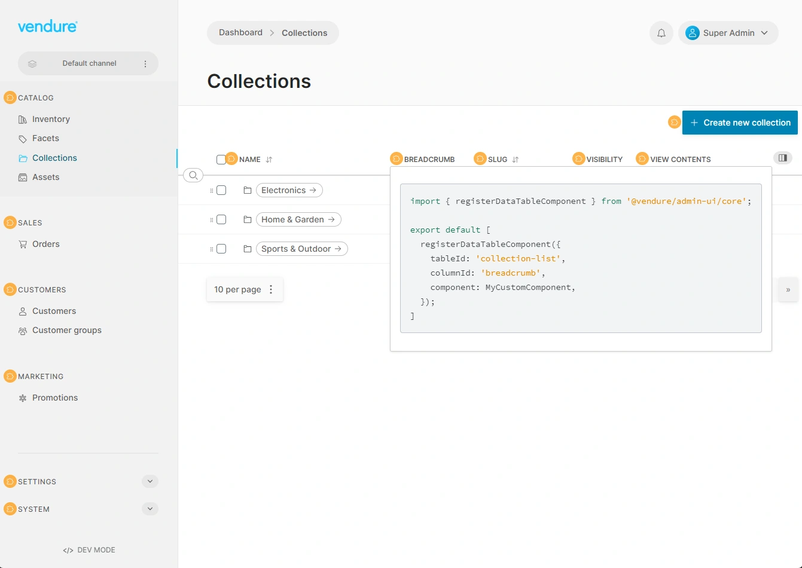
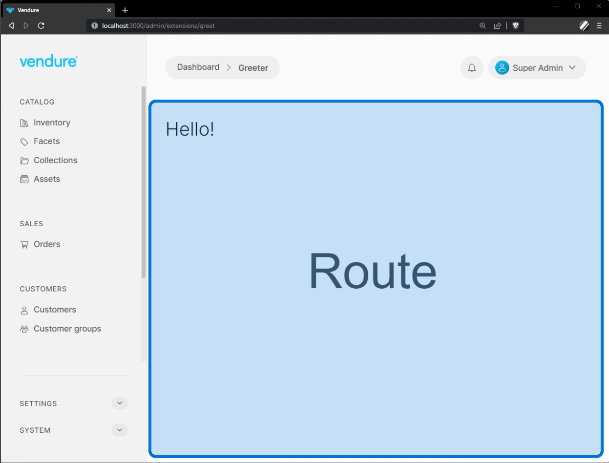

import Tabs from '@theme/Tabs';
import TabItem from '@theme/TabItem';

When creating a plugin, you may wish to extend the Admin UI in order to expose a graphical interface to the plugin's functionality, or to add new functionality to the Admin UI itself. The UI can be extended with custom components written in [Angular](https://angular.io/) or [React](https://react.dev/).

:::note
The APIs described in this section were introduced in Vendure v2.1.0. For the legacy APIs, see the [Legacy API section](#legacy-api--v210).
:::

UI extensions fall into two categories:

-   **Providers**: these are used to add new functionality to the Admin UI, such as adding buttons to pages, adding new nav menu items, or defining custom form inputs. They would typically be defined in a file named `providers.ts`.
-   **Routes**: these are used to define new pages in the Admin UI, such as a new page for managing a custom entity. They would typically be defined in a file named `routes.ts`.

## Setup

:::cli
Use `npx vendure add` and select "Set up Admin UI extensions".

Then follow the prompts, which will guide you through the process of 
setting up the necessary files and folders for your UI extensions.
:::

### Manual setup

It is recommended to use the `vendure add` command as described above, but if you prefer to set up the 
Admin UI extensions manually, follow these steps:

First, install the [`@vendure/ui-devkit` package](https://www.npmjs.com/package/@vendure/ui-devkit) as a dev dependency:

<Tabs>
<TabItem value="npm" label="npm" default>

```bash
npm install --save-dev @vendure/ui-devkit
```

</TabItem>
<TabItem value="yarn" label="yarn">

```bash
yarn add --dev @vendure/ui-devkit
```

</TabItem>
</Tabs>

:::info
If you plan to use React components in your UI extensions, you should also install the `@types/react` package:


<Tabs>
<TabItem value="npm" label="npm" default>

```bash
npm install --save-dev @types/react
```

</TabItem>
<TabItem value="yarn" label="yarn">

```bash
yarn add --dev @types/react
```

</TabItem>
</Tabs>

:::


You can then create the following folder structure to hold your UI extensions:

```
src
├── vendure-config.ts
└── plugins
    └── my-plugin
        └── ui
            ├── routes.ts
            └── providers.ts
```

Let's add a simple UI extension that adds a new button to the "order list" page. We'll leave the routes file empty for now.

```ts title="src/plugins/my-plugin/ui/providers.ts"
import { addActionBarItem } from '@vendure/admin-ui/core';

export default [
    addActionBarItem({
        id: 'test-button',
        label: 'Test Button',
        locationId: 'order-list',
    }),
];
```

You can then use the [`compileUiExtensions` function](/reference/admin-ui-api/ui-devkit/compile-ui-extensions/) to compile your UI extensions and add them to the Admin UI app bundle.

```ts title="src/vendure-config.ts"
import { VendureConfig } from '@vendure/core';
import { AdminUiPlugin } from '@vendure/admin-ui-plugin';
// highlight-next-line
import { compileUiExtensions } from '@vendure/ui-devkit/compiler';
import * as path from 'path';

export const config: VendureConfig = {
    // ...
    plugins: [
        AdminUiPlugin.init({
            port: 3002,
            // highlight-start
            app: compileUiExtensions({
                outputPath: path.join(__dirname, '../admin-ui'),
                extensions: [
                    {
                        id: 'test-extension',
                        extensionPath: path.join(__dirname, 'plugins/my-plugin/ui'),
                        providers: ['providers.ts'],
                    },
                ],
                devMode: true,
            }),
            // highlight-end
            adminUiConfig: {
                apiPort: 3000,
            },
        }),
    ],
};
```

Now when you start the server, the following will happen:

1. A new folder called `admin-ui` will be created in the root of your project (as specified by the `outputPath` option). This is a temporary directory (it should not be added to version control) which will contain the source files of your custom Admin UI app.
2. During bootstrap, the `compileUiExtensions` function will be called, which will compile the Admin UI app and serve it in development mode. The dev server will be listening on port `4200` but this port will also be proxied to port `3000` (as specified by `apiOptions.port`). This step can take up to a minute or two, depending on the speed of your machine.

:::caution
**Note:** the TypeScript source files of your UI extensions **must not** be compiled by your regular TypeScript build task. This is because they will instead be compiled by the Angular compiler when you run `compileUiExtensions()`.

You can exclude them in your main `tsconfig.json` by adding a line to the "exclude" array:

```json title="tsconfig.json"
{
    "exclude": [
        "node_modules",
        "migration.ts",
        // highlight-start
        "src/plugins/**/ui/*",
        "admin-ui"
        // highlight-end
    ]
}
```

:::

:::info
**How It Works:** The Admin UI is an Angular application, and to generate a custom UI including your extensions, it is internally using the powerful [Angular CLI](https://angular.io/cli) to compile the app into an optimized bundle, including code-splitting and lazy-loading any routes which you define.
:::

## Providers

Your `providers.ts` file exports an array of objects known as "providers" in Angular terminology. These providers are passed to the application on startup to configure new functionality.

With providers you can:

-   Add new buttons to the action bar of existing pages (the top bar containing the primary actions for a page) using [`addActionBarItem`](/reference/admin-ui-api/action-bar/add-action-bar-item).
-   Add new menu items to the left-hand navigation menu using [`addNavMenuItem`](/reference/admin-ui-api/nav-menu/add-nav-menu-item) and [`addNavMenuSection`](/reference/admin-ui-api/nav-menu/add-nav-menu-section).
-   Define bulk actions for list views using [`registerBulkAction`](/reference/admin-ui-api/bulk-actions/register-bulk-action).
-   Define arbitrary components to be rendered in a detail view page using [`registerCustomDetailComponent`](/reference/admin-ui-api/custom-detail-components/register-custom-detail-component) or [`registerReactCustomDetailComponent`](/reference/admin-ui-api/react-extensions/register-react-custom-detail-component)
-   Add custom widgets to the dashboard using [`registerDashboardWidget`](/reference/admin-ui-api/dashboard-widgets/register-dashboard-widget)
-   Define custom components for rendering data table cells using [`registerDataTableComponent`](/reference/admin-ui-api/custom-table-components/register-data-table-component) or [`registerReactDataTableComponent`](/reference/admin-ui-api/react-extensions/register-react-data-table-component)
-   Define custom form input components for custom fields and configurable operation arguments using [`registerFormInputComponent`](/reference/admin-ui-api/custom-input-components/register-form-input-component) or [`registerReactFormInputComponent`](/reference/admin-ui-api/react-extensions/register-react-form-input-component)
-   Define custom components to render customer/order history timeline entries using [`registerHistoryEntryComponent`](/reference/admin-ui-api/custom-history-entry-components/register-history-entry-component)

### Providers format 

A providers file should have a **default export** which is an array of providers:

```ts title="src/plugins/my-plugin/ui/providers.ts"
import { addActionBarItem } from '@vendure/admin-ui/core';

export default [
    addActionBarItem({
        id: 'test-button',
        label: 'Test Button',
        locationId: 'order-list',
    }),
];
```

### Specifying providers

When defining UI extensions in the `compileUiExtensions()` function, you must specify at least one providers file. This is done by passing an array of file paths, where each file path is relative to the directory specified by the `extensionPath` option.

```ts title="src/vendure-config.ts"
import { compileUiExtensions } from '@vendure/ui-devkit/compiler';
import * as path from 'path';

// ... omitted for brevity

compileUiExtensions({
    outputPath: path.join(__dirname, '../admin-ui'),
    extensions: [
        {
            id: 'test-extension',
            extensionPath: path.join(__dirname, 'plugins/my-plugin/ui'),
            // highlight-next-line
            providers: ['providers.ts'],
        },
    ],
    devMode: true,
});
```

:::info
When running the Admin UI in dev mode, you can use the `ctrl + u` keyboard shortcut to see the location of all UI extension points.

Clicking on an extension point will display a code snippet which you can copy and paste into your `providers.ts` file.


:::

In addition to the specialized UI extension providers listed above, the providers array can also contain any kind of Angular providers which you want to use inside your custom logic. For example, we can define a custom service, add it to the providers array and then consume it from within another provider:

```ts title="src/plugins/my-plugin/ui/providers.ts"
import { Injectable } from '@angular/core';
import { addActionBarItem } from '@vendure/admin-ui/core';

// highlight-start
@Injectable()
class MyService {
    greet() { return 'Hello!'; }
}
// highlight-end 

export default [
    MyService,
    addActionBarItem({
        id: 'print-invoice',
        label: 'Print invoice',
        locationId: 'order-detail',
        onClick: (event, context) => {
            // highlight-start
            const myService = context.injector.get(MyService);
            console.log(myService.greet());
            // logs "Hello!"
            // highlight-end
        },
    }),
];
```


## Routes

Routes allow you to define completely custom views in the Admin UI.



Your `routes.ts` file exports an array of objects which define new routes in the Admin UI. For example, imagine you have created a plugin which implements a simple content management system. You can define a route for the list of articles, and another for the detail view of an article.

For a detailed instructions, see the [Defining Routes guide](/guides/extending-the-admin-ui/defining-routes/).


## Dev vs Prod mode

When you are developing your Admin UI extension, you can set the `devMode` option to `true` which will compile the Admin UI app in development mode, and recompile and auto-refresh the browser on any changes to your extension source files.

```ts title="src/vendure-config.ts"
import { VendureConfig } from '@vendure/core';
import { AdminUiPlugin } from '@vendure/admin-ui-plugin';
import { compileUiExtensions } from '@vendure/ui-devkit/compiler';
import * as path from 'path';

export const config: VendureConfig = {
    // ...
    plugins: [
        AdminUiPlugin.init({
            port: 3002,
            app: compileUiExtensions({
                outputPath: path.join(__dirname, '../admin-ui'),
                extensions: [
                    {
                        // ...
                    },
                ],
                devMode: true,
            }),
        }),
    ],
};
```

## Compiling as a deployment step

Although the examples so far all use the `compileUiExtensions` function in conjunction with the AdminUiPlugin, it is also possible to use it on its own:

```ts title="src/compile-admin-ui.ts"
import { compileUiExtensions } from '@vendure/ui-devkit/compiler';
import * as path from 'path';

compileUiExtensions({
    outputPath: path.join(__dirname, '../admin-ui'),
    extensions: [
        /* ... */
    ],
})
    .compile?.()
    .then(() => {
        process.exit(0);
    });
```

This can then be run from the command line:

<Tabs>
<TabItem value="npm" label="npm" default>

```bash
npm run ts-node compile-admin-ui.ts
```

</TabItem>
<TabItem value="yarn" label="yarn">

```bash
yarn ts-node compile-admin-ui.ts
```

</TabItem>
</Tabs>

Once complete, the production-ready app bundle will be output to `admin-ui/dist`. This method is suitable for a production setup, so that the Admin UI can be compiled ahead-of-time as part of your deployment process. This ensures that your Vendure server starts up as quickly as possible. In this case, you can pass the path of the compiled app to the AdminUiPlugin:

```ts title="src/vendure-config.ts"
import { VendureConfig } from '@vendure/core';
import { AdminUiPlugin } from '@vendure/admin-ui-plugin';
import * as path from 'path';

export const config: VendureConfig = {
    // ...
    plugins: [
        AdminUiPlugin.init({
            port: 3002,
            app: {
                path: path.join(__dirname, '../admin-ui/dist'),
            },
        }),
    ],
};
```

:::info
To compile the angular app ahead of time (for production) and copy the dist folder to Vendure's output dist folder, include the following commands in your packages.json scripts:

```json
{
    "scripts": {
        "copy": "npx copyfiles -u 1 'src/__admin-ui/dist/**/*' dist",
        "build": "tsc && yarn copy",
        "build:admin": "rimraf admin-ui && npx ts-node src/compile-admin-ui.ts"
    }
}
```

"build:admin" will remove the admin-ui folder and run the compileUiExtensions function to generate the admin-ui Angular app.
Make sure to install copyfiles before running the "copy" command:

<Tabs>
<TabItem value="npm" label="npm" default>

```bash
npm install copyfiles
```

</TabItem>
<TabItem value="yarn" label="yarn">

```bash
yarn add copyfiles
```

</TabItem>
</Tabs>

:::

## Using other frameworks

While the Admin UI natively supports extensions written with Angular or React, it is still possible to create extensions using other front-end frameworks such as Vue or Solid. Note that creating extensions in this way is much more limited, with only the ability to define new routes, and limited access to internal services such as data fetching and notifications. See [UI extensions in other frameworks](/guides/extending-the-admin-ui/using-other-frameworks/).

## IDE Support

### WebStorm

If you are using Angular in your UI extensions and WebStorm is not recognizing the Angular templates, you can
add an `angular.json` file to the `/src/plugins/<my-plugin>/ui` directory:

```json title="angular.json"
{
    "$schema": "../../../../node_modules/@angular/cli/lib/config/schema.json",
    "version": 1,
    "newProjectRoot": "projects",
    "projects": {
        "ui-extensions": {
            "root": "",
            "sourceRoot": "src",
            "projectType": "application"
        }
    }
}
```

This allows WebStorm's built-in Angular support to recognize the Angular templates in your UI extensions. Note that depending
on your folder structure, you may need to adjust the path to the schema file in the `$schema` property.

### VS Code

If you are using Angular in your UI extensions and VS Code is not recognizing the Angular templates, you can
add an empty `tsconfig.json` file to the `/src/plugins/<my-plugin>/ui` directory:

```json title="tsconfig.json"
{}
```

This works around the fact that your main `tsconfig.json` file excludes the `src/plugins/**/ui` directory, 
which would otherwise prevent the Angular Language Service from working correctly.

## Legacy API < v2.1.0

Prior to Vendure v2.1.0, the API for extending the Admin UI was more verbose and less flexible (React components were not supported at all, for instance). This API is still supported, but from v2.1 is marked as deprecated and will be removed in a future major version. 

This section describes the legacy API.

### Lazy vs Shared Modules

Angular uses the concept of modules ([NgModules](https://angular.io/guide/ngmodules)) for organizing related code. These modules can be lazily loaded, which means that the code is not loaded when the app starts, but only later once that code is required. This keeps the main bundle small and improves performance.

When creating your UI extensions, you can set your module to be either `lazy` or `shared`. Shared modules are loaded _eagerly_, i.e. their code is bundled up with the main app and loaded as soon as the app loads.

As a rule, modules defining new routes should be lazily loaded (so that the code is only loaded once that route is activated), and modules defining [new navigations items](/guides/extending-the-admin-ui/nav-menu/) and [custom form input](/guides/extending-the-admin-ui/custom-form-inputs/) should be set to `shared`.

:::info
"lazy" modules are equivalent to the new "routes" API, and "shared" modules are equivalent to the new "providers" API. In fact, behind the scenes,
the new APIs are automatically creating these modules for you.
:::

### Example lazy module

Here's a very simple Angular component which displays a greeting:

```ts title="src/plugins/greeter/ui/components/greeter/greeter.component.ts"
import { Component } from '@angular/core';

@Component({
    selector: 'greeter',
    template: `<vdr-page-block><h1>{{ greeting }}</h1></vdr-page-block>`,
})
export class GreeterComponent {
    greeting = 'Hello!';
}
```

Next we need to declare an Angular module to house the component:

```ts title="src/plugins/greeter/ui/greeter.module.ts"
import { NgModule } from '@angular/core';
import { RouterModule } from '@angular/router';
import { SharedModule } from '@vendure/admin-ui/core';
import { GreeterComponent } from './greeter.component';

@NgModule({
    imports: [
        SharedModule,
        RouterModule.forChild([{
            path: '',
            pathMatch: 'full',
            component: GreeterComponent,
            data: { breadcrumb: 'Greeter' },
        }]),
    ],
    declarations: [GreeterComponent],
})
export class GreeterModule {}
```

:::note
The `SharedModule` should, in general, always be imported by your extension modules. It provides the basic Angular
directives and other common functionality that any extension would require.
:::

Now we need to tell the `compileUiExtensions` function where to find the extension, and which file contains the NgModule itself (since a non-trivial UI extension will likely contain multiple files).

```ts title="src/vendure-config.ts"
import path from 'path';
import { AdminUiPlugin } from '@vendure/admin-ui-plugin';
import { VendureConfig } from '@vendure/core';
import { compileUiExtensions } from '@vendure/ui-devkit/compiler';

export const config: VendureConfig = {
    // ...
    plugins: [
        AdminUiPlugin.init({
            port: 3002,
            app: compileUiExtensions({
                outputPath: path.join(__dirname, '../admin-ui'),
                extensions: [{
                    extensionPath: path.join(__dirname, 'plugins/greeter/ui'),
                    // highlight-start
                    ngModules: [{
                        type: 'lazy',
                        route: 'greet',
                        ngModuleFileName: 'greeter.module.ts',
                        ngModuleName: 'GreeterModule',
                    }],
                    // highlight-end
                }],
            }),
        }),
    ],
};
```

### Example shared module

Here's an example of the legacy API for defining a shared module:

```ts title="src/plugins/invoices/ui/invoice-shared.module.ts"
import { NgModule } from '@angular/core';
import { SharedModule, addActionBarItem } from '@vendure/admin-ui/core';

@NgModule({
    imports: [SharedModule],
    providers: [
        addActionBarItem({
            id: 'print-invoice',
            label: 'Print invoice',
            locationId: 'order-detail',
            routerLink: route => {
                const id = route.snapshot.params.id;
                return ['./extensions/order-invoices', id];
            },
            requiresPermission: 'ReadOrder',
        }),
    ],
})
export class InvoiceSharedModule {}
```

```ts title="src/vendure-config.ts"
import path from 'path';
import { AdminUiPlugin } from '@vendure/admin-ui-plugin';
import { VendureConfig } from '@vendure/core';
import { compileUiExtensions } from '@vendure/ui-devkit/compiler';

export const config: VendureConfig = {
    // ...
    plugins: [
        AdminUiPlugin.init({
            port: 3002,
            app: compileUiExtensions({
                outputPath: path.join(__dirname, '../admin-ui'),
                extensions: [{
                    extensionPath: path.join(__dirname, 'plugins/invoices/ui'),
                    // highlight-start
                    ngModules: [{
                        type: 'shared',
                        ngModuleFileName: 'invoice-shared.module.ts',
                        ngModuleName: 'InvoiceSharedModule',
                    }],
                    // highlight-end
                }],
            }),
        }),
    ],
};
```

### Migrating to the new API

If you have existing UI extensions written using the legacy API, you can migrate them to the new API as follows:

1. Convert all components to be [standalone components](https://angular.io/guide/standalone-components). Standalone components were introduced in recent versions of Angular and allow components to be defined without the need for a module. To convert an existing component, you need to set `standalone: true` and add an `imports` array containing any components, directives or pipes you are using in that component. Typically, you can import `SharedModule` to get access to all the common Angular directives and pipes, as well as the shared Admin UI components.
  ```ts
  import { Component } from '@angular/core';
  // highlight-next-line
  import { SharedModule } from '@vendure/admin-ui/core';
  
  @Component({
      selector: 'greeter',
      template: `<vdr-page-block><h1>{{ greeting }}</h1></vdr-page-block>`,
      // highlight-start
      standalone: true,
      imports: [SharedModule],
      // highlight-end
  })
  export class GreeterComponent {
      greeting = 'Hello!';
  }
  ```
2. In templates for page components, remove the `<vdr-page-header>` and `<vdr-page-body>` components, as they are included by default now when using
the `registeRouteComponent()` function:
   ```html
   // highlight-start
   <vdr-page-header>
       <vdr-page-title></vdr-page-title>
   </vdr-page-header>
   <vdr-page-body>
   // highlight-end
       <vdr-page-block>This content should remain</vdr-page-block>
   // highlight-next-line
   </vdr-page-body>
   ```
3. Remove any `NgModule` files, and replace lazy modules with `routes.ts`, and shared modules with `providers.ts` (see above).

