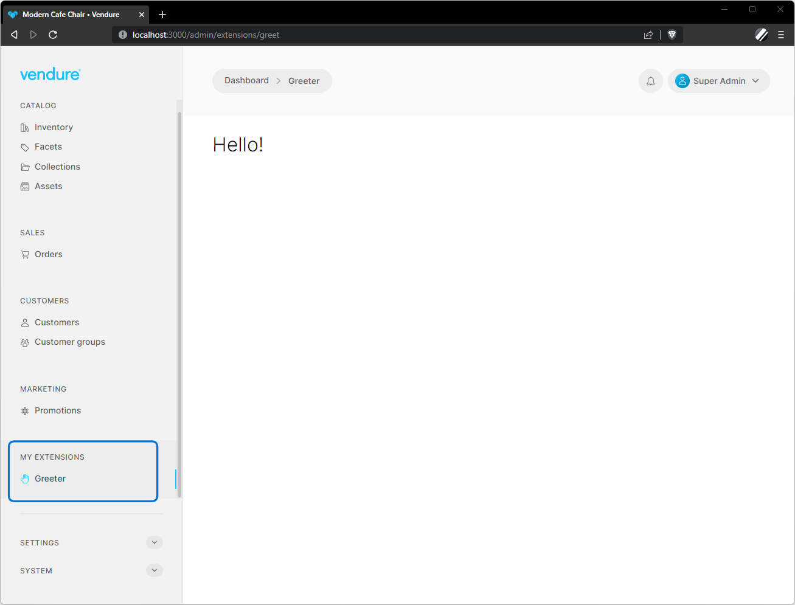
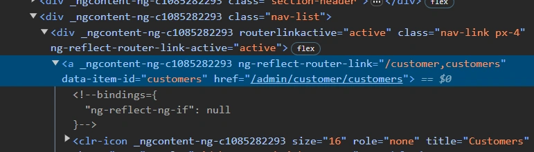

The Nav Menu is the main navigation for the Admin UI, located on the left-hand side when in desktop mode. It is used to provide top-level
access to routes in the app, and can be extended and modified by UI extensions.

## Extending the NavMenu

Once you have defined some custom routes, you need some way for the administrator to access them. For this you will use the [addNavMenuItem](/reference/admin-ui-api/nav-menu/add-nav-menu-item/) and [addNavMenuSection](/reference/admin-ui-api/nav-menu/add-nav-menu-section) functions.

Let's add a new section to the Admin UI main nav bar containing a link to the "greeter" module from the [Getting Started guide](/guides/extending-the-admin-ui/getting-started/#routes) example:

```ts title="src/plugins/greeter/ui/providers.ts"
import { addNavMenuSection } from '@vendure/admin-ui/core';

export default [
    addNavMenuSection({
        id: 'greeter',
        label: 'My Extensions',
        items: [{
            id: 'greeter',
            label: 'Greeter',
            routerLink: ['/extensions/greet'],
            // Icon can be any of https://core.clarity.design/foundation/icons/shapes/
            icon: 'cursor-hand-open',
        }],
    },
    // Add this section before the "settings" section
    'settings'),
];
```

Now we must also register these providers with the compiler:

```ts title="src/vendure-config.ts"
import path from 'path';
import { VendureConfig } from '@vendure/core';
import { AdminUiPlugin } from '@vendure/admin-ui-plugin';
import { compileUiExtensions } from '@vendure/ui-devkit/compiler';

export const config: VendureConfig = {
    // ...
    plugins: [
        AdminUiPlugin.init({
            port: 3002,
            app: compileUiExtensions({
                outputPath: path.join(__dirname, '../admin-ui'),
                extensions: [
                    {
                        id: 'greeter',
                        extensionPath: path.join(__dirname, 'plugins/greeter/ui'),
                        routes: [{ route: 'greet', filePath: 'routes.ts' }],
                        // highlight-start
                        providers: ['providers.ts']
                        // highlight-end
                    },
                ],
            }),
        }),
    ],
};
```

Running the server will compile our new shared module into the app, and the result should look like this:



## Overriding existing nav items

It is also possible to override one of the default (built-in) nav menu sections or items. This can be useful for example if you wish to provide a completely different implementation of the product list view.

This is done by setting the `id` property to that of an existing nav menu section or item. The `id` can be found by inspecting the link element in your browser's dev tools for the `data-item-id` attribute:



## Removing existing nav items

If you would like to remove an existing nav item, you can do so by overriding it and setting the `requiresPermission` property to an invalid value:

```ts title="src/plugins/greeter/ui/providers.ts"
import { SharedModule, addNavMenuItem} from '@vendure/admin-ui/core';

export default [
    addNavMenuItem({
        id: 'collections',  // <-- we will override the "collections" menu item
        label: 'Collections',
        routerLink: ['/catalog', 'collections'],
        // highlight-start
        // we use an invalid permission which ensures it is hidden from all users
        requiresPermission: '__disable__'
        // highlight-end
    },
    'catalog'),
];
```
