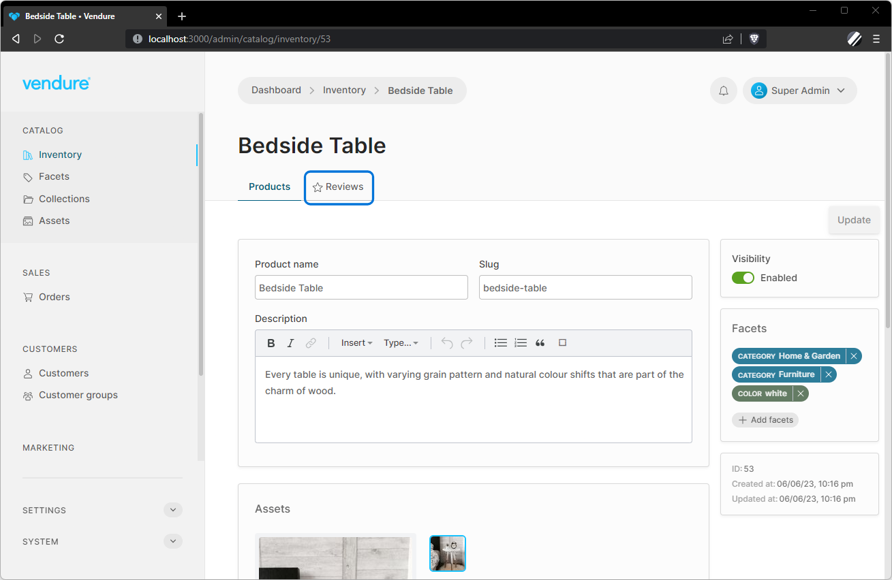

You can add your own tabs to any of the Admin UI's list or detail pages using the [registerPageTab](/reference/admin-ui-api/tabs/register-page-tab/) function. For example, to add a new tab to the product detail page for displaying product reviews:

```ts title="src/plugins/reviews/ui/providers.ts"
import { registerPageTab } from '@vendure/admin-ui/core';

import { ReviewListComponent } from './components/review-list/review-list.component';

export default [
    registerPageTab({
        location: 'product-detail',
        tab: 'Reviews',
        route: 'reviews',
        tabIcon: 'star',
        component: ReviewListComponent,
    }),
];
```



If you want to add page tabs to a custom admin page, specify the `locationId` property:

```ts title="src/plugins/my-plugin/ui/routes.ts"
import { registerRouteComponent } from '@vendure/admin-ui/core';
import { TestComponent } from './components/test/test.component';

export default [
    registerRouteComponent({
        component: TestComponent,
        title: 'Test',
        // highlight-next-line
        locationId: 'my-location-id'
    }),
];
```

:::note
Currently it is only possible to define new tabs using Angular components.
:::
