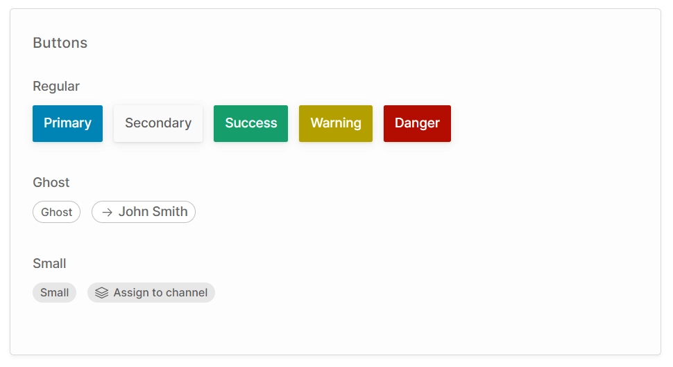
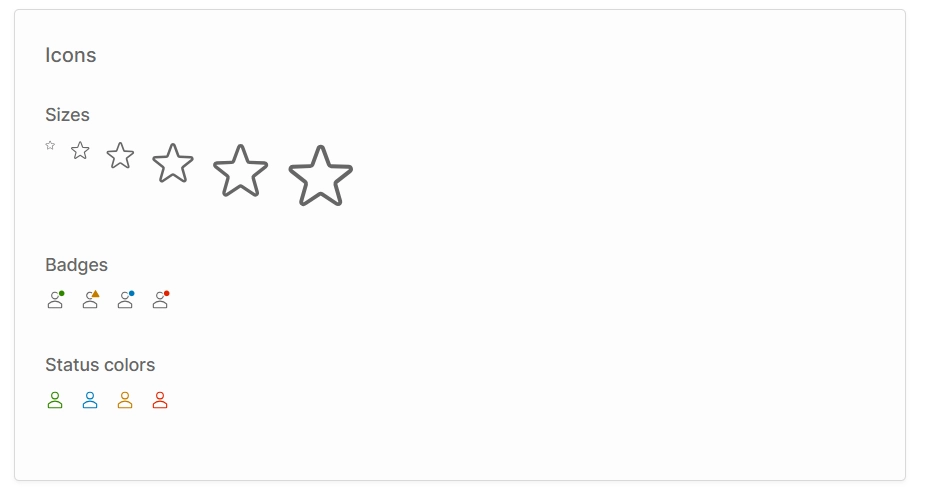
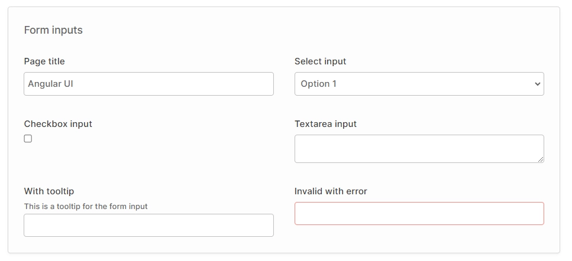
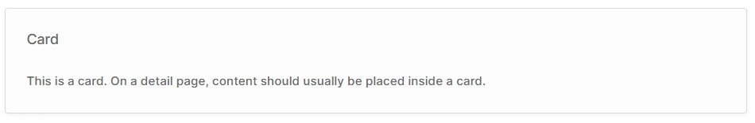
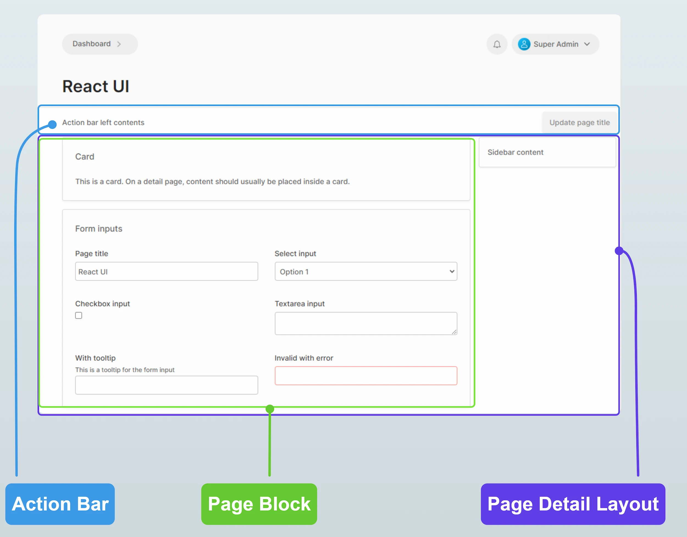

import Tabs from '@theme/Tabs';
import TabItem from '@theme/TabItem';

The Admin UI is built on a customized version of the [Clarity Design System](https://clarity.design/documentation/get-started). This means that if you are writing Angular-based UI extensions, you can use the same components that are used in the rest of the Admin UI. If you are using React, we are gradually exporting the most-used components for use with React.

## Buttons



There are three types of button:

- **Regular**: These are general-purpose buttons available in a number of styles. They are used in the action bar and as confirmation buttons for dialogs.
- **Ghost**: This style is primarily used to indicate a column in a table which is a link to a detail view.
- **Small**: This style is used for secondary actions of less prominence than a standard button, or when the button must fit in a small space.


<Tabs groupId="framework">
<TabItem value="Angular" label="Angular" default>


```html
<button class="button primary">Primary</button>
<button class="button secondary">Secondary</button>
<button class="button success">Success</button>
<button class="button warning">Warning</button>
<button class="button danger">Danger</button>

<button class="button-ghost">Ghost</button>
<a class="button-ghost" [routerLink]="['/extensions/my-plugin/my-custom-route']">
    <clr-icon shape="arrow" dir="right"></clr-icon>
    John Smith
</a>

<button class="button-small">Small</button>
<button class="button-small">
    <clr-icon shape="layers"></clr-icon>
    Assign to channel
</button>
```

</TabItem>
<TabItem value="React" label="React">

```tsx
import React from 'react';
import { CdsIcon, Link } from '@vendure/admin-ui/react';

export function DemoComponent() {
    return (
        <>
            <button className="button primary">Primary</button>
            <button className="button secondary">Secondary</button>
            <button className="button success">Success</button>
            <button className="button warning">Warning</button>
            <button className="button danger">Danger</button>
            
            <button className="button-ghost">Ghost</button>
            <Link className="button-ghost" href="/extensions/my-plugin/my-custom-route">
                <CdsIcon icon={arrowIcon} direction="right" />
                John Smith
            </Link>
            
            <button className="button-small">Small</button>
            <button className="button-small">
                <CdsIcon icon={layersIcon} />
                Assign to channel
            </button>
        </>
    );
}
```

</TabItem>
</Tabs>


## Icons

You can use the built-in [Clarity Icons](https://core.clarity.design/foundation/icons/shapes/) for a consistent look-and-feel with the rest of the 
Admin UI app.




<Tabs groupId="framework">
<TabItem value="Angular" label="Angular" default>


```html
<clr-icon shape="star" size="8"></clr-icon>
<clr-icon shape="star" size="16"></clr-icon>
<clr-icon shape="star" size="24"></clr-icon>
<clr-icon shape="star" size="36"></clr-icon>
<clr-icon shape="star" size="48"></clr-icon>
<clr-icon shape="star" size="56"></clr-icon>

<clr-icon shape="user" class="has-badge--success"></clr-icon>
<clr-icon shape="user" class="has-alert"></clr-icon>
<clr-icon shape="user" class="has-badge--info"></clr-icon>
<clr-icon shape="user" class="has-badge--error"></clr-icon>

<clr-icon shape="user" class="is-success"></clr-icon>
<clr-icon shape="user" class="is-info"></clr-icon>
<clr-icon shape="user" class="is-warning"></clr-icon>
<clr-icon shape="user" class="is-error"></clr-icon>
```

</TabItem>
<TabItem value="React" label="React">

```tsx
import React from 'react';
import { starIcon, userIcon } from '@cds/core/icon';
import { CdsIcon } from '@vendure/admin-ui/react';

export function DemoComponent() {
    return (
        <>
            <CdsIcon icon={starIcon} size="xs" />
            <CdsIcon icon={starIcon} size="sm" />
            <CdsIcon icon={starIcon} size="md" />
            <CdsIcon icon={starIcon} size="lg" />
            <CdsIcon icon={starIcon} size="xl" />
            <CdsIcon icon={starIcon} size="xxl" />
            
            <CdsIcon icon={userIcon} badge="success" />
            <CdsIcon icon={userIcon} badge="info" />
            <CdsIcon icon={userIcon} badge="warning" />
            <CdsIcon icon={userIcon} badge="danger" />
            
            <CdsIcon icon={userIcon} status="success" />
            <CdsIcon icon={userIcon} status="info" />
            <CdsIcon icon={userIcon} status="warning" />
            <CdsIcon icon={userIcon} status="danger" />
        </>
    );
}
```

</TabItem>
</Tabs>

## Form inputs

Form inputs are styled globally, so you don't need to use special components for these. The label & tooltip styling is controlled by the
"form field" wrapper component.




<Tabs groupId="framework">
<TabItem value="Angular" label="Angular" default>


```html
<div class="form-grid">
    <vdr-form-field label="Page title">
        <input type="text" />
    </vdr-form-field>
    <vdr-form-field label="Select input">
        <select>
            <option>Option 1</option>
            <option>Option 2</option>
        </select>
    </vdr-form-field>
    <vdr-form-field label="Checkbox input">
        <input type="checkbox" />
    </vdr-form-field>
    <vdr-form-field label="Textarea input">
        <textarea></textarea>
    </vdr-form-field>
    <vdr-form-field label="With tooltip" tooltip="This is a tooltip for the form input">
        <input type="text" />
    </vdr-form-field>
    <vdr-form-field label="Invalid with error">
        <input type="text" [formControl]="invalidFormControl" />
    </vdr-form-field>
    <vdr-rich-text-editor
        class="form-grid-span"
        label="Description"
    ></vdr-rich-text-editor>
</div>
```

</TabItem>
<TabItem value="React" label="React">

```tsx
import React from 'react';
import { starIcon, userIcon } from '@cds/core/icon';
import { FormField, RichTextEditor } from '@vendure/admin-ui/react';

export function DemoComponent() {
    return (
        <div className="form-grid">
            <FormField label="Page title">
                <input type="text" />
            </FormField>
            <FormField label="Select input">
                <select>
                    <option>Option 1</option>
                    <option>Option 2</option>
                </select>
            </FormField>
            <FormField label="Checkbox input">
                <input type="checkbox" />
            </FormField>
            <FormField label="Textarea input">
                <textarea />
            </FormField>
            <FormField label="With tooltip" tooltip="This is a tooltip for the form input">
                <input type="text" />
            </FormField>
            <FormField label="Invalid with error" invalid>
                <input type="text" />
            </FormField>
            <RichTextEditor className="form-grid-span" label="Description" readOnly={false} />
        </div>
    );
}
```

</TabItem>
</Tabs>

The `form-grid` class is used to lay out the form fields into a 2-column grid on larger screens, and a single column on smaller screens.
If you want to force a particular field to always take up the full width (i.e. to span 2 columns at all screen sizes), you can add the
`form-grid-span` class to that form field.

```html
<div class="form-grid">
    // highlight-next-line
    <vdr-form-field label="Page title" class="form-grid-span">
        <input type="text" />
    </vdr-form-field>
</div>
```

## Cards

Cards are used as a general-purpose container for page content, as a way to visually group related sets of components.




<Tabs groupId="framework">
<TabItem value="Angular" label="Angular" default>


```html
<vdr-card title="Card">
    This is a card. On a detail page, content should usually be placed inside a card.
</vdr-card>
```

</TabItem>
<TabItem value="React" label="React">

```tsx
import React from 'react';
import { Card } from '@vendure/admin-ui/react';

export function DemoComponent() {
    return (
        <Card title="Card">
            This is a card. On a detail page, content should usually be placed inside a card.
        </Card>
    );
}
```

</TabItem>
</Tabs>

## Layout

The following layout components are available:

- Page block: This is a wrapper which applies consistent margins and max-width to the contents of the page. In general, the contents of a page should always be wrapped in this component except when using the DataTable2 component, which has its own styling for margins and width.
- Action bar: This is a wrapper for the top area of the page, just below the header section. This is where the primary action buttons for the page should be located.
- Page detail layout: For detail views, this wrapper provides a two-column layout with a main content area and a sidebar.




<Tabs groupId="framework">
<TabItem value="Angular" label="Angular" default>


```html
<vdr-page-block>
    <vdr-action-bar>
        <vdr-ab-left>Action bar left contents</vdr-ab-left>
        <vdr-ab-right>
            <button class="button primary">Primary action</button>
        </vdr-ab-right>
    </vdr-action-bar>
</vdr-page-block>
<vdr-page-detail-layout>
    <vdr-page-detail-sidebar>
        <vdr-card>Sidebar content</vdr-card>
    </vdr-page-detail-sidebar>
    <vdr-page-block>
        <vdr-card title="Card">
            This is a card. On a detail page, content should usually be placed inside a card.
        </vdr-card>
    </vdr-page-block>
</vdr-page-detail-layout>
```

</TabItem>
<TabItem value="React" label="React">

```tsx
import React from 'react';
import { 
    ActionBar,
    Card,
    PageBlock,
    PageDetailLayout,
} from '@vendure/admin-ui/react';

export function DemoComponent() {
    return (
        <>
            <PageBlock>
                <ActionBar leftContent={<div>Action bar left contents</div>}>
                    <button className="button primary">Primary action</button>
                </ActionBar>
            </PageBlock>

            <PageDetailLayout
                sidebar={
                    <div>
                        <Card>Sidebar content</Card>
                    </div>
                }
            >
                <PageBlock>
                    <Card title="Card">
                        This is a card. On a detail page, content should usually be placed inside a card.
                    </Card>
                </PageBlock>
            </PageDetailLayout>
        </>
    );
}
```

</TabItem>
</Tabs>
