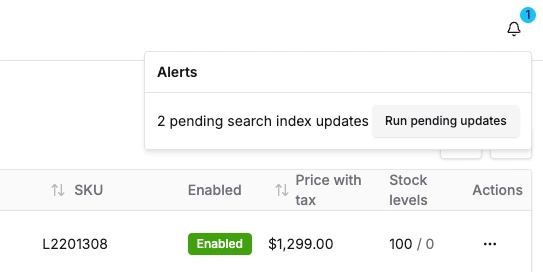

Alerts allow you to display important information to the administrators who use the Dashboard. They can be used to notify users about 
pending tasks, system status, or any conditions that require attention.

:::info
This API is further documented in the [DashboardAlertDefinition API reference](/reference/dashboard/extensions-api/alerts)
:::

## Creating a Custom Alert

To create a custom alert, you need to define a `DashboardAlertDefinition` object and register it with the Dashboard.



### Example: Pending Search Index Updates Alert

Let's take the built-in "pending search index updates" as an example, since it demonstrates many features you'll also use
in your own custom alerts.

```tsx title="pending-updates-alert.tsx"
import { graphql } from '@/gql';
import { api, DashboardAlertDefinition } from '@vendure/dashboard';
import { toast } from 'sonner';

const pendingSearchIndexUpdatesDocument = graphql(`
    query GetPendingSearchIndexUpdates {
        pendingSearchIndexUpdates
    }
`);

export const runPendingSearchIndexUpdatesDocument = graphql(`
    mutation RunPendingSearchIndexUpdates {
        runPendingSearchIndexUpdates {
            success
        }
    }
`);

export const pendingSearchIndexUpdatesAlert: DashboardAlertDefinition<number> = {
    id: 'pending-search-index-updates',
    // The `check` function is called periodically based on the `recheckInterval`.
    // It will typically do something like checking an API for data. The result
    // of this function is then used to decide whether an alert needs to be
    // displayed.
    check: async () => {
        const data = await api.query(pendingSearchIndexUpdatesDocument);
        return data.pendingSearchIndexUpdates;
    },
    recheckInterval: 10_000,
    // Determines whether to display the alert. In our case, we want to display
    // and alert if there are one or more pendingSearchIndexUpdates
    shouldShow: data => data > 0,
    title: data => `${data} pending search index updates`,
    description: 'Runs all pending search index updates',
    // The severity (info, warning, error) can be a static string, or can
    // be dynamically set based on the data returned by the `check` function.
    severity: data => (data < 10 ? 'info' : 'warning'),
    // Actions allow the administrator to take some action based on the
    // alert.
    actions: [
        {
            label: `Run pending updates`,
            onClick: async ({ dismiss }) => {
                await api.mutate(runPendingSearchIndexUpdatesDocument, {});
                toast.success('Running pending search index updates');
                // Calling this function will immediately dismiss
                // the alert.
                dismiss();
            },
        },
    ],
};
```

This alert is the registered in your dashboard extensions extry point:

```ts
import { defineDashboardExtension } from '@vendure/dashboard';

import { pendingSearchIndexUpdatesAlert } from './pending-updates-alert';

defineDashboardExtension({
    alerts: [pendingSearchIndexUpdatesAlert],
});
```

