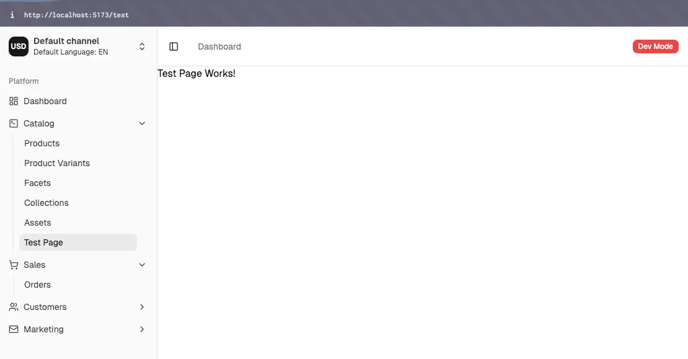
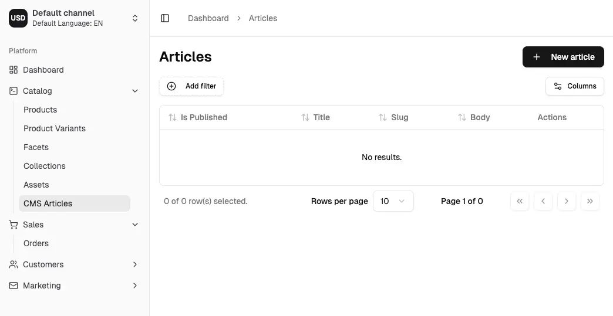

import Tabs from '@theme/Tabs';
import TabItem from '@theme/TabItem';

Follow this guide to see how to extend the dashboard with custom pages, blocks, and components.

We will create a brand new `CmsPlugin` that implements a simple content management system (CMS) for Vendure in
order to demonstrate how to extend the dashboard.

## Creating the plugin

Let's create the plugin:

```bash
npx vendure add --plugin cms
```

Now let's add an entity to the plugin:

```bash
npx vendure add --entity Article --selected-plugin CmsPlugin
```

You now have your `CmsPlugin` created with a new `Article` entity. You can find the plugin in the `./src/plugins/cms` directory.

Let's edit the entity to add the appropriate fields:

```ts title="src/plugins/cms/entities/article.entity.ts"
import { DeepPartial, HasCustomFields, VendureEntity } from '@vendure/core';
import { Column, Entity } from 'typeorm';

export class ArticleCustomFields {}

@Entity()
export class Article extends VendureEntity implements HasCustomFields {
    constructor(input?: DeepPartial<Article>) {
        super(input);
    }

    @Column()
    slug: string;

    @Column()
    title: string;

    @Column('text')
    body: string;

    @Column()
    isPublished: boolean;

    @Column(type => ArticleCustomFields)
    customFields: ArticleCustomFields;
}
```

Now let's create a new `ArticleService` to handle the business logic of our new entity:

```bash
npx vendure add --service ArticleService --selected-plugin CmsPlugin --selected-entity Article
```

The service will be created in the `./src/plugins/cms/services` directory.

Finally, we'll extend the GraphQL API to expose those CRUD operations:

```bash
npx vendure add --api-extension CmsPlugin --selected-service ArticleService --query-name ArticleQuery
```

Now the api extensions and resolver has been created in the `./src/plugins/cms/api-extensions` directory.

The last step is to create a migration for our newly-created entity:

```bash
npx vendure migrate --generate article
```

## Setting up Dashboard extensions

Dashboard extensions are declared directly on the plugin metadata. Unlike the old AdminUiPlugin, you do not need to separately
declare ui extensions anywhere except on the plugin itself.

```ts title="src/plugins/cms/cms.plugin.ts"
@VendurePlugin({
    // ...
    entities: [Article],
    adminApiExtensions: {
        schema: adminApiExtensions,
        resolvers: [ArticleAdminResolver],
    },
    // highlight-next-line
    dashboard: './dashboard/index.tsx',
})
export class CmsPlugin {
    // ...
}
```

Now we'll create the entry point of our dashboard extension:

```tsx title="src/plugins/cms/dashboard/index.tsx"
import { defineDashboardExtension } from '@vendure/dashboard';

export default defineDashboardExtension({
    // Let's add a simple test page to check things are working
    routes: [
        {
            component: () => <div>Test Page Works!</div>,
            path: '/test',
            navMenuItem: {
                id: 'test',
                title: 'Test Page',
                sectionId: 'catalog',
            },
        },
    ],
});
```

Restart the Vite server (`q, enter` to quit if still running), and then you should be able to see your new test page!



## Creating a list page

Now that the test page is working, let's create a list page for our `Article` entity.

First we'll create a new `article-list.tsx` file in the `./src/plugins/cms/dashboard` directory:

```tsx title="src/plugins/cms/dashboard/article-list.tsx"
import {
    Button,
    DashboardRouteDefinition,
    ListPage,
    PageActionBarRight,
    DetailPageButton,
} from '@vendure/dashboard';
import { Link } from '@tanstack/react-router';
import { PlusIcon } from 'lucide-react';

// This function is generated for you by the `vendureDashboardPlugin` in your Vite config.
// It uses gql-tada to generate TypeScript types which give you type safety as you write
// your queries and mutations.
import { graphql } from '@/gql';

// The fields you select here will be automatically used to generate the appropriate columns in the
// data table below.
const getArticleList = graphql(`
    query GetArticles($options: ArticleListOptions) {
        articles(options: $options) {
            items {
                id
                createdAt
                updatedAt
                isPublished
                title
                slug
                body
                customFields
            }
        }
    }
`);

const deleteArticleDocument = graphql(`
    mutation DeleteArticle($id: ID!) {
        deleteArticle(id: $id) {
            result
        }
    }
`);

export const articleList: DashboardRouteDefinition = {
    navMenuItem: {
        sectionId: 'catalog',
        id: 'articles',
        url: '/articles',
        title: 'CMS Articles',
    },
    path: '/articles',
    loader: () => ({
        breadcrumb: 'Articles',
    }),
    component: route => (
        <ListPage
            pageId="article-list"
            title="Articles"
            listQuery={getArticleList}
            deleteMutation={deleteArticleDocument}
            route={route}
            customizeColumns={{
                title: {
                    cell: ({ row }) => {
                        const post = row.original;
                        return <DetailPageButton id={post.id} label={post.title} />;
                    },
                },
            }}
        >
            <PageActionBarRight>
                <Button asChild>
                    <Link to="./new">
                        <PlusIcon className="mr-2 h-4 w-4" />
                        New article
                    </Link>
                </Button>
            </PageActionBarRight>
        </ListPage>
    ),
};
```

Let's register this route (and we can also remove the test page) in our `index.tsx` file:

```tsx title="src/plugins/cms/dashboard/index.tsx"
import { defineDashboardExtension } from '@vendure/dashboard';

// highlight-next-line
import { articleList } from './article-list';

export default defineDashboardExtension({
    routes: [
        // highlight-next-line
        articleList,
    ],
});
```

You should now be able to see the list view, which will be empty:



## Creating a detail page

Now let's create a detail page so we can start adding articles.

We'll begin with the simplest approach, where the form will be auto-generated for us based on the GraphQL schema
using the [DetailPage](/reference/dashboard/detail-views/detail-page) component.
This is useful for quickly getting started, but you will probably want to customize the form later on.

Create a new file called `article-detail.tsx` in the `./src/plugins/cms/dashboard` directory:

```tsx title="src/plugins/cms/dashboard/article-detail.tsx"
import { DashboardRouteDefinition, DetailPage, detailPageRouteLoader } from '@vendure/dashboard';
import { graphql } from '@/gql';

const articleDetailDocument = graphql(`
    query GetArticleDetail($id: ID!) {
        article(id: $id) {
            id
            createdAt
            updatedAt
            isPublished
            title
            slug
            body
            customFields
        }
    }
`);

const createArticleDocument = graphql(`
    mutation CreateArticle($input: CreateArticleInput!) {
        createArticle(input: $input) {
            id
        }
    }
`);

const updateArticleDocument = graphql(`
    mutation UpdateArticle($input: UpdateArticleInput!) {
        updateArticle(input: $input) {
            id
        }
    }
`);

export const articleDetail: DashboardRouteDefinition = {
    path: '/articles/$id',
    loader: detailPageRouteLoader({
        queryDocument: articleDetailDocument,
        breadcrumb: (isNew, entity) => [
            { path: '/articles', label: 'Articles' },
            isNew ? 'New article' : entity?.title,
        ],
    }),
    component: route => {
        return (
            <DetailPage
                pageId="article-detail"
                queryDocument={articleDetailDocument}
                createDocument={createArticleDocument}
                updateDocument={updateArticleDocument}
                route={route}
                title={article => article?.title ?? 'New article'}
                setValuesForUpdate={article => {
                    return {
                        id: article?.id ?? '',
                        isPublished: article?.isPublished ?? false,
                        title: article?.title ?? '',
                        slug: article?.slug ?? '',
                        body: article?.body ?? '',
                    };
                }}
            />
        );
    },
};
```

Now we can register this route in our `index.tsx` file:

```tsx title="src/plugins/cms/dashboard/index.tsx"
import { defineDashboardExtension } from '@vendure/dashboard';

import { articleList } from './article-list';
// highlight-next-line
import { articleDetail } from './article-detail';

export default defineDashboardExtension({
    routes: [
        articleList,
        // highlight-next-line
        articleDetail,
    ],
});
```

You should now be able to click on the "New article" button in the list view, and see the detail page:


Congratulations! You can now add, edit and delete articles in the dashboard.


## Customizing the detail page

The auto-generated [DetailPage](/reference/dashboard/detail-views/detail-page) is a great way to get started and quickly be able
to interact with your entities. But let's now see how we can fully customize the layout and form fields.

```tsx title="src/plugins/cms/dashboard/article-detail.tsx"
import {
    DashboardRouteDefinition,
    detailPageRouteLoader,
    useDetailPage,
    Page,
    PageTitle,
    PageActionBar,
    PageActionBarRight,
    PermissionGuard,
    Button,
    PageLayout,
    PageBlock,
    FormFieldWrapper,
    DetailFormGrid,
    Switch,
    Input,
    RichTextInput,
    CustomFieldsPageBlock,
} from '@vendure/dashboard';
import { AnyRoute, useNavigate } from '@tanstack/react-router';
import { toast } from 'sonner';

import { graphql } from '@/gql';

const articleDetailDocument = graphql(`
    query GetArticleDetail($id: ID!) {
        article(id: $id) {
            id
            createdAt
            updatedAt
            isPublished
            title
            slug
            body
            customFields
        }
    }
`);

const createArticleDocument = graphql(`
    mutation CreateArticle($input: CreateArticleInput!) {
        createArticle(input: $input) {
            id
        }
    }
`);

const updateArticleDocument = graphql(`
    mutation UpdateArticle($input: UpdateArticleInput!) {
        updateArticle(input: $input) {
            id
        }
    }
`);

export const articleDetail: DashboardRouteDefinition = {
    path: '/articles/$id',
    loader: detailPageRouteLoader({
        queryDocument: articleDetailDocument,
        breadcrumb: (isNew, entity) => [
            { path: '/articles', label: 'Articles' },
            isNew ? 'New article' : entity?.title,
        ],
    }),
    component: route => {
        return <ArticleDetailPage route={route} />;
    },
};

function ArticleDetailPage({ route }: { route: AnyRoute }) {
    const params = route.useParams();
    const navigate = useNavigate();
    const creatingNewEntity = params.id === 'new';

    const { form, submitHandler, entity, isPending, resetForm } = useDetailPage({
        queryDocument: articleDetailDocument,
        createDocument: createArticleDocument,
        updateDocument: updateArticleDocument,
        setValuesForUpdate: article => {
            return {
                id: article?.id ?? '',
                isPublished: article?.isPublished ?? false,
                title: article?.title ?? '',
                slug: article?.slug ?? '',
                body: article?.body ?? '',
            };
        },
        params: { id: params.id },
        onSuccess: async data => {
            toast('Successfully updated article');
            resetForm();
            if (creatingNewEntity) {
                await navigate({ to: `../$id`, params: { id: data.id } });
            }
        },
        onError: err => {
            toast('Failed to update article', {
                description: err instanceof Error ? err.message : 'Unknown error',
            });
        },
    });

    return (
        <Page pageId="article-detail" form={form} submitHandler={submitHandler}>
            <PageTitle>{creatingNewEntity ? 'New article' : (entity?.title ?? '')}</PageTitle>
            <PageActionBar>
                <PageActionBarRight>
                    <PermissionGuard requires={['UpdateProduct', 'UpdateCatalog']}>
                        <Button
                            type="submit"
                            disabled={!form.formState.isDirty || !form.formState.isValid || isPending}
                        >
                            Update
                        </Button>
                    </PermissionGuard>
                </PageActionBarRight>
            </PageActionBar>
            <PageLayout>
                <PageBlock column="side" blockId="publish-status">
                    <FormFieldWrapper
                        control={form.control}
                        name="isPublished"
                        label="Is Published"
                        render={({ field }) => (
                            <Switch checked={field.value} onCheckedChange={field.onChange} />
                        )}
                    />
                </PageBlock>
                <PageBlock column="main" blockId="main-form">
                    <DetailFormGrid>
                        <FormFieldWrapper
                            control={form.control}
                            name="title"
                            label="Title"
                            render={({ field }) => <Input {...field} />}
                        />
                        <FormFieldWrapper
                            control={form.control}
                            name="slug"
                            label="Slug"
                            render={({ field }) => <Input {...field} />}
                        />
                    </DetailFormGrid>
                    <FormFieldWrapper
                        control={form.control}
                        name="body"
                        label="Content"
                        render={({ field }) => (
                            <RichTextInput value={field.value ?? ''} onChange={field.onChange} />
                        )}
                    />
                </PageBlock>
                <CustomFieldsPageBlock column="main" entityType="Article" control={form.control} />
            </PageLayout>
        </Page>
    );
}
```

In the above example, we have:

- Used the [Page](/reference/dashboard/page-layout/page), [PageTitle](/reference/dashboard/page-layout/page-title),
  [PageActionBar](/reference/dashboard/page-layout/page-action-bar) and [PageLayout](/reference/dashboard/page-layout) components to create a layout for our page.
- Used [PageBlock](/reference/dashboard/page-layout/page-block) components to structure the page into blocks.
- Used custom form components (such as the `RichTextInput`) to better represent the data.

## API Reference

A partial API reference of the new Dashboard API can be found here:

- [Dashboard API Reference](/reference/dashboard/extensions-api/)
