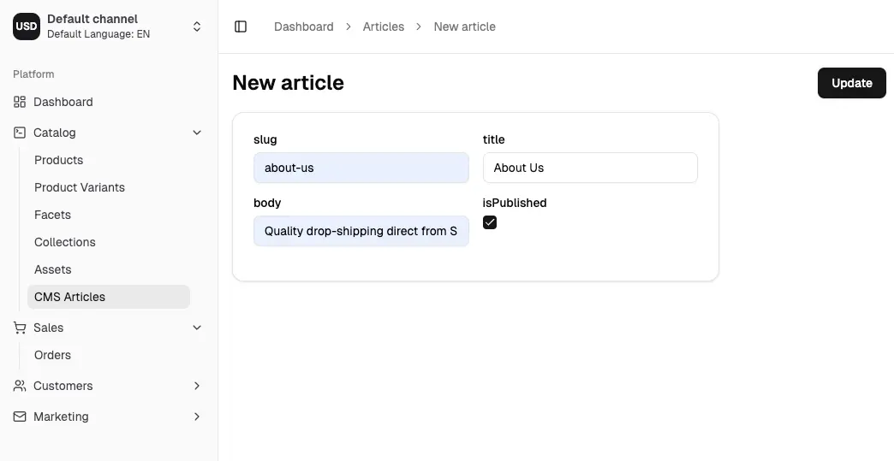
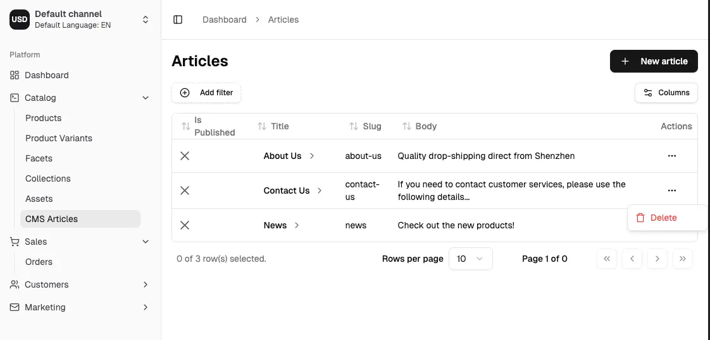

## Setup

:::info
This guide assumes you have a `CmsPlugin` with an `Article` entity, as covered in the [Extending the Dashboard: Plugin Setup](/extending-the-dashboard/extending-overview/#plugin-setup) guide.
:::

Detail pages can be created for any entity which has been exposed via the Admin API. Following the
above setup of the `CmsPlugin` will result in the following additions to your API schema:

```graphql
type Article implements Node {
    id: ID!
    createdAt: DateTime!
    updatedAt: DateTime!
    slug: String!
    title: String!
    body: String!
    isPublished: Boolean!
}

type Query {
    # ...
    article(id: ID!): Article
}

type Mutation {
    # ...
    createArticle(input: CreateArticleInput!): Article!
    updateArticle(input: UpdateArticleInput!): Article!
    deleteArticle(id: ID!): DeletionResponse!
}
```

## Simple Detail Pages

Now let's create a detail page so we can start adding articles.

We'll begin with the simplest approach, where the form will be auto-generated for us based on the GraphQL schema
using the [DetailPage](/reference/dashboard/detail-views/detail-page) component.
This is useful for quickly getting started, but you can also to customize the form later on.

Create a new file called `article-detail.tsx` in the `./src/plugins/cms/dashboard` directory:

```tsx title="src/plugins/cms/dashboard/article-detail.tsx"
import { DashboardRouteDefinition, DetailPage, detailPageRouteLoader } from '@vendure/dashboard';
import { graphql } from '@/gql';

const articleDetailDocument = graphql(`
    query GetArticleDetail($id: ID!) {
        article(id: $id) {
            id
            createdAt
            updatedAt
            isPublished
            title
            slug
            body
            customFields
        }
    }
`);

const createArticleDocument = graphql(`
    mutation CreateArticle($input: CreateArticleInput!) {
        createArticle(input: $input) {
            id
        }
    }
`);

const updateArticleDocument = graphql(`
    mutation UpdateArticle($input: UpdateArticleInput!) {
        updateArticle(input: $input) {
            id
        }
    }
`);

export const articleDetail: DashboardRouteDefinition = {
    path: '/articles/$id',
    loader: detailPageRouteLoader({
        queryDocument: articleDetailDocument,
        breadcrumb: (isNew, entity) => [
            { path: '/articles', label: 'Articles' },
            isNew ? 'New article' : entity?.title,
        ],
    }),
    component: route => {
        return (
            <DetailPage
                pageId="article-detail"
                queryDocument={articleDetailDocument}
                createDocument={createArticleDocument}
                updateDocument={updateArticleDocument}
                route={route}
                title={article => article?.title ?? 'New article'}
                setValuesForUpdate={article => {
                    return {
                        id: article?.id ?? '',
                        isPublished: article?.isPublished ?? false,
                        title: article?.title ?? '',
                        slug: article?.slug ?? '',
                        body: article?.body ?? '',
                    };
                }}
            />
        );
    },
};
```

Now we can register this route in our `index.tsx` file:

```tsx title="src/plugins/cms/dashboard/index.tsx"
import { defineDashboardExtension } from '@vendure/dashboard';

import { articleList } from './article-list';
import { articleDetail } from './article-detail'; // [!code highlight]

defineDashboardExtension({
    routes: [
        articleList,
        articleDetail, // [!code highlight]
    ],
});
```

You should now be able to click on the "New article" button in the list view, and see the detail page:


Congratulations! You can now add, edit and delete articles in the dashboard.



## Customizing the detail page

The auto-generated [DetailPage](/reference/dashboard/detail-views/detail-page) is a great way to get started and quickly be able
to interact with your entities. But let's now see how we can fully customize the layout and form fields.

```tsx title="src/plugins/cms/dashboard/article-detail.tsx"
import {
    DashboardRouteDefinition,
    detailPageRouteLoader,
    useDetailPage,
    Page,
    PageTitle,
    PageActionBar,
    PageActionBarRight,
    PermissionGuard,
    Button,
    PageLayout,
    PageBlock,
    FormFieldWrapper,
    DetailFormGrid,
    Switch,
    Input,
    RichTextInput,
    CustomFieldsPageBlock,
} from '@vendure/dashboard';
import { AnyRoute, useNavigate } from '@tanstack/react-router';
import { toast } from 'sonner';

import { graphql } from '@/gql';

const articleDetailDocument = graphql(`
    query GetArticleDetail($id: ID!) {
        article(id: $id) {
            id
            createdAt
            updatedAt
            isPublished
            title
            slug
            body
            customFields
        }
    }
`);

const createArticleDocument = graphql(`
    mutation CreateArticle($input: CreateArticleInput!) {
        createArticle(input: $input) {
            id
        }
    }
`);

const updateArticleDocument = graphql(`
    mutation UpdateArticle($input: UpdateArticleInput!) {
        updateArticle(input: $input) {
            id
        }
    }
`);

export const articleDetail: DashboardRouteDefinition = {
    path: '/articles/$id',
    loader: detailPageRouteLoader({
        queryDocument: articleDetailDocument,
        breadcrumb: (isNew, entity) => [
            { path: '/articles', label: 'Articles' },
            isNew ? 'New article' : entity?.title,
        ],
    }),
    component: route => {
        return <ArticleDetailPage route={route} />;
    },
};

function ArticleDetailPage({ route }: { route: AnyRoute }) {
    const params = route.useParams();
    const navigate = useNavigate();
    const creatingNewEntity = params.id === 'new';

    const { form, submitHandler, entity, isPending, resetForm } = useDetailPage({
        queryDocument: articleDetailDocument,
        createDocument: createArticleDocument,
        updateDocument: updateArticleDocument,
        setValuesForUpdate: article => {
            return {
                id: article?.id ?? '',
                isPublished: article?.isPublished ?? false,
                title: article?.title ?? '',
                slug: article?.slug ?? '',
                body: article?.body ?? '',
            };
        },
        params: { id: params.id },
        onSuccess: async data => {
            toast('Successfully updated article');
            resetForm();
            if (creatingNewEntity) {
                await navigate({ to: `../$id`, params: { id: data.id } });
            }
        },
        onError: err => {
            toast('Failed to update article', {
                description: err instanceof Error ? err.message : 'Unknown error',
            });
        },
    });

    return (
        <Page pageId="article-detail" form={form} submitHandler={submitHandler}>
            <PageTitle>{creatingNewEntity ? 'New article' : (entity?.title ?? '')}</PageTitle>
            <PageActionBar>
                <PageActionBarRight>
                    <PermissionGuard requires={['UpdateProduct', 'UpdateCatalog']}>
                        <Button
                            type="submit"
                            disabled={!form.formState.isDirty || !form.formState.isValid || isPending}
                        >
                            Update
                        </Button>
                    </PermissionGuard>
                </PageActionBarRight>
            </PageActionBar>
            <PageLayout>
                <PageBlock column="side" blockId="publish-status">
                    <FormFieldWrapper
                        control={form.control}
                        name="isPublished"
                        label="Is Published"
                        render={({ field }) => (
                            <Switch checked={field.value} onCheckedChange={field.onChange} />
                        )}
                    />
                </PageBlock>
                <PageBlock column="main" blockId="main-form">
                    <DetailFormGrid>
                        <FormFieldWrapper
                            control={form.control}
                            name="title"
                            label="Title"
                            render={({ field }) => <Input {...field} />}
                        />
                        <FormFieldWrapper
                            control={form.control}
                            name="slug"
                            label="Slug"
                            render={({ field }) => <Input {...field} />}
                        />
                    </DetailFormGrid>
                    <FormFieldWrapper
                        control={form.control}
                        name="body"
                        label="Content"
                        render={({ field }) => (
                            <RichTextInput value={field.value ?? ''} onChange={field.onChange} />
                        )}
                    />
                </PageBlock>
                <CustomFieldsPageBlock column="main" entityType="Article" control={form.control} />
            </PageLayout>
        </Page>
    );
}
```

In the above example, we have:

- Used the [Page](/reference/dashboard/page-layout/page), [PageTitle](/reference/dashboard/page-layout/page-title),
  [PageActionBar](/reference/dashboard/page-layout/page-action-bar) and [PageLayout](/reference/dashboard/page-layout) components to create a layout for our page.
- Used [PageBlock](/reference/dashboard/page-layout/page-block) components to structure the page into blocks.
- Used [FormFieldWrapper](/reference/dashboard/form-components/form-field-wrapper) around form components for consistent styling and
  layout of inputs.
- Used custom form components (such as the [RichTextInput](/reference/dashboard/form-components/rich-text-input)) to better represent the data.
