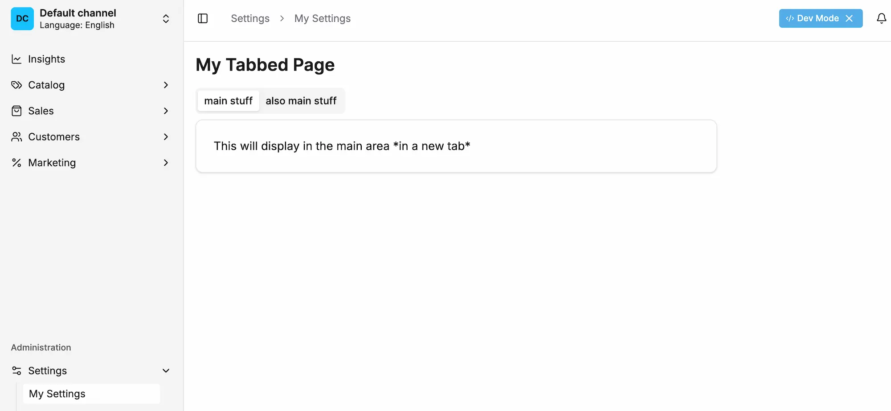

## Setup

:::info
This guide assumes you have a basic understanding of creating custom pages in the Vendure Dashboard, as covered in the [Creating List Pages](/extending-the-dashboard/creating-pages/list-pages) and [Creating Detail Pages](/extending-the-dashboard/creating-pages/detail-pages) guides.
:::

Tabbed pages allow you to organize related content into separate tabs within a single page. This is useful
for grouping configuration settings, related data views, or different aspects of an entity.

While using them within page blocks is supported, by simply using the `Tabs` component directly, you may want to use `Tabs` on the top level of your page.
This is where this guide comes in.

## Tabbed Page Example



The Dashboard provides tab components that work seamlessly with the `Page` component to create tabbed interfaces.
Using the correct format is important to avoid style issues and ensure consistent behavior.

When a component grows, you may want to consider using the `Tabs` component to help you organize your content.

```tsx title="src/plugins/my-plugin/dashboard/settings-page.tsx"
import {
    Page,
    PageTitle,
    Tabs,
    TabsContent,
    TabsList,
    TabsTrigger,
    DashboardRouteDefinition,
} from '@vendure/dashboard';

export const settingsPage: DashboardRouteDefinition = {
    navMenuItem: { sectionId: 'settings', title: 'My Settings', order: 10 },
    path: '/settings/my-settings',
    loader: () => ({
        breadcrumb: 'My Settings',
    }),
    component: () => {
        return (
            <Page pageId="my-settings">
                <PageTitle>My Tabbed Page</PageTitle>

                <Tabs defaultValue="main-stuff" className="w-full">
                    <TabsList>
                        <TabsTrigger value="main-stuff">main stuff</TabsTrigger>
                        <TabsTrigger value="other-stuff">other stuff</TabsTrigger>
                    </TabsList>

                    <TabsContent value="main-stuff">
                        <PageLayout>
                            <PageBlock column="main" blockId="main-stuff">
                                This will display in the main area *in a tab*
                            </PageBlock>
                        </PageLayout>
                    </TabsContent>

                    <TabsContent value="other-stuff">
                        <PageLayout>
                            <PageBlock column="main" blockId="other-stuff">
                                This will display in the main area *in another tab*
                            </PageBlock>
                        </PageLayout>
                    </TabsContent>
                </Tabs>
            </Page>
        );
    },
};
```

## Tab Component

This uses the stock shadcn tab component, docs are avilable [here](https://ui.shadcn.com/docs/components/tabs).

:::note
Always use the `Page` component as the root and `PageLayout` as the only child of the `TabContent` when creating tabbed pages. This ensures proper styling
and integration with the Dashboard layout system.
:::

## Avoiding Nested Layouts

The purpose of this structure is to avoid nested layout components, which can cause style and layout issues.

:::warning
One might be tempted to wrap tab content in a `FullWidthPageBlock` or `PageLayout` and then place other `PageBlock` components inside it. **This will cause layout problems.**

Instead, place `PageBlock` components directly inside each `TabsContent`, just as you would in a regular detail page.

**Incorrect approach:**

```tsx title="DO NOT DO THIS"
<Tabs value="general">
    <PageLayout>
        // this will not render correctly
        <FullWidthPageBlock blockId="tabbed-page">
            <TabsList>
                <TabsTrigger value="main-stuff">main stuff</TabsTrigger>
                <TabsTrigger value="also-main-stuff">also main stuff</TabsTrigger>
            </TabsList>

            <TabsContent value="main-stuff">
                <PageBlock column="main" blockId="main-stuff">
                    This will display in the main area *in a new tab*
                </PageBlock>
            </TabsContent>
        </FullWidthPageBlock>
    </PageLayout>
</Tabs>
```

:::

## Using Tabs with Components

You can use any Dashboard components within tab content, including forms, lists, or custom components:

```tsx
<TabsContent value="general">
    <PageBlock column="main" blockId="general-settings">
        <DetailFormGrid>
            <FormFieldWrapper
                control={form.control}
                name="siteName"
                label="Site Name"
                render={({ field }) => <Input {...field} />}
            />
            <FormFieldWrapper
                control={form.control}
                name="siteUrl"
                label="Site URL"
                render={({ field }) => <Input {...field} />}
            />
        </DetailFormGrid>
    </PageBlock>
</TabsContent>
```
