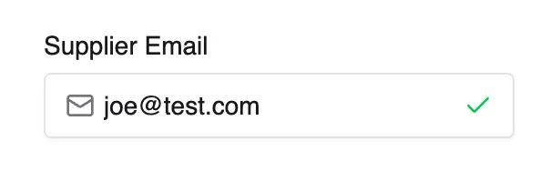
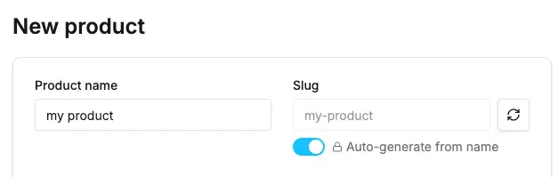

import Tabs from '@theme/Tabs';
import TabItem from '@theme/TabItem';

## Email Input with Validation

This example uses the `react-hook-form` validation state in order to display an icon indicating
the validity of the email address, as defined by the custom field "pattern" option:




<Tabs>
<TabItem value="Component" label="Component" default>
    ```tsx title="src/plugins/my-plugin/dashboard/components/email-input.tsx"
    import {AffixedInput, DashboardFormComponent} from '@vendure/dashboard';
    import {Mail, Check, X} from 'lucide-react';
    import {useFormContext} from 'react-hook-form';

    export const EmailInputComponent: DashboardFormComponent = ({name, value, onChange, disabled}) => {
        // highlight-start
        const {getFieldState} = useFormContext();
        const isValid = getFieldState(name).invalid === false;
        // highlight-end

        return (
            <AffixedInput
                prefix={<Mail className="h-4 w-4 text-muted-foreground" />}
                suffix={
                    value &&
                    // highlight-start
                    (isValid ? (
                        <Check className="h-4 w-4 text-green-500" />
                    ) : (
                        <X className="h-4 w-4 text-red-500" />
                    ))
                    // highlight-end
                }
                value={value || ''}
                onChange={e => onChange(e.target.value)}
                disabled={disabled}
                placeholder="Enter email address"
                className="pl-10 pr-10"
                name={name}
            />
        );
    };
    ```
</TabItem>
<TabItem value="Registration" label="Registration">
    ```tsx title="src/plugins/my-plugin/dashboard/index.tsx"
    import { defineDashboardExtension } from '@vendure/dashboard';

    import { EmailInputComponent } from './components/email-input';

    defineDashboardExtension({
        customFormComponents: {
            customFields: [
                {
                    // highlight-start
                    id: 'custom-email',
                    component: EmailInputComponent,
                    // highlight-end
                },
            ],
        }
    });
    ```
</TabItem>
<TabItem value="Custom field definition" label="Custom field definition">
    ```ts title="src/plugins/my-plugin/my.plugin.ts"
    @VendureConfig({
        configuration: config => {
            config.customFields.Seller.push({
                name: 'supplierEmail',
                type: 'string',
                label: [{ languageCode: LanguageCode.en, value: 'Supplier Email' }],
                // highlight-start
                pattern: '^[^\\s@]+@[^\\s@]+\\.[^\\s@]+$',
                ui: { component: 'custom-email' },
                // highlight-end
            });
            return config;
        }
    })
    export class MyPlugin {}
    ```
</TabItem>
</Tabs>

## Multi-Currency Price Input

This example demonstrates a component with its own state (using `useState`) and more complex
internal logic.


<Tabs>
<TabItem value="Component" label="Component" default>
    ```tsx title="src/plugins/my-plugin/dashboard/components/price-input.tsx"
    import {
        AffixedInput,
        DashboardFormComponent,
        Select,
        SelectContent,
        SelectItem,
        SelectTrigger,
        SelectValue,
        useLocalFormat,
    } from '@vendure/dashboard';
    import { useState } from 'react';

    export const MultiCurrencyInputComponent: DashboardFormComponent = ({ value, onChange, disabled, name }) => {
        const [currency, setCurrency] = useState('USD');
        const { formatCurrencyName } = useLocalFormat();

        const currencies = [
            { code: 'USD', symbol: '$', rate: 1 },
            { code: 'EUR', symbol: '€', rate: 0.85 },
            { code: 'GBP', symbol: '£', rate: 0.73 },
            { code: 'JPY', symbol: '¥', rate: 110 },
        ];

        const selectedCurrency = currencies.find(c => c.code === currency) || currencies[0];

        // Convert price based on exchange rate
        const displayValue = value ? (value * selectedCurrency.rate).toFixed(2) : '';

        const handleChange = (val: string) => {
            const numericValue = parseFloat(val) || 0;
            // Convert back to base currency (USD) for storage
            const baseValue = numericValue / selectedCurrency.rate;
            onChange(baseValue);
        };

        return (
            <div className="flex space-x-2">
                <Select value={currency} onValueChange={setCurrency} disabled={disabled}>
                    <SelectTrigger className="w-24">
                        <SelectValue>
                            <div className="flex items-center gap-1">{currency}</div>
                        </SelectValue>
                    </SelectTrigger>
                    <SelectContent>
                        {currencies.map(curr => {
                            return (
                                <SelectItem key={curr.code} value={curr.code}>
                                    <div className="flex items-center gap-2">{formatCurrencyName(curr.code)}</div>
                                </SelectItem>
                            );
                        })}
                    </SelectContent>
                </Select>
                <AffixedInput
                    prefix={selectedCurrency.symbol}
                    value={displayValue}
                    onChange={e => onChange(e.target.value)}
                    disabled={disabled}
                    placeholder="0.00"
                    name={name}
                />
            </div>
        );
    };
    ```
</TabItem>
<TabItem value="Registration" label="Registration">
    ```tsx title="src/plugins/my-plugin/dashboard/index.tsx"
    import { defineDashboardExtension } from '@vendure/dashboard';

    import { MultiCurrencyInputComponent } from './components/price-input';

    defineDashboardExtension({
        customFormComponents: {
            customFields: [
                {
                    id: 'custom-price',
                    component: MultiCurrencyInputComponent,
                },
            ],
        }
    });
    ```
</TabItem>
<TabItem value="Custom field definition" label="Custom field definition">
    ```ts title="src/plugins/my-plugin/my.plugin.ts"
    @VendureConfig({
        configuration: config => {
            config.customFields.Product.push({
                name: 'rrp',
                type: 'int',
                label: [{ languageCode: LanguageCode.en, value: 'RRP' }],
                // highlight-start
                ui: { component: 'custom-price' },
                // highlight-end
            });
            return config;
        }
    })
    export class MyPlugin {}
    ```
</TabItem>
</Tabs>

## Tags Input Component

This component brings better UX to a simple comma-separated tags custom field.


<Tabs>
<TabItem value="Component" label="Component" default>
    ```tsx title="src/plugins/my-plugin/dashboard/components/tags-input.tsx"
    import { Input, Badge, Button, DashboardFormComponent } from '@vendure/dashboard';
    import { useState, KeyboardEvent } from 'react';
    import { X } from 'lucide-react';

    export const TagsInputComponent: DashboardFormComponent = ({ value, onChange, disabled, name, onBlur }) => {
        const [inputValue, setInputValue] = useState('');

        // Parse tags from string value (comma-separated)
        const tags: string[] = value ? value.split(',').filter(Boolean) : [];

        const addTag = (tag: string) => {
            const trimmedTag = tag.trim();
            if (trimmedTag && !tags.includes(trimmedTag)) {
                const newTags = [...tags, trimmedTag];
                onChange(newTags.join(','));
            }
            setInputValue('');
        };

        const removeTag = (tagToRemove: string) => {
            const newTags = tags.filter(tag => tag !== tagToRemove);
            onChange(newTags.join(','));
        };

        const handleKeyDown = (e: KeyboardEvent<HTMLInputElement>) => {
            if (e.key === 'Enter' || e.key === ',') {
                e.preventDefault();
                addTag(inputValue);
            } else if (e.key === 'Backspace' && inputValue === '' && tags.length > 0) {
                removeTag(tags[tags.length - 1]);
            }
        };

        return (
            <div className="space-y-2">
                {/* Tags Display */}
                <div className="flex flex-wrap gap-1">
                    {tags.map((tag, index) => (
                        <Badge key={index} variant="secondary" className="gap-1">
                            {tag}
                            <Button
                                type="button"
                                variant="ghost"
                                size="icon"
                                className="h-4 w-4 p-0 hover:bg-transparent"
                                onClick={() => removeTag(tag)}
                                disabled={disabled}
                            >
                                <X className="h-3 w-3" />
                            </Button>
                        </Badge>
                    ))}
                </div>

                {/* Input */}
                <Input
                    value={inputValue}
                    onChange={e => setInputValue(e.target.value)}
                    onKeyDown={handleKeyDown}
                    onBlur={onBlur}
                    disabled={disabled}
                    placeholder="Type a tag and press Enter or comma"
                    name={name}
                />
            </div>
        );
    };
    ```
</TabItem>
<TabItem value="Registration" label="Registration">
    ```tsx title="src/plugins/my-plugin/dashboard/index.tsx"
    import { defineDashboardExtension } from '@vendure/dashboard';

    import { TagsInputComponent } from './components/tags-input';

    defineDashboardExtension({
        customFormComponents: {
            customFields: [
                {
                    id: 'custom-tags',
                    component: TagsInputComponent,
                },
            ],
        }
    });
    ```
</TabItem>
<TabItem value="Custom field definition" label="Custom field definition">
    ```ts title="src/plugins/my-plugin/my.plugin.ts"
    @VendureConfig({
        configuration: config => {
            config.customFields.Product.push({
                name: 'tags',
                type: 'string',
                label: [{ languageCode: LanguageCode.en, value: 'Tags' }],
                // highlight-start
                ui: { component: 'custom-tags' },
                // highlight-end
            });
            return config;
        }
    })
    export class MyPlugin {}
    ```
</TabItem>
</Tabs>

## Auto-generating Slug Input

This example demonstrates a component that automatically generates a slug from the product name.
It uses the `react-hook-form` `watch` method to get the value of another field in the form and 
react to changes in that field.



<Tabs>
<TabItem value="Component" label="Component" default>
```tsx title="src/plugins/my-plugin/dashboard/components/slug-input.tsx"
    import { Input, Button, Switch, DashboardFormComponent } from '@vendure/dashboard';
    import { useFormContext } from 'react-hook-form';
    import { useState, useEffect } from 'react';
    import { RefreshCw, Lock, Unlock } from 'lucide-react';

    export const SlugInputComponent: DashboardFormComponent = ({ value, onChange, disabled, name }) => {
        const [autoGenerate, setAutoGenerate] = useState(!value);
        const [isGenerating, setIsGenerating] = useState(false);
        const { watch } = useFormContext();
        const nameValue = watch('translations.0.name');

        const generateSlug = (text: string) => {
            return text
                .toLowerCase()
                .replace(/[^a-z0-9 -]/g, '') // Remove special characters
                .replace(/\s+/g, '-') // Replace spaces with hyphens
                .replace(/-+/g, '-') // Replace multiple hyphens with single
                .trim('-'); // Remove leading/trailing hyphens
        };

        useEffect(() => {
            if (autoGenerate && nameValue) {
                const newSlug = generateSlug(nameValue);
                if (newSlug !== value) {
                    onChange(newSlug);
                }
            }
        }, [nameValue, autoGenerate, onChange, value]);

        const handleManualGenerate = async () => {
            if (!nameValue) return;

            setIsGenerating(true);
            // Simulate API call for slug validation/generation
            await new Promise(resolve => setTimeout(resolve, 500));

            const newSlug = generateSlug(nameValue);
            onChange(newSlug);
            setIsGenerating(false);
        };

        return (
            <div className="space-y-2">
                <div className="flex items-center space-x-2">
                    <Input
                        value={value || ''}
                        onChange={e => onChange(e.target.value)}
                        disabled={disabled || autoGenerate}
                        placeholder="product-slug"
                        className="flex-1"
                        name={name}
                    />

                    <Button
                        type="button"
                        variant="outline"
                        size="icon"
                        disabled={disabled || !nameValue || isGenerating}
                        onClick={handleManualGenerate}
                    >
                        <RefreshCw className={`h-4 w-4 ${isGenerating ? 'animate-spin' : ''}`} />
                    </Button>
                </div>

                <div className="flex items-center space-x-2">
                    <Switch checked={autoGenerate} onCheckedChange={setAutoGenerate} disabled={disabled} />
                    <div className="flex items-center space-x-1 text-sm text-muted-foreground">
                        {autoGenerate ? <Lock className="h-3 w-3" /> : <Unlock className="h-3 w-3" />}
                        <span>Auto-generate from name</span>
                    </div>
                </div>
            </div>
        );
    };
    ```
</TabItem>
<TabItem value="Registration" label="Registration">
    ```tsx title="src/plugins/my-plugin/dashboard/index.tsx"
    import { defineDashboardExtension } from '@vendure/dashboard';

    import { SlugInputComponent } from './components/slug-input';

    defineDashboardExtension({
        detailForms: [
            {
                // highlight-start
                pageId: 'product-detail',
                inputs: [
                    {
                        blockId: 'main-form',
                        field: 'slug',
                        component: SlugInputComponent,
                    },
                ],
                // highlight-end
            },
        ]
    });
    ```
</TabItem>
</Tabs>

:::note
Input components completely replace the default input for the targeted field. Make sure your component handles all the data types and scenarios that the original input would have handled.
:::

## Related Guides

- **[Custom Form Elements Overview](./)** - Learn about the unified system for custom field components, input components, and display components
