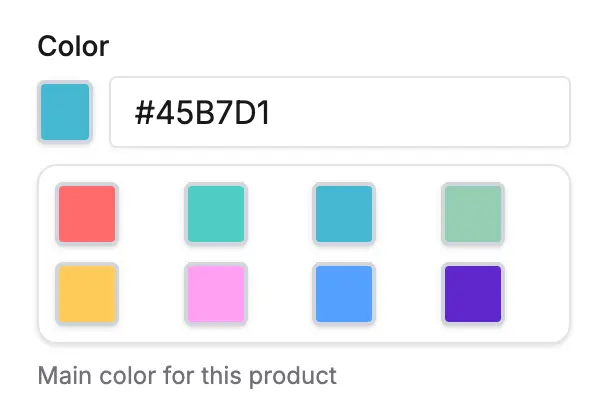
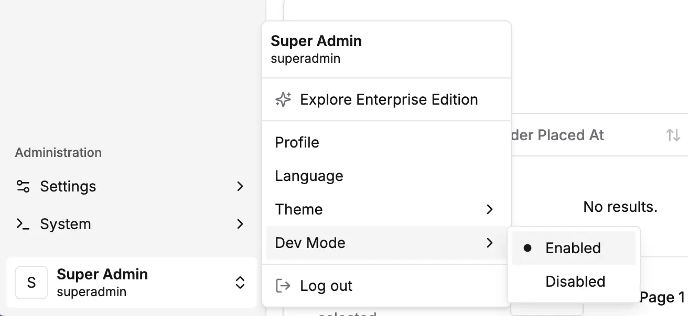
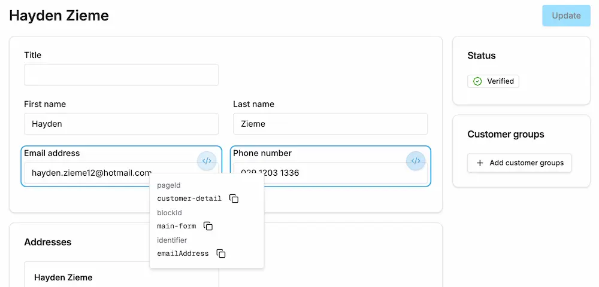

The dashboard allows you to create custom form elements that provide complete control over how data is rendered and how users
interact with forms. This includes:

- **[Custom Field Components](#custom-field-components)** — Globally-registered components that can be used to render **custom fields** and **configurable operation arguments**
- **[Detail Form Components](#detail-form-components)** — Form input components that target specific fields of detail pages

## Anatomy of a Form Component

All form components must implement the [DashboardFormComponent type](/reference/dashboard/extensions-api/form-components#dashboardformcomponent).

This type is based on the props that are made available from `react-hook-form`, which is the
underlying form library used by the Dashboard.

Here's an example custom form component that has been annotated to explain the typical parts you will be working with:

```tsx title="src/plugins/my-plugin/dashboard/components/color-picker.tsx"
import { Button, Card, CardContent, cn, DashboardFormComponent, Input } from '@vendure/dashboard';
import { useState } from 'react';
import { useFormContext } from 'react-hook-form';

// By typing your component as DashboardFormComponent, the props will be correctly typed
export const ColorPickerComponent: DashboardFormComponent = ({ value, onChange, name }) => {
    // You can use any of the built-in React hooks as usual
    const [isOpen, setIsOpen] = useState(false);

    // To access the react-hook-form context, use this hook.
    // This is useful for getting information about the current
    // field, or even other fields in the form, which allows you
    // to create advanced components that depend on the state of
    // other fields in the form.
    const { getFieldState } = useFormContext();
    // The current field name is always passed in as a prop, allowing
    // you to look up the field state
    const error = getFieldState(name).error;

    const colors = ['#FF6B6B', '#4ECDC4', '#45B7D1', '#96CEB4', '#FECA57', '#FF9FF3', '#54A0FF', '#5F27CD'];

    return (
        <div className="space-y-2">
            <div className="flex items-center space-x-2">
                <Button
                    type="button"
                    variant="outline"
                    size="icon"
                    className={cn('w-8 h-8 border-2 border-gray-300 p-0', error && 'border-red-500')}
                    style={{ backgroundColor: error ? 'transparent' : value || '#ffffff' }}
                    onClick={() => setIsOpen(!isOpen)}
                />
                <Input value={value || ''} onChange={e => onChange(e.target.value)} placeholder="#ffffff" />
            </div>

            {isOpen && (
                <Card>
                    <CardContent className="grid grid-cols-4 gap-2 p-2">
                        {colors.map(color => (
                            <Button
                                key={color}
                                type="button"
                                variant="outline"
                                size="icon"
                                className="w-8 h-8 border-2 border-gray-300 hover:border-gray-500 p-0"
                                style={{ backgroundColor: color }}
                                onClick={() => {
                                    onChange(color);
                                    setIsOpen(false);
                                }}
                            />
                        ))}
                    </CardContent>
                </Card>
            )}
        </div>
    );
};
```

Here's how this component will look when rendered in your form:



## Custom Field Components

Let's configure a [custom field](/developer-guide/custom-fields/) which uses the `ColorPickerComponent` as its form component.

First we need to register the component with the `defineDashboardExtension` function:

```tsx title="src/plugins/my-plugin/dashboard/index.tsx"
import { defineDashboardExtension } from '@vendure/dashboard';
import { ColorPickerComponent } from './components/color-picker';

defineDashboardExtension({
    customFormComponents: {
        // Custom field components for custom fields
        customFields: [
            {
                // The "id" is a global identifier for this custom component. We will // [!code highlight]
                // reference it in the next step. // [!code highlight]
                id: 'color-picker', // [!code highlight]
                component: ColorPickerComponent, // [!code highlight]
            },
        ],
    },
    // ... other extension properties
});
```

Now that we've registered it as a custom field component, we can use it in our custom field definition.

```tsx title="src/plugins/my-plugin/my.plugin.ts"
@VendurePlugin({
    // ...
    configuration: config => {
        config.customFields.Product.push({
            name: 'color',
            type: 'string',
            pattern: '^#[A-Fa-f0-9]{6}$',
            label: [{ languageCode: LanguageCode.en, value: 'Color' }],
            description: [{ languageCode: LanguageCode.en, value: 'Main color for this product' }],
            ui: {
                // This is the ID of the custom field // [!code highlight]
                // component we registered above. // [!code highlight]
                component: 'color-picker', // [!code highlight]
            },
        });
        return config;
    },
})
export class MyPlugin {}
```

## Configurable Operation Components

The `ColorPickerComponent` can also be used as a [configurable operation argument](/developer-guide/strategies-configurable-operations/#configurable-operations) component. For example, we can add a color code
to a shipping calculator:

```tsx title="src/plugins/my-plugin/config/custom-shipping-calculator.ts"
const customShippingCalculator = new ShippingCalculator({
    code: 'custom-shipping-calculator',
    description: [{ languageCode: LanguageCode.en, value: 'Custom Shipping Calculator' }],
    args: {
        color: {
            type: 'string',
            label: [{ languageCode: LanguageCode.en, value: 'Color' }],
            description: [
                { languageCode: LanguageCode.en, value: 'Color code for this shipping calculator' },
            ],
            ui: { component: 'color-picker' }, // [!code highlight]
        },
    },
    calculate: (ctx, order, args) => {
        // ...
    },
});
```

## Detail Form Components

Detail form components allow you to replace specific input fields in existing dashboard forms with custom implementations. They are targeted to specific pages, blocks, and fields.

Let's say we want to use a plain text editor for the product description field rather than the default
html-based editor.

```tsx title="src/plugins/my-plugin/dashboard/components/markdown-editor.tsx"
import { DashboardFormComponent, Textarea } from '@vendure/dashboard';

// This is a simplified example - a real markdown editor should use
// a library that handles markdown rendering and editing.
export const MarkdownEditorComponent: DashboardFormComponent = props => {
    return (
        <Textarea
            className="font-mono"
            ref={props.ref}
            onBlur={props.onBlur}
            value={props.value}
            onChange={e => props.onChange(e.target.value)}
            disabled={props.disabled}
        />
    );
};
```

You can then use this component in your detail form definition:

```tsx title="src/plugins/my-plugin/dashboard/index.tsx"
import { defineDashboardExtension } from '@vendure/dashboard';
import { MarkdownEditorComponent } from './components/markdown-editor';

defineDashboardExtension({
    detailForms: [
        {
            pageId: 'product-detail', // [!code highlight]
            inputs: [ // [!code highlight]
                { // [!code highlight]
                    blockId: 'main-form', // [!code highlight]
                    field: 'description', // [!code highlight]
                    component: MarkdownEditorComponent, // [!code highlight]
                }, // [!code highlight]
            ], // [!code highlight]
        },
    ],
});
```

### Targeting Input Components

Input components are targeted using three properties:

- **pageId**: The ID of the page (e.g., 'product-detail', 'customer-detail')
- **blockId**: The ID of the form block (e.g., 'product-form', 'customer-info')
- **field**: The name of the field to replace (e.g., 'price', 'email')

```tsx
inputs: [
    {
        pageId: 'product-variant-detail',
        blockId: 'main-form',
        field: 'price',
        component: PriceInputComponent,
    },
    {
        pageId: 'customer-detail',
        blockId: 'main-form',
        field: 'emailAddress',
        component: EmailInputComponent,
    },
];
```

You can discover the required IDs by turning on dev mode:



and then hovering over any of the form elements will allow you to view the IDs:



## Form Validation

Form validation is handled by the `react-hook-form` library, which is used by the Dashboard. Internally,
the Dashboard uses the `zod` library to validate the form data, based on the configuration of the custom field or
operation argument.

You can access validation data for the current field or the whole form by using the `useFormContext` hook.

:::note[Error Messages]
Your component does not need to handle standard error messages - the Dashboard will handle them for you.

For example, if your custom field specifies a `pattern` property, the Dashboard will automatically display an error message
if the input does not match the pattern.
:::

```tsx title="src/plugins/my-plugin/dashboard/components/validated-input.tsx"
import { DashboardFormComponent, Input, Alert, AlertDescription } from '@vendure/dashboard';
import { useFormContext } from 'react-hook-form';
import { CheckCircle2 } from 'lucide-react';

export const ValidatedInputComponent: DashboardFormComponent = ({ value, onChange, name }) => {
    const { getFieldState } = useFormContext();
    const fieldState = getFieldState(name);

    console.log(fieldState);
    // will log something like this:
    // {
    //     "invalid": false,
    //     "isDirty": false,
    //     "isValidating": false,
    //     "isTouched": false
    // }
    // You can use this data to display validation errors, etc.

    return (
        <div className="space-y-2">
            <Input
                value={field.value || ''}
                onChange={e => field.onChange(e.target.value)}
                onBlur={field.onBlur}
                className={fieldState.error ? 'border-destructive' : ''}
            />

            {fieldState.error && (
                <Alert variant="destructive">
                    <AlertDescription>{fieldState.error.message}</AlertDescription>
                </Alert>
            )}

            {fieldState.isTouched && !fieldState.error && (
                <div className="flex items-center gap-1 text-sm text-green-600">
                    <CheckCircle2 className="h-4 w-4" />
                    Valid input
                </div>
            )}
        </div>
    );
}
```

:::tip[Best Practices]

1. **Always use Shadcn UI components** from the `@vendure/dashboard` package for consistent styling
2. **Handle React Hook Form events properly** - call `onChange` and `onBlur` appropriately for custom field components
3. **Display validation errors** from `fieldState.error` when they exist (custom field components)
4. **Use dashboard design tokens** - leverage `text-destructive`, `text-muted-foreground`, etc.
5. **Provide clear visual feedback** for user interactions
6. **Handle disabled states** by using the `disabled` prop
7. **Target components precisely** using pageId, blockId, and field for input components
:::


:::important Design System Consistency
Always import UI components from the `@vendure/dashboard` package rather than creating custom inputs or buttons. This ensures your components follow the dashboard's design system and remain consistent with future updates.
:::

The unified custom form elements system gives you complete flexibility in how data is presented and edited in the dashboard, while maintaining seamless integration with React Hook Form and the dashboard's design system.

## Nested Forms and Event Handling

When creating custom form components that contain their own forms (e.g., dialogs with forms inside detail pages), you need to prevent form submission events from bubbling up to parent forms. The dashboard provides the `handleNestedFormSubmit` utility for this purpose.

### Why Use handleNestedFormSubmit?

Detail pages in the dashboard are themselves forms. If you add a custom component with its own form (like a dialog with create/edit functionality), submitting the inner form will also trigger the outer detail page form submission. This can cause:

- Unintended save operations on the detail page
- Validation errors on unrelated fields
- Loss of unsaved changes in the dialog

### Using handleNestedFormSubmit

The `handleNestedFormSubmit` utility prevents event propagation and properly handles form submission:

```tsx title="src/plugins/my-plugin/dashboard/components/nested-form-dialog.tsx"
import {
    Button,
    Dialog,
    DialogContent,
    DialogTrigger,
    Form,
    DashboardFormComponent,
    handleNestedFormSubmit
} from '@vendure/dashboard';
import { useForm } from 'react-hook-form';
import { zodResolver } from '@hookform/resolvers/zod';
import { z } from 'zod';

const formSchema = z.object({
    title: z.string().min(1, 'Title is required'),
    description: z.string().min(1, 'Description is required'),
});

type FormData = z.infer<typeof formSchema>;

export const NestedFormDialogComponent: DashboardFormComponent = (props) => {
    const form = useForm<FormData>({
        resolver: zodResolver(formSchema),
        defaultValues: {
            title: '',
            description: '',
        },
    });

    const onSubmit = (data: FormData) => {
        // Handle your form submission logic
        console.log('Form submitted:', data);
        // You might update the parent form value here
        props.onChange(data);
        form.reset();
    };

    return (
        <Dialog>
            <DialogTrigger asChild>
                <Button variant="outline">Open Form</Button>
            </DialogTrigger>
            <DialogContent>
                <Form {...form}>
                    {/* Use handleNestedFormSubmit to prevent event bubbling */}
                    <form onSubmit={handleNestedFormSubmit(form, onSubmit)}>
                        {/* Your form fields here */}
                        <Button type="submit">Save</Button>
                    </form>
                </Form>
            </DialogContent>
        </Dialog>
    );
};
```

### What handleNestedFormSubmit Does

The utility function:
1. Prevents the submit event from propagating to parent forms (`e.stopPropagation()`)
2. Prevents the browser's default form submission behavior (`e.preventDefault()`)
3. Properly triggers react-hook-form's handleSubmit with your custom handler
4. Maintains type safety with TypeScript generics

### When to Use It

Use `handleNestedFormSubmit` whenever you have:
- A dialog with a form inside a detail page
- A custom component with its own form that's nested within another form
- Any scenario where form submission events should not bubble up to parent forms

## Relation Selectors

The dashboard includes powerful relation selector components for selecting related entities with built-in search and pagination:

```tsx title="src/plugins/my-plugin/dashboard/components/product-selector.tsx"
import {
    SingleRelationInput,
    createRelationSelectorConfig,
    graphql,
    CustomFormComponentInputProps,
} from '@vendure/dashboard';

const productConfig = createRelationSelectorConfig({
    listQuery: graphql(`
        query GetProductsForSelection($options: ProductListOptions) {
            products(options: $options) {
                items {
                    id
                    name
                }
                totalItems
            }
        }
    `),
    idKey: 'id',
    labelKey: 'name',
    placeholder: 'Search products...',
    buildSearchFilter: (term: string) => ({
        name: { contains: term },
    }),
});

export function ProductSelectorComponent({ value, onChange }: CustomFormComponentInputProps) {
    return <SingleRelationInput value={value} onChange={onChange} config={productConfig} />;
}
```

Features include:

- **Real-time search** with debounced input
- **Infinite scroll pagination** loading 25 items by default
- **Single and multi-select modes** with type safety
- **Customizable GraphQL queries** and search filters
- **Built-in UI components** using the dashboard design system

## Further Reading

For detailed information about specific types of custom form elements, see these dedicated guides:

- **[Form component examples](./form-component-examples)** - Detailed examples of how to use the APIs available for custom form components.
- **[Relation selectors](./relation-selectors)** - Build powerful entity selection components with search, pagination, and multi-select capabilities for custom fields and form inputs
