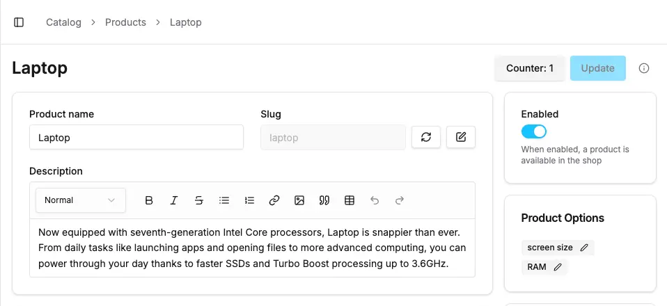
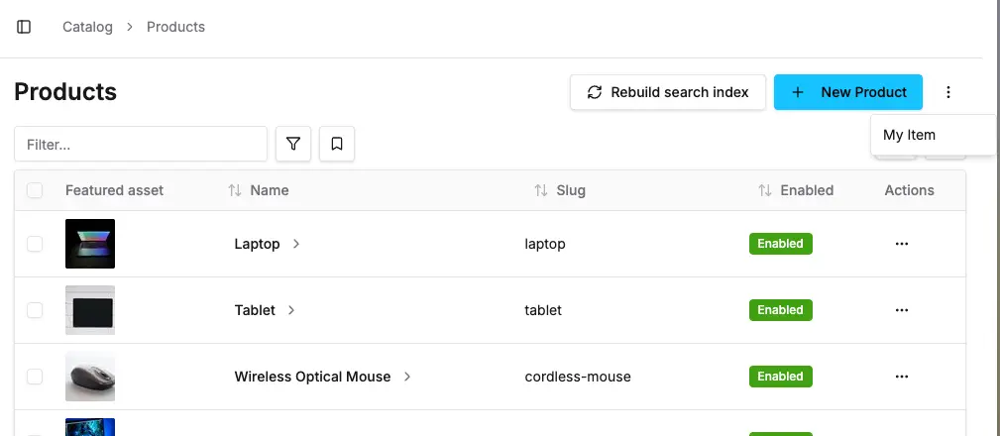

The Action Bar is the bar at the top of the page where you can add
buttons and other actions.

:::info
All available options are documented in the [DashboardActionBarItem reference](/reference/dashboard/extensions-api/action-bar#dashboardactionbaritem)
:::

## Basic Action Bar Item

Here's a simple example of adding a button to the action bar:

```tsx title="src/plugins/my-plugin/dashboard/index.tsx"
import { Button, defineDashboardExtension } from '@vendure/dashboard';
import { useState } from 'react';

defineDashboardExtension({
    actionBarItems: [
        {
            pageId: 'product-detail',
            component: ({ context }) => {
                const [count, setCount] = useState(0);
                return (
                    <Button type="button" variant="secondary" onClick={() => setCount(x => x + 1)}>
                        Counter: {count}
                    </Button>
                );
            },
        },
    ],
});
```



## Context Data

The `context` prop provides access to:

- **`entity`**: The current entity being viewed/edited (e.g., Product, Customer, etc.)
- **`form`**: The React Hook Form instance for the current page (if applicable)
- **`route`**: Route information and parameters

## Dropdown Menu

You can also define dropdown menu items for the Action Bar. This is useful for secondary actions that are needed
less often by administrators.

Make sure to always wrap these in the `DropdownMenuItem` component for consistent styling.

```tsx
import { DropdownMenuItem, defineDashboardExtension } from '@vendure/dashboard';
import { useState } from 'react';

defineDashboardExtension({
    actionBarItems: [
        {
            pageId: 'product-list',
            type: 'dropdown',
            component: () => <DropdownMenuItem variant="default">My Item</DropdownMenuItem>
        }
    ],
});
```



## Practical Examples

### Export Button

```tsx title="src/plugins/my-plugin/dashboard/index.tsx"
import { Button, defineDashboardExtension } from '@vendure/dashboard';
import { DownloadIcon } from 'lucide-react';

defineDashboardExtension({
    actionBarItems: [
        {
            pageId: 'product-detail',
            component: ({ context }) => {
                const product = context.entity;

                const handleExport = async () => {
                    // Export product data
                    const data = JSON.stringify(product, null, 2);
                    const blob = new Blob([data], { type: 'application/json' });
                    const url = URL.createObjectURL(blob);

                    const a = document.createElement('a');
                    a.href = url;
                    a.download = `product-${product.id}.json`;
                    a.click();

                    URL.revokeObjectURL(url);
                };

                return (
                    <Button variant="outline" onClick={handleExport} disabled={!product}>
                        <DownloadIcon className="mr-2 h-4 w-4" />
                        Export
                    </Button>
                );
            },
        },
    ],
});
```

### Sync Button with Loading State

```tsx title="src/plugins/my-plugin/dashboard/index.tsx"
import { Button, defineDashboardExtension } from '@vendure/dashboard';
import { RefreshCwIcon } from 'lucide-react';
import { useState } from 'react';
import { toast } from 'sonner';

defineDashboardExtension({
    actionBarItems: [
        {
            pageId: 'product-detail',
            component: ({ context }) => {
                const [isSyncing, setIsSyncing] = useState(false);
                const product = context.entity;

                const handleSync = async () => {
                    if (!product) return;

                    setIsSyncing(true);
                    try {
                        // Simulate API call to external system
                        await fetch(`/api/sync-product/${product.id}`, {
                            method: 'POST',
                        });
                        toast.success('Product synced successfully');
                    } catch (error) {
                        toast.error('Failed to sync product');
                    } finally {
                        setIsSyncing(false);
                    }
                };

                return (
                    <Button variant="outline" onClick={handleSync} disabled={!product || isSyncing}>
                        <RefreshCwIcon className={`mr-2 h-4 w-4 ${isSyncing ? 'animate-spin' : ''}`} />
                        {isSyncing ? 'Syncing...' : 'Sync to ERP'}
                    </Button>
                );
            },
        },
    ],
});
```

### Conditional Action Bar Items

You can conditionally show action bar items based on the entity or user permissions:

```tsx title="src/plugins/my-plugin/dashboard/index.tsx"
import { Button, defineDashboardExtension, PermissionGuard } from '@vendure/dashboard';
import { SendIcon } from 'lucide-react';

defineDashboardExtension({
    actionBarItems: [
        {
            pageId: 'customer-detail',
            component: ({ context }) => {
                const customer = context.entity;

                // Only show for customers with email addresses
                if (!customer?.emailAddress) {
                    return null;
                }

                const handleSendEmail = () => {
                    // Open email composer or trigger email send
                    console.log('Sending email to:', customer.emailAddress);
                };

                return (
                    <PermissionGuard requires={['UpdateCustomer']}>
                        <Button variant="outline" onClick={handleSendEmail}>
                            <SendIcon className="mr-2 h-4 w-4" />
                            Send Email
                        </Button>
                    </PermissionGuard>
                );
            },
        },
    ],
});
```

## Multiple Action Bar Items

You can add multiple action bar items to the same page:

```tsx title="src/plugins/my-plugin/dashboard/index.tsx"
import { Button, defineDashboardExtension } from '@vendure/dashboard';
import { DownloadIcon, RefreshCwIcon, SendIcon } from 'lucide-react';

defineDashboardExtension({
    actionBarItems: [
        {
            pageId: 'product-detail',
            component: ({ context }) => (
                <Button variant="outline">
                    <DownloadIcon className="mr-2 h-4 w-4" />
                    Export
                </Button>
            ),
        },
        {
            pageId: 'product-detail',
            component: ({ context }) => (
                <Button variant="outline">
                    <RefreshCwIcon className="mr-2 h-4 w-4" />
                    Sync
                </Button>
            ),
        },
        {
            pageId: 'product-detail',
            component: ({ context }) => (
                <Button variant="outline">
                    <SendIcon className="mr-2 h-4 w-4" />
                    Share
                </Button>
            ),
        },
    ],
});
```

## Available Button Variants

The dashboard provides several button variants you can use:

- `default` - Primary button style
- `secondary` - Secondary button style
- `outline` - Outlined button style
- `ghost` - Minimal button style
- `destructive` - For destructive actions (delete, etc.)

```tsx
<Button variant="default">Primary</Button>
<Button variant="secondary">Secondary</Button>
<Button variant="outline">Outline</Button>
<Button variant="ghost">Ghost</Button>
<Button variant="destructive">Delete</Button>
```

## Best Practices

1. **Use appropriate icons**: Icons help users quickly understand the action
2. **Provide loading states**: Show loading indicators for async operations
3. **Handle errors gracefully**: Use toast notifications for feedback
4. **Consider permissions**: Use `PermissionGuard` for actions that require specific permissions
5. **Keep labels concise**: Use short, descriptive labels for buttons
6. **Group related actions**: Consider the order and grouping of multiple action items
7. **Test thoroughly**: Verify your actions work correctly across different entity states

## Finding Page IDs

To find the `pageId` for your action bar items:

1. Enable [Dev Mode](/extending-the-dashboard/extending-overview/#dev-mode) in the dashboard
2. Navigate to the page where you want to add your action
3. The page ID will be shown in the dev mode overlay
4. Use this ID in your action bar item configuration
