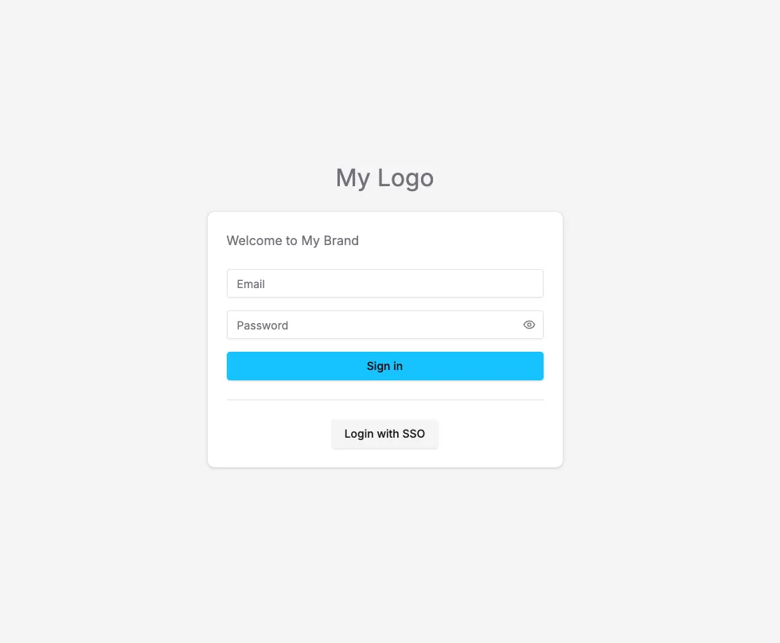

The login page can be customized with your own logo and messaging, as well as things like SSO login buttons.

Reference documentation can be found at [DashboardLoginExtensions](/reference/dashboard/extensions-api/login#dashboardloginextensions).

## Login page extension points

```tsx title="index.tsx"
import { defineDashboardExtension } from '@vendure/dashboard';

import { useSsoLogin } from './use-sso-login';

defineDashboardExtension({
    login: {
        logo: {
            component: () => <div className="text-3xl text-muted-foreground">My Logo</div>,
        },
        beforeForm: {
            component: () => <div className="text-muted-foreground">Welcome to My Brand</div>,
        },
        afterForm: {
            component: () => {
                const { handleLogin } = useSsoLogin();
                return (
                    <div>
                        <Button variant="secondary" className="w-full" onClick={handleLogin}>
                            Login with SSO
                        </Button>
                    </div>
                );
            },
        },
    },
});
```

This will result in a login page like this:



## Fully custom login pages

If you need even more control over the login page, you can also create an
[unauthenticated route](/guides/extending-the-dashboard/navigation/#unauthenticated-routes) with a completely
custom layout.

```tsx title="index.tsx"
import { defineDashboardExtension } from '@vendure/dashboard';

defineDashboardExtension({
    routes: [
        {
            path: '/custom-login',
            component: () => (
                <div className="flex h-screen items-center justify-center text-2xl">
                    This custom login page
                </div>
            ),
            authenticated: false,
        },
    ],
});
```
