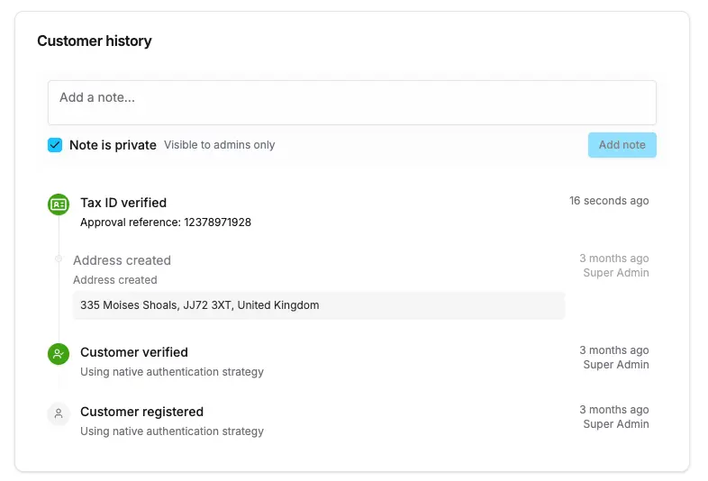

The Customer and Order detail pages have a special history timeline, which show a summary of all significant changes and
activity relating to that customer or order.

History entries are defined by [DashboardHistoryEntryComponent](/reference/dashboard/extensions-api/history-entries#dashboardhistoryentrycomponent),
and the component should be wrapped in [HistoryEntry](/reference/dashboard/extensions-api/history-entries#historyentry).

## Example

Following the backend example of a custom history entry given in the [HistoryService docs](/reference/typescript-api/services/history-service),
we can define a corresponding component to render this entry in the customer history timeline:

```tsx
import { defineDashboardExtension, HistoryEntry } from '@vendure/dashboard';
import { IdCard } from 'lucide-react';

defineDashboardExtension({
    historyEntries: [
        {
            type: 'CUSTOMER_TAX_ID_VERIFICATION',
            component: ({ entry, entity }) => {
                return (
                    <HistoryEntry
                        entry={entry}
                        title={'Tax ID verified'}
                        timelineIconClassName={'bg-success text-success-foreground'}
                        timelineIcon={<IdCard />}
                    >
                        <div className="text-xs">Approval reference: {entry.data.ref}</div>
                    </HistoryEntry>
                );
            },
        },
    ],
});
```

This will then appear in the customer history timeline:


