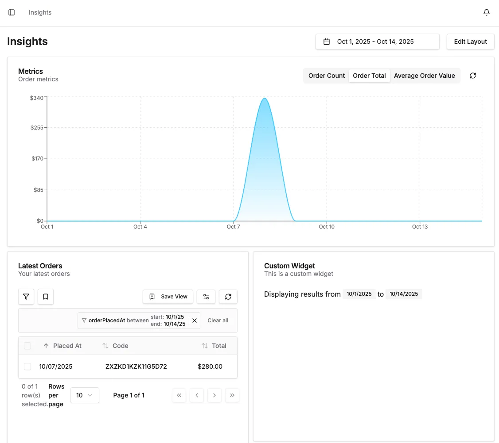

The "Insights" page can be extended with custom widgets which are used to display charts, metrics or other information that can
be useful for administrators to see at a glance.

## Example

Here's an example of a custom widget:

```tsx title="custom-widget.tsx"
import { Badge, DashboardBaseWidget, useLocalFormat, useWidgetFilters } from '@vendure/dashboard';

export function CustomWidget() {
    const { dateRange } = useWidgetFilters();
    const { formatDate } = useLocalFormat();
    return (
        <DashboardBaseWidget id="custom-widget" title="Custom Widget" description="This is a custom widget">
            <div className="flex flex-wrap gap-1">
                <span>Displaying results from</span>
                <Badge variant="secondary">{formatDate(dateRange.from)}</Badge>
                <span>to</span>
                <Badge variant="secondary">{formatDate(dateRange.to)}</Badge>
            </div>
        </DashboardBaseWidget>
    );
}
```

Always wrap your custom widget in the `DashboardBaseWidget` component, which ensures that it will render correctly
in the Insights page.

Use the `useWidgetFilters()` hook to get the currently-selected date range, if your widget depends on that.

Then register your widget in your dashboard entrypoint file:

```tsx title="index.tsx"
import { defineDashboardExtension } from '@vendure/dashboard';

import { CustomWidget } from './custom-widget';

defineDashboardExtension({
    widgets: [
        {
            id: 'custom-widget',
            name: 'Custom Widget',
            component: CustomWidget,
            defaultSize: { w: 3, h: 3 },
        },
    ],
});
```

Your widget should now be available on the Insights page:


