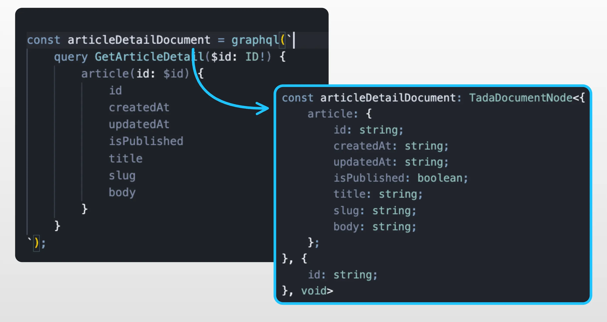

## API Client

The API client is the primary way to send queries and mutations to the Vendure backend. It handles channel tokens and authentication automatically.

### Importing the API Client

```tsx
import { api } from '@vendure/dashboard';
```

The API client exposes two main methods:

- `query` - For GraphQL queries
- `mutate` - For GraphQL mutations

### Using with TanStack Query

The API client is designed to work seamlessly with TanStack Query for optimal data fetching and caching:

#### Query Example

```tsx
import { useQuery } from '@tanstack/react-query';
import { api } from '@vendure/dashboard';
import { graphql } from '@/gql';

const getProductsQuery = graphql(`
    query GetProducts($options: ProductListOptions) {
        products(options: $options) {
            items {
                id
                name
                slug
            }
            totalItems
        }
    }
`);

function ProductList() {
    const { data, isLoading, error } = useQuery({
        queryKey: ['products'],
        queryFn: () =>
            api.query(getProductsQuery, {
                options: {
                    take: 10,
                    skip: 0,
                },
            }),
    });

    if (isLoading) return <div>Loading...</div>;
    if (error) return <div>Error: {error.message}</div>;

    return <ul>{data?.products.items.map(product => <li key={product.id}>{product.name}</li>)}</ul>;
}
```

#### Mutation Example

```tsx
import { useMutation, useQueryClient } from '@tanstack/react-query';
import { api } from '@vendure/dashboard';
import { graphql } from '@/gql';
import { toast } from 'sonner';

const updateProductMutation = graphql(`
    mutation UpdateProduct($input: UpdateProductInput!) {
        updateProduct(input: $input) {
            id
            name
            slug
        }
    }
`);

function ProductForm({ product }) {
    const queryClient = useQueryClient();

    const mutation = useMutation({
        mutationFn: input => api.mutate(updateProductMutation, { input }),
        onSuccess: () => {
            // Invalidate and refetch product queries
            queryClient.invalidateQueries({ queryKey: ['products'] });
            toast.success('Product updated successfully');
        },
        onError: error => {
            toast.error('Failed to update product', {
                description: error.message,
            });
        },
    });

    const handleSubmit = data => {
        mutation.mutate({
            id: product.id,
            ...data,
        });
    };

    return (
        // Form implementation
        <form onSubmit={handleSubmit}>{/* Form fields */}</form>
    );
}
```

## Type Safety

The Dashboard Vite plugin incorporates [gql.tada](https://gql-tada.0no.co/), which gives you type safety _without_ any code generation step!

It works by analyzing your Admin API schema (including all your custom fields and other API extensions), and outputs the results
to a file - by default you can find it at `src/gql/graphql-env.d.ts`.

When you then use the `import { graphql } from '@/gql'` function to define your queries and mutations, you get automatic
type safety when using the results in your components!

When you have the `@/gql` path mapping correctly [set up as per the getting started guide](/extending-the-dashboard/getting-started/#installation--setup), you should see that
your IDE is able to infer the TypeScript type of your queries and mutations, including the correct inputs and return
types!


